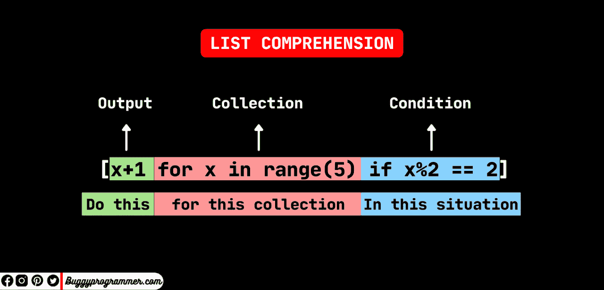
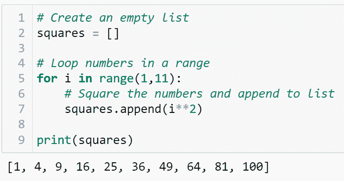
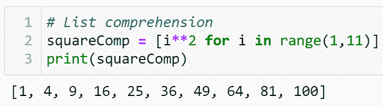
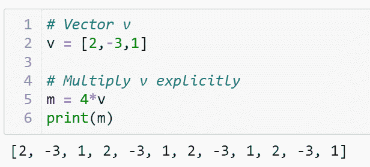
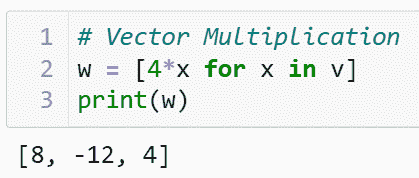
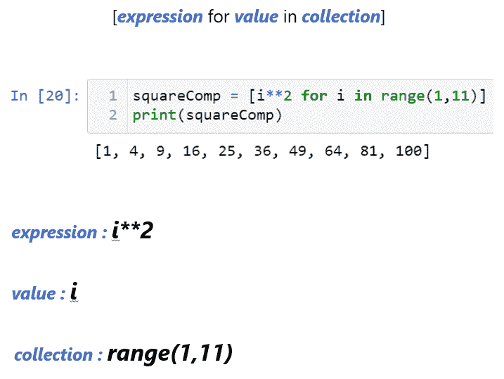
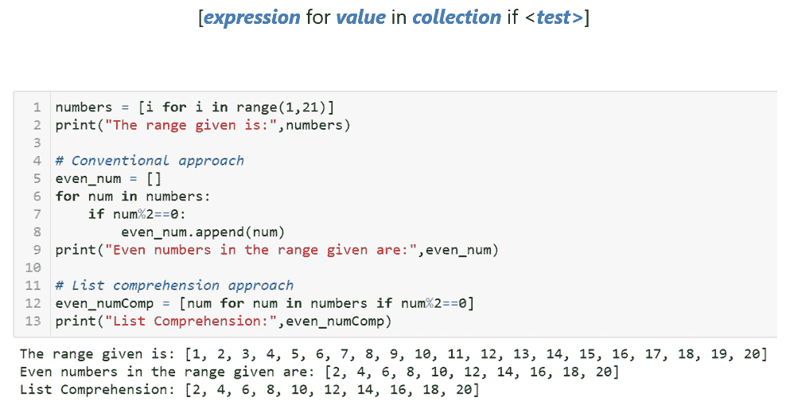
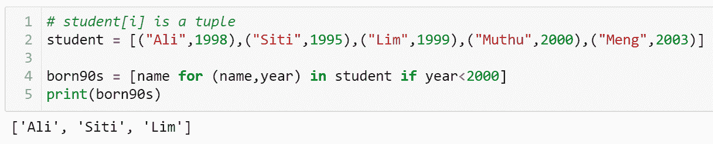

# 列表理解(Python)解释

> 原文：<https://blog.devgenius.io/list-comprehension-python-explained-c0cf1f9591c0?source=collection_archive---------14----------------------->



# 列表理解(Python)解释

List 是 Python 中最简单也是最常见的数据结构之一。今天在这篇文章中，我们将通过“列表理解”把列表提升到一个新的层次。

# 列表理解的最简单形式

这里，我们将使用这个简单的例子来说明什么是列表理解，以及列表理解如何使您的代码更加“优雅”。

假设我们想要创建一个列表来存储一系列数字的平方。从逻辑上讲，我们希望创建一个空列表，循环一系列数字，对每个数字求平方，将结果追加到列表中。

```
# Create an empty list
squares = [] # Loop numbers in a range
for i in range(1,11):
    # Square the numbers and append to list
    squares.append(i**2)

print(squares)
```



这几行代码可以写成一个清单，如下所示:

```
# List comprehension
squareComp = [i**2 for i in range(1,11)]
print(squareComp)
```



这里，squareComp 是一个带有内置 for 循环的列表。这可能是强大的，因为这意味着我们可以将任何 iterable 传递给一个 list comprehension，例如另一个 list。

假设我们想在一个向量中执行乘法。

```
# Vector v
v = [2,-3,1] # Multiply v explicitly
m = 4*v
print(m)
```



与字符串相乘类似，3 *“Hello”将输出“HelloHello”。类似地，4*v 会将向量作为一个整体相乘。由于列表是可迭代的，我们可以循环向量中的每个元素，并将结果存储在另一个列表中。

```
# Vector Multiplication
w = [4*x for x in v]
print(w)
```



# 列表理解语法



要定义一个列表理解，你需要一个表达式。表达式是你想要存储在新列表中的内容。在 squareComp 中，我想存储每个值 I 的平方，其中 I 是每个元素 1 到 10 范围内的数字的集合。

# 用 IF 子句列出理解



注意，语法中不需要使用“for”和“if”，“:”。在传统方法中，“if”在 for 循环中缩进，append 在 if 子句中缩进。

```
numbers = [i for i in range(1,21)] 
print("The range given is:",numbers) # Conventional approach
even_num = []
for num in numbers:
    if num%2==0:
        even_num.append(num)
print("Even numbers in the range given are:",even_num)
```

在列表理解中，我们会简单地在列表理解的末尾加上 if <test>。</test>

```
# List comprehension approach
even_numComp = [num for num in numbers if num%2==0]
print("List Comprehension:",even_numComp)
```

# 多重变量

如果你的列表或者其他形式的字典(比如 dictionary)中有超过 1 个变量，该怎么办？简单回答:像在普通 for 循环中那样定义变量。

```
# student[i] is a tuple
student = [("Ali",1998),("Siti",1995),("Lim",1999),("Muthu",2000),("Meng",2003)] born90s = [name for (name,year) in student if year<2000]
print(born90s)
```



目前，这就是我们在本文中对列表理解的全部内容。列表理解有更多的问题和更复杂的场景，但是让我们把它们留到下一天。如果你觉得这篇文章对你的连接有帮助，请分享出来，让更多的人可以从中受益。

这篇文章最初发表在我的 [LinkedIn](https://www.linkedin.com/pulse/list-comprehension-python-explained-chee-chuan-foo/) 上。关注我获取更多类似的内容！

下周文章再见。谢谢你看完:)