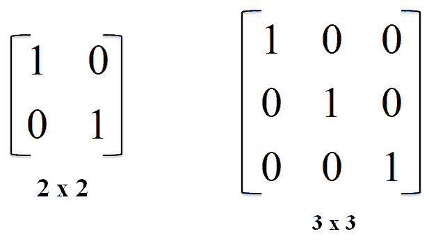

# Python 中的列表、字典和集合理解

> 原文：<https://blog.devgenius.io/list-dictionary-and-set-comprehensions-in-python-103c2a20191b?source=collection_archive---------1----------------------->

## 在 Python 中快速创建列表、字典或集合，无需使用 for 循环


一套完整的旋转石，图片由作者提供

Python 提供了三种类型的理解，可以用 Python 方便地创建基本的集合数据类型，可读性更好。

我将用例子来解释每一种理解。

# 列出理解

列表理解是用 Python 快速创建列表的另一种方式。如果你发现自己使用 for 循环和`.append()`来创建一个列表，列表理解是一个很好的选择。

列表理解具有以下签名。

```
[*expr* for *val* in *collection* if *condition*]
```

您可以对以下内容使用列表理解:

*   操纵列表
*   提取信息
*   过滤列表

我将用四个不同的例子来解释列表理解的可能性。每个例子都展示了如何在有列表理解和没有列表理解的情况下实现该功能。

## 1.计算数字 1 到 10 的平方

此示例显示了计算数字 1 到 10 的平方的两种方法。第一个，第一到第三行使用`append`将数字的平方加到列表中。第二，在第五行，使用*列表理解*。计算平方的表达式是一样的，`i**2`。

计算数字 1 到 10 的平方

正如您所看到的，带有`append`的版本使用了三行，而 list comprehension 使用单行完成了同样的任务。

## 2.从数字 1 到 10 中过滤奇数

这个例子展示了从列表中过滤奇数的两种方法。第一种方法使用 for 循环和模运算符来计算余数。

第六行的第二个使用一个 if 语句的列表理解来过滤奇数。

过滤 1 到 10 范围内的奇数

结合 if 语句，行数的差异甚至更大——对于包含列表理解的解决方案，一行表示一行。

## 3.过滤 25 岁以上的人

下面的例子显示了如何使用列表理解来过滤所有 25 岁以上的人。

用户列表包含三个字典。每本词典都包含一个人的姓名和年龄。我们过滤 25 岁以上的人的名字。

使用列表理解筛选人员

第 10 行的 List Comprehension 遍历所有用户，如果用户的年龄超过 25 岁，它将选择姓名。

## 4.创建标识矩阵

大小为 n 的单位矩阵是一个 n 乘 n 的方阵，主对角线上只有 1。一个二乘二和一个三乘三的单位矩阵看起来像这样。



两个单位矩阵

在 Python 中，可以通过在一个列表中使用另一个列表来构造一个单位矩阵。

```
[ [ 1, 0, 0 ],
  [ 0, 1, 0 ],
  [ 0, 0, 1 ] ]
```

让我们看看如何在不使用 Python 中的列表理解的情况下创建这个单位矩阵。

这里我们使用了两个 for 循环，一个用于迭代行，另一个用于迭代列。如果列索引和行索引相同，我们追加一个 1；否则，我们加一个零。

用 Python 创建一个单位矩阵

为了使用列表理解来实现这一点，我们使用第二次迭代。请参见下面的示例，该示例创建了相同的三乘三单位矩阵。

# 词典释义

就像列表理解是快速创建列表的一种方式一样，字典理解是用 Python 快速创建字典的一种不同方式。

字典理解有以下签名。

```
{*expr* for *(key,value)* in *dictionary* if *condition*}
```

它们看起来很像列表综合，但是使用括号 **{}** 代替括号 **[]。**

您可以使用字典理解:

*   操纵字典
*   提取信息
*   过滤词典

我将用三个不同的例子来解释字典理解的可能性。每个例子都展示了如何在有和没有字典理解的情况下实现该功能。

## 1.计算数字 1 到 10 的平方，并将其存储在字典中

这个例子展示了用数字 1 到 10 的平方创建字典的两种方法。第一个，第一到第三行使用索引操作符`[]`向列表中添加一个方块。第五行的第二个使用列表理解。计算平方的表达式是一样的，`i**2`。

使用字典理解计算数字 1 到 10 的平方

## 2.过滤 25 岁以上的人

这个例子展示了从字典中过滤 25 岁以上的人的两种方法。该字典包含 Person 类的三个实例。

使用字典理解按年龄筛选人员

该示例使用一个源代码行来执行使用字典理解的过滤，而不使用字典理解的示例需要四行代码。

## 3.统计单词在句子中的出现次数

你可以用字典理解来计算一个句子中的单词。以下示例的前四行在不使用字典理解的情况下计算字符串中的单词。首先，它创建一个字典，分割字符串，并遍历单词。程序使用这个单词作为字典的关键字。如果该键已经存在，则计数加 1；它将计数设置为 1。

第六行的字典理解将消息拆分并创建一个集合。通过创建一个集合，所有的双字都被删除。它遍历所有唯一单词，并计算该唯一单词在拆分字符串中出现的次数。

统计有词典理解和没有词典理解的单词的频率

# 集合理解

我们在 Python 中可以使用的最后一种理解叫做集合理解。集合理解类似于列表理解，但是返回集合而不是列表。语法看起来更像是字典理解，因为我们使用花括号来创建集合。

集合理解具有以下签名。

```
{*expr* for *key* in *dictionary* if *condition*}
```

## 1.筛选表中某列的不同值

在第 12 行，使用集合理解来选择列表中人员的所有城市。该集合确保所有项目都是唯一的。

从人员列表中过滤不同的城市

# 理解的可读性

有人说理解很难读懂。我认为有时他们是对的，他们可能很难读懂。所以确保当你使用一个时，代码变得更可读。有时在理解中加入空格有助于提高可读性。

# **结论**

列表、字典或集合理解允许我们将一个序列转换成另一个序列。它们提供了一个紧凑的语法来完成这个任务，限制了代码的行数。

理解遵循集合构建符号的数学形式，因此对于具有数学背景的程序员来说，它们可能特别直观。

尽管列表理解使你的代码更加简洁，但是确保我们最终的代码尽可能的易读是至关重要的。您应该避免特别长的单行代码，以确保您的代码是可维护的。

感谢您的阅读！