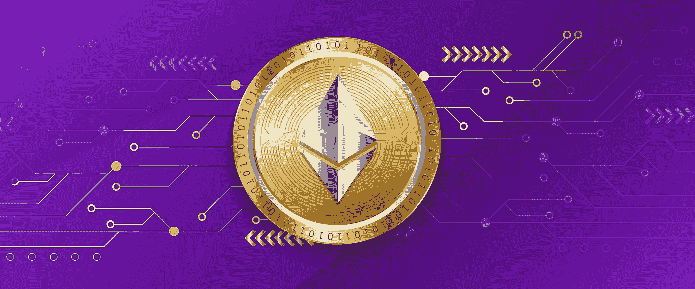

# 以太坊区块链架构组件列表-

> 原文：<https://blog.devgenius.io/list-of-architectural-components-of-the-ethereum-blockchain-fc7fc8c1ac?source=collection_archive---------9----------------------->

[Pixabay](https://pixabay.com/illustrations/ethereum-crypto-currency-bitcoin-6928106/)

在我们跳到以太坊区块链的架构组件列表之前。让我来帮你-

# 谁发现了以太坊？

来自多伦多的俄裔加拿大程序员兼企业家 Vitalik Buterin 在 19 岁时构想了以太坊。

2011 年，他对比特币产生了兴趣，并共同创办了《比特币》杂志，在该杂志上，他撰写了数百篇关于加密货币世界的[文章](https://bitcoinmagazine.com/authors/vitalik-buterin)。在这段旅程中，他受到比特币的启发，产生了以太坊的想法。

他在 2013 年发布了一份关于以太坊概念的[白皮书](https://ethereum.org/en/whitepaper/)，以太坊是比特币的替代平台；在这里，开发人员可以创建分散式应用程序(dApps ),这仅仅是因为内置的编程语言，它可供全球受众访问，并且高度安全。

# 以太坊是什么？

以太坊由[区块链技术](https://www.investopedia.com/terms/b/blockchain.asp)驱动，主要以其原生加密货币 Ether 或 ETH 而闻名。

此外，以太坊用于提供安全的数字技术。以太坊可以用作在区块链网络中运行的代币，也可以用作在区块链上完成工作的支付方式。

以太坊是开发者和企业的选择，因为它是去中心化的、可伸缩的、安全的和可编程的。

智能合约是以太坊背后用于[去中心化应用](https://www.investopedia.com/terms/d/decentralized-applications-dapps.asp) (dApps)的必要工具。许多像[去中心化金融](https://www.investopedia.com/decentralized-finance-defi-5113835) (DeFi)这样的应用使用了区块链技术的智能合约。

现在，让我解释以太坊区块链的架构组件列表-

# 以太和令牌组学-

以太俗称 ETH，以太坊区块链的原生加密货币。在以太坊生态系统中，以太拥有几个用例，例如奖励矿工或以太坊区块链上的费用支付活动。

每当发送者向另一个人发送 ETH 时，发送者必须在通过以太坊区块链发送交易时花费一定数量的 ETH。

每一个 ETH 都可以被一定的小数位数整除，ETH 的最小分数称为卫，为 0.000000000000000001 ETH。稍高一些的 ETH 是 Gwei(气体单位),为 0.000000001 ETH。Gwei 也被称为 Giga-Wei，是指 1，000，000，000 Wei 的单位。

以太坊的概念类似于比特币，每个比特币由 1 亿个 Satoshis 组成。

ETH 是在加密交易所交易的加密资产，因其价格波动而闻名。

由于对以太坊通货膨胀[令牌经济学](https://www.fool.com/investing/stock-market/market-sectors/financials/cryptocurrency-stocks/what-is-tokenomics/)的担忧，以太坊开采过程的改变由以太坊改进提案 EIP1559 做出，并于 2021 年 8 月 5 日实施。

采矿过程的改变背后的目标是定期燃烧足够的以太，减少以太坊的供应，把它变成通货紧缩的硬币。

共识方法的变化已经在影响以太坊区块链的令牌组学，并通过支持其网络和押注其资金为以太坊持有者提供激励。

[ETH 流通供应量为 10%](https://cointelegraph.com/news/eth2-deposit-contract-now-holds-10-of-the-circulating-eth-supply) 锁定在 ETH2 存款合约中，相当于 1200 万 ETH 或 345 亿美元。

# 以太坊虚拟机(EVM)

以太坊虚拟机(EVM)是以太坊区块链的核心处理器。它反映了整个系统是如何工作的，在考虑变化的同时，它也维护了自己。

EVM 在以太坊区块链中增加了新功能，以减少与分布式账本相关的问题。每个以太坊节点都使用 EVM 来维护区块链共识。

智能合约在以太坊区块链上运行，它们是不同的代码片段。这些代码位于完全隔离的 EVM 内部，这意味着代码无法访问任何文件系统、网络或其他进程。

智能契约中的编码被转换成字节码。此外，智能合同中使用的主要源代码是用 [Solidity 编程语言](https://soliditylang.org/)编写的。此外，数据被翻译成操作码以供 EVM 理解。有了这些操作码，EVM 就能完成特定的任务。

因此，EVM 的工作是保持以太坊区块链在适当的工作模式。

# 智能合同-

智能合约是用名为 Solidity 的编程语言编写的代码。

智能合约是由特定代码引导的不同区块链地址。开发人员设计这些代码地址来完成一个功能，外部交易触发智能合同。在以太坊区块链的情况下，智能合约在以太坊虚拟机(EVM)上处理。

智能合约中的几行代码可以创建一种金融服务或一种新的加密货币，但应遵循智能合约的基本标准。以太坊协议标准化实现了 dApps 之间的协同，因此，在如此短的时间内，在 DeFi 和 NFT 方面有了提升。

如果用户在以太坊区块链上发送交易，智能合约，即以太坊区块链上的一个账户，由一个自动完成该动作的代码指示。

用户需要支付以太币作为气费来与以太坊区块链进行交互，以启动或编码智能合约。

从一个用户向另一个用户发送 ETH 的交易比建立需要更高 ETH 量的智能合同要低。

智能合同是 dex 等去中心化应用(dApps)的基础。dApps 的后端由智能合约在兼容的分布式账本上运行，如以太坊区块链。智能合同可以在没有分布式账本的技术上创建和运行。但是，并非所有区块链都与智能合约兼容。

# 交易和燃气费-

在以太坊区块链上，气体是用于执行智能合同或任何交易的计量单位。此外，对于这两种情况，汽油费都需要作为 ETH 的一项成本。

以太坊区块链上的一个简单交易需要 21000 个气体单位。

# 伦敦硬叉-

2021 年以太坊区块链的主要更新之一是“伦敦硬分叉”。此次更新对交易费用的计算方式进行了重大改变，并降低了交易费用的波动性。

以太坊区块链下的另一个重大转变是，它将使矿工难以赚钱，从而使采矿变得无关紧要。

升级后的交易费用结构分为-

## 1.基本费用-

基本费用将以前的区块大小与目标大小进行比较，目标大小是所有交易消耗的天然气总量。如果目标区块大小超过，则每个区块的基本费用将增加 12.5%。因为保持大的块尺寸在经济上是不可能的。

基本费用被烧掉，减少了 ETH 的供应，小费将作为报酬转给矿工。

## 2.优先权/小费-

在正常情况下，需要一点小费，这将为矿工提供最低限度的激励。

在同一个街区需要更高的小费来出价高于竞争对手的交易。

此外，矿工发现在没有小费的情况下开采区块在经济上更有利，因为他们将获得相同的区块奖励。

## 3.最高费用-

用户可以选择必须在以太坊区块链上执行的每笔交易所需的最大燃气费，称为 maxFeePerGas 参数。

要完成一笔交易，最高费用应该超过基本费用和小费。

# 节点-

一般来说，区块链节点充当任何区块链上的信息存储点。区块链技术依赖于全球众多的用户，这使他们对网络共识和交易负责。

在以太坊区块链中，有 3 种类型的节点，即轻型节点、完整节点和归档节点，这三种节点取决于计算能力、节点运行目标和硬件存储可用性。

轻型节点使用来自块的有限数量的数据，并且它们的工作是为了准确性而与网络上的其他完整节点同步。

完整节点携带大量历史数据，然后区块链根据命令组合历史数据。

存档节点保存所有先前块的全部历史，无论是数据还是以太坊区块链下的任何形式的事务。

此外，还有 2 个节点:以太坊虚拟机(EVM)和挖掘节点。EVM 提供了一个帮助执行智能合约代码的运行时。矿工处理的代码被称为采矿代码，采矿代码运行在与 EVM 相同的网络上。

# 账户-

以太坊区块链有两种账户形式:外部拥有的账户(EOA)和合约账户。

外部拥有的账户(EOA)是区块链以太坊上的一种账户，任何用户都可以免费创建账户来存储、发送和接收代币或建立在区块链以太坊上的 ETH，如 ERC-20 代币。发送或接收加密货币资产的操作需要外部源操作。

合约账户是以太坊区块链上的一种账户，仅在满足特定条件的情况下完成动作。

以太坊区块链上有一个 nonce 的概念。nonce 是任何事务或块的唯一编号。因此，账户随机数跟踪交易金额，以确保避免在以太坊区块链上重复消费。

# 采矿、街区和共识

以太坊是运行在工作证明(PoW)共识方法上的区块链。和众多的计算机硬件矿以太坊世界各地，以确保以太坊区块链。每一个挖掘以太坊的计算机硬件都被称为一个矿工。

那些矿工需要在街区上不停地奔跑，解决复杂的谜题，解决那些谜题。找到一个复杂的难题解决方案被称为验证块。每个区块持有一定的交易和挖掘奖励，以解决复杂的谜题。

整个以太坊区块链由不同的块组成，包括数据以及与前一个和后一个块的联系。并且因此，获胜的矿工接收采矿奖励和与交易相关的费用。

假设一个矿工解决了一个复杂的问题。新闻向网络的其他部分广播。其他矿工会在接受一名矿工解决的障碍之前仔细检查响应，从而将其添加到分类帐中，并因此支付奖励。

# 以太网-

由于以太坊区块链是开源的，所以东西不一定要应用到以太坊区块链的主网上。

以太坊区块链主网上申请前有 4 个测试网，分别是 Rinkeby、Koven、Ropsten、Goerli。

每个网络都是独立运行的，因此以太坊区块链主网上的交易历史和余额不适用于其他网络。用户可以连接不同的网络，如 Metamask。

# 以太坊标准-

以太坊协议中有 4 个定义的标准，这些标准支持以太坊虚拟机(EVM)支持的所有 dApps 之间的协同。这些标准已经在以太坊第 1 层网络中复制，试图复制其功能。

这 4 个定义的标准是

1.ERC-20 —可在 Dao 中用作投票权的可替换令牌和虚拟货币的标准。

2.ERC-721 —不可替代令牌的标准是一次性数字资产、所有权契约或收藏品。

3.ERC-777 —帮助您在令牌基础上构建额外功能的标准。如果你在区块链交易中丢失了你的私人钥匙或隐私，它可能是一个恢复工具。

4.ERC-1155 —这是一种标准，可以实现与 ERC-20 或 ERC-721 令牌相同的功能，但在批量令牌、收集余额或批准单个地址上的多组令牌方面提供了额外的移动。

# 结束语-

随着以太坊 2.0 的升级，以太币将变得高度可扩展、可持续和安全。这种变化之所以会发生，是因为正在发生从工作证明(PoW)到规模证明(PoS)的转变。以太坊 2.0 将被称为宁静。以太坊 2.0 的全面发布预计在 2023 年，以太坊合并将在 2022 年 9 月 21 日发生。

你觉得以太坊 2.0 升级会让货币可伸缩吗？