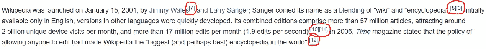

# 收听维基百科(Python 教程)

> 原文：<https://blog.devgenius.io/listening-to-wikipedia-python-tutorial-8c65bb3b449a?source=collection_archive---------8----------------------->

如果你宁愿听维基百科而不是阅读它们，并且你已经安装了 Python，那么你就来对地方了！


当我发现如何在 Python 中执行文本到语音转换时，我想知道如何将它应用到一个有用的研究案例中。然后，我想起我经常访问维基百科页面，这些页面涉及我感兴趣的主题，但包含了许多我不想完全阅读的文本。我宁愿一边听那些页面的内容，一边做别的事情。

因此，我决定使用 Python 将维基百科页面转换成音频文件。

## 导入包

让我们从导入对这个任务有用的包开始。我将使用的库是用于抓取部分的 **bs4** 和 **requests** ，用于正则表达式的 **re** ，用于文本到语音部分的 **pyttsx3** 。

```
**from** bs4 **import** BeautifulSoup
**import** requests
**import** re
**import** pyttsx3 **as** tts
```

## 擦

对于抓取部分，我们只需要定义一个 URL，从相应的网页中检索文本。

```
url = "https://en.wikipedia.org/wiki/Wikipedia" ***#the web page you want to scrape******# Collecting data from the web page***
r = requests.get(url)
data = r.text
soup = BeautifulSoup(data, "lxml")
```

我们希望只保留文本。因此，我们只寻找段落元素。

```
paragraphs = soup.findAll("p")
```

如果您打印变量**段落**，您将看到一个列表，其中包含使用变量 **URL** 访问的网页中的所有段落元素。

## 处理数据

当我们将文本转换为语音时，我们需要处理**段落**的内容，以获得可理解的文本。下面的循环让我们将段落元素转换成它们包含的文本。这样，像“< p > … < /p >”这样的标签就从文本中删除了，剩下的内容就是任何人点击那个链接都能在维基百科页面[https://en.wikipedia.org/wiki/Wikipedia](https://en.wikipedia.org/wiki/Wikipedia)上看到的内容。

```
for i in range(len(paragraphs)):
    paragraphs[i] = paragraphs[i].get_text()
```

如果你现在看一下段落的内容，你应该会看到与抓取的网页的原始内容非常相似的字符串。然而，当阅读该内容时，引用(以方括号中的数字表示)将被阅读，并使音频不太容易理解。



方括号中的数字

您可以通过应用下面给出的进一步处理步骤来删除它们:

```
pattern = r"\[[^\]]*\]"
for i in range(len(paragraphs)):
    paragraphs[i] = re.sub(pattern, "", paragraphs[i])
```

让我们把所有的段落放在一个字符串中，然后我们就可以把文本转换成音频文件了。

```
text = "".join(paragraphs)
```

## 文本到语音转换

作为使用 **pyttsx3** 的第一步，我们必须初始化一个引擎。

```
engine = tts.init()
```

然后，在进行文本到语音转换之前，可能需要检查引擎语音的语言，因为您不希望用英语语音朗读法语文本。

```
***# Checking the language of the different available voices***
voices = engine.getProperty("voices")
for voice in voices:
    print(voice)
```

使用上面的块，您可以显示关于引擎拥有的不同声音的信息，并查看是否有任何声音的语言与您想要转换的文本的语言相匹配。举个例子，我想拥有一个英国人的声音。在我的电脑上，语音列表中索引为 1 的语音是英语语音，所以我决定使用它。

```
engine.setProperty("voice", voices[1].id) ***#replace 1 with an index whose corresponding voice is in the language you wish***
```

一旦你设置好引擎的声音，你可以简单地运行下面两行来保存维基百科页面到一个. mp3 文件。

```
engine.save_to_file(text, "wikipedia.mp3")
engine.runAndWait()
```

就是这样！

**注意:**运行这些步骤后，你可能会得到一个非常大的音频文件。我建议压缩输出文件。我个人使用了 https://www.onlineconverter.com/compress-mp3[](https://www.onlineconverter.com/compress-mp3)**提供的在线转换器，我的文件大小被除以 10，尽管音频质量仍然非常好。**

****GitHub :** 此外，在这里你可以找到本文给出的代码，总结在一个笔记本里:**

**[](https://github.com/jmpion/listening-to-wikipedia) [## GitHub-jmp ion/收听维基百科

### 此时您不能执行该操作。您已使用另一个标签页或窗口登录。您已在另一个选项卡中注销，或者…

github.com](https://github.com/jmpion/listening-to-wikipedia)**