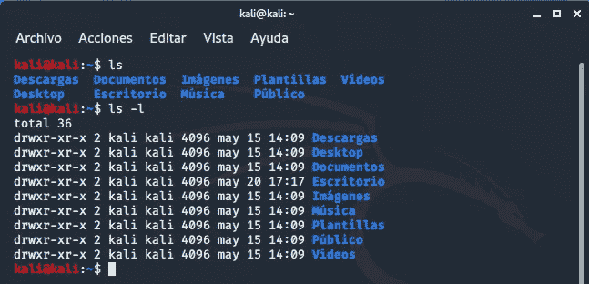
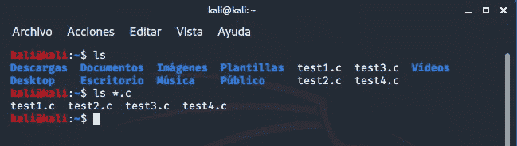

# 列出文件和使用通配符:Linux 中的伟大组合

> 原文：<https://blog.devgenius.io/listing-files-and-using-wildcards-a-great-mix-in-linux-6f2468618395?source=collection_archive---------15----------------------->

在这篇博客中，我将讨论两个非常有趣的话题，它们的共同点是在移动终端时都非常有用。

您应该从了解如何列出文件和/或目录开始，什么是通配符？

首先，用于列出文档和/或目录的命令是“ls”。使用这个命令，我们可以看到当前目录的内容，无论是空文件、可执行文件、目录等等。就像 Linux 中的每个命令一样，它有自己的参数，用这些参数我们可以根据自己的需要指定我们想要看到的内容。

接下来，我将向您展示一个例子，说明当您列出一个目录时会发生什么；此外，当您使用一些参数(如“-l”)以长格式列出时，也就是说，使用附加信息(权限、所有者、组、日期等)。

这是运行 ls 时控制台的样子

我们已经处理了清单，现在让我们开始开玩笑吧。有很多这样的例子，但是今天我将谈论星号(*)。为了让你更容易理解，就好像那个星号同时有任何值；任何种类的字符、数字、字母、符号等。所以，当我用任何命令执行它时，我表示我希望那个特定的点能够取任何值，并给我一个广泛的结果。

这个通配符非常有用，因为当我想对共享某些字符的许多文件执行任何类型的操作时，我不必逐个规范化它们，只需告诉它们共享什么，然后添加通配符来引用“所有内容”。

# 当你输入 ls *时会发生什么。c？

现在让我们看看当我们想使用通配符(*)和。c 扩展:

没有外卡的 ls 和没有外卡的 ls 之间的区别

如您所见，使用通配符过滤掉了所有与搜索不匹配的结果。

在这篇博客中，您了解了 ls 命令的用途，以及如何使用通配符，将它应用于以“.”结尾的文件。c”。不要忘记尝试所有可能的方法，不要停止学习！