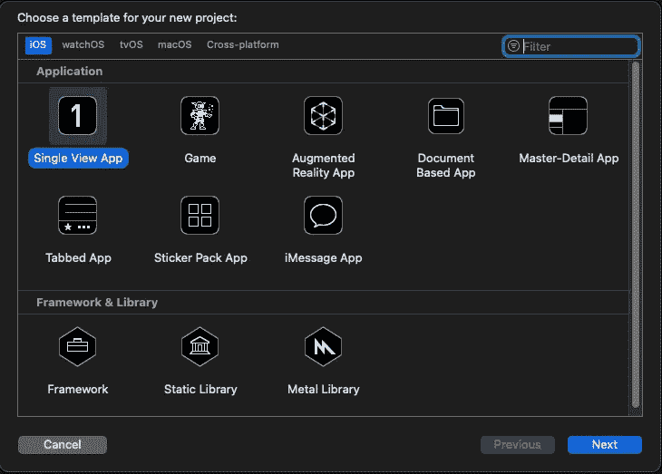
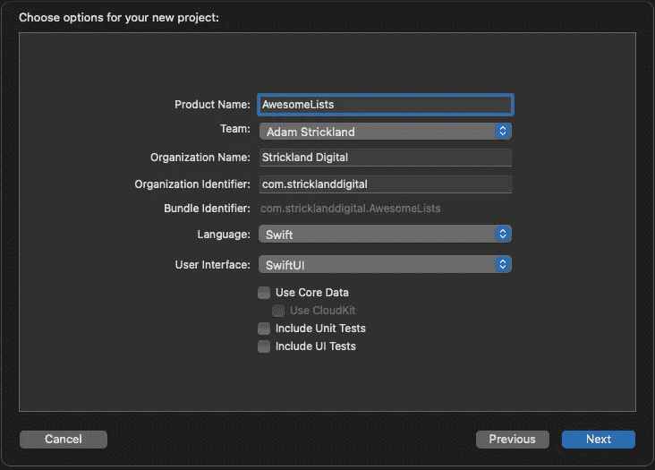
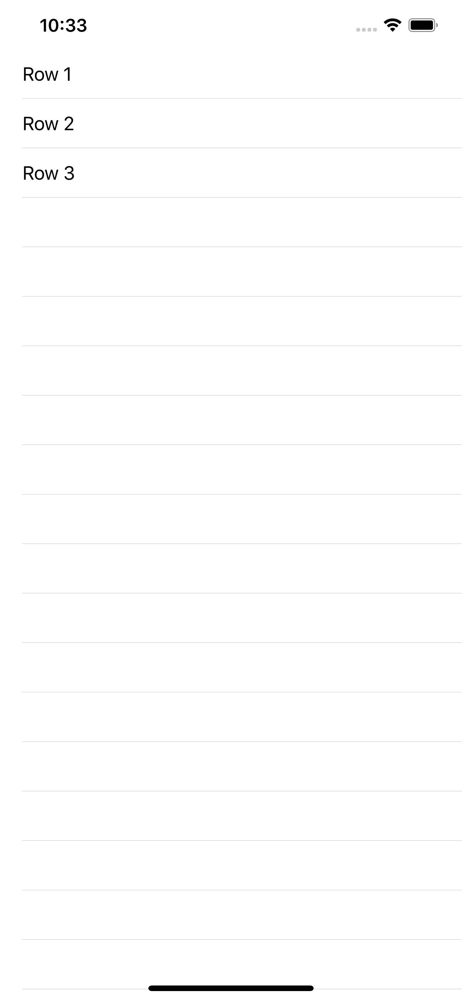
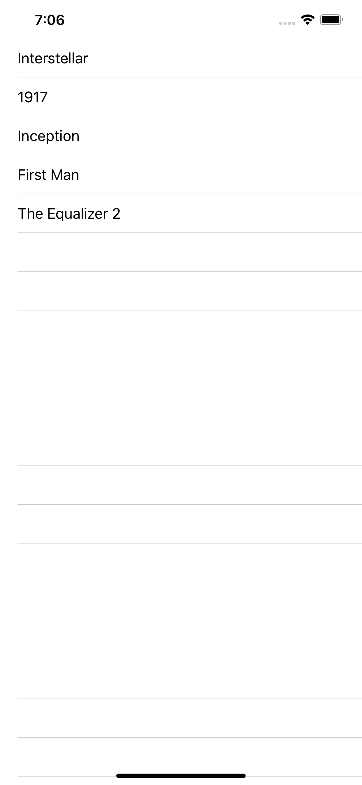

# SwiftUI 中的列表:初学者的综合方法—第 1 部分

> 原文：<https://blog.devgenius.io/lists-in-swiftui-a-comprehensive-approach-for-beginners-part-1-912be5d7dbcc?source=collection_archive---------33----------------------->

列表图片

今天我们将深入 SwiftUI 中的列表，看看它们与 UIKit 的 UITableViews 有何不同。正如许多开发人员所知，数据表在许多应用程序中无处不在。很难想象在应用程序中没有对象列表或类似的东西的应用程序。正因为如此，iOS 开发者必须时刻准备着知道如何实现这些组件。至少，我们必须知道如何在现有的代码库中修改它们。

所以让我们进入正题:我们如何实现一个简单的 SwiftUI 列表？继续在 Xcode 中创建一个新的“单视图应用程序”项目，随意命名，将组织名称和标识符更新为您自己的名称，并为“用户界面”选项选择 SwiftUI。像往常一样，将项目保存在 Mac 上您喜欢的任何位置。

无论您是否熟悉创建新的 SwiftUI 项目，Xcode 都会在新项目开始时立即在名为“ContentView.swift”的文件中生成样板代码。现在让我们更改 ContentView.swift 文件中顶层结构的内容。将内容视图结构代码更新为:

当您运行应用程序时，显示屏将显示以下内容:

这就是创建一个简单的静态列表视图所需要的全部内容。我们将文本视图嵌入到列表视图中，剩下的工作由 SwiftUI 完成。现在我们可以更进一步，像这样更新代码:

如果你还不熟悉 Swift，不要对那个 *$* 符号感到害怕。这里有几种使用这个 *$* 操作符的方法:a)当你想省略闭包中实际的参数名时，这就是我们上面所做的；b)在 SwiftUI 中，您将使用它从状态变量访问绑定。但是现在，我们先不要担心后者。这将在以后的文章中讨论。如果您用上面的代码更新了 ContentView 结构，那么您会注意到模拟器或 Xcode 预览中的输出是相同的。好东西！让我们继续前进。

让我们谈谈你可以用列表做的最后一件很酷的事情。通常对于数据列表或表格，您会有一个想要迭代的集合。无论您有一个硬编码(静态)的数组，还是从网络调用的响应中动态加载该数组，您都可以将集合直接传递到 SwiftUI 的列表视图中。查看下面的代码与我们迄今为止编写的代码之间的区别:

很酷，对吧？在第 3 行，我们将集合传递给列表。看到在 SwiftUI 中创建数据列表的代码如此之少，真是可笑又令人羞愧。

现在让我们添加拼图的最后一块，并创建我们的数组来保存，例如，我们最喜欢的电影。我们不想一直说“第 1 排，第 2 排，第 3 排”，等等。所以现在像这样更新 ContentView 结构，但是你把你喜欢的电影放进去:

我们现在传入一个实际的数组，这个数组已经填充了数据。通过使用“favoriteMovies”的名称并加上“.指数，“我们可以使用动态范围，而不是固定的。因此，你可以在那里放 50 部电影，这就很好了。

在我们结束本系列文章的这一部分之前，我确实想表明，如果为了清楚起见，您不愿意使用 *$0* ，那么您并不需要这样做。我们将把它改为使用闭包的参数。为简单起见，我们将其命名为“索引”。所以如果你想把它改回下面的代码，你可以:

最终，您的模拟器、设备或 Xcode 预览将显示以下内容:

所以退一步，想一想我们必须做什么来在 UIKit 和故事板中创建一个简单的表格视图。如果没有 SwiftUI 的帮助，我们将不得不采用并遵循 UITableViewDataSource 和 UITableViewDelegate 协议来返回表视图中的节和行数。我们还必须在视图控制器中设置表视图的约束(除非您使用 UITableViewController 方法)。然后，我们必须根据原型单元格在*table view:cellforrowatdinexpath:*方法中定制表格视图单元格。我们还必须确保在 Xcode 脚本中适当地设置我们的身份检查器。你明白我对 UIKit 的看法了吗？累死了！但不是用 SwiftUI。

我希望你喜欢这个系列的第一部分，并祝贺你能走到这一步！在第 2 部分中，我们将讨论更复杂的 SwiftUI 列表视图布局，以及为什么我们在列表中使用“id”参数。在第 3 部分中，我们将了解如何从列表视图导航到详细视图。最后，在第 4 部分中，我们将进行一次真实的网络调用，并用真实数据填充列表。