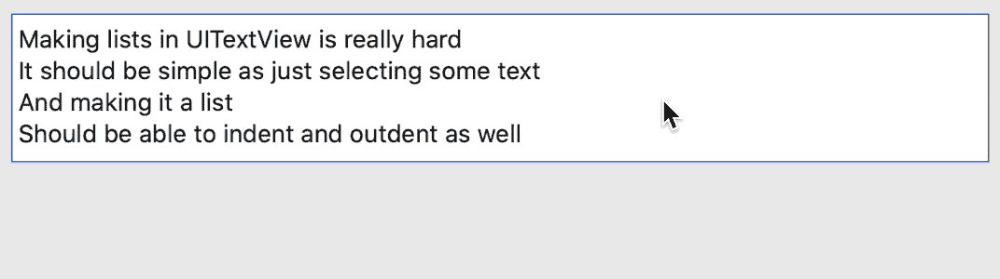
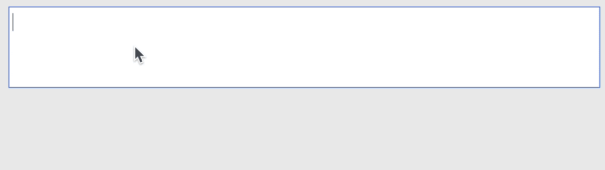
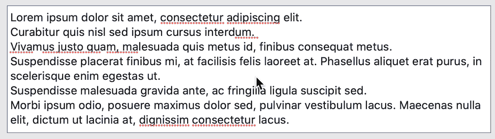
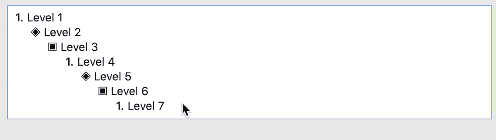

# UITextView 中的列表

> 原文：<https://blog.devgenius.io/lists-in-uitextview-756fe2b1407a?source=collection_archive---------4----------------------->

您是否希望在 UITextView 中实现如下功能:



非常奇怪的是，一个被广泛使用的东西，却没有被 iOS 上的 UITextView 所支持。当我遇到一个场景时(稍后会有更多内容——请务必阅读到最后🙂)当我需要在 UITextView 中实现一个函数列表时，似乎遇到了障碍。从一开始，我就知道我唯一的选择是在 NSAttributeString 中使用自定义属性。然而，事实证明，我不得不尝试多种方法才能最终创建出我所寻找的实现。

# 第一次尝试

我尝试的第一种方法如下:

1.  创建一个名为`listItem`的自定义 NSAttributedString 属性。
2.  只要选择了一个区域来应用列表格式，就用换行符分隔所有的行，并在每行之前用项目符号添加额外的文本。另外，更新`paragraphStyle`属性来添加缩进。

这种方法有很多问题:

1.  当添加文本(表示项目符号/编号)时，文本的整个范围发生了变化，使得很难循环通过用户最初选择的范围内的行。
2.  跟踪表示项目符号/编号的索引是很棘手的，尤其是当项目在中间被删除/添加时。
3.  段落缩进需要考虑项目符号/数字的宽度，这反过来又需要右对齐。
4.  控制列表项第一级之外的缩进变得非常棘手。

虽然这种方法在您试图在一个`UILabel`(内容不变)中显示列表的情况下可以相对较好地工作，但是对于用户可能改变文本并且列表需要动态调整的`UITextView`来说，使用同样的方法就远非完美了。

# NSLayoutManager 前来救援

从第一次尝试中最大的收获是，我不能使用通过编程来改变文本的方法来包含列表的标记，如项目符号/数字等。经过进一步思考和遍历 TextKit 关键部分的文档，我发现定制 NSLayoutManager 可能是使它工作的最佳选择。

在很高的层面上，行之有效的方法是:

1.  子类`NSLayoutManager`覆盖 [drawGlyphs](https://developer.apple.com/documentation/uikit/nslayoutmanager/1403158-drawglyphs) 函数。
2.  在内容中循环查找`layoutManager.textStorage`中是否存在自定义属性`.listItem`，用户可以通过选择文本范围来应用该属性。
3.  使用`enumerateLineFragments`，遍历`layoutManager`中的线段。需要注意的是，行片段是 UITextView 中实际布局的行，而不是由新行字符分隔的行。使用这个函数的目的是为了让我们得到每一行的`rect`，并使用它在给定的位置定位自定义绘制的字形(项目符号/数字)。
4.  对于每个被识别为段落的内容范围(即由新的行字符分隔)，创建一个`NSParagraphStyle`的副本并更新`firstLineHeadIndent`和`headIndent`。
5.  将上面更新的`paragraphStyle`重新应用到相同的范围。如果您更改了现有属性，则需要一个副本，它将应用于该样式的整个范围，该范围可能超出一行文本(以换行符结尾)。
6.  使用我们从`enumerateLineFragments`获得的线段 rect，计算位置以绘制表示列表标记的自定义图像/文本，即项目符号/编号。

使用这种方法的好处是，因为 layoutManager 在每次按键时都会被有效地触发，所以更容易维护对列表项进行编号的索引。即，当在列表中间添加/删除项目时，它会根据布局自动重新索引。

但是，这种方法只处理选定文本范围内的列表项。使用列表时，用户期望的不仅仅是这些。文本视图应支持以下内容:

1.  选择文本范围并应用列表样式。这将自动创建与所选范围中的行数一样多的列表项。
2.  当用户按下回车键时，它应该在用户所在的同一级别创建一个新的列表项。
3.  用户还应该能够使用 tab/shift-tab (macOS Catalyst)来缩进/突出列表项。
4.  在最后一个列表项上按两次 enter 应该会退出列表。

上述行为可以通过使用 UITextViewDelegate 函数拦截按键并在给定范围内更新`listItem`属性来实现。为了拦截 shift-Tab，可以使用`UIKeyCommand`。然后，这可以再次由被覆盖的`drawGlyphs`中的`LayoutManager`读取，并按照预期进行布局。

# 简单的出路

正如开始提到的，我需要创建列表——这是一个开源项目的需求— [Proton](https://github.com/rajdeep/proton/) 。质子是一个项目，我在业余时间工作。开发 [Proton](https://github.com/rajdeep/proton/) 的动机来自于这样一个事实，即虽然 UITextView 非常强大，但它开箱后只暴露了很少一部分功能。你真的需要将相当多的部分(TextKit)放在一起，以实现一个能够支持不同类型文本格式的原生 iOS/macOS Catalyst 文本编辑器。质子有助于使这部分变得更容易。


你在上面的例子中看到的来自 [Proton](https://github.com/rajdeep/proton/) ，它封装了`TextKit`组件以提供丰富的文本编辑功能。宝腾能够通过以下方式实现列表:

1.  `EditorView`:可编辑的文本视图，内部使用一个带有自定义`NSTextStorage`和`NSLayoutManager`的 UITextView。
2.  `ListCommand`:质子有一个可以在`EditorView`上调用的命令的概念。命令可以在内部创建，并用`EditorView`注册。
3.  文本处理器是当用户改变文本时执行的一段代码。这样，就更容易拦截特殊的按键输入，如 Enter、Tab 等。以及 Ctrl、Alt、Shift 等组合键。像命令一样，这些只需要注册。
4.  `EditorListFormattingProvider`:需要在`editorView.listFormattingProvider`上实现和设置的协议。这用于查询每个索引的编号/项目符号。您可以返回一个文本值，甚至可以返回一个图像作为列表标记。

## 用质子编码

当使用[质子](https://github.com/rajdeep/proton/)时，您只需要添加以下内容即可获得列表功能:

```
let command = ListCommand()
let attributeValue: Any? = "anyValue"
command.execute(on: editor, attributeValue: attributeValue)
```

`attributeValue`可以是您可以添加到列表项中的任何值。该值与项目的索引一起返回到`EditorListFormattingProvider`，并可用于保存上下文，比如列表是项目符号列表还是编号列表。

要获得处理(Shift) Enter、(Shift) Tab 和 backspace 的功能，您只需要:

```
editor.registerProcessor(ListTextProcessor())
```

当用户在列表中键入文本时，负责所有的格式设置，包括创建新项目、缩进和突出列表以及退出列表。

在 macOS Catalyst 应用程序上运行的 Proton 中的更多列表示例:



根据键入的文本创建列表



从现有文本创建列表



使用 Tab/Shift-Tab 缩进/突出显示

感谢您抽出时间阅读本文。这是我计划写的关于[质子](https://github.com/rajdeep/proton/)的系列文章的第一篇，讲述了成功的和失败的方法以及我的学习。我期待在下一篇文章中见到您。

在那之前，请注意安全！🙂