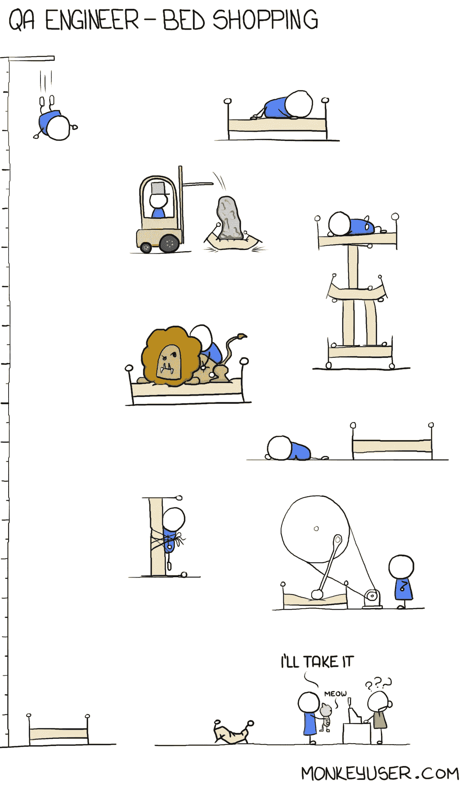
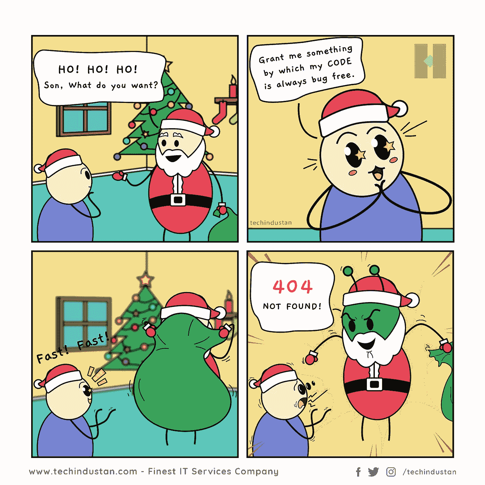
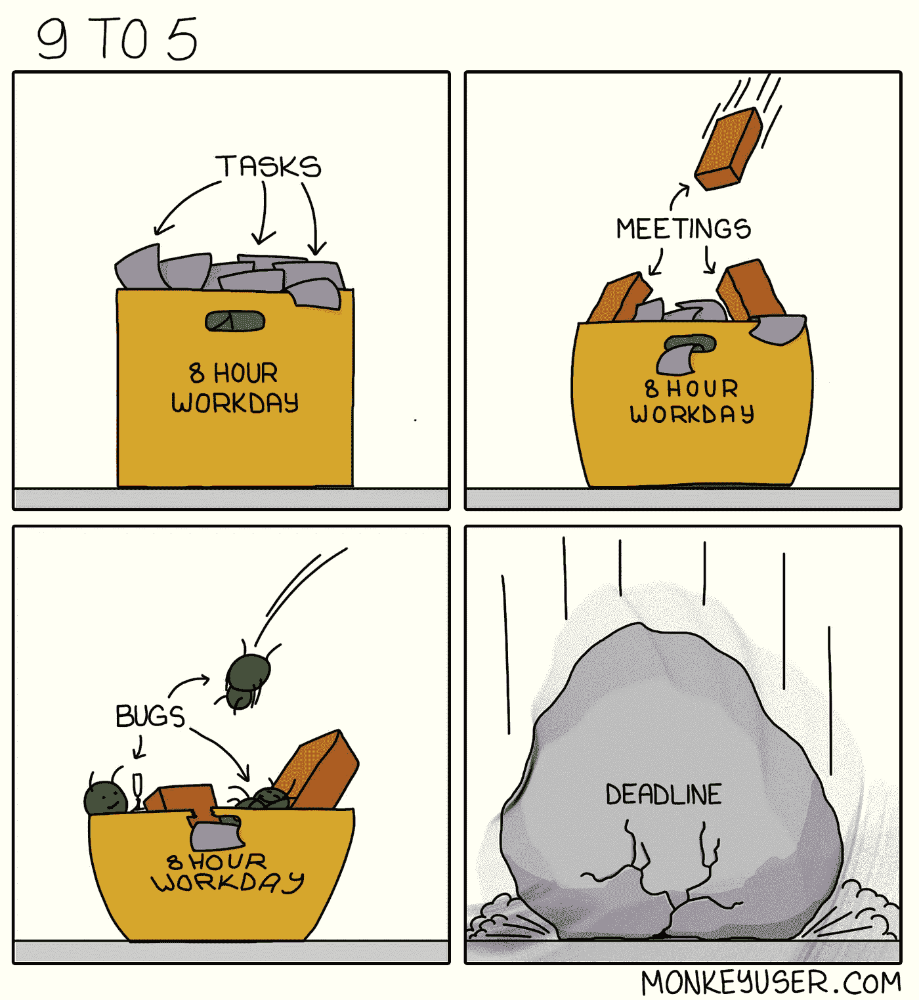
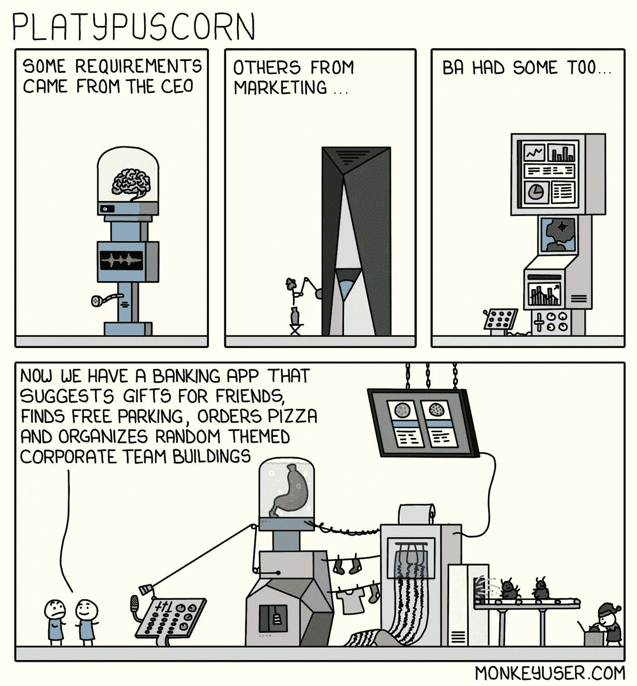
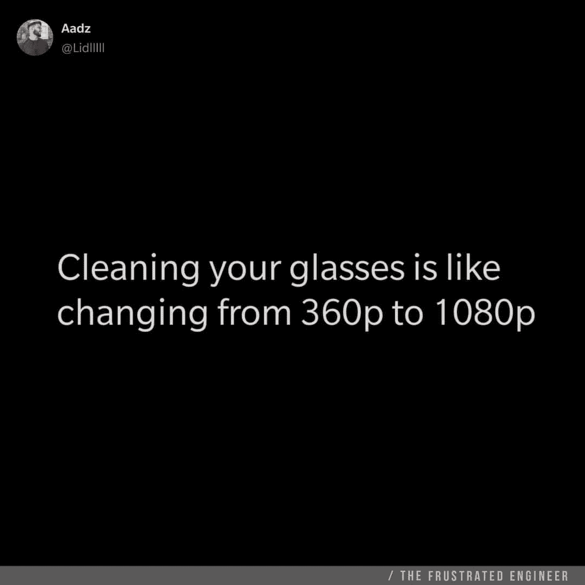
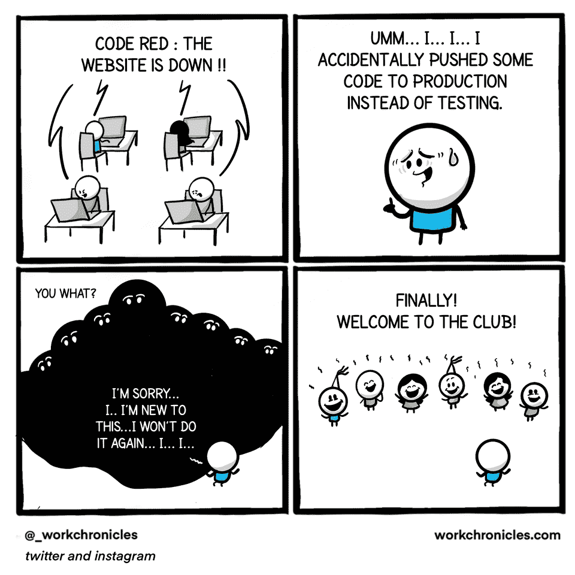
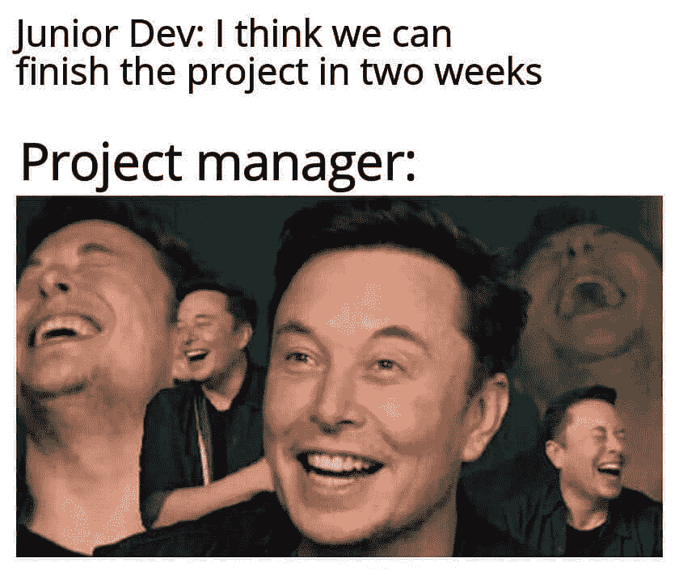

# 2021 年鲜为人知的笑法

> 原文：<https://blog.devgenius.io/little-known-ways-to-laugh-in-2021-d8283948c3b3?source=collection_archive---------6----------------------->

## 能让你心情愉快的迷因

## 令人捧腹的迷因会让你笑死

在 [Unsplash](https://unsplash.com?utm_source=medium&utm_medium=referral) 上 [Angshu Purkait](https://unsplash.com/@angshu_purkait?utm_source=medium&utm_medium=referral) 拍摄的照片

你听过“笑是压力最好的良药”吗？

但是怎么做呢？心情不好的时候怎么笑或者微笑？

今天，我试着整理一些我在网上和脸书发现的让我笑逐颜开的**笑话/迷因**，希望它也能让你笑逐颜开…

> *开始了…准备好你的第一剂药…*

# 浏览量每天都在增加，是的，人们好奇的看着，怎么会有人这么做呢？英雄联盟

[https://www.facebook.com/ProgrammersCreateLife/](https://www.facebook.com/ProgrammersCreateLife/)

# 打算买床垫？像问答一样思考…这将有助于:D

[https://www.monkeyuser.com/](https://www.monkeyuser.com/)

# 这种情况经常发生…风扇会启动，声音会出现…

[https://www . quora . com/What-some-of-some-of-best 程序员笑话和迷因就在那里](https://www.quora.com/What-are-some-of-the-best-programmer-jokes-and-memes-out-there)

# 你的愿望是什么？无 Bug 代码？抱歉 404:未找到

[https://www.facebook.com/techindustan/](https://www.facebook.com/techindustan/)

# 那种只有你的人能理解你的感觉…

[https://www.facebook.com/programminggeeks.in](https://www.facebook.com/programminggeeks.in)

# 当你有很多东西在桶里的时候，没有时间工作…

来源:[https://www.monkeyuser.com/](https://www.monkeyuser.com/)

# 当每个人都建议添加一些功能来美化网站时..结局会是这样的…

[https://www.monkeyuser.com/](https://www.monkeyuser.com/)

# 只有戴眼镜的人才能感受到这一点…

[https://www.facebook.com/JokesTechnical](https://www.facebook.com/JokesTechnical)

# 对不起，这种事不会再发生了..欢迎好友…

[https://www.facebook.com/DZoneInc/photos/10158894902394712](https://www.facebook.com/DZoneInc/photos/10158894902394712)

# 当初级开发给出评估时…项目经理也有同样的感觉…

[https://www . Facebook . com/JavaScript js/photos/1559356324201966](https://www.facebook.com/javascriptJS/photos/1559356324201966)

# 你错过了以前的搞笑炸弹吗？看看这里，爆发你的快乐…

 [## 25 个以上的 StackOverflow 编程迷因，所有开发人员都可以涉及到

### 编程幽默可以通过刷新你的情绪来减轻你的压力

javascript.plainenglish.io](https://javascript.plainenglish.io/25-more-stackoverflow-programming-jokes-that-all-devs-can-relate-to-ebc2f9c11ca3)  [## 11 个能让你心情愉快的编程迷因

### 2021 年最佳编程迷因

javascript.plainenglish.io](https://javascript.plainenglish.io/11-programming-memes-that-will-lighten-up-your-mood-e165be3513ea)  [## 2021 年最佳编程幽默汇编

### 编程迷因可以减轻你的压力

blog.devgenius.io](/best-programming-humor-compilations-2021-623473bfb0d)  [## 有趣的编程迷因会让你笑死

### 编笑话来点亮你的周五

blog.devgenius.io](/funny-programming-memes-that-will-make-you-die-laughing-1ccd8e139040)  [## 2021 年最佳编程幽默汇编

### 编程迷因可以减轻你的压力

blog.devgenius.io](/best-programming-humor-compilations-2021-623473bfb0d)