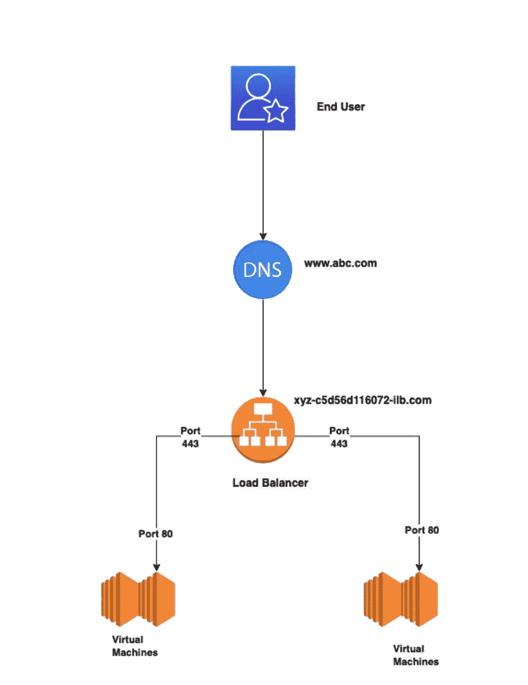

# 负载平衡:101

> 原文：<https://blog.devgenius.io/load-balancing-101-8251350c033f?source=collection_archive---------3----------------------->

这篇博客是我们从零开始讨论**云**概念的系列文章的一部分，面向的是入门知识有限的读者。这篇文章属于*中级*系列，因为它涉及构建一般的负载平衡原则。

云系列中的一些早期博客如下。

[**AWS 云上容灾**](/disaster-recovery-on-aws-cloud-building-blocks-e013bffd6244)[**Azure 云上容灾**](/disaster-recovery-on-azure-cloud-building-blocks-6ff826adbc8b)[**Google 云上容灾**](/disaster-recovery-on-google-cloud-building-blocks-b2a232a9ec)

# 什么是负载平衡

负载平衡的概念是将传入的客户流量分配到多个后端服务器。负载平衡器在后端服务器间使用有效的流量路由算法，确保后端层的性能和弹性在动态流量需求间得到维护。

使用适当的 [**健康检查**](https://cloud.google.com/load-balancing/docs/health-check-concepts) 来确定正在运行的服务的可用性，负载平衡器将客户与任何不健康的下游隔离。此外，配合基于系统指标的正确的 [**自动扩展**](https://en.wikipedia.org/wiki/Autoscaling) 规则，负载平衡器提供了动态添加或删除服务器的功能。

# 端到端流量是如何工作的

# 顺序流程

1.  最终用户在端口 443 上的浏览器中点击 https 端点[***【www.abc.com】***](http://www.abc.com)*。*
2.  *使用客户端[***www.abc.com***](http://www.abc.com)*中的 DNS 解析映射到负载平衡器的内部 DNS***xyz.c5d56d116072-ilb.com。*****
3.  **负载平衡器定期对端口 80 进行健康检查，以确定健康的后端服务器。**
4.  **负载平衡器 IP 端口 443 上的流量被重定向到端口 80 上的健康后端。**

# **负载平衡器的分类**

## **OSI 模型**

**基于 [OSI](https://www.geeksforgeeks.org/layers-of-osi-model/) 模型，任何给定网络上两个节点之间的通信分为 7 层。负载平衡器通常在这 7 层中的两层运行，即 **L4 负载平衡器(传输层)**和 **L7 负载平衡器(应用层)**。**

## ****L4 负载均衡器****

**这些 LB 使用由客户端创建的相同 TCP 连接来与上游服务器建立连接。传输中的数据在传输层被隔离，路由决策只能基于使用 *IP 和端口***

## ****L7 负载平衡器****

**这些 LB 使用两个 TCP 连接，一个由客户端在发出请求时创建，另一个由负载平衡器在与上游服务器建立连接时创建。在这种情况下，可以使用传输中的数据和诸如 ***认证、智能路由和 TLS 终止等功能做出路由决策。*****

# **流量路由规则**

**根据用于将流量定向到后端服务器的流量路由算法，负载平衡器可以进一步分为**

## ****循环算法****

**将每个服务器视为同质实体，流量在后端服务器之间平均轮换。**

## ****加权循环算法****

**每台服务器都分配有一个加权分数，负载平衡器根据分配的权重按比例将流量分配给后端。**

## ****最少连接算法。****

**流量被从负载平衡器转发到具有最少活动连接的服务器。**

## ****最小响应时间算法。****

**除了最少的连接，在这个负载平衡算法中，流量被定向到具有最低响应的服务器，作为最高优先级。**

# **摘要**

**负载平衡是公共云或私有云上的分布式可扩展部署的基本构建块。每个云供应商都提供了一系列负载平衡解决方案，这些解决方案结合使用了上述规则。其中比较流行的有以下几种——**[**AWS 负载均衡**](https://docs.aws.amazon.com/AmazonECS/latest/developerguide/load-balancer-types.html)**[**Azure 负载均衡**](https://docs.microsoft.com/en-us/azure/architecture/guide/technology-choices/load-balancing-overview)[**GCP 负载均衡**](https://cloud.google.com/load-balancing)******

*******如需反馈，请留言至****Amit[dot]894[at]Gmail[dot]com****或联系 https://about.me/amit_raj**的任意链接。*******