# 使用带有 Apache Iceberg 的 EMR Spark 加载数据

> 原文：<https://blog.devgenius.io/load-data-using-emr-spark-with-apache-iceberg-7568f356e68c?source=collection_archive---------6----------------------->

> 创建 EMR 集群，然后使用 Spark 和 Apache Iceberg 加载数据的快速指令集。

**技术堆栈:**

**AWS EMR** 作为计算引擎。弹性 MapReduce (EMR)是一个托管集群平台，可简化大数据框架的运行。

**AWS S3** as 数据仓库(data warehouse)。简单存储服务(亚马逊 S3)是一种对象存储服务，提供行业领先的可扩展性、数据可用性、安全性和性能。

**AWS DynamoDB** 作为 Spark 目录 metastore。Amazon DynamoDB 是一个完全托管的专有 NoSQL 数据库服务，支持键值和文档数据结构。

**Apache Spark** 作为用于大数据工作负载的开源分布式数据处理框架/系统。

**Apache Iceberg** 作为大型数据集的开放表格式。一种用于数据湖的高性能、并发、符合 ACID 的表格式。

# 创建 AWS EMR 集群和 Jupyter 笔记本的步骤

> **让我们创建一个 EMR 集群**

转到 AWS 服务并点击 EMR。单击“创建集群”按钮。

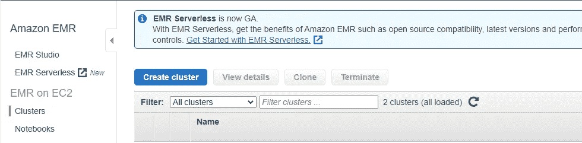

点击“进入高级选项”

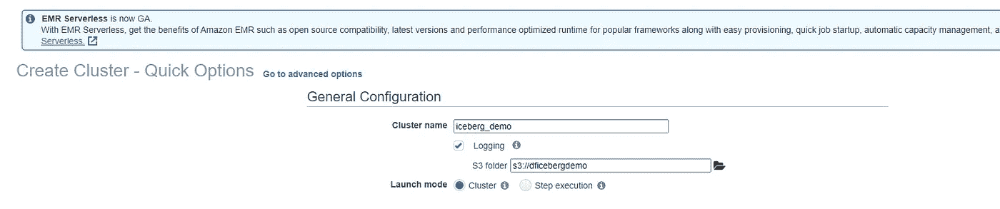

让我们在下拉选择器中选择 EMR 版本为 **6.4.0** 。接下来，选中以下所有应用程序的复选框，将它们包含在集群中:

spark 3 . 1 . 2
JupyterHub 1.41
jupyterenterprise gateway 2 . 1 . 0

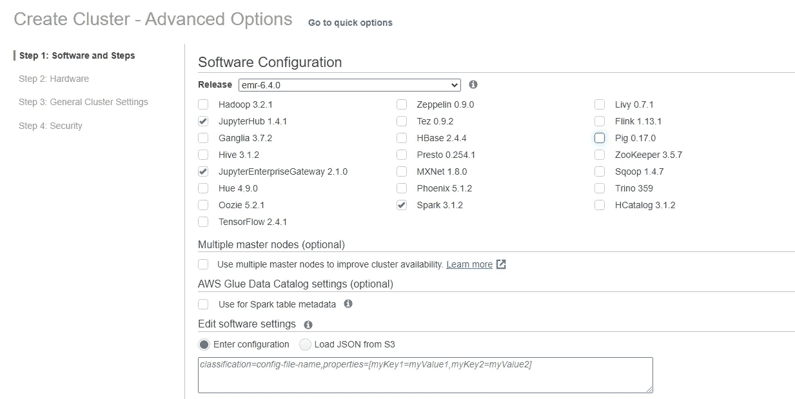

在“编辑软件设置”部分，请在文本框中输入以下配置。请确保将<your s3="" path="">替换为您想要用于仓库的 S3 位置的路径，例如 s3://dficebergdemo</your>

```
[
 {
 “classification”:”spark-defaults”,
 “properties”:{
 “spark.jars.packages”:”org.apache.iceberg:iceberg-spark3-runtime:0.12.1,software.amazon.awssdk:bundle:2.15.40,software.amazon.awssdk:url-connection-client:2.15.40",
 “spark.sql.extensions”:”org.apache.iceberg.spark.extensions.IcebergSparkSessionExtensions”,
 “spark.sql.defaultCatalog”:”prodiceberg”,
 “spark.sql.catalog.prodiceberg”:”org.apache.iceberg.spark.SparkCatalog”,
 “spark.sql.catalog.prodiceberg.catalog-impl”:”org.apache.iceberg.aws.dynamodb.DynamoDbCatalog”,
 “spark.sql.catalog.prodiceberg.warehouse”:”s3://dficebergdemo”,
 “spark.sql.catalog.prodiceberg.dynamodb.table-name”:”prodiceberg_metastore”
 }
 }
]
```

所以最后，它看起来会像下面这样-

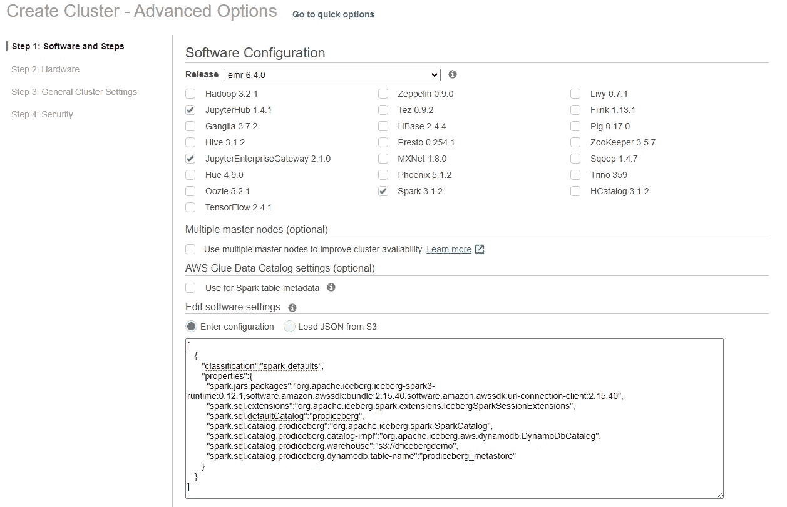

单击“下一步”并选择硬件的默认选项。单击下一步，在“常规集群设置”中更改集群名称。单击下一步，选择适当的安全选项，最后单击“创建集群”。

这将在大约 10 到 15 分钟内创建集群。

> **让我们创建一个 Jupyter 笔记本**

在 AWS 管理控制台的 EMR 仪表板上，选择左侧导航窗格中的“笔记本”。然后你可以点击“创建笔记本”

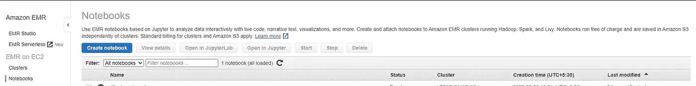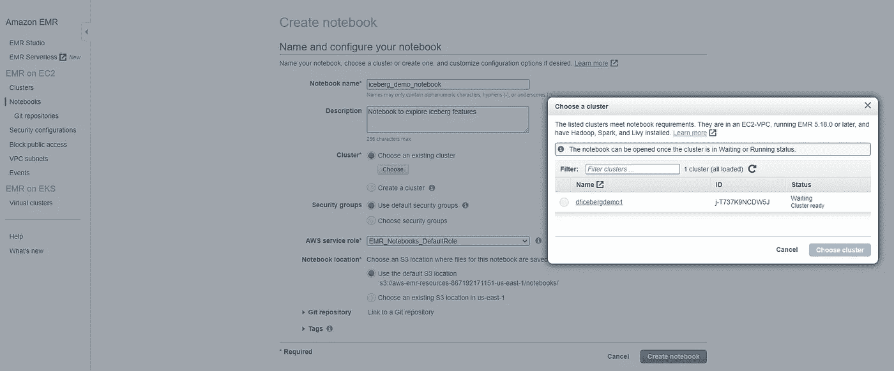

Jupyter Enterprise Gateway 可帮助您将此笔记本电脑连接到我们在上一步中创建的集群。为笔记本提供适当的名称。您将看到一个选择现有集群的选项，并且可以看到在上一步中创建的集群。从弹出窗口中选择特定集群，然后单击“选择集群”以将集群与笔记本连接。最后，点击“创建笔记本”按钮。笔记本将处于挂起状态，直到笔记本服务器启动。

# 加载数据的步骤

> **让我们加载数据**

点击笔记本名称，访问笔记本。

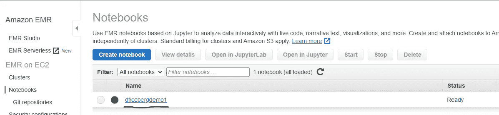

点击“在 Jupyter 中打开”

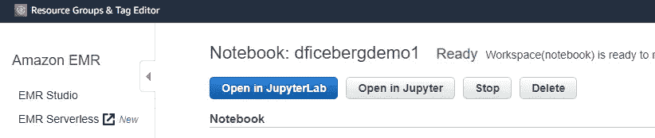

把 Jupyter 狗窝改成 PySpark

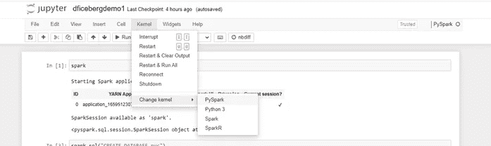

请通过在单元中运行 spark 来启动 spark 会话。

```
**spark**
```

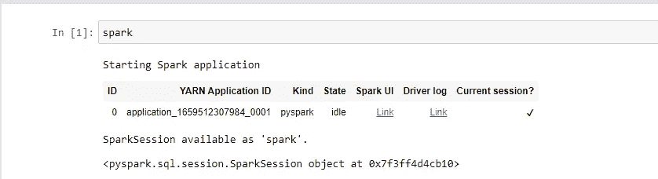

我们将使用纽约市出租车和豪华轿车委员会(TLC)的出行记录数据([https://registry.opendata.aws/nyc-tlc-trip-records-pds/](https://registry.opendata.aws/nyc-tlc-trip-records-pds/))。该数据包含纽约市出租车和出租汽车的出行信息。

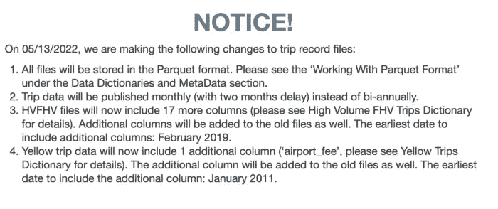

https://coiled.io/blog/nyc-taxi-parquet-csv-index-error/

> **让我们创建数据库和表格来加载数据**

我们将创建一个 **nyc** 数据库，并将几个月的数据保存到一个名为**taxi**的冰山表中。请注意，所有文件现在都是拼花格式，而不是 CSV 格式。

```
**spark.sql(“CREATE DATABASE nyc”)
df = spark.read.option(“header”, True).parquet(“s3://nyc-tlc/trip data/yellow_tripdata_2020–03.parquet”)
df.writeTo(“nyc.taxis”).create()**
```

您可以运行 describe table 命令来查看列和列类型。

```
**spark.sql(“DESCRIBE TABLE nyc.taxis”).show(truncate=False)**
```

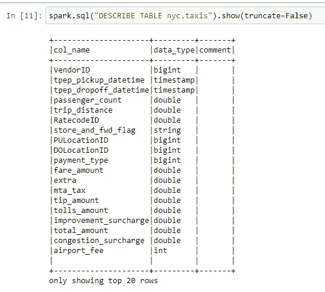

再加载一个月的数据。

```
**df = spark.read.option(“header”, True).parquet(“s3://nyc-tlc/trip data/yellow_tripdata_2020–04.parquet”)
df.write.mode(“append”).insertInto(“nyc.taxis”)**
```

让我们检查一下 **nyc.taxis** 表的记录计数。

```
**spark.sql(“””
 SELECT COUNT(*) as cnt
 FROM nyc.taxis
“””).show()**
```

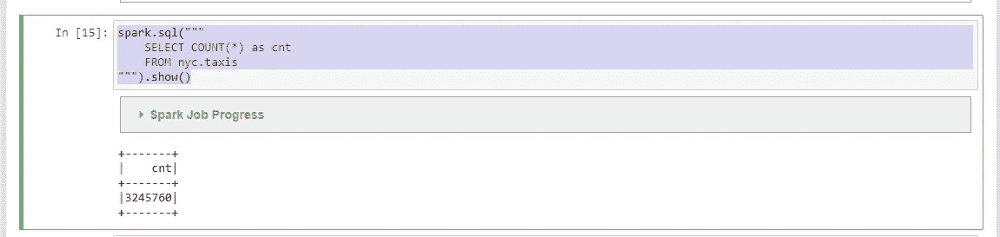

这样，我们只需加载数据，使用 EMR 集群作为计算引擎，使用 S3 持久化数据，使用 Apache Iceberg 作为开放表格式，就像 SQL 表一样工作。

用于 DML 操作、时间旅行、模式进化、数据回滚、数据压缩等的表达性 SQL。Apache Iceberg 有一些有趣的特性，如果我们追求一个开源和开放标准必不可少的数据架构，那么它是表格格式的最佳选择。

如果你想了解更多关于这个技术栈的信息，请点击下面的链接

[](https://iceberg.apache.org/spec/) [## 投机

### 这是 Iceberg 表格式的规范，旨在管理大量缓慢变化的…

iceberg.apache.org](https://iceberg.apache.org/spec/) [](https://iceberg.apache.org/docs/latest/) [## 介绍

### Apache Iceberg 是一种用于大型分析数据集的开放式表格格式。Iceberg 为计算引擎添加了表格，包括…

iceberg.apache.org](https://iceberg.apache.org/docs/latest/)  [## 什么是亚马逊 EMR？

### Amazon EMR(以前称为 Amazon Elastic MapReduce)是一个托管集群平台，可以简化大数据的运行…

docs.aws.amazon.com](https://docs.aws.amazon.com/emr/latest/ManagementGuide/emr-what-is-emr.html) [](https://www.dremio.com/resources/guides/apache-iceberg-an-architectural-look-under-the-covers/) [## 阿帕奇冰山:隐藏的建筑景观

### 如果你更喜欢视频而不是文字，这里有一个在这篇文章中介绍这一内容的录音，我们会去…

www.dremio.com](https://www.dremio.com/resources/guides/apache-iceberg-an-architectural-look-under-the-covers/)