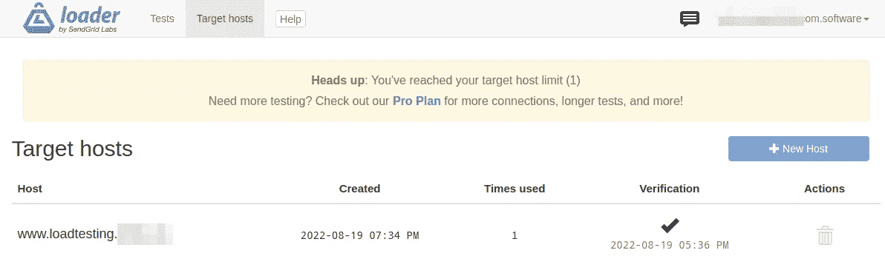
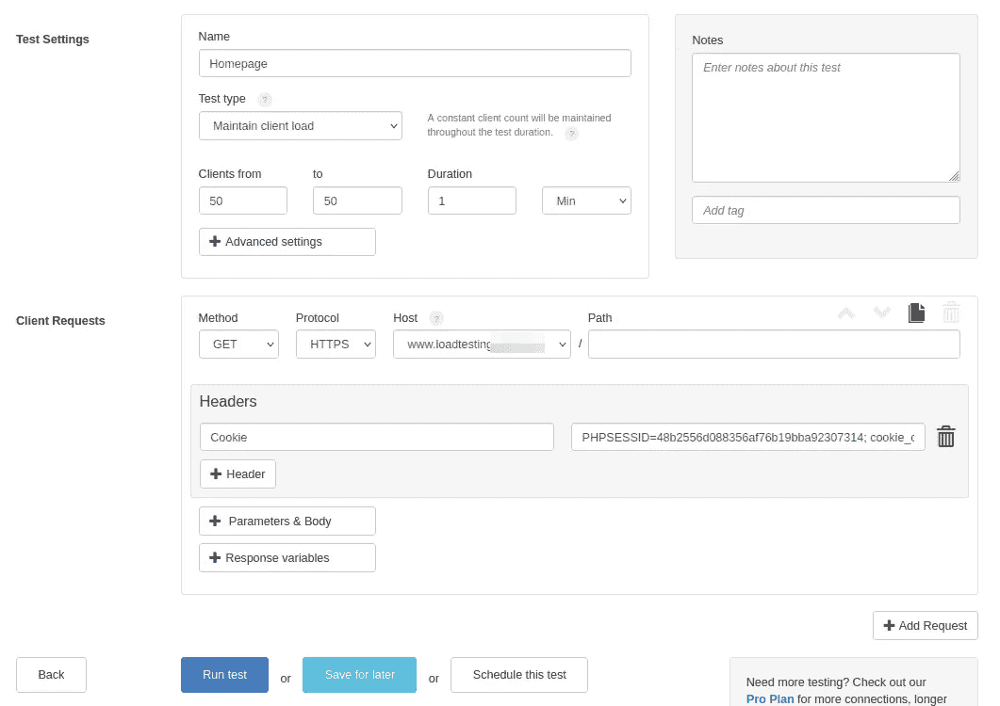
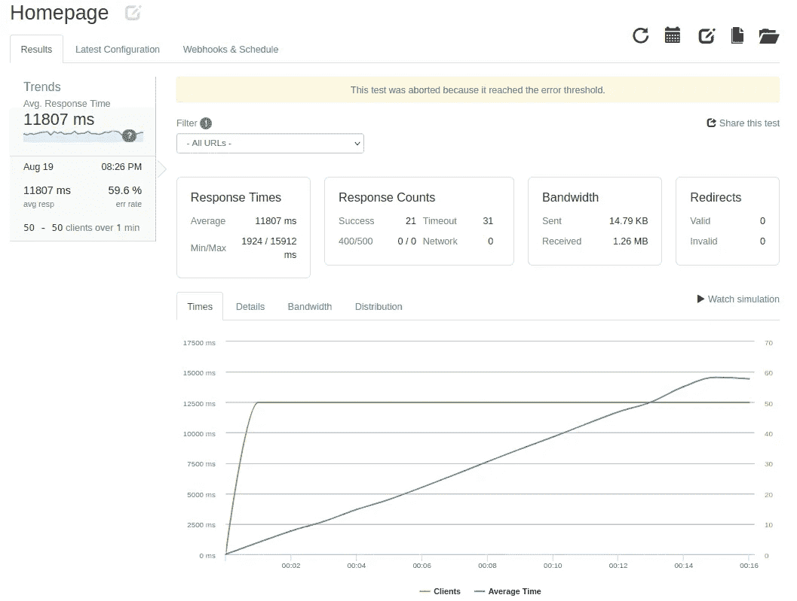
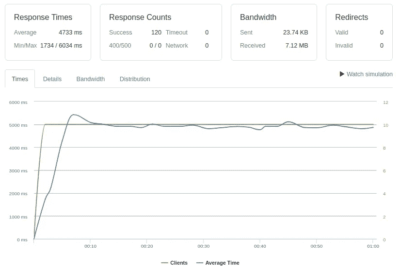

# 对 PHP 应用程序进行负载测试

> 原文：<https://blog.devgenius.io/load-testing-your-web-application-cc97ac0ee3d9?source=collection_archive---------7----------------------->

## 了解你的应用在高负载下的表现对于任何成功的在线业务都是至关重要的

在 [Unsplash](https://unsplash.com?utm_source=medium&utm_medium=referral) 上由 [Oleksandr Brovko](https://unsplash.com/@alex_brov?utm_source=medium&utm_medium=referral) 拍摄的照片

你有没有问过自己“我的应用程序能处理多少用户？”多亏了负载测试工具，这个问题并不难回答。

## 关于负载测试

[负载测试](https://en.wikipedia.org/wiki/Load_testing)是一种有用的测试技术，它允许你验证你的应用程序在暴露于大量并发会话时的行为。在发布之前测试应用程序给了你一个发现代码中难以预测的问题的机会。

有许多工具可以执行这种测试，分为两大类:

*   离线工具——比如 Apache 的最流行和免费的[jMeter](https://jmeter.apache.org/)
*   在线服务—由[各种云提供商](https://en.wikipedia.org/wiki/Load_testing#Load_testing_tools)

## 如何进行测试？

在运行任何负载测试之前，您需要定义场景。这些步骤可以是简单的，如“加载单个页面”,也可以是复杂的，由多个步骤组成:

*   登录到应用程序
*   使用搜索查找产品
*   打开产品页面

应该定期监视应用程序，因为随着时间的推移，应用程序的性能可能会因数据库中数据量的增加而下降。

## 在哪里进行测试？

*   可以进行测试:
*   在生产环境中，最好不要在高峰时段，以免因可能的停机而干扰常规用户
*   在暂存环境中，最好是服务器基础架构与生产环境相匹配或接近，并且数据库中植入了相同数量的数据
*   除非环境使用生产就绪设置，否则不建议使用本地开发环境

在当地环境下:

*   服务器需要以某种方式暴露于互联网(例如，通过暴露的端口或隧道服务)
*   应该启用生产模式
*   数据库应该包含足够的数据
*   网络吞吐量必须足够大，以处理数量增加的请求

对于基本用法，我推荐使用 SendGrid labs 的 [Loader.io](https://loader.io) 服务。这项服务使用起来毫不费力，并且提供了慷慨的免费计划，每次测试有 10，000 个可能的客户，这对于开始使用这项服务来说绰绰有余。**免责声明**:我与该提供商没有任何关系。

为了开始，您需要添加 web 应用程序的主机名，并通过在根目录中放置一个验证文件来证明所有权。

成功验证后，我们可以定义我们的场景。我将在我的开发环境中测试主页渲染速度。请记住，服务器没有以任何方式进行优化😊

我将选择“maintain client load”测试来验证在一分钟的测试中，当每秒钟有 50 个客户端请求主页时，我的环境表现如何。我将包含带有会话 id 的 cookie，以便在请求期间对会话进行身份验证，并包含同意 cookie，以免用 GDPR 模式干扰请求。

我一点击“运行测试”按钮，它就开始运行。果然，正如我所料，过了一会儿，它没有完全执行。

从图表中可以看出，由于大量的并发请求，响应时间不断增加，直到达到 10 秒的限制，测试中止。我的开发环境无法处理 50 个并发会话。我将编辑场景，并同时进行 10 次会议。

这一次它设法完成了，平均响应时间为 4733 毫秒。

不能称之为成功，但至少是有效的。

[https://imgflip.com](https://imgflip.com)

我喜欢负载测试，并且一直在做。它允许比较任何类型的性能修改的“之前”和“之后”的结果。

你会试一试吗？也许你知道一个你想分享的好服务，请在评论中告诉我。

*有什么疑问吗？想法？请给我留下你的看法。让我们一起让我们的代码变得美丽。订阅我的出版物，获取更多类似的文章，成为更好的开发人员。*

这个故事*对你有价值吗*？请留言支持我的工作👏鼓掌表示感谢你知道你可以不止一次鼓掌吗？🥰 *谢谢。*