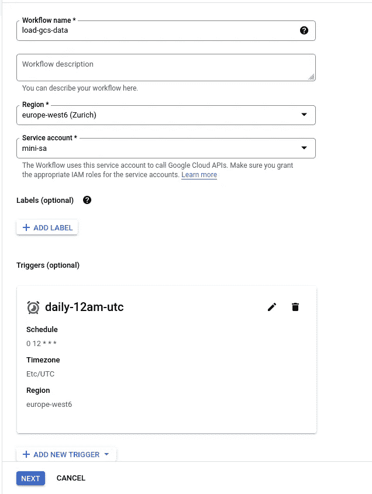

# 使用云工作流将数据从 Google 云存储加载到 BigQuery

> 原文：<https://blog.devgenius.io/loading-data-from-google-cloud-storage-into-bigquery-using-cloud-workflows-679761d18998?source=collection_archive---------1----------------------->

[Google Cloud Workflows](https://cloud.google.com/workflows/docs/overview) 是一个无服务器的编排平台，允许我们将服务组合成可重复和可观察的动作集，通常连接其他 GCP 服务。你猜对了，这些工作流叫做**。**

**作为一名数据工程师，我广泛使用 Apache Airflow(以及它在 GCP 的实现 Composer ),起初我对它提供的功能有点怀疑，但后来逐渐喜欢上了它的直接和简单。**

**在这个快速练习中，我们将展示一个简单的用例——将一个 CSV 文件从 Google 云存储加载到 BigQuery。**

## **准备工作**

**让我们设置适当的帐户和权限。对于这个作业，我们已经创建了一个服务帐户，并为其分配了角色“大查询作业用户”**

****

**我们服务客户的项目角色**

**我们还被授予了同一个服务帐户访问 Google 云存储桶的权限，我们打算从这个存储桶加载数据。**

****

**服务帐户的存储桶权限**

**接下来，我们需要创建一个目标 BigQuery 数据集，并在其上提供服务帐户“Big Query Data Editor”角色。请注意，数据集需要与数据加载到的存储桶位于同一个 GCP 区域(或多区域)。**

****

**BigQuery 目标数据集权限**

**现在，让我们看看我们的文件——一个普通的逗号分隔的 CSV 文件，第一行是标题行。**

********

**根据我们的图例，该文件遵循以下命名约定，第一部分是销售日期。**

****

**好了，现在让我们来看看工作流程本身。**

## **创建工作流**

****

**在出现的对话框中，我们为工作流命名，选择区域和服务帐户(与上面我们授予权限的帐户相同)来运行工作流。**

****

**比方说，如果我们希望每天都读取文件，也就是说，按照特定的时间表运行工作流，我们可以创建一个云调度程序触发器。这将自动以给定的节奏运行工作流。**

**请注意，项目级角色“工作流调用者”需要附加到触发工作流的服务帐户。**

****

**带有触发器的工作流如下所示**

****

## **创建步骤**

**现在我们看到了工作流开发窗口，在这里我们可以用 YAML 式的语法为我们的工作流编写定义。如果你不熟悉工作流语法，一个好的起点是[工作流教程页面](https://cloud.google.com/functions/docs/tutorials)。另外，请注意右侧的窗格，它展示了我们的控制流**

****

**我们现在需要构建工作流逻辑。在本练习中，我们需要检查可以为 BigQuery 作业设置的配置选项，这些选项记录在以下链接中**

** [## 方法:Google APIs . big query . v2 . jobs . insert | Workflows | Google Cloud

### 无论您的企业正处于数字化转型的早期阶段，谷歌云都可以帮助您解决…

cloud.google.com](https://cloud.google.com/workflows/docs/reference/googleapis/bigquery/v2/jobs/insert) 

最简单的方法是在使用模式自动检测的同时尝试加载数据。注意负载配置中的`autodetect: true`部分。

以下代码将:

*   声明一个结果列表，我们将在其中累积作业结果
*   使用一组提供的参数创建 BigQuery 插入作业
*   将插入作业的结束状态附加到先前创建的列表中
*   工作流程完成后打印作业状态列表

BigQuery 已经自动检测了列类型并加载了数据。

如果我们选择为作业提供模式，我们可以执行以下操作:

在执行时，这会产生以下结果。

如果我们有一个稍微高级一点的用例，并且想要将数百个文件(可能相当大)读入一个分区表，该怎么办？代码可能看起来像下面这样。

请注意以下事项:

*   基于字段**日期**按“天”进行时间划分
*   sourceUris 现在有一个通配符“*”来捕获所有以“_orders.csv”结尾的文件。

我们现在有了一个分区表

## 结论

正如我们在这个练习中看到的，使用云工作流将数据从 Google 云存储加载到 BigQuery 非常简单，并且允许我们利用 BQ API 在 Google Cloud 中构建可重复的低开销数据管道。感谢阅读！**