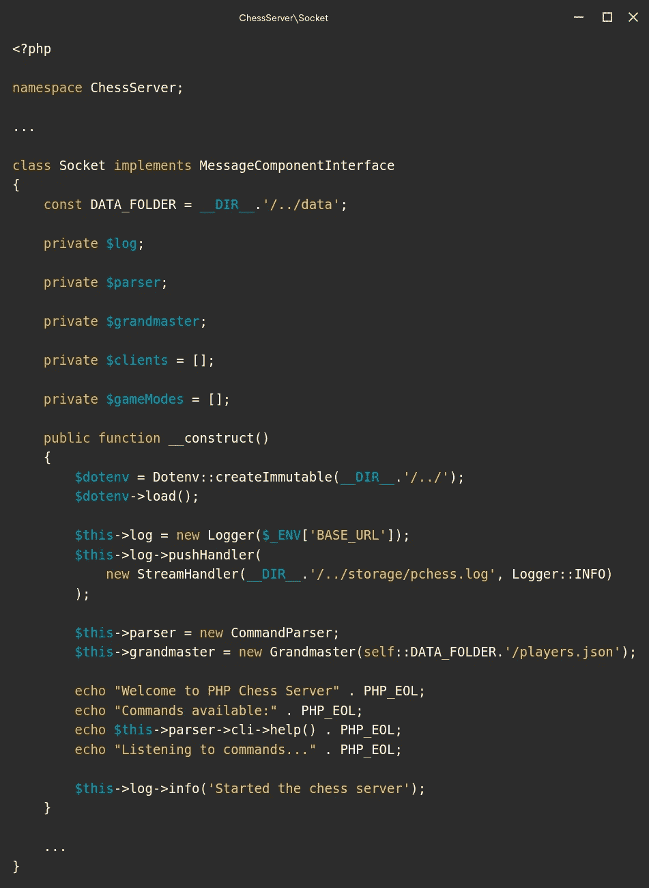
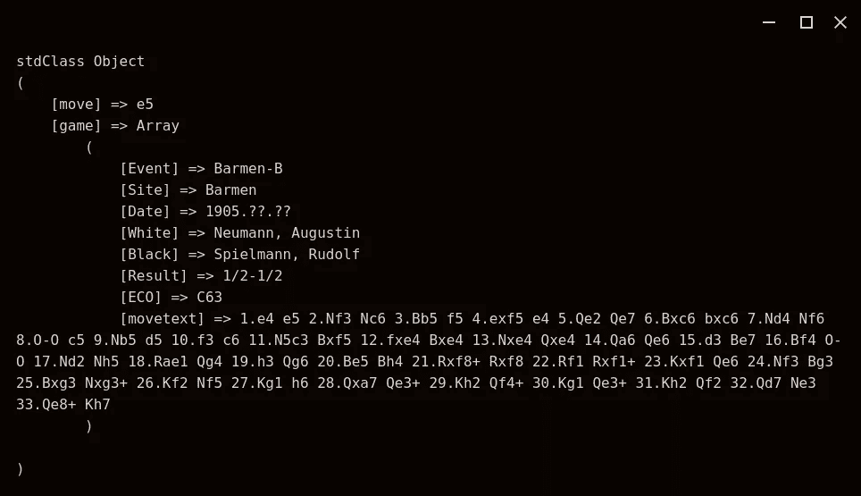
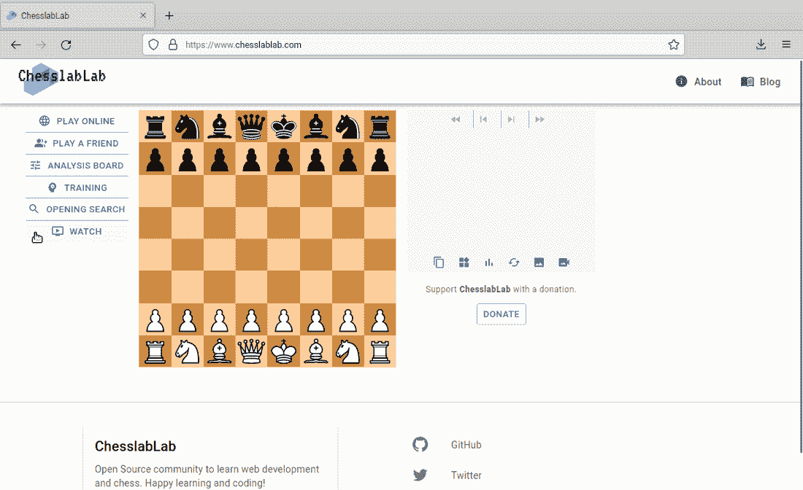

# 加载大型 JSON 文件

> 原文：<https://blog.devgenius.io/loading-large-json-files-bbd27b01f740?source=collection_archive---------1----------------------->

## 而不是在数据库上花钱


在 [Unsplash](https://unsplash.com/s/photos/save-money?utm_source=unsplash&utm_medium=referral&utm_content=creditCopyText) 上由 [micheile dot com](https://unsplash.com/@micheile?utm_source=unsplash&utm_medium=referral&utm_content=creditCopyText) 拍摄的照片

这是我想写给未来的自己的帖子之一，让我回来后重温我过去是如何做一些事情的。现在，你也可以读它，帮我赚几块钱！如果你想支持我成为一名作家，请[考虑注册我的链接](https://programarivm.medium.com/membership)成为一名媒介会员。我会赚一小笔佣金。

在 GitHub 上的 ChesslaBlab repos 上工作了一年之后，已经做了很多工作，有时我觉得好像我没有特别写这个或那个东西。

[](https://github.com/chesslablab) [## 切斯拉拉布

### 面向网络的开源象棋。ChesslaBlab 有 7 个可用的存储库。在 GitHub 上关注他们的代码。

github.com](https://github.com/chesslablab) 

一切都很好，尽管我记不起来了。一个好的迹象是，尽管一套 chess web 应用程序带来了越来越多的复杂性，但代码可以很容易地更改。DevOps 方面的东西也保持最小化，这与下面上一篇文章中描述的 AWS 设置非常相似。

[](https://medium.com/geekculture/how-to-make-docker-containers-talk-to-each-other-38029a461ad2) [## 如何让 Docker 容器相互对话

### 通过使用桥接网络

medium.com](https://medium.com/geekculture/how-to-make-docker-containers-talk-to-each-other-38029a461ad2) 

基本上，我仍然使用一个单独的 [t2.micro 实例](https://aws.amazon.com/ec2/instance-types/t2/)来运行所有需要的服务，每个月花费大约 14 美元，然而，在过去的四个月里，事实证明，一台机器单独处理这些资源太多了。

因此，有一个重大的变化，以保持一切尽可能便宜。

# 我摆脱了 MySQL 数据库

至少目前是这样。

这意味着目前所有的象棋游戏都被转储到一个大的 JSON 文件中，供 PHP 象棋服务器进一步处理，而不是使用数据库。我想可以说平面文件数据库已经被取代了。JSON 平面文件可以做到这一点，因为它只在服务器启动时加载到内存中一次。



**图一**。[象棋服务器构造器](https://github.com/chesslablab/chess-server/blob/309fa5020d42c6013abc19b6b498936694f630d8/src/Socket.php)。

值得注意的是，WebSocket chess 服务器不同于 HTTP web 服务器，在 HTTP web 服务器中，大型 JSON 文件将在每个 HTTP 请求中加载，而不是在启动时加载，这使得平面文件方法由于内存问题而不可行。如果您需要在 web 应用程序中处理大型 JSON 文件，您可以考虑使用流解析器或像 JSON Machine 这样的内存高效解析器。

[](https://github.com/salsify/jsonstreamingparser) [## GitHub-sals ify/jsonstreamingparser:一个用 PHP 实现的 JSON 流解析器。

### 这是一个简单的流解析器，用于处理大型 JSON 文档。使用它来解析非常大的 JSON 文档…

github.com](https://github.com/salsify/jsonstreamingparser) [](https://github.com/halaxa/json-machine) [## GitHub - halaxa/json-machine:高效、易用、快速的 PHP JSON 流解析器

### (README 与代码同步)非常易于使用，内存效率高，是低效迭代的替代产品…

github.com](https://github.com/halaxa/json-machine) 

# 如前所述

棘轮 WebSocket 服务器就不是这种情况，因为 JSON 文件可以在 PHP Chess 库的`Chess\Grandmaster`类的帮助下加载到服务器构造函数中。

 [## 象棋\特级大师- PHP 象棋

### Chess\Grandmaster 根据传递给其构造函数的 JSON 文件路径计算出下一步要走的棋…

php-chess.readthedocs.io](https://php-chess.readthedocs.io/en/latest/grandmaster/) 

用技术语言更准确地说，一个类型为`Grandmaster`的对象在 chess server 构造函数中被实例化，然后被分配给`$this->grandmaster`。

```
$this->grandmaster = new Grandmaster(
    self::DATA_FOLDER.'/players.json'
);
```

`Chess\Grandmaster`试图根据传递给其构造函数的文件路径来判断下一步要做的事情，如下例所示。

```
**use** **Chess**\**Game**;
**use** **Chess**\**Grandmaster;**$game = **new** Game(Game::MODE_GRANDMASTER);
$game->play('w', 'e4'); $move = (**new** Grandmaster(**__DIR__**.'/../data/players.json'))
    ->move($game);print_r($move);
```



**图二**。`Chess\Grandmaster`计算出下一步的行动。

# 用象棋游戏数据创建一个 JSON 文件

JSON 文件可以用 Chess 数据报告中的命令行工具生成。

[](https://github.com/chesslablab/chess-data) [## GitHub-chess lab/chess-data:一个国际象棋数据库，数据科学和使用 Rubix ML 的机器学习。

### 一个象棋数据库，数据科学和机器学习用 Rubix ML。一个国际象棋数据库…

github.com](https://github.com/chesslablab/chess-data) 

这是一个分三步走的过程。首先要做的是将一堆游戏加载到 MySQL 数据库中。

```
$ php cli/seed/players.php data/players/t2.micro
✗ 2 games did not pass the validation.
✓ 3893 games out of a total of 3895 are OK.
✓ 3365 games out of a total of 3365 are OK.
✓ 3430 games out of a total of 3430 are OK.
✓ 2743 games out of a total of 2743 are OK.
✗ 5 games did not pass the validation.
✓ 1341 games out of a total of 1346 are OK.
✓ 597 games out of a total of 597 are OK.
✓ 1540 games out of a total of 1540 are OK.
✓ 827 games out of a total of 827 are OK.
✓ 1186 games out of a total of 1186 are OK.
✗ 1 games did not pass the validation.
✓ 2385 games out of a total of 2386 are OK.
✓ 1826 games out of a total of 1826 are OK.
✓ 919 games out of a total of 919 are OK.
✓ 1186 games out of a total of 1186 are OK.
✗ 1 games did not pass the validation.
✓ 3497 games out of a total of 3498 are OK.
✗ 2 games did not pass the validation.
✓ 2108 games out of a total of 2110 are OK.
✓ 1571 games out of a total of 1571 are OK.
✓ 2851 games out of a total of 2851 are OK.
✓ 3102 games out of a total of 3102 are OK.
✓ 1395 games out of a total of 1395 are OK.
✓ 3985 games out of a total of 3985 are OK.
✓ 2658 games out of a total of 2658 are OK.
✓ 847 games out of a total of 847 are OK.
✓ 909 games out of a total of 909 are OK.
✓ 2231 games out of a total of 2231 are OK.
✓ 2902 games out of a total of 2902 are OK.
✓ 1824 games out of a total of 1824 are OK.
✓ 701 games out of a total of 701 are OK.
✓ 1124 games out of a total of 1124 are OK.
```

这个命令将在`[data/players/t2.micro](https://github.com/chesslablab/chess-data/tree/master/data/players/t2.micro)`中找到的文件植入`players`表，T6 是一个包含几十个来自 [PGN 导师](https://www.pgnmentor.com/files.html)的游戏的文件夹。

> 请注意，Chess Data repo 中的数据库专门用于为进一步的机器学习创建和准备数据，所有这些都是在本地完成的。

然后，数据被转储到`output/players.csv`文件中。

```
$ php cli/csv/players.php
```

最后，使用 csvtojson 将`players.csv`转换成`players.json`。

[](https://www.npmjs.com/package/csvtojson) [## csvtojson

### 一个专注于将 csv 数据转换为 JSON 的工具，支持定制的解析器。最新版本:2.0.10，最新…

www.npmjs.com](https://www.npmjs.com/package/csvtojson) 

```
$ csvtojson output/players.csv > output/players.json
```

# 就是这样！

得到的`players.json`大小为 35 MB，将被存储在[象棋服务器/数据](https://github.com/chesslablab/chess-server/tree/master/data)文件夹中。

从最终用户的角度来看，当猜测国际象棋大师的走法时，这些数据被提取并显示在屏幕上，如下图所示。



**图 3** 。训练>猜棋

目前，只要国际象棋服务器没有获得太多的流量，这在 www.chesslablab.com 运行得很好。该解决方案不涉及任何数据库管理系统，只是帮助将成本保持在最低水平，这对 MVP 来说是非常好的。