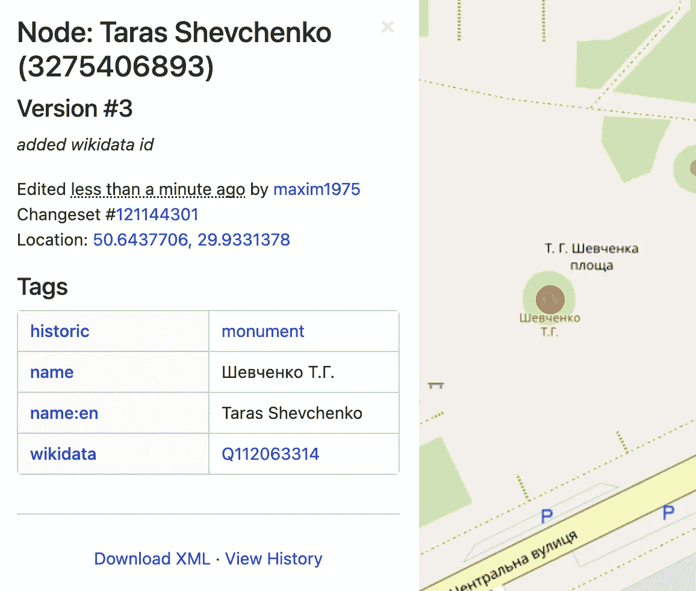
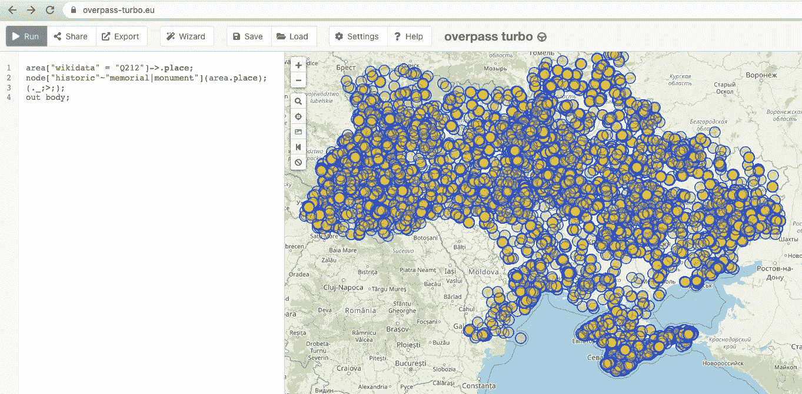
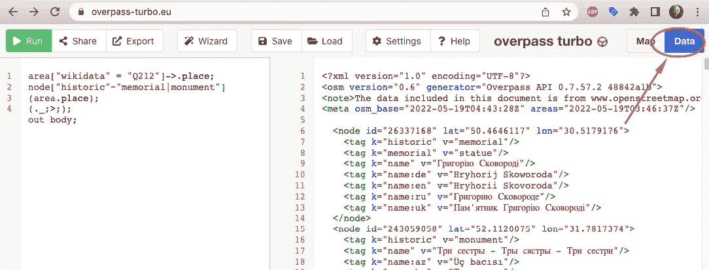
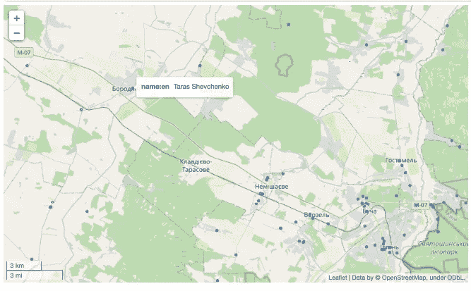
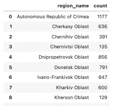
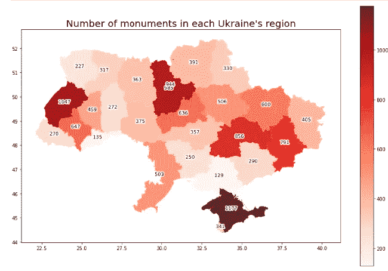
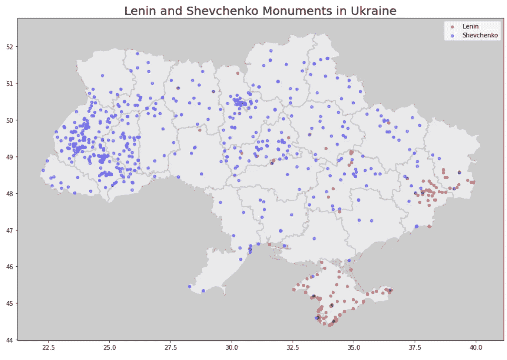
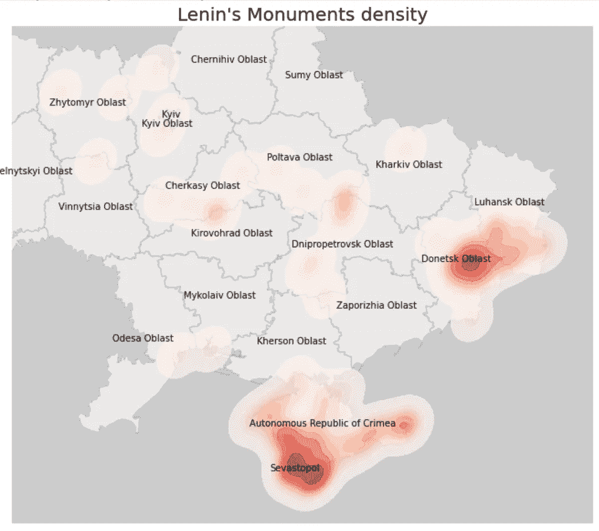

# 使用天桥 API 从 OpenStreetMap 加载 POI 数据

> 原文：<https://blog.devgenius.io/loading-poi-data-from-openstreetmap-using-overpass-api-b287ed809ed8?source=collection_archive---------3----------------------->

OpenStreetMap 是地理空间数据的宝贵来源。这就像地图的维基百科。每个人都可以通过添加街道，房子，湖泊来编辑它。甚至像长凳、路灯和邮箱这样的小物件也可以添加进去。

有多种方法可以加载这些数据。其中一种是通过发送一个查询到[over API](https://wiki.openstreetmap.org/wiki/Overpass_API)与您的搜索标准，并加载数据作为 JSON 或 XML 数据。

在这篇文章中，我将向你展示如何找到位于乌克兰的古迹的位置和名称。首先，我们需要找到一个纪念碑，并检查哪些标签用于 OSM 的纪念碑。

让我们来看看位于基辅地区 Borodyanka 的乌克兰著名作家塔拉斯·舍甫琴科的纪念碑。这座位于 T2 的小镇最近遭到了俄罗斯军队 T3 的轰炸。


[博罗代安卡](https://commons.wikimedia.org/wiki/Category:Monument_to_Taras_Shevchenko_in_Borodianka) [塔拉斯·舍甫琴科纪念碑来源:乌克兰国家紧急服务](https://en.wikipedia.org/wiki/State_Emergency_Service_of_Ukraine)在知识共享许可下

所有可以在地图上表示为一个点的对象都作为节点存储在 OSM 中。这座纪念碑是一个节点。每个节点都有一个唯一的 ID。对于这个纪念碑，节点 ID 是 3275406893。标签和其他详细信息可在此处查看:

[https://www.openstreetmap.org/node/3275406893](https://www.openstreetmap.org/node/3275406893)



OSM 古迹资料

如您所见，值为“monument”的标记“historical”描述了节点类型。“名称”在本地语言(乌克兰语)中有纪念碑名称，“名称:en”-英文名称，“维基数据”包含维基数据中纪念碑的 ID，维基数据是维基媒体项目的结构化数据存储(维基百科是这些项目之一)。

# 将数据加载到数据框中

要获取乌克兰的所有古迹，请使用以下查询:

```
area["wikidata" = "Q212"]->.place;    
node["historic"~"memorial|monument"](area.place);
(._;>;);
out body;
```

第一部分:

```
area["wikidata" = "Q212"]->.place;
```

查找标签为“wikidata”且值为“Q212”的区域，Q212 是乌克兰的 Wikidata ID。

第二部分:

```
node["historic"~"memorial|monument"](area.place);
```

查找标签为“historic”且值为“memorial”或“monument”的节点。“~”字符指定该值应该与正则表达式匹配。仅返回位于乌克兰区域内的节点。

有关详细信息，请查看 transition API 语言指南[https://wiki . openstreetmap . org/wiki/transition _ API/Language _ Guide](https://wiki.openstreetmap.org/wiki/Overpass_API/Language_Guide)

要运行查询，请转到[https://overpass-turbo.eu/](https://overpass-turbo.eu/)并将查询粘贴到左侧的文本区域。单击“运行”并确认您同意加载一个大响应(3 Mb)。因此，您可以看到以下地图视图，其中所有节点都符合查询条件:



天桥 Turbo.eu 中的运行节点查询

要查看 XML 格式的数据，请单击右上角的“数据”按钮。如您所见，响应包括节点 ID、坐标和标记。这个文件也可以保存。



数据视图

这个基于网络的查询工具非常方便地编辑和调试你的天桥 API 查询。一旦准备好查询，就可以将其复制到源代码中。让我们从 Python 执行这个查询。

[*over pay*](https://pypi.org/project/overpy/)库用于连接立交桥 API。可以使用 pip 安装:

```
!pip install overpy
```

现在我们可以运行查询来加载纪念碑数据:

query_result 包含一个节点数组。让我们将节点转换为地理数据框架。请注意，带有点的 GeoSeries 是从点对象数组创建的。还设置了地理空间投影 4326，这是以度为单位的 WGS 84 经度和纬度值。

数据框中超过 13，000 个纪念碑位置

乌克兰的纪念碑

由于我们有很多点，explore()是使用可以滚动和放大的地图来检查数据的最佳方式。为地理数据框指定有效的 CRS 非常重要，否则底图将不会显示。

可以设置点工具提示上显示的数据。例如，英文名称:

```
monuments_gdf.explore(tooltip=["name:en"], highlight=True)
```



显示带有数据框点的叶图

# 创建显示每个地区古迹数量的 choropleth 地图

现在，我们可以查看乌克兰每个地区有多少座纪念碑。在我以前的文章中，我解释了如何从 OSM 提取行政边界，所以我将使用现有的 CSV 文件“ua_admin.csv”。

乌克兰的地区在 OSM 使用标签“admin _ level”= 4 来定义。对加载的行政边界数据应用过滤器以仅获得此级别。


ua_admin_gdf

每个区域几何都表示为多边形，如果包含不相连的区域，则表示为多重多边形。

首先，我们需要找到每个标志点所在的区域多边形。

**。sjoin()** 方法将对行政边界和纪念碑数据框进行空间“内”连接，并使用两者的列生成新的。所以现在我们有了每个纪念碑的地区名称。

```
ua_admin_monuments_gdf = ua_admin_gdf.sjoin(monuments_gdf)
```


使用。groupby()将返回一个包含纪念碑数量的区域列表。

```
monuments_count_df = ua_admin_monuments_gdf.groupby(by=["region_name"]).size().to_frame("count").reset_index()
```



要创建 choropleth 映射运行:



乌克兰每个地区的古迹数量

# 在地图上将纪念碑位置显示为标记

纪念碑可以按名称过滤。例如，我们可以过滤数据集以在地图上显示弗拉基米尔·列宁(苏维埃政权独裁者)和塔拉斯·舍甫琴科(乌克兰作家)的位置。纪念碑名称可能会有所不同，也可以用俄语或乌克兰语书写。最好的方法是使用正则表达式来覆盖多个变量。

对于列宁(俄语为ленин，乌克兰语为ленін)的正则表达式**”。*Лен[иі]н.*"** 将被使用。

对于舍甫琴科(шевченко在俄语和乌克兰语中都有)的正则表达式**”。*Шевченк.*"** 将被使用。请注意，最后一个字母被删除了，因为在这些语言中，姓名可能会被“拒绝”,但根据用法，拼写会略有不同。

除了每个人两个覆盖(红色和蓝色)，我还会添加行政边界，以提供一些视觉参考。



乌克兰的列宁和舍甫琴科纪念碑

正如你所看到的，乌克兰西部有很多舍甫琴科纪念碑。列宁纪念碑集中在顿巴斯和克里米亚地区，这两个地区目前被俄罗斯联邦占领。

我们可以计算给定区域内的密度，而不是显示单个点。当你有大量的点数时，这个方法非常有效。



列宁纪念碑的密度

正如你所看到的两个列宁纪念碑“热点”是克里米亚南部海岸和顿涅茨克。这个看点分布真的很有用。

整个例子可以在 Kaggle 上的笔记本中找到，包括行政边界文件。

[https://www . ka ggle . com/maxim 75/loading-data-from-osm-using-transition-API](https://www.kaggle.com/maxim75/loading-data-from-osm-using-overpass-api)

天桥 API 查询可以很容易地修改，以返回其他类型的数据，不仅作为节点，而且作为方式，面积和关系。例如:

```
["brand" = "McDonald's"] - McDonald's restaurants
["natural"="peak"] - mountain peaks
```

我希望你会发现这些例子对你的项目有用。