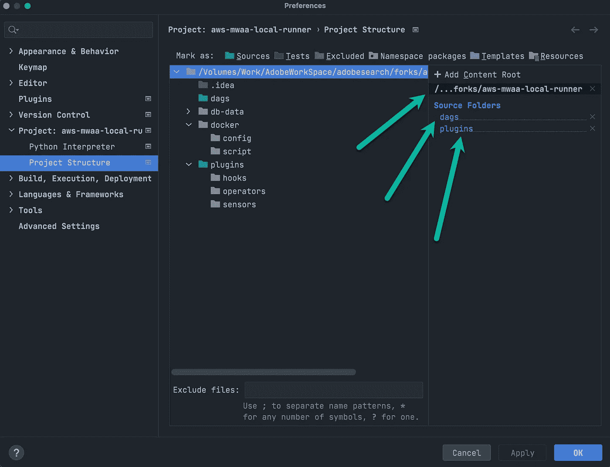
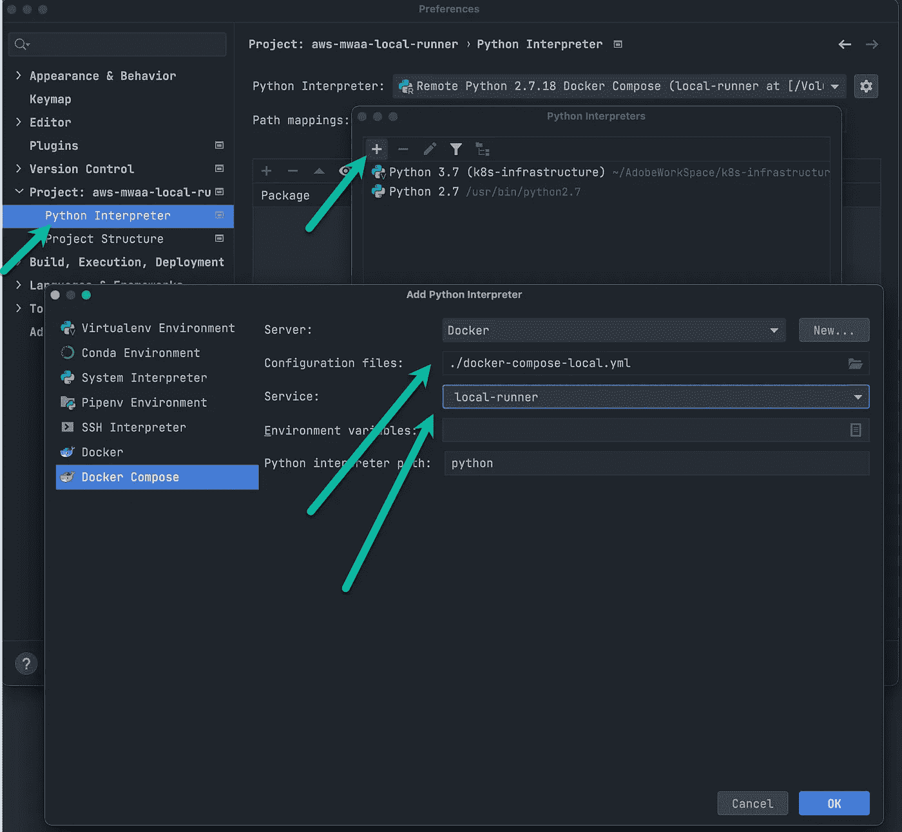
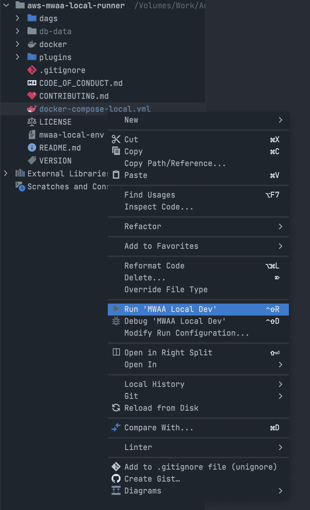
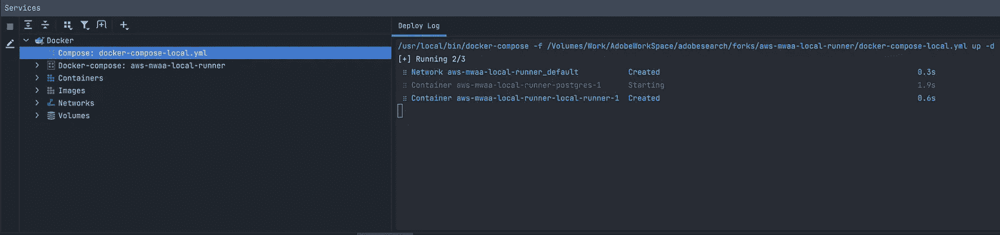
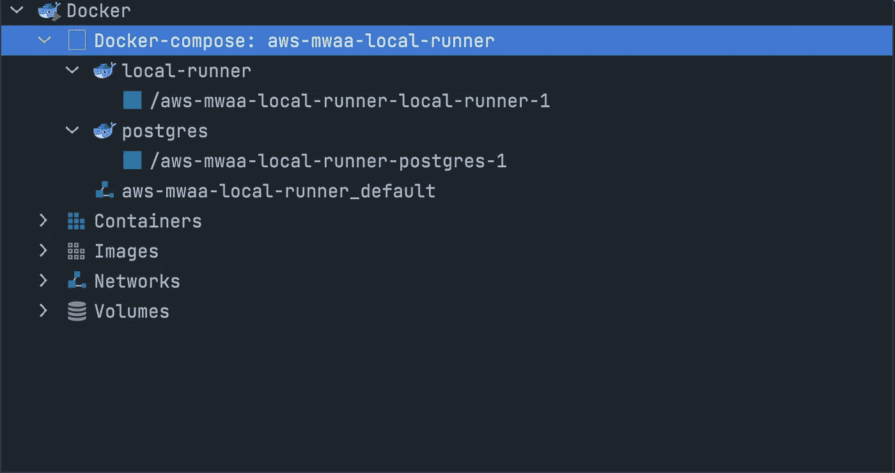
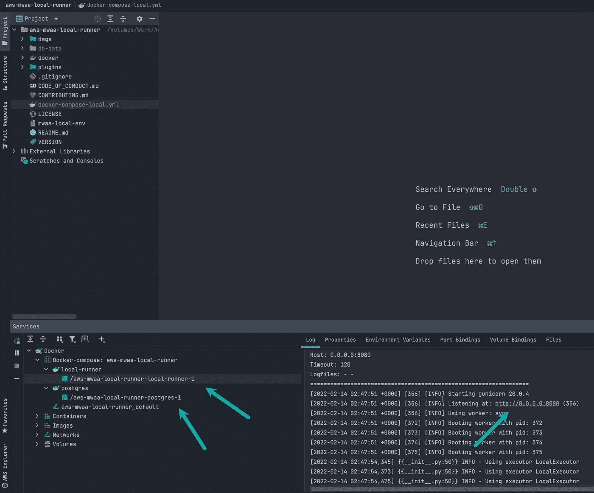

# 使用 PyCharm 的 MWAA 本地开发设置

> 原文：<https://blog.devgenius.io/local-development-setup-for-mwaa-with-pycharm-ea5f002aeb1?source=collection_archive---------10----------------------->


[照片](https://unsplash.com/photos/3uqauucYhjQ)由 [JC Gellidon](https://unsplash.com/@jcgellidon) 在 Unsplash 上拍摄

通常，我的组织使用`airflow`作为我们的`etl`或`pipeline`服务。最近，我们从我们的内部`airflow`设置转移到**亚马逊管理的气流，又名 MWAA** 。

在花了一些时间之后，我开始想是否有办法在本地设置 dag/operators/plugin 开发。

我使用 P [ycharm](https://www.jetbrains.com/pycharm/) 作为我的本地`python`相关开发 IDE。所以我决定用 P[y cham](https://www.jetbrains.com/pycharm/)来设置我的**气流 Dags** 开发。谢天谢地， **MWAA** 已经在 GitHub 上发布了一个本地开发设置—[AWS-mwaa-local-runner](https://github.com/aws/aws-mwaa-local-runner)。

下面我提供了我遵循的步骤:

**步骤 1:** 在本地下载存储库。我正在使用**气流 1.10.12，**所以我下载了`1.10.12`标签

```
git clone -b v1.10.12 [https://github.com/aws/aws-mwaa-local-runner](https://github.com/aws/aws-mwaa-local-runner)
```

**步骤 2:** 按照'[自述文件](https://github.com/aws/aws-mwaa-local-runner/blob/main/README.md)'在本地构建 docker 映像。

```
./mwaa-local-env build-image
```

**第三步:**一旦构建了映像，我们必须执行一个快速的 hack，即将 Docker 合成文件`docker-compose-local.yml`从`docker`文件夹移动到根文件夹`aws-mwaa-local-runner`。

**第四步:**设置 Pycharm 的时间到了。在 Pycharm 中打开`aws-mwaa-local-runner`，应用以下设置。



Pycharm 项目结构设置

选择`aws-mwaa-local-runner`作为**根文件夹**，选择`dags`和`plugins`作为**源文件夹**。

**步骤 5:** 为项目设置`Python Interpreter`。



选择 Python 解释器->添加新项-> Docker 编写->选择 docker-componse-local.yml 文件->服务` local-runner '

选择 **Python 解释器**->-**添加新**->-**Docker 撰写** - >选择`**docker-componse-local.yml**`文件- >服务`**local-runner.**`

**第六步:**现在，我们几乎完成了所有的先决条件。开始吧。！运行`docker-compose-local.yml`文件。



右键单击 docker-compose-local.yml 并运行

这应该会启动`docker-compose-local.yml`文件中提到的容器。



现在我们可以看到容器启动并运行:



现在我们可以看到我们有:

1.  **气流**集装箱作为`/aws-mwaa-local-runner-local-runner-1`运行
2.  **Postgres** 集装箱作为`/aws-mwaa-local-runner-postgres-1`运行
3.  如果您选择容器右窗格，您可以看到日志和本地 URL 的**气流**[http://0 . 0 . 0 . 0:8080](http://0.0.0.0:8080)。

我们已经在我们最喜欢的 IDE, **PyCharm 上运行了本地**亚马逊管理气流**。**

# 编码快乐！！