# 本地化图像、颜色和信息列表(iOS)

> 原文：<https://blog.devgenius.io/localize-images-colors-and-infoplist-ios-6b668cf9c919?source=collection_archive---------1----------------------->

使用本地化时，有时需要使用本地化的图像、应用程序显示名称、隐私权限文本描述等。除此之外，还有一些项目无法本地化，如应用程序图标、启动屏幕等。此外，基于操作系统的警报无法定制，只能通过操作系统进行控制。希望这篇文章能有所帮助！

XCODE 允许我们对图像进行本地化，一个图像资源集合可以针对不同的语言进行本地化。从属性检查器中，转到本地化并选择语言。一个新的图像集出现在图像上。您可以为每种语言设置单独的图像。

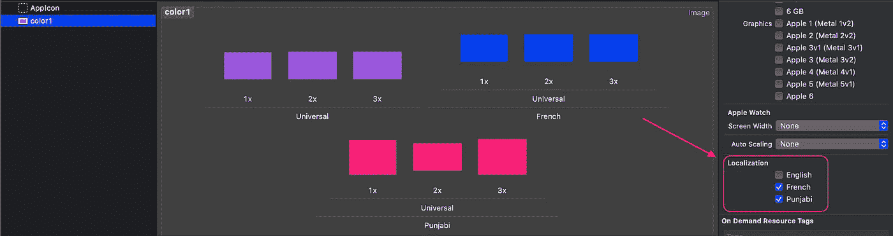

在上面的截图中，我们将图像本地化为 3 种不同的语言。每种语言都有自己的形象。这三对图像仅用一个名字识别。因此，添加另一种语言不需要任何编程上的改变。

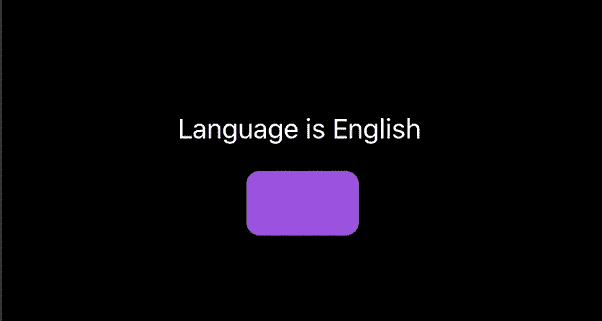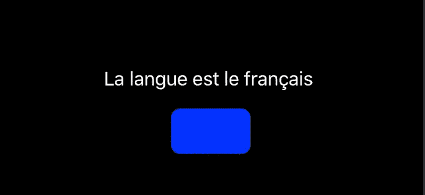

就这样，我们完成了图像定位。遗憾的是，这不适用于启动屏幕和应用程序图标。

颜色也可以像图像一样进行本地化。创建颜色资源集合，命名一种颜色。然后按照与图像相同的步骤操作。

同样，info plist 字符串也可以本地化。但是这里我们只限于 info.plist 中的一些字符串，它们都不能被本地化。只有下列键可以本地化—

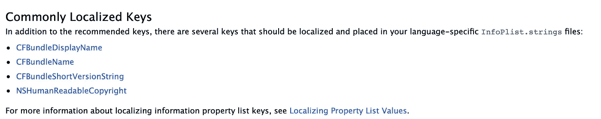

参考链接— [点击这里](https://developer.apple.com/library/archive/documentation/General/Reference/InfoPlistKeyReference/Articles/AboutInformationPropertyListFiles.html)

幸运的是，所有的权限字符串都可以本地化，即`NSCameraUsageDescription`或`NSLocationAlwaysUsageDescription`或`NSLocationUsageDescription`。嗯，只要遵循下面的步骤，你就会一切就绪。

**创建名为 *InfoPlist.strings* 的字符串文件**

转到 info.plist 所在的同一个字典，创建名为 *InfoPlist.strings* 的新字符串(确保该名称如上所述应该是正确的)

现在，将这个 InfoPlist 文件本地化为所有需要的语言:

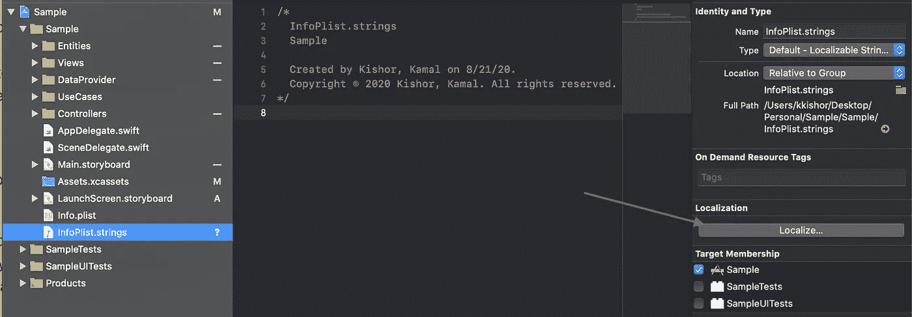

选择语言后，它看起来像这样—

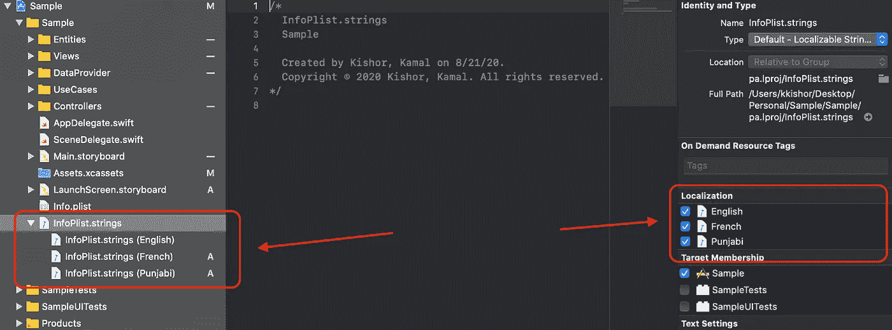

添加您想要本地化的键。这里再次提醒一下，我们可以本地化默认 plist 中的有限字符串，但是可以本地化所有权限字符串。为此，您需要使用 info.plist 文件中定义的相同密钥。

这是一个例子—

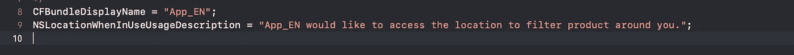

InfoPlist.strings(英语)

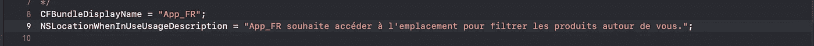

InfoPlist.strings(法语)

InfoPlist.strings(旁遮普语)

正如所料，这里是所有相应的警报，应用程序中的显示名称已更改—

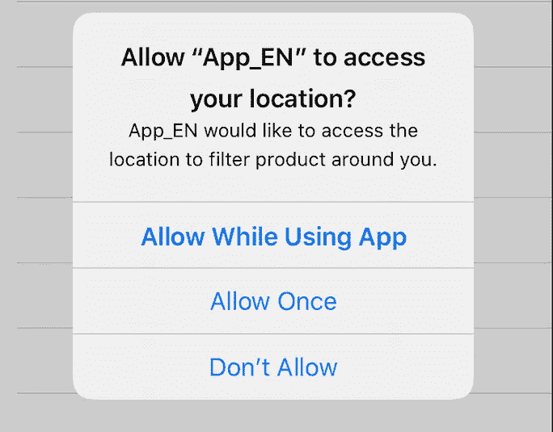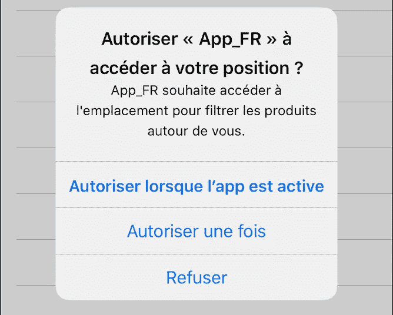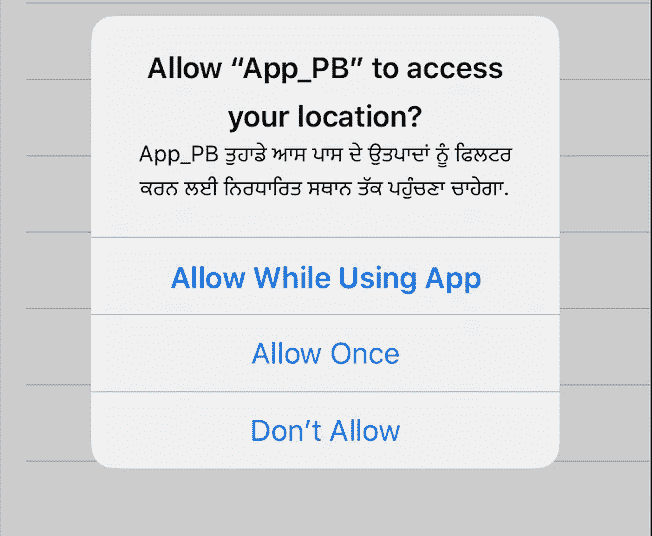

此外，CFBundleDisplayName 键将更改手机中可见的应用程序名称，包括 Siri 读取的名称。

希望这将有助于节省您的时间，增加适应范围更多的语言与最小的代码变化。

编码快乐！！