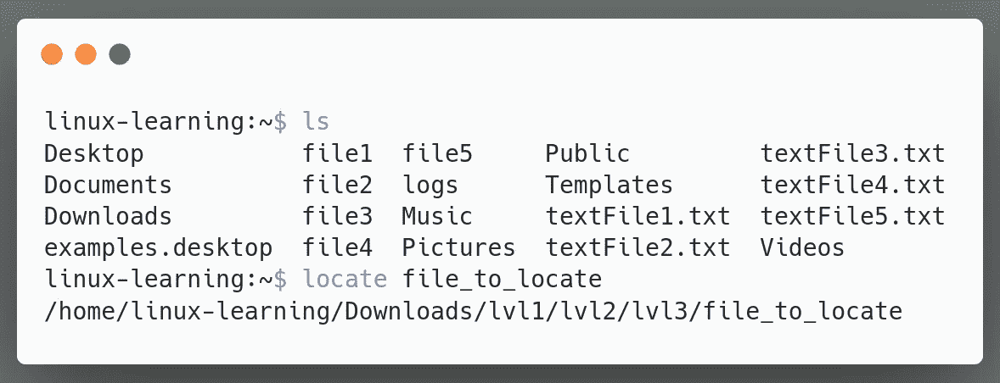
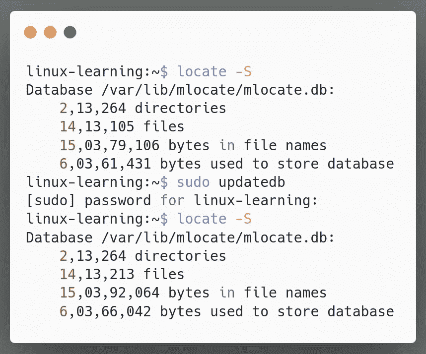
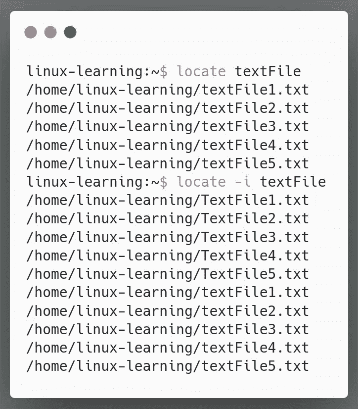
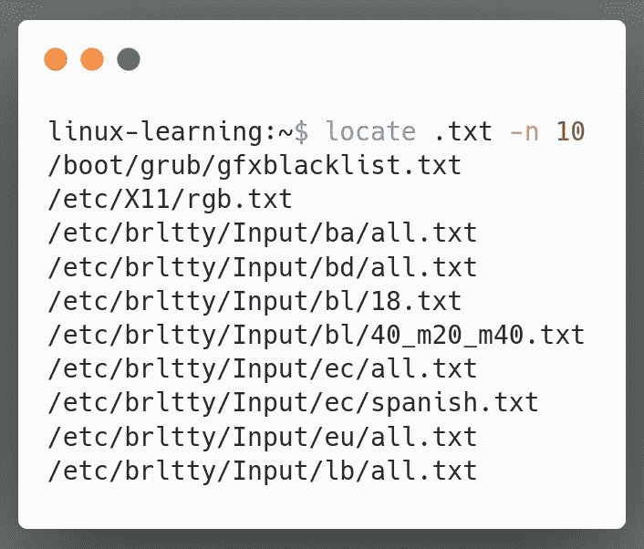
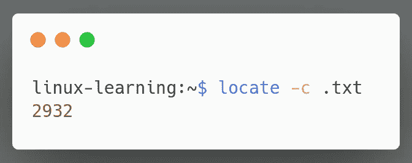
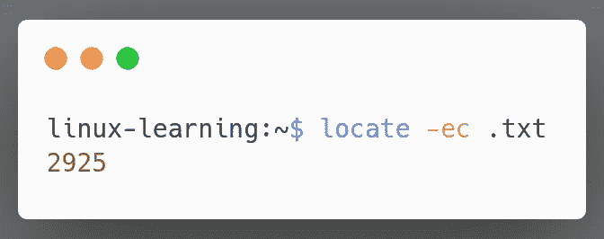

# 在 Linux 系统中定位文件和目录

> 原文：<https://blog.devgenius.io/locating-files-and-directories-in-linux-system-63f03947486a?source=collection_archive---------29----------------------->

凯文·霍尔瓦特在 [Unsplash](https://unsplash.com?utm_source=medium&utm_medium=referral) 上拍摄的照片

到目前为止，我们已经学习了用于文件和目录的 [**导航**](https://medium.com/@yashsugandh/linux-navigation-for-beginners-8cfda137f78b)[**探索**](https://medium.com/swlh/exploring-linux-system-7247c54084c7)[**创建**](https://medium.com/@yashsugandh/creating-files-and-directories-in-linux-system-9a5cebe1503d)[**删除**](https://medium.com/@yashsugandh/deleting-files-and-directories-in-linux-system-19d4d32e565) ，以及 [**操纵**](https://dev.to/yashsugandh/(https://dev.to/yashsugandh/how-to-copy-move-and-rename-files-and-directories-in-linux-system-4kpo)) 的命令。

是不是感觉我们还是少了点什么？

是的，你是对的。我们仍然缺少在 Linux 系统中搜索文件的最重要的功能之一。

两个最受欢迎和信任的文件搜索命令行工具是`locate`和`find`。

**1。** `**locate**` **命令**

定位命令用于搜索和定位文件。与同类产品相比，它查找文件的速度非常快。

`locate`命令的语法

要使用`locate`命令，我们只需要传递我们想要查找的文件名。

在上面的例子中，我们使用了`locate`命令来搜索文件“file _ to _ be _ located ”, locate 命令返回了文件的位置。

但是定位命令是如何工作的呢？为什么这么快？

`locate`之所以这么快是因为它没有从文件系统中读取被搜索的文件或目录名。

它实际上指的是一个数据库 **updatedb** ，由用户 **nobody** 创建，并由 cronjob 每天自动更新**。**

虽然这是一个好方法，但它也有缺点。

由于数据库仅由 cron 作业更新，我们在数据库更新后创建的新文件对`locate command`不可见。

为了解决这个问题，我们可以使用命令`sudo updatedb`手动更新数据库。

让我们看一个如何手动更新 **updatedb** 的例子。

在上面的例子中，我们使用命令`locate -S`来获取数据库的统计数据，这个数据库是`locate`命令用来搜索的。

然后我们使用命令`sudo updatedb`来更新数据库。

在完成了`sudo updatedb`命令后，我们再次使用了`locate -S`命令，发现数据库更新后文件的数量增加了。

为了更好地理解，让我们再看一些例子

*   找到所有名为“textFile”的文件，不考虑其大小写

在上面的例子中，我们首先使用命令`locate textFile`获取所有名为“textFile”的文件。但是因为我们需要所有的结果，所以我们需要不区分大小写的结果

为此，我们使用了`locate -i textFile` where

`locate`代表**定位命令**
`-i`代表**不区分大小写**
`.txt`代表所有的**文本文件**

*   找到所有文本文件，但将输出限制为 10 个

在上面的例子中，我们使用了命令`locate .txt -n 10`，其中

`locate`代表**定位命令**
`.txt`代表所有的**文本文件**
`-n 10`代表我们想要的**条目数**即 **10**

我们也可以使用长格式选项`--limit`代替`-n`来限制条目的数量。

*   计算 Linux 系统中文本文件的数量

在上面的例子中，我们使用命令`locate -c .txt`，其中

`locate`代表**定位命令**
代表**计数**条目
代表所有**文本文件**

请稍等，可能还有另一个问题，因为 updatedb 仅通过 cronjob 进行更新。

如果我们删除了一些文件，而数据库还没有更新，会发生什么？

嗯，在这种情况下，我们甚至会得到那些在当前系统中不存在的文件。

我们能做些什么来跳过这些文件吗？

是的，当然，让我们检查一下

*   计算 Linux 系统中当前存在的文本文件的数量

在上面的例子中，我们使用了命令`locate -ec .txt`其中
`locate`代表**定位命令**
`-e`代表**文件中已有的**条目指定
`c`代表**条目计数**
`.txt`代表所有的**文本文件**

从上面的例子中我们可以看到，以前的文本文件计数是 **2932** ，现在的计数是 **2925** 。

因此，在数据库最后一次更新后，7 个文本文件被删除。

好了，这就是关于`locate`命令的所有信息。

在下一篇文章中，我们将看看什么是`find`命令，它是如何工作的，它与`locate`命令有什么不同等等。

我希望您理解了 Linux 中的`locate`命令行实用程序。如果有任何问题，请告诉我。