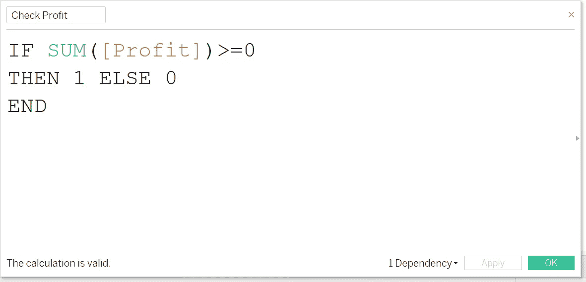
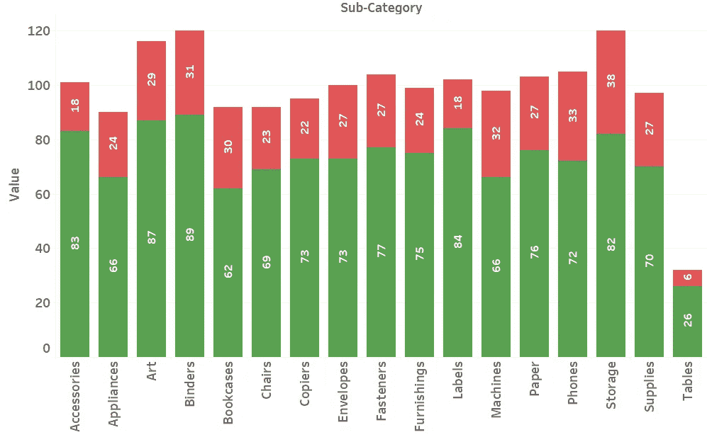

# LOD 表达式问题 2:固定与包含

> 原文：<https://blog.devgenius.io/lod-expression-problem-2-fixed-vs-include-75f2e576d8b?source=collection_archive---------3----------------------->

在本文中，我们将使用 Fixed 和 Include 来解决相同的问题

# 目录

> [定义](#a539)
> 
> [用例:每个子类别中的盈利产品](#50f2)
> 
> [现在，问题来了！](#742a)
> 
> [检查数字](#182f)
> 
> [怎么了？](#3378)
> 
> [使用包含](#913b)
> 
> [解决方案](#eb46)
> 
> [结论](#4b15)
> 
> [视频教程](#cb54)

# 定义

对于那些不知道的人，下面是每个 LOD 表达式的一些**特征**:

**固定:**

1.  **粒度只看表达式。使用 LOD 表达式时，我们需要声明一个尺寸。**

> 例如，{固定[类别]:总和(销售额)}

这个维度声明是唯一被固定关注的。

**2。独立于视图。**不管你视觉的细节层次如何，固定 LOD 表达式将**而不是**改变它的值。

**3。不受维度过滤器影响。**维度过滤器是指你拖动到过滤卡中的任何字段(上下文过滤器除外)。

这些特点可以总结为一句话。从固定表达式中获得的值不会随着视图和过滤器而改变。

**包括:**

1.  视野中的尺寸加上表情中的内容。与固定表达式不同，包含将根据您的视图的详细程度而变化。因此，Include 不是固定一个值，而是向视图中添加更多的细节。
2.  **返回 ATTR。向视图中添加细节意味着添加更多的行。但是请记住 LOD 表达式将返回一个度量值。这意味着它不会向视图中添加更多的行，而是显示维度的值。这与先前的观点相矛盾。这是 ATTR 履行职责的地方。只有当所有值都相同时，ATTR 才会显示一个值。即最大值=最小值。当 max(value) > min(value)时，它将返回一个*表示有多个值要显示，但不确定要显示哪一个。**
3.  **受维度过滤器影响。当您决定使用固定还是包含时，这是游戏规则的改变者。让我们马上来看看我们的用例来演示这一点。**

# 用例:每个子类别中的盈利产品

我们使用[全球超市](https://docs.google.com/spreadsheets/d/1o-KaA43TD6Q_w_vnyEOIzaR6xMTmR9nd/edit#gid=1072903389)的数据。在这些数据中，我们有 17 个产品子类别，每个子类别中有数百种不同的产品。


我们想知道子类别中有多少产品是盈利的， **Sum(利润)> 0。**

在这种情况下，最简单的方法是使用固定 LOD 表达式来获得每个产品的利润总和，并计算子类别级别的“利润”是多少。


```
IF 
{ FIXED [Product ID]: SUM([Profit])}>=0
THEN "Profitable"
ELSE "Not Profitable"
END
```

将**产品盈利能力**添加到标记卡的颜色中


将颜色改为**绿色**表示盈利，将**红色**表示不盈利。

将 CNTD(产品 ID)添加到标签上。


干得好！我们已经展示了每个子类别中盈利和不盈利产品的数量。

# 现在，问题来了！

如果我想只在非洲地区展示这种比较，会怎么样？没问题。添加您的过滤器。


按区域过滤= '非洲'

在非洲地区，配件子类别中应该有 68 个盈利产品和 33 个非盈利产品。让我们检查这些值是否为真。

# 检查数字

在视图中使用 LOD 表达式时。请用十字交叉表仔细核对你的数字。您希望创建所需的精确细节级别，并尽量减少使用的计算字段的数量。(如果可以，尽量不要使用)

在本例中，我们试图显示非洲配件子类别中盈利(和不盈利)产品的数量。



确保您添加了所有小计，并将它们移动到表格的顶部

请注意，数字不匹配。向下滚动到其他子类别，你会得到同样的结论。


# 怎么了?

记住固定不会受到尺寸过滤器的影响？


这些产品整体不盈利。所以无论我们选择什么样的过滤器，这些产品都不会盈利。


# 使用包含

这就是 Include 的用处所在，因为它可以被维度过滤器过滤。

哦对了。让我们复制我们的固定计算，并将其更改为包括。


然后替换分数卡中的固定计算

哎呀！它不起作用。发生了什么事？

还记得我们说过 Include 返回 ATTR()这将始终是一个度量。所以我们不能像使用维度一样使用颜色。那我们该怎么办？

# 解决方案

我们需要 2 个计算字段。

只有当 Sum(Profit) ≥ 0 时才显示产品 ID


```
IF 
{ INCLUDE [Product ID]: SUM([Profit])}>=0
THEN [Product ID]
END
```

另一个只在 Sum(Profit) < 0 时显示产品 ID


```
IF 
{ INCLUDE [Product ID]: SUM([Profit])}<0
THEN [Product ID]
END
```

现在我们都有了，我们可以像前面一样将它们堆叠起来，创建一个堆叠条形图。请注意，我们用右键而不是左键来拖放。因此，我们可以选择 CNTD，而不是默认的 CNT。(并自动转换为连续字段)


然后将 CNTD(包括损耗)拖到第一个轴上。* *这就是我们如何创建一个组合轴:两个测量共享同一个轴。


这个 Tableau 自动地为我们将**度量名称** & **度量值**添加到视图中。


然后将度量名称拖到颜色中，这有两个目的:

1.  删除水平轴上的度量名称(我们不需要它们)。


2.重新创建我们之前做的堆积条形图。

*   包含利润->绿色
*   包含损失->红色


现在将测量值添加到标签中，并检查这些值。


最后，值将根据我们的过滤器而改变。这适用于您稍后添加的任何其他过滤器。



最终输出

# 结论

尽管你可以用上下文过滤器来解决这个问题，但有时你的仪表板可能是由多个视觉效果组成的，使用上下文过滤器会弄糟这一点。无论如何，这可能对那些可能处于这种情况的人有所帮助。

总之，Fixed 在大多数时候可能是有用的，但是如果你不检查你的值，有时它可能是危险的。我希望这篇文章清楚地向您展示了:

1.  为什么你应该总是仔细检查你的值(用过滤器和其他计算)
2.  什么时候应该用**包括**而不是**固定**
3.  当字段不能是维度时，创建堆积条形图的另一种方法

这就是本文的全部内容。直到下一次，我会再见到你。

# 视频教程

如果你想看视频教程，可以在我的 YouTube 频道上看。视频会比文章更详细。