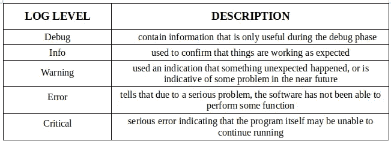
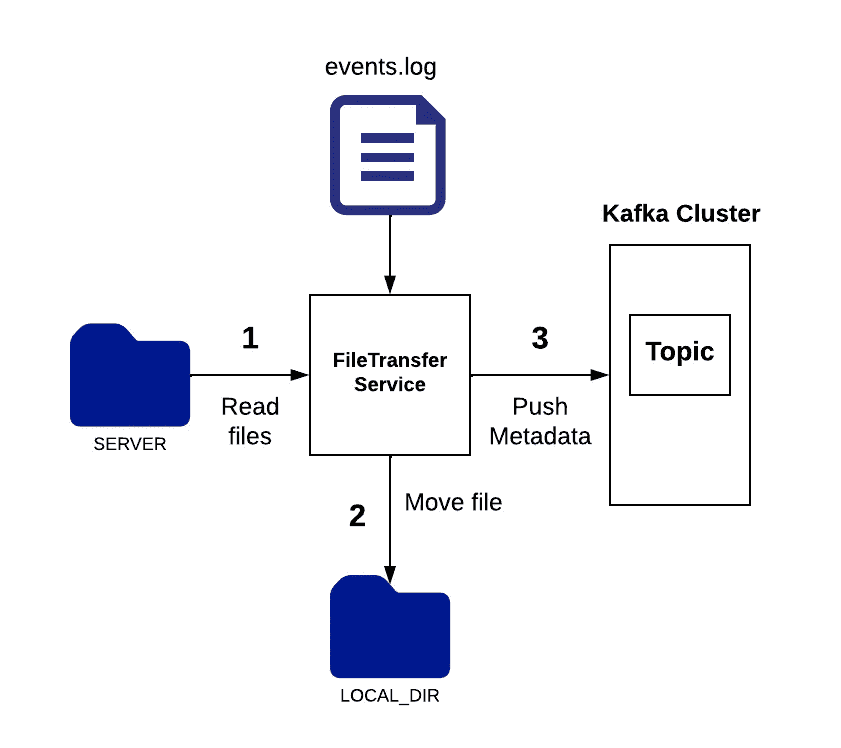
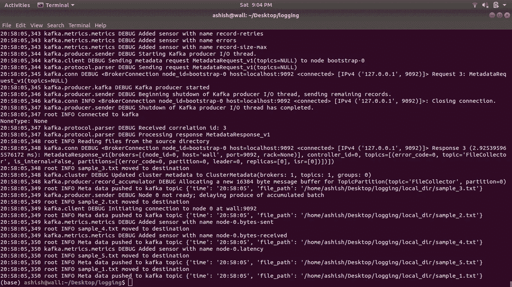
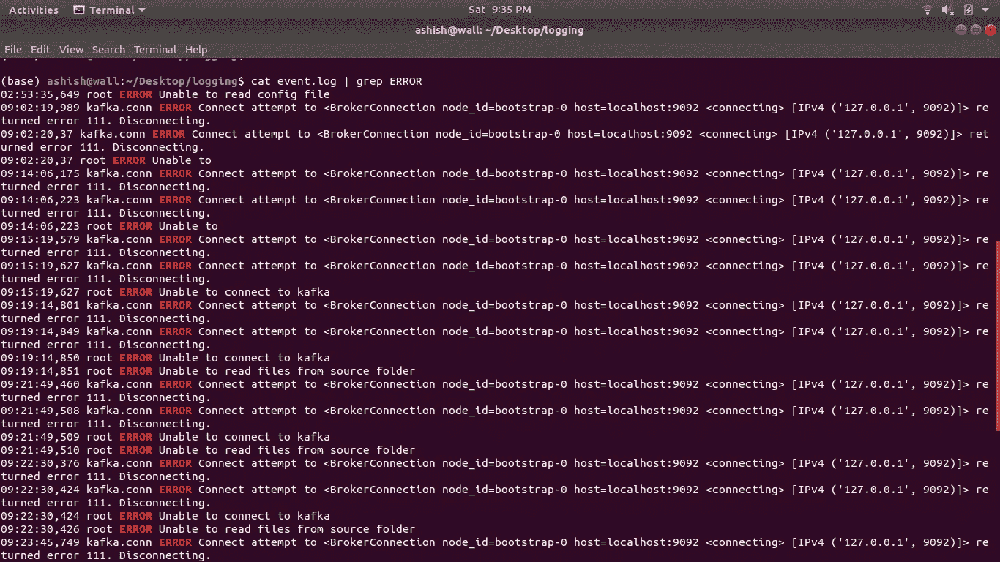

# 在 Python 中登录

> 原文：<https://blog.devgenius.io/logging-in-python-adec94519755?source=collection_archive---------1----------------------->


在 Python 中登录

本文旨在概述日志记录的基础，并创建一个简单的项目，将每个事件记录到一个日志文件中，然后使用这个日志文件来分析错误。

# 什么是日志？

日志是与特定系统或服务相关的带有时间戳的事件文档，该过程称为日志记录。日志中的每个记录通常由时间戳(事件发生的时间)、用户信息、日志级别、事件信息组成。如果没有日志记录，并且如果程序或服务在执行过程中被中断，那么分析根本原因就变得很困难。

# 日志级别

下表中的日志级别按照严重性递增的顺序排列。这些日志级别足以处理任何问题。



日志级别

# 入门指南



文件传输服务

我们将创建一个名为 File Transfer 的简单服务，其主要功能是将文件从 *server* 目录移动到 *local_dir* 目录，然后将移动文件的元数据推送到 [kafka](/kafka-with-python-4eb017b41e83) 主题中。在此过程中，服务会将事件记录到事件日志文件中。

## 1.密码

创建两个名为 *server* 和 *local_dir* 的文件夹，并在 server 文件夹中放置一些示例文件。确保安装了 [kafka](/kafka-with-python-4eb017b41e83) 和必要的 python 包。

## 2.奔跑

*   启动动物园管理员和卡夫卡。在单独的终端中运行这些命令

```
bin/zookeeper-server-start.sh config/zookeeper.properties
bin/kafka-server-start.sh config/server.properties
```

*   运行文件传输服务

## 3.分析日志

下图显示了存储在 *events.log* 文件中的一些记录。使用 *cat* (linux)或 *type* (windows)命令显示日志。

```
cat events.log
```



日志文件

假设服务会一直运行/处理文件。如果发生了与文件传输服务相关的问题，并且要求您分析根本原因。浏览如此大的文件可能是一项乏味的任务，因为它包含大量的日志记录。所以要过滤掉日志记录，我们可以使用 grep (linux)或 findstr (windows)命令。

```
cat events.log | grep ERROR
```



使用 grep 命令过滤日志记录

# 结论

在这个故事中，我们已经了解了日志记录的基本知识，并创建了一个简单的服务，它将事件记录在一个文件中。后来使用日志文件来分析问题，使用的命令有 *cat* 和 *grep* 。希望你喜欢。

感谢阅读！

[Github](https://github.com/ashish-mj/logging)网站 Linkedin