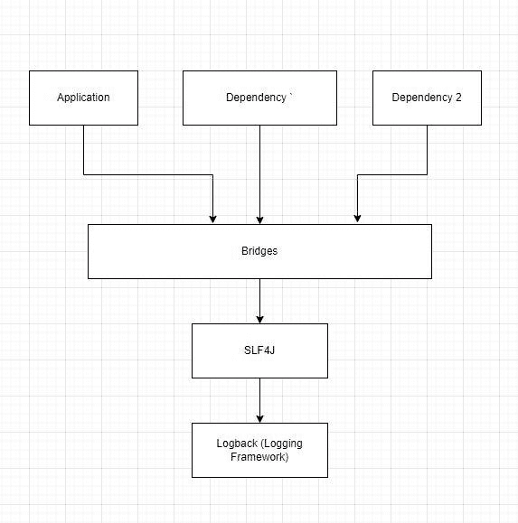
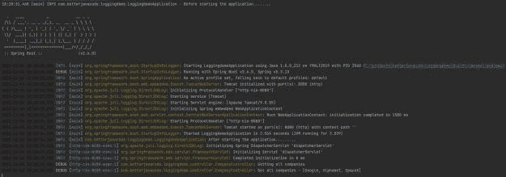

# Spring Boot 微服务中的测井

> 原文：<https://blog.devgenius.io/logging-in-spring-boot-microservices-bc4635fabe35?source=collection_archive---------0----------------------->

日志记录是企业应用程序的关键部分。日志记录不仅有助于调查问题，还有助于构建相关的指标。从业务角度来看，这些指标非常重要。事实上，企业使用这些标准来编写服务水平协议(SLA)。在本帖中，我们将讨论基于 Spring Boot 的微服务中的日志记录。

如果你是 Spring Boot 和微服务的新手，我会推荐你阅读关于 [Spring Boot 和微服务](https://betterjavacode.com/core-java/spring-boot-and-microservices)。

# 我们为什么要记录，记录什么？

生产级应用程序可能会因为各种原因而随时失败。对于开发人员来说，及时调查此类问题，让日志可用变得至关重要。日志是应用程序恢复的关键。

问题来了，我们记录什么？开发人员、软件架构师投入足够的时间来决定记录什么。不记录大量信息同样重要。你不想丢失关键信息。显然，人们不应该记录任何 PII(个人身份信息)。开发人员可以使用的范例是“如果应用程序失败，什么将帮助我调查代码中的问题？”。特别是，如果一个关键的业务决策需要在代码中进行注释，那么记录该决策也是一个同样可行的选择。

同时，可以使用日志中随机生成的跟踪 id 来跟踪请求-响应。更难的部分是在应用程序的整个生命周期中保持这种想法。

# 记录和可观察性

微服务与外部 API、其他微服务进行通信。从今以后，记录这种交流的细节是很重要的。在[事件驱动的微服务](https://betterjavacode.com/programming/microservices-event-driven-architecture)中，人们可以记录事件的细节。借助云基础设施，记录微服务的详细信息变得更加容易。像 AWS 这样的云基础设施提供 [CloudWatch](https://aws.amazon.com/cloudwatch/) 来收集这些日志，然后使用 ELK 栈来监控日志。然而，像 New Relic、Sumo Logic 这样的可观察性工具与不同的云基础设施相连接。它们收集日志，并提供显示、查询和基于日志构建指标的灵活性。

因此，开发人员有足够的工具来记录来自应用程序的数据，以提高可跟踪性和调试。

# 基于 Spring Boot 微服务的日志记录

让我们来看看 Spring Boot 微服务的日志记录。我们将创建一个简单的微服务，并展示我们可以使用哪种日志记录配置。

我们的主类如下所示:

```
package com.betterjavacode.loggingdemo;

import org.springframework.boot.SpringApplication;
import org.springframework.boot.autoconfigure.SpringBootApplication;

@SpringBootApplication
public class LoggingdemoApplication {

  public static void main(String[] args) {
    SpringApplication.run(LoggingdemoApplication.class, args);
  }

}
```

基本上微服务目前什么都没有。不管怎样，我们有一个主类，我们将看到日志是如何进入画面的。

作为应用程序的一部分，我包含了一个单独的依赖项

```
implementation 'org.springframework.boot:spring-boot-starter-web'
```

这个依赖还包括`spring-boot-starter-logging`。`spring-boot-starter-logging`是 Spring Boot 提供的默认日志配置。我们会调查更多的细节。

# 默认日志记录配置

`spring-boot-stater-logging`依赖包括`slf4j`作为日志门面，`logback`作为日志框架。

`SLF4J`是许多框架支持的日志门面。使用这个外观的好处是我们可以很容易地从一个框架切换到另一个框架。Logback 是任何 spring boot 应用程序中的默认框架，但是我们可以很容易地切换到 Log4j、Log4J2 或 Java Util 日志。

`spring-boot-starter-logging`包括所需的桥，这些桥从其他依赖项获取日志并将它们委托给日志框架。



# 回溯日志记录配置

类似于我们添加的微服务和默认日志记录，我们将了解如何使用回退日志记录配置。如果我们不提供任何配置，spring boot 将使用`logback`的默认配置。它会将日志附加到控制台，日志级别为`info`。日志框架帮助我们将日志传播到不同的目标，如控制台、文件、数据库，甚至是 [Kafka](https://betterjavacode.com/kafka/using-apache-kafka-with-spring-boot) 。

通过配置文件(`logback-spring.xml`)，我们还可以设置消息的模式。如果你想用`log4j2`代替 logback，你可以阅读这篇关于[日志和错误处理](https://betterjavacode.com/java/error-handling-and-logging-in-spring-boot-rest-api-part-iii)的帖子。

以下配置文件显示了我们将如何记录日志:

```
<configuration>
    <property name="LOGDIRECTORY" value="./logs" />
    <appender name="Console" class="ch.qos.logback.core.ConsoleAppender">
        <layout class="ch.qos.logback.classic.PatternLayout">
            <Pattern>
                %black(%d{ISO8601}) %highlight(%-5level) [%blue(%t)] %yellow(%C{1.}): %msg%n%throwable
            </Pattern>
        </layout>
    </appender>
    <appender name="RollingFile" class="ch.qos.logback.core.rolling.RollingFileAppender">
        <file>${LOGDIRECTORY}/microservice.log</file>
        <encoder
                class="ch.qos.logback.classic.encoder.PatternLayoutEncoder">
            <Pattern>%d %p %C{1.} [%t] %m%n</Pattern>
        </encoder>

        <rollingPolicy
                class="ch.qos.logback.core.rolling.TimeBasedRollingPolicy">
            <fileNamePattern>${LOGDIRECTORY}/archived/microservice-%d{yyyy-MM-dd}.%i.log
            </fileNamePattern>
            <timeBasedFileNamingAndTriggeringPolicy
                    class="ch.qos.logback.core.rolling.SizeAndTimeBasedFNATP">
                <maxFileSize>5MB</maxFileSize>
            </timeBasedFileNamingAndTriggeringPolicy>
        </rollingPolicy>
    </appender>
    <root level="info">
        <appender-ref ref="RollingFile" />
        <appender-ref ref="Console" />
    </root>

    <logger name="com.betterjavacode" level="debug" additivity="false">
        <appender-ref ref="RollingFile" />
        <appender-ref ref="Console" />
    </logger>
</configuration>
```

我们将分析这个文件，以了解配置中的每一行是做什么的。

首先，我们配置了一个属性`LOGDIRECTORY`,指向机器上保存日志文件的物理目录。我们在`appender`和`rollingPolicy`中使用这个属性。

# 不同的日志选项

随后，我们使用 Logback 配置中的`appender`来配置我们想要添加日志的位置。在这种情况下，我们已经为`Console`和`File`进行了配置。

对于`ConsoleAppnder`，我们使用的消息模式包括黑色的日期和时间，蓝色的日志级别，黄色的包。日志消息将采用默认颜色。

对于`RollingFileAppender`，我们有一行指示文件名和存储位置。在这种情况下，我们在`LOGDIRECTORY`登录`microservice.log`。下一行表示日志消息的模式。

此后，我们定义`RollingPolicy`。我们希望确保不要将信息记录在单个文件中，这样文件的大小会不断增加。当日志文件达到 5 MB 时，我们触发转出日志文件，并将旧文件保存在归档目录中，文件名为`microservice-date-number.log`。

接下来，我们将在下一节讨论日志级别。

# 配置日志级别

配置文件的最后一部分表示日志级别。在根级别，我们在`INFO`级别记录一切。基本上，我们的应用程序将记录代码中使用`INFO`日志级别编写的所有消息。

但是下一个配置允许我们在包中设置日志级别。在从`com.betterjavacode`开始的包中，记录所有在`DEBUG`级别的消息。

# 执行 Spring Boot 应用程序

现在，我们将看看这在我们的演示微服务中是如何实现的。

我的应用程序中有一个简单的`RestController`，它检索如下的`company`信息:

```
package com.betterjavacode.loggingdemo.controller;

import org.slf4j.Logger;
import org.slf4j.LoggerFactory;
import org.springframework.web.bind.annotation.GetMapping;
import org.springframework.web.bind.annotation.RequestMapping;
import org.springframework.web.bind.annotation.RestController;

import java.util.ArrayList;
import java.util.List;

@RestController
@RequestMapping("/v1/companies")
public class CompanyController
{
    private static final Logger LOGGER = LoggerFactory.getLogger(CompanyController.class);
    @GetMapping
    public List getAllCompanies()
    {
        LOGGER.debug("Getting all companies");

        List result = new ArrayList<>();

        result.add("Google");
        result.add("Alphabet");
        result.add("SpaceX");

        LOGGER.debug("Got all companies - ", result);

        return result;
    }
}
```

现在，如果执行我们的应用程序并访问 API `http://localhost:8080/v1/companies/`，我们将获得公司列表，而且我们将能够在控制台上查看日志，如下所示:



日志文件将如下所示:

```
2021-12-04 18:20:32,221 INFO org.springframework.boot.StartupInfoLogger [main] Starting LoggingdemoApplication using Java 1.8.0_212 on YMALI2019 with PID 3560
2021-12-04 18:20:32,223 DEBUG org.springframework.boot.StartupInfoLogger [main] Running with Spring Boot v2.6.0, Spring v5.3.13
2021-12-04 18:20:32,224 INFO org.springframework.boot.SpringApplication [main] No active profile set, falling back to default profiles: default
2021-12-04 18:20:33,789 INFO org.springframework.boot.web.embedded.tomcat.TomcatWebServer [main] Tomcat initialized with port(s): 8080 (http)
2021-12-04 18:20:33,798 INFO org.apache.juli.logging.DirectJDKLog [main] Initializing ProtocolHandler ["http-nio-8080"]
2021-12-04 18:20:33,799 INFO org.apache.juli.logging.DirectJDKLog [main] Starting service [Tomcat]
2021-12-04 18:20:33,799 INFO org.apache.juli.logging.DirectJDKLog [main] Starting Servlet engine: [Apache Tomcat/9.0.55]
2021-12-04 18:20:33,875 INFO org.apache.juli.logging.DirectJDKLog [main] Initializing Spring embedded WebApplicationContext
2021-12-04 18:20:33,875 INFO org.springframework.boot.web.servlet.context.ServletWebServerApplicationContext [main] Root WebApplicationContext: initialization completed in 1580 ms
2021-12-04 18:20:34,212 INFO org.apache.juli.logging.DirectJDKLog [main] Starting ProtocolHandler ["http-nio-8080"]
2021-12-04 18:20:34,230 INFO org.springframework.boot.web.embedded.tomcat.TomcatWebServer [main] Tomcat started on port(s): 8080 (http) with context path ''
2021-12-04 18:20:34,239 INFO org.springframework.boot.StartupInfoLogger [main] Started LoggingdemoApplication in 2.564 seconds (JVM running for 3.039)
2021-12-04 18:20:34,242 INFO com.betterjavacode.loggingdemo.LoggingdemoApplication [main] After starting the application.........
2021-12-04 18:20:39,526 INFO org.apache.juli.logging.DirectJDKLog [http-nio-8080-exec-1] Initializing Spring DispatcherServlet 'dispatcherServlet'
2021-12-04 18:20:39,526 INFO org.springframework.web.servlet.FrameworkServlet [http-nio-8080-exec-1] Initializing Servlet 'dispatcherServlet'
2021-12-04 18:20:39,527 INFO org.springframework.web.servlet.FrameworkServlet [http-nio-8080-exec-1] Completed initialization in 0 ms
2021-12-04 18:20:39,551 DEBUG com.betterjavacode.loggingdemo.controller.CompanyController [http-nio-8080-exec-1] Getting all companies
2021-12-04 18:20:39,551 DEBUG com.betterjavacode.loggingdemo.controller.CompanyController [http-nio-8080-exec-1] Got all companies - [Google, Alphabet, SpaceX]
```

# 追踪请求

之前，我说过我们为什么要记录。当有多个微服务并且每个微服务都与其他和外部 API 通信时，有一种方法来跟踪请求是很重要的。方法之一是在`logback-spring.xml`中配置一个图案。

另一种选择是使用`Filter`和 [MDC(映射诊断上下文)](https://logback.qos.ch/manual/mdc.html)。基本上，每个传入 API 的请求都会被过滤器拦截。在 Filter 中，您可以向 MDC 映射添加一个惟一的 id。使用使用 MDC 映射中的键的日志记录模式。这样，您的请求将有跟踪信息。需要记住的一点是，一旦 API 响应了客户端，就要从 MDC 中清除上下文。

# 配置用于监控的日志

在企业中，配置日志的一种方式是将日志存储在文件中，并将这些文件存放在云服务器上的一个中心位置。AWS 提供了更简单的灵活性，可以从存储 S3 的云观察中提取这些信息，然后用户可以使用 Kibana 和 Elastic search 等工具来监控日志和指标。

# 结论

在这篇文章中，我们详细介绍了如何在基于 spring boot 的微服务中使用日志记录。我们还讨论了在 Spring Boot 应用程序中使用 Logback 框架时可以使用的`Logback`配置。

这些实践中的大多数都是标准的，如果遵循得当，可以确保在生产环境中对应用程序进行故障排除和监控。

*原载于 2021 年 12 月 5 日【https://betterjavacode.com】[](https://betterjavacode.com/programming/logging-in-spring-boot-microservices)**。***

**更多内容尽在*[*blog . dev genius . io*](http://blog.devgenius.io)*。**