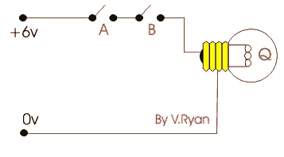
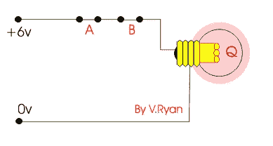
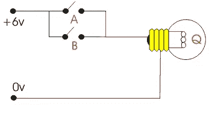
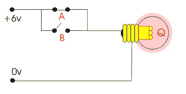

# 逻辑运算符:Python 完整教程—第 14 部分

> 原文：<https://blog.devgenius.io/logical-operators-python-complete-course-part-14-fed8e4ddc415?source=collection_archive---------14----------------------->


由 [Pixbay](https://pixabay.com/photos/search/logical/) 上的 [Phtorxp](https://pixabay.com/users/phtorxp-3603324/) 拍摄的照片

**在我们开始之前，让我告诉你:**

*   这篇文章是 Python 完全初学者到专家课程
    的一部分，你可以在这里[找到它](https://medium.com/@samersallam92/python-complete-beginner-to-expert-course-f7626916df30)。
*   所有资源都可以在下面的“资源”部分找到。
*   这篇文章也可以作为 YouTube 视频[在这里](https://youtu.be/n9ovgx4BqDc)获得。

[https://youtu.be/n9ovgx4BqDc](https://youtu.be/n9ovgx4BqDc)

## 介绍

在本文中，您将了解一种可用于布尔值的新型运算符。这些运算符是逻辑运算符。

**目录**

1.  [逻辑运算符](#c008)
2.  [逻辑与运算符](#5034)
3.  [逻辑或运算符【或】](#355b)
4.  [逻辑非运算符(not)](#48b7)

## 1.逻辑运算符

逻辑运算符用于组合布尔值，这些布尔值通常从使用比较运算符编写的条件语句中获得。在编程中，您经常会遇到这样的情况:您希望检查是否同时满足一个或多个条件，或者至少满足其中一个条件。为此，您需要逻辑运算符。

对于逻辑**(与)**和逻辑**(或)**这些运算符中的每一个:

*   接受两个操作数。
*   操作数应该是数字(布尔型)。
*   结果是一个数字(布尔值)。

逻辑**(非)**运算符:

*   接受一个操作数。
*   操作数应该是一个数字(布尔值)。
*   结果是一个数字(布尔值)。

为了更好地理解，让我们用简单的电路来解释这个想法。

## **2。逻辑与运算符**

如图 1 所示，电路中有一个电源、两个串联开关和一个灯泡。



图 1:逻辑与门(关)([https://technologystudent.com/elec1/dig2.htm](https://technologystudent.com/elec1/dig2.htm))

从物理学上我们知道，要让灯泡亮着，我们必须合上两个开关。参考图 2。这类似于**和**运算符。换句话说，操作员应该取两个**真值**来给出一个**真值**结果。所以，A 和 B 都应该是**真**才能得到**真**。



图 2:逻辑与门(开)([https://technologystudent.com/elec1/dig2.htm](https://technologystudent.com/elec1/dig2.htm))

**让我们用一个代码示例来测试一下:**

**输入:**

```
a = True
b = True
c = a and b
print(c)
```

**输出:**

```
True
```

让我们将 **b** 的值改为**假**。

**输入:**

```
a = True
b = False
c = a and b
print(c)
```

**输出:**

```
False
```

结果为假，因为与电路情况一样，“a”和“b”都应该为**真**才能得到**真**，但在这种情况下，“b”为**假**。

## **3。逻辑或运算符**

假设您有另一个具有相同元件的电路，但现在两个开关并联。同样从物理学上，我们知道关闭一个开关就足以点亮灯泡，参见图 3。



图 3:逻辑或门([https://technologystudent.com/elec1/dig2.htm](https://technologystudent.com/elec1/dig2.htm))

所以如果你关闭 A 或者 B，在这两种情况下，灯泡都会被打开。所以，你可以理解，如果选项 A 或 B 中至少有一个是**真**，那么运算符的结果将是**真**。

**让我们用一个代码示例来测试一下:**

**输入:**

```
a = True
b = Falsec = a or b
print(c)
```

**输出:**

```
True
```

您得到了**真值**，因为两个变量中至少有一个是**真值**。

## 4.逻辑非运算符(NOT)

它用于反转其操作数的逻辑状态。

**输入:**

```
a = True
b = Falsec = not a
print(c)
```

**输出:**

```
False
```

你得到了**假**，因为 a = **真**的反义词是**假。**

因为这些运算符返回布尔值，所以您可以在同一个表达式中使用多个运算符来构建更复杂的表达式。例如:

**输入:**

```
c = not (a and b)
print(c)
```

**输出:**

```
True
```

**注:**

您已经在前面的[比较运算符文章](https://medium.com/@samersallam92/python-complete-course-part13-comparison-operators-be85ac47361b)中了解到，比较运算符是通常根据比较结果给出 true 或 false 值的运算符。

这意味着您可以使用比较运算符结果作为逻辑运算符操作数之一。让我们看一个例子:

**输入:**

```
a = 10
b = 20
c = 30
d = (a > b) or (c !=b)
print(d)
```

**输出:**

```
True
```

## 现在，让我们总结一下我们在这篇文章中学到的内容:


照片由[安 H](https://www.pexels.com/@ann-h-45017/) 在[像素](https://www.pexels.com/)上拍摄

*   **逻辑运算符**:用于组合条件语句。
*   逻辑**和**、**或**运算符只接受两个操作数，这些操作数应该是数字(布尔型)，最终结果数据类型是数字(布尔型)。
*   逻辑**非**运算符只接受一个操作数，该操作数应该是一个数字(布尔型)，最终结果数据类型是一个数字(布尔型)。

***附言*** *:非常感谢您花时间阅读我的故事。在你离开之前，让我快速地提两点*

*   *首先，要直接在您的收件箱中获得我的帖子，请在此处订阅*[](https://medium.com/@samersallam92/subscribe)**，您可以在此处关注我*[](https://medium.com/@samersallam92)**。***
*   ***第二，作家在媒介上制造了数以千计的***。为了无限制地访问 Medium stories 并开始赚钱，* [***现在就注册成为 Medium 会员***](https://medium.com/@samersallam92/membership)**，其中* *每月只需花费 5 美元。通过此链接* [***报名***](https://medium.com/@samersallam92/membership) *，可以直接支持我，不需要你额外付费。*****

**

[萨梅尔萨拉姆](https://medium.com/@samersallam92?source=post_page-----fed8e4ddc415--------------------------------)** 

## **Python 初学者到专家的完整课程**

**[View list](https://medium.com/@samersallam92/list/python-complete-beginner-to-expert-course-32d3a941c05e?source=post_page-----fed8e4ddc415--------------------------------)****21 stories**************

**要回到上一篇文章，您可以使用以下链接:**

**第 13 部分:比较运算符**

**要阅读下一篇文章，您可以使用以下链接:**

**[第 15 部分:按位运算符](https://python.plainenglish.io/bitwise-operators-python-complete-course-part-15-e688a24c2f0a)**

## **资源:**

*   **GitHub [这里**这里**。](https://github.com/samersallam/python-complete-beginner-to-expert-course/tree/main/Logical%20Operators)**