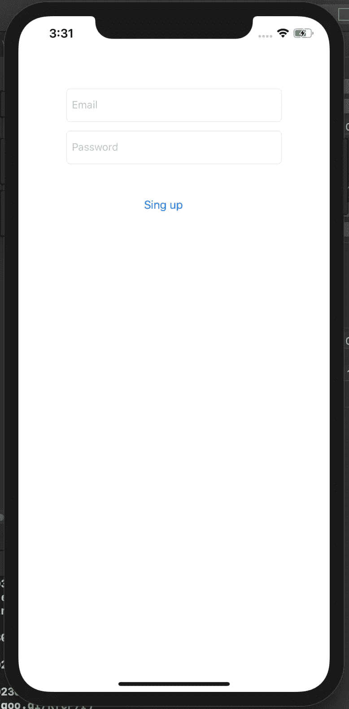

# 在 Swift 中使用 Firebase 登录和注册

> 原文：<https://blog.devgenius.io/login-and-signup-using-firebase-in-swift-8a63de282124?source=collection_archive---------5----------------------->

在本文中，我们将学习如何使用 Firebase 设置您的 Swift 应用程序，并实现注册和登录功能。

1.  **什么是 Firebase**
2.  **创建和配置 Swift 应用程序以使用 Firebase。**
3.  **实现注册功能**
4.  **实现登录功能。**

**什么是 Firebase**

Firebase 是后端即服务，这意味着我们可以使用 Firebase 实现以前需要后端服务的功能。前面我们要么需要学习一些后端技术(Node。JS 或 Java)来构建任何移动应用程序，如果我们希望我们的应用程序实现登录/注册，数据存储等。

**创建和配置 Swift 应用程序以使用 Firebase。**

首先，让我们创建一个新的单视图 Xcode 项目(我创建的名称是 iOS-SwiftDemo)。

要在你的 iOS 项目中添加 Firebase，请转到[https://firebase.google.com/](https://firebase.google.com/)并从右上角选择转到控制台。按照说明添加项目。完成后，您会看到如下屏幕，您可以在其中选择想要配置的平台。

选择 iOS 并按照说明操作，在下一个屏幕上，您将被要求输入捆绑包标识符，输入您的(我们也将在 Swift 应用程序中使用相同的捆绑包 Id)。

在下一个屏幕中，有一个下载 GoogleService-info.plist 的链接。这是根据您输入的详细信息自动创建的文件，是您的应用程序独有的。

将下载的 GoogleService-info.plist 添加到您的 Swift 文件中，然后单击下一步。

现在，你将获得在你的应用程序中设置 Cocoapods 的指令，这非常简单。

1.  在终端中导航到您的项目。
2.  运行 **pod init，**一个 podifle 将在您的项目根文件夹中创建。
3.  从 firebase 控制台复制指令，并将其粘贴到 podfile 中。
4.  运行 **pod install** ，它将安装所需的依赖项并创建一个新的。xcworkspace 文件，从现在开始，我们将在 Xcode 中打开它。

Firebase 设置在此完成，现在将转移到 Swift 应用程序。

在我们的 appdelegate 文件中，导入 Firebase，并在**difinishlaunchingwithoptions**方法中，调用 FirebaseApp.configure()

如果一切都做得很好，到现在为止，您已经有了一个可以与 Firebase 一起使用的 Swift 应用程序。

**实现注册功能**

为了在 firebase 中创建一个用户，您需要转到 Firebase 中的应用程序，在 Authentication 部分下，启用 Email/password 作为登录方法。

**设置界面**

我创建了一个非常简单的用户界面来实现注册功能，它有一个电子邮件和密码字段，只有一个注册按钮。设置您的 IbOutlet 和动作，然后将实现 click 动作。

在你的视图控制器中导入 FirebaseAuth，并将下面的代码粘贴到你的按钮动作中。

**let**email = email text field . text

**让**password = password textfield . text

Auth.auth()。create user(with mail:email！，密码:密码！){ (authResult，error)中的

****如果** **让** error = error {**

**print("DEBUG:无法创建用户，出现错误: "，error.localizedDescription)**

****返回****

**}**

**打印(“注册成功”)**

**//配置导航控制器以导航到主页**

**}**

**在上述代码之后，当我在 Email 和 Password 字段中输入值并单击 signup 按钮时，Firebase 中会创建一个新用户。**

****

****实现登录功能****

**要实现登录特性，我们只需要更改方法名。下面是登录方法的代码。**

****let**email = email text field . text**

****let**password = password textfield . text**

**//登录方法**

**Auth.auth()。登录(with mail:email！，密码:密码！){(用户，错误)中的**

****//处理错误****

******如果**让 error = error {****

****print("无法让用户登录，出现错误"，error.localizedDescription)****

******返回******

****}****

****打印(“登录成功”)****

****}****

****}****

****当我输入刚刚创建的用户详细信息时，我得到了下面的代码消息，这意味着登录成功了。****

****本文到此为止。希望你喜欢阅读这篇文章，它会帮助你在下一个 iOS 应用程序中使用 firebase。****

****如果我遗漏了什么，请随时提出您的建议/反馈。****