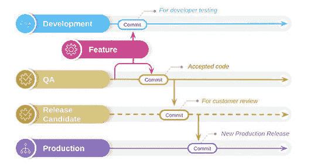

# 长寿环境

> 原文：<https://blog.devgenius.io/long-lived-environments-93f097786aa6?source=collection_archive---------2----------------------->

在过去的十年里，我一直在有不止一个长期环境的公司工作。

## 为什么有多个环境？

在我看来，随着公司开始遭受越来越多的错误，他们认为通过检查步骤来避免它们是一个好主意。在第一阶段，这似乎是明智的，我们有更多的机会发现错误。

但问题不在于检测错误，而在于我们如何手动检测。长期环境之所以存在(除了生产环境之外),是因为我们希望手动验证功能，而手动验证速度很慢。

为了得出这个结论，我将解释我以前工作中的一个故事。

## 故事

这是一个充满错误的故事，但我们真的学到了很多。我曾在一家公司工作，这家公司意识到他们的一种产品质量不够好，无法在越来越多的市场上销售。在另一个国家安装它需要几个月的时间。由于该公司计划用该产品扩展到许多国家，他们决定从头开始创造另一个东西(也许这是第一个错误)。像往常一样，当开发者从零开始创造东西时，我们认为这一次我们会做得更好，但由于我们不知道如何做得更好，我们犯了同样的错误。所以我们新的花哨的微服务架构(后端是一个分布式的整体，前端是一个整体)充满了错误，因为我们没有测试。代码中有很多 YAGNIs，只是因为之前的系统有另一个需求，我们把它当作做什么的来源。

所以在项目延期的某个时候，我们意识到我们必须改变，我们做出了一些艰难的决定:

*   用测试覆盖新代码。让人们理解为什么测试和如何测试。
*   使用 gitflow 作为我们的分支模型(另一个大错误)
*   因为我们有 gitflow，所以我们决定创建我们所谓的“集成环境”。
*   我们开始做合并前的代码审查(在合并到 master 之前)。这太疯狂了，因为代码审查是在独立测试之后进行的，所以当它被合并到 dev 中时，由于代码审查中所做的更改，迫使 QA 再次进行测试。

我将集中讨论我们为什么创建集成环境以及它是什么。这个想法是在一个隔离的环境中验证每个故事，这样 QA 人员可以在它被合并到 dev 之前测试它。之后，当它被合并到开发中时，QA 必须再次手动测试它，以便创建一个发布并部署到生产中。

所以我们在 Docker Swarm 中创建了这个环境。它能够为每个名为美国-XXXX 的分支创建一个隔离的环境，当故事被合并到 dev 时，这些环境被取消了(Dev 也是我们的“集成环境”中的一个环境)。当我们在微服务架构中工作时，系统能够将每个具有相同名称的所选分支的微服务放在相同的环境中(这是在创建分支时自动完成的)。新环境还能够通过 web 应用程序监控日志和环境状态。在公司里，每个人都认为环境很好，有了这些东西，我们能够创造出更高质量的产品，但我们开始遇到一些新问题。

当 sprint 完成时，我们每两周部署一次生产，因为我们认为“这就是 Scrum 的工作方式”。所以当我们没有足够的 QA(瓶颈)来验证团队创造的故事时，冲刺的结尾总是一个疯狂的时刻。充满压力，因为我们有很多冲突，因为人们开发了几天的用户故事，后来我们试图合并它们时发生了疯狂的冲突。Next sprint 总是充满了任务来稳定之前的 sprint 版本。

我们认为通过更多的检查步骤(映射更多的环境)在我们的产品中引入质量是一个好主意，然后这个模型面对现实。我们没有足够的 QA 来验证用户故事，而且我们有很多冲突，因为我们有长期存在的分支。QA 不得不做一些疯狂的事情来测试一些特性，因为环境没有足够的数据(这不是生产)。

> *软件架构中的一切都是一种权衡。*
> 
> *软件架构第一定律*

请注意，我们选择了一些权衡，因为这种工作方式，但我们无法支付账单。我们无法管理由长期分支引入的团队内部的复杂性。

在这个故事中，集成环境的存在仅仅是因为我们想在将它们合并到开发中之前进行 gitflow 和测试。事实上，我们正试图通过对已完成的工作进行人工验证来解决质量问题。

## 在代码中加入复杂性

集成环境非常复杂，有大量代码，我们需要 5 台机器来创建 Docker Swarm 集群。我们需要维护环境，我们必须学习很多关于起重机、码头工人和其他技术来使它工作。只是因为我们没有意识到这可以在应用程序内部进行管理。甚至有一个团队“平台”团队，我的团队，负责环境。另一个错误是，我们创建了一个筒仓来管理主要由开发人员使用的环境。

为什么不在应用程序中拥有这些功能，并避免所有这些由其他团队而不是开发团队管理的复杂性呢？。

我们意识到我们所有的合并问题都是因为长期存在的分支而存在的，我们的集成环境是因为长期存在的分支而存在的，我们缺少 QA 是因为长期存在的分支而存在的。

那么，为什么不简化一切，把事情放在代码中呢？。诚然，代码会更复杂，但代码比团队、流程和角色更容易更改。

我们开始考虑转向基于主干的开发(CI/CD):

*   我们创建了一个管道，当所有东西都被合并到 master 时，只部署到一个环境中。
*   我们放置了一个 CI 服务器来验证我们的合并和发布。
*   我们鼓励人们做小的测试提交，并以高频率直接推送到 master。
*   我们让开发人员负责在需要时部署到生产环境中。
*   开发人员学会了使用像特性切换或黑暗启动这样的工具，以便能够频繁推动来掌握未完成的工作。
*   测试由开发人员完成，质量保证人员开始为人们提供更好的测试工具。

所以我们的问题消失了，不再有压力，不再有疯狂的合并，不再有充满手工工作的 QA。人们确实需要学习很多东西，但我认为这比每次冲刺都流血要便宜。你知道为什么不遵循更好的工程实践而不是通过过程来解决问题吗？。

事实上，我们意识到我们的产品不仅充满了来自产品的需求，还需要包含**品质**，所以它需要支持那种品质。**质量**在你的产品中引入要求。

所以有多种环境是不好的，我不会这么说，但我认为这是一种气味。你不能只在代码中计算复杂性，但是复杂性也来自你的平台，你的文化，你的架构。有时候，简化这些事情并转移到开发团队代码库内部对组织来说更容易，更便宜。

**唯一喜欢生产的环境就是生产，去生产更快，所以少创造环境(哪怕只是生产？).**