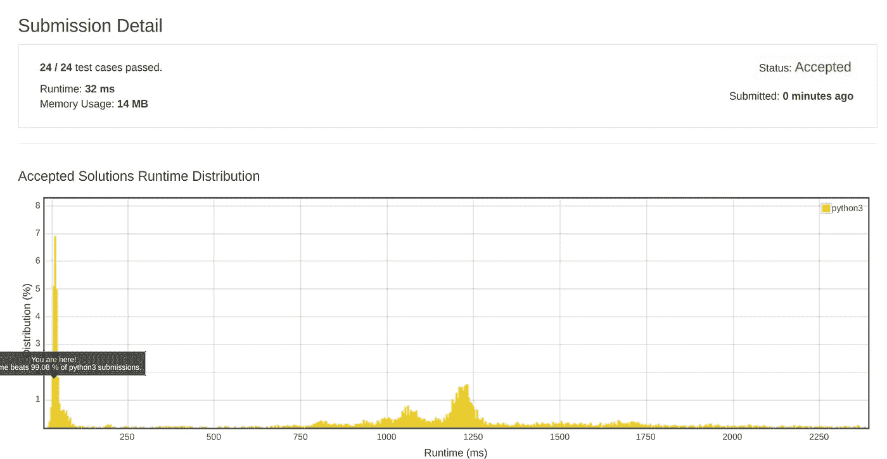
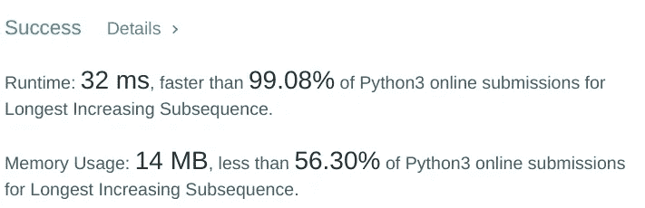

# 最长递增子序列 O(nlogn)

> 原文：<https://blog.devgenius.io/longest-increasing-subsequence-o-nlogn-8239e5de4b5c?source=collection_archive---------7----------------------->


[斯科特·格雷厄姆](https://unsplash.com/@sctgrhm?utm_source=medium&utm_medium=referral)在 [Unsplash](https://unsplash.com?utm_source=medium&utm_medium=referral) 上拍照

最长递增子序列(LIS)问题是寻找给定序列的最长子序列的长度，使得该子序列的所有元素按递增顺序排序。

例如，{10，12，9，13，21，50，41，65，85}的 LIS 长度为 7，LIS 为{10，12，13，21，50，65，85}。

这个问题可以使用递归或动态规划以 O(n)复杂度来解决。
但是有另一种方法可以以 O(nlogn)的复杂度和 O(n)的空间复杂度来解决这个问题(对于最坏的情况，当序列以升序排列时)。

> 让我们深入研究这种方法:
> 代码非常简短，易于理解。

```
import bisect
def lis(arr):
  if len(arr) == 0:
    return 0 l = [arr[0]]

  for element in arr[1:]:
    pos = bisect.bisect(l, element)
    if pos == len(l):      
      if element > l[pos - 1]:
        l.append(element)
    else:
      if element != l[pos - 1]:
        l[pos] = element
  return len(l)if __name__ == "__main__":
  print(lis([10, 12, 9, 13, 21, 50, 41, 65, 85]))
```

# 这是如何工作的？

这个概念是，对于列表中的每个元素，我们检查它在最长子序列列表中的位置(结果数组)。
可以有两种情况**:**

*   ****在**的结果数组里面，这意味着我们应该用这个值替换旧的值。(在替换之前，我们验证该数字与结果数组中的数字不同)**
*   ****在**结果数组之外，这意味着它是一个新的递增序列，所以我们把它附加到结果数组中。(在追加之前，我们验证它与结果数组中的数字不同)**

**这种技术是可行的，因为我们总是按照递增的顺序添加新的数字。**

********

**上面的结果来自 leetcode，它验证程序并显示执行时间和消耗的内存。**

****注**:该程序只能用来统计最长子序列数组的长度。如果我们需要实际的序列，我们需要使用二维数组来存储每个长度的序列。通常在编程竞赛中，我们只对最长序列的长度感兴趣。**

> **不过，如果您对序列本身感兴趣，请查看下面的代码:**

```
 def lis_nlogn(arr): if len(arr) == 0:
          return 0

        l = [[arr[0]]]
        for element in arr[1:]:
            pos = bisect.bisect(l[-1], element)
            if pos == len(l):
                if element > l[pos - 1][pos - 1]:
                    l.append(l[pos -1] + [element])
            elif pos == 0:
                l[pos][pos] = element
            else:
                if element != l[pos - 1][pos -1]:
                    l[pos][pos] = element
        return len(l)
## l contains the actual sequence 
```

**使用这种方法，对于同一组测试用例，执行时间为 60 ms，内存消耗增加到 38.4 MB。**

**如果我们感兴趣的是长度而不是实际的序列，请确保使用第一个程序。**