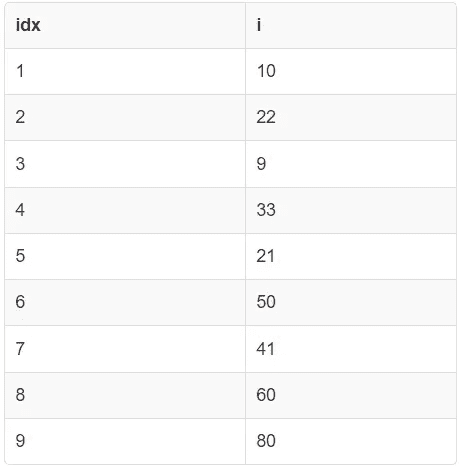
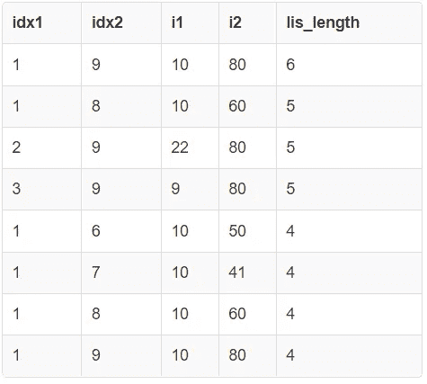
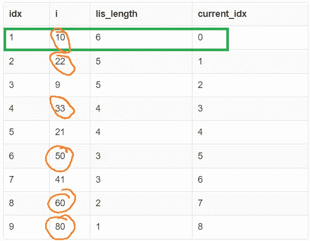

# SQL 中数组的最长递增子序列

> 原文：<https://blog.devgenius.io/longest-increasing-subsequence-of-an-array-in-sql-3202888c637f?source=collection_archive---------7----------------------->

最长递增子序列问题要求你在一个整数数组中找到元素的最长子序列，使得它们的值从左到右严格递增。这个问题在命令式编程语言(如 C++、Java、Python 等)中有一个众所周知的 O(n log n)解决方案。我们纯粹在声明式 SQL 中探索一个解决方案，并介绍一些知识和新技术。


蒂姆·埃文斯在 [Unsplash](https://unsplash.com?utm_source=medium&utm_medium=referral) 上拍摄的照片

**上一篇:**[SQL 中的二进制(下界)搜索](https://medium.com/@dhruvbird/binary-lower-bound-search-in-sql-384cb0cc66fe)

# 问题陈述和在线报道

这个问题在编程界非常流行，在网上也有广泛的报道。这里有一些资源可以让你更熟悉这个问题，如果你还不熟悉的话。

1.  [Geeksforgeeks](https://www.geeksforgeeks.org/longest-increasing-subsequence-dp-3/)
2.  [Leetcode](https://leetcode.com/problems/longest-increasing-subsequence/)
3.  [采访位](https://www.interviewbit.com/blog/longest-increasing-subsequence/)

# 输入表模式

输入表有 2 列:

1.  **idx:** 数组元素索引(如果在 C++中使用数组，这就是你在数组中寻址元素的方式)。
2.  **i:** 存储值。

```
CREATE TABLE input_data(idx SERIAL PRIMARY KEY, i INTEGER);

INSERT INTO input_data(i) VALUES
(10), (22), (9), (33), (21), (50), (41), (60), (80);
```

下面是该表的外观。

```
SELECT * FROM input_data;
```



input_data 表的内容(图片由作者提供)

# 最长增长子序列

该序列的最长递增子序列长度为 6，其中之一如下:

```
10, 22, 33, 50, 60, 80
```

还有另一个同样长度的递增序列，看起来像这样:

```
10, 22, 33, 41, 60, 80
```

可能有一个以上的数字递增子序列，因此它们都是最长的递增子序列。即最长的递增子序列可能不是唯一的。

# 两种解决方案的共同之处

以下两种解决方案都严重依赖于[递归 cte](https://www.postgresql.org/docs/current/queries-with.html)(公共表表达式)。如果您不熟悉这个概念，请考虑在提供的链接中阅读它。

# 第一种解决方案:O(n⁴日志 n)

我们解决这个问题的第一次尝试是从长度为 1 的 **"n"** 序列(只有一个元素)开始，并尝试在每一步将长度加倍。收敛到最终解需要 **O(log n)** 步。然而，在每一步，都有 **O(n )** 行需要考虑，每一行都需要与 **O(n )** 行匹配，因此在最终的复杂度中有 **O(n⁴)** 项。考虑的每一行都有以下各列:

1.  **idx1** :子序列的起始索引
2.  **idx2** :子序列的结束索引
3.  **i1** :子序列的开始元素
4.  **i2** :子序列的结束元素
5.  **lis _ length**:idx 1 和 idx2 之间的元素构成的递增子序列的长度
6.  iters :收敛到最终解的剩余迭代次数

合并 2 个序列的规则(假设 LHS 序列在位置上在 RHS 序列之前)很简单:

1.  2 个 LIS 序列是否使得 LHS 序列的最后一个元素与 RHS 序列的第一个元素相同，在这种情况下，LIS 长度为 LIS(LHS)+LIS(RHS)-1(由于重叠元素)，或者
2.  这两个 LIS 序列是否使得 LHS 序列的最后一个元素是< the first element of the RHS sequence, in which case the LIS length is LIS(LHS) + LIS(RHS) (due to no overlapping element).

The SQL code for this solution is shown below.

```
WITH RECURSIVE base_table AS (
  SELECT idx AS idx1, idx AS idx2, i AS i1, i AS i2, 1 AS lis_length,
    (SELECT CEIL(LOG(COUNT(1)) / LOG(2.0)) + 2 FROM input_data) AS iters
  FROM input_data
),

lis_table(idx1, idx2, i1, i2, lis_length, iters) AS (
  SELECT
    *
  FROM base_table

  UNION ALL

  (
    WITH snapshot AS (
      SELECT * FROM lis_table
    )

    SELECT
      lhs.idx1 AS idx1,
      rhs.idx2 AS idx2,
      lhs.i1 AS i1,
      rhs.i2 AS i2,
      MAX(
        lhs.lis_length + rhs.lis_length + (
          CASE WHEN lhs.idx2 = rhs.idx1 THEN -1 ELSE 0 END
        )
      ) AS lis_length,
      lhs.iters - 1 AS iters
    FROM snapshot lhs INNER JOIN snapshot rhs
    ON (lhs.idx2 = rhs.idx1) OR (lhs.idx2 < rhs.idx1 AND lhs.i2 < rhs.i1)
    -- Stop the recursion (by returning an empty table) when iters = 0
    WHERE lhs.iters > 0
    GROUP BY 1, 2, 3, 4, 6
  )
)

-- We display the top 8 candidates to show that there can be
-- potentially a different number of sequences with the same
-- length (number of elements).
SELECT idx1, idx2, i1, i2, lis_length FROM lis_table
GROUP BY 1, 2, 3, 4, 5
ORDER BY lis_length DESC
LIMIT 8; 
```



Output of the query for the first solution which runs in time O(n⁴ log n) (Image by author)

**估计成本:**对于一个 9 行的表，该查询的估计成本是 [104M](https://explain.depesz.com/s/Ayvi) 。

# 第二种解决方案:O(n)

这个问题更常见的解决方案是从后向前查看输入序列中的每个元素，并尝试查看正在考虑的元素是否可以扩展在正在考虑的元素之后开始的现有 LIS 序列之一。

例如，如果您正在考虑输入数组中索引 **x** 处的元素，那么您将检查是否有从索引 **[x+1】处开始的 LIS..n]** ，并尝试将其全部扩展。然后根据索引 **x** 记录最长的序列。

递归表(lis_table)的模式如下所示:

1.  **idx** :数组元素的索引
2.  **i** :数组元素的值
3.  **lis_length** :从索引 idx 处的数组元素开始的 lis 长度
4.  **current_idx** :下一次递归迭代中要处理的元素的索引。当 **current_idx = idx — 1** 时，将处理索引 **idx** 处的元素。

最后，我们只显示在任何给定迭代中更新的那些行。由于只有当 **current_idx = idx — 1** 时才会更新一行，所以我们只在最终结果中显示那些行。

```
WITH RECURSIVE with_last_idx AS (
  SELECT idx, i, MAX(idx) OVER () AS last_idx
  FROM input_data
),

with_lis_length AS (
  SELECT
    idx,
    i,
    CASE WHEN idx = last_idx THEN 1 ELSE 0 END AS lis_length,
    last_idx - 1 AS current_idx
  FROM with_last_idx
),

lis_table(idx, i, lis_length, current_idx) AS (
  SELECT * FROM with_lis_length

  UNION ALL

  (
    -- We can't run an OUTER JOIN on a table that is participating
    -- in a recursive CTE, so we take a point in time snapshot and
    -- use that instead.
    WITH lis_with_tag AS (
      SELECT
        idx,
        i,
        lis_length,
        current_idx,
        -- When the incoming table's current_idx is 0, it means that we're
        -- going to process the row with idx = 0 in this iteration. Such a
        -- row is not part of the original input, so we mark this process
        -- as complete and tag is_complete = TRUE so that we don't consider
        -- this result of this iteration in the final result.
        --
        -- We need to be careful and ensure that we are able to process
        -- this round without an error or exception.
        CASE WHEN current_idx = 0 THEN TRUE ELSE FALSE END AS is_complete 
      FROM lis_table
    ),

    -- First extract the row containing the element that we are going
    -- to attempt to add to the LIS.
    row_to_process AS (
      SELECT
        idx,
        i,
        lis_length,
        current_idx,
        is_complete 
      FROM lis_with_tag
      WHERE idx = current_idx
    ),

    -- Then extract the result of the rows that are expected to be unchanged.
    rest_of_the_rows AS (
      SELECT
        idx,
        i,
        lis_length,
        current_idx - 1 AS current_idx,
        is_complete 
      FROM lis_with_tag
      WHERE idx <> current_idx
    ),

    -- The wavefront is the set of possible extensions of the LIS
    -- due to the element in the table row_to_process.
    wavefront AS (
      SELECT
        lhs.idx,
        lhs.i,
        MAX(COALESCE(rhs.lis_length + 1, 0)) AS lis_length,
        lhs.current_idx - 1 AS current_idx,
        lhs.is_complete
      FROM row_to_process lhs LEFT JOIN (
        SELECT * FROM rest_of_the_rows WHERE idx > current_idx
      ) rhs
      ON lhs.i < rhs.i
      GROUP BY lhs.idx, lhs.i, lhs.current_idx, lhs.is_complete
    ),

    -- Now UNION the unchanged rows with the new row that
    -- potentially extends the LIS.
    unioned AS (
      SELECT * FROM wavefront
      UNION ALL
      SELECT * FROM rest_of_the_rows
    )

    SELECT idx, i, lis_length, current_idx FROM unioned
    WHERE is_complete = FALSE
  )
) 

SELECT * FROM lis_table
-- Only keep rows that were processed in that iteration.
WHERE idx - 1 = current_idx
ORDER BY idx ASC, current_idx ASC;
```



运行第二个解决方案的查询所打印的结果(图片由作者提供)

LIS 显示有 6 个元素，从数字 10 开始。橙色圆圈中的数字是参与长度为 6 的 LIS 的数字。

## 实现此解决方案的替代方法

这个解决方案的一个特点是递归 CTE 表既包含要处理的行(索引)，也包含已经处理的行(从末尾开始)。我们可以实现这个解决方案，使这个表只包含已经处理的行，而不是未处理的行。这将涉及到从单独的表中获取新行。最终的解仍然是 O(n)，但是常数会更低，因为我们不会在每一步都复制“n”行，而是在递归步骤中复制 1，2，3，…，n 行。

# SQL 小提琴

这篇文章中所有解决方案的 SQL 链接可以在[这里](http://sqlfiddle.com/#!17/8efd5/33)找到。

# 结论

实施这个解决方案后，我学到的一件事是如何从功能上考虑解决方案。即在一个不能更新任何状态，而只能添加或聚集现有状态的世界中。更新可以被认为是一个行添加，然后是具有相同键的行的聚合。在[表](https://www.scylladb.com/glossary/sstable/)(数据库系统的一种流行存储格式)中利用了相同的概念，其中更新和删除作为插入处理，而行数据作为包含相同行键的不同级别的各种[表](https://stackoverflow.com/questions/2576012/what-is-an-sstable)定期合并在一起而聚集。