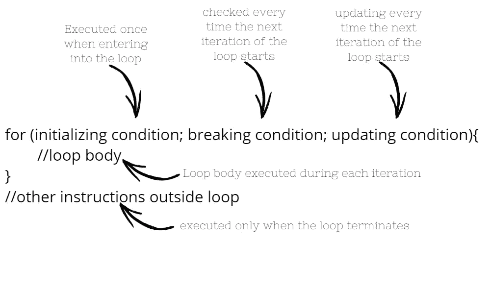
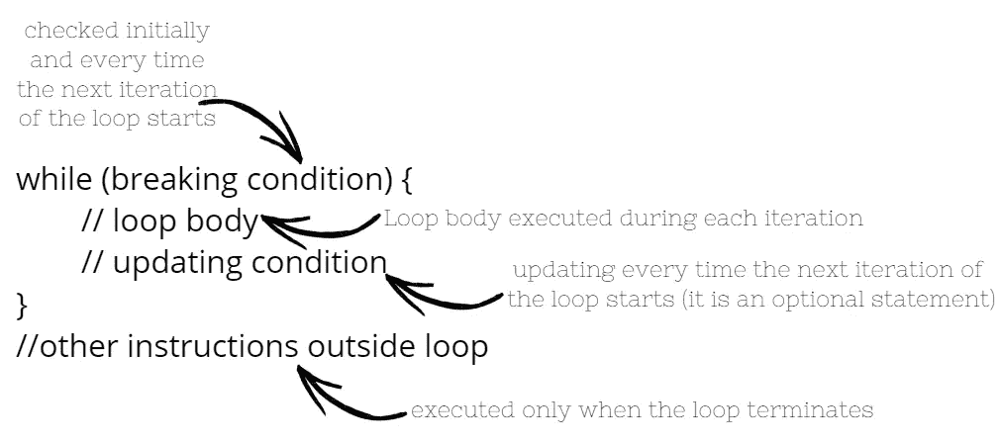
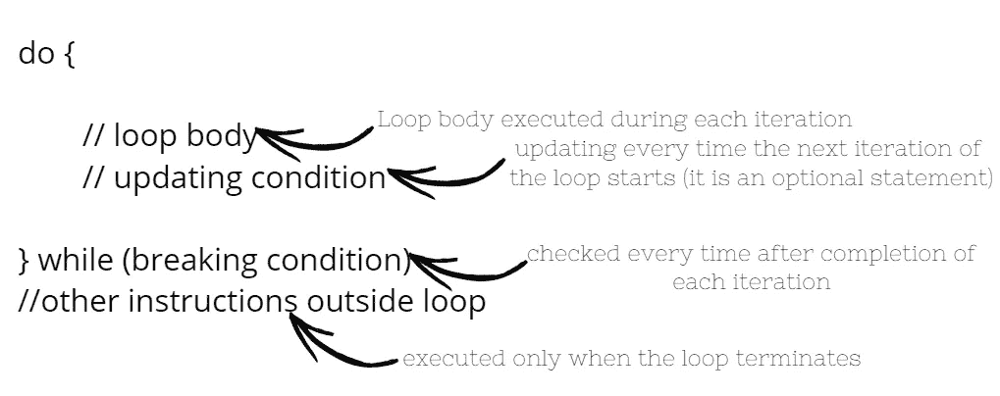

# 循环这些循环

> 原文：<https://blog.devgenius.io/looping-the-loops-78e80055f32a?source=collection_archive---------23----------------------->

基本编程概念'循环'

来源:https://giphy.com/gifs/panda-slide-ieaUdBJJC19uw

这篇文章关注的是循环的基本编程概念。在每一种编程语言中，循环的概念都可以应用。像 C++、Java、Python 这样的高级语言都支持循环。此外，循环是结构化编程语言的重要组成部分，所以让我们详细了解它们。

# **为什么会有圈圈？**

计算机语言中的循环旨在重复一组指令，直到满足预定的条件。编程中的循环对于消除冗余和自动化任务非常有帮助。

考虑一个水果采摘机器人的例子——“罗比”。她只能处理我们提供的指令。我们想告诉她一成熟就从树上摘水果。有两种方法可以做到:

1.  去告诉她每次水果成熟时采摘水果，即检查水果是否成熟->成熟时采摘->检查水果是否成熟->成熟时采摘。
2.  让她在每次水果成熟时采摘，例如，如果水果成熟就采摘->重复。

在第一种情况下，我们的机器人只会尝试摘两次水果，如果我们想让她摘更多的水果，我们就必须再次指导她。

但在第二种情况下，她会自动地，直到一些打破条件发生。为了理解循环的中断条件和其他细节，让我们转到—

# 循环的组成部分

典型的循环结构由四部分组成:循环控制变量初始化、循环体、更新语句、中断条件或语句。

循环控制变量一般用来定义循环的中断语句。循环体包含每次执行循环时重复的所有指令。更新语句负责更新控制变量。中断条件用于中断循环并继续执行代码中的下一条指令。

我们应该注意到不同类型的循环有不同的结构和风格来定义上面提到的组件。

# 循环的类型

通常，在每种编程语言中，我们都会发现以下类型的循环:

1.  for 循环
2.  while 循环
3.  do-while 循环(也称为重复循环)

让我们详细看看它们的每个结构:

典型的 for 循环

while 循环和 do while 循环的主要区别在于检查中断条件的时间。在 while 循环中，在循环开始时检查中断条件，在 do while 循环中，在每次迭代结束时检查中断条件。所以我们可以说，do while 循环中的循环体至少会执行一次。

while 循环

do while 循环

# 循环控制语句

为了更好地控制代码中循环的执行，我们需要使用循环控制语句，比如:continue，break，pass。

Continue 将控件返回到循环的开头，以便开始下一次迭代。

Break 将控制带出循环。

Pass 用于写空循环。这是一个空的控制语句。

# 结论

高级循环，如 forEach 循环，也称为高级 for 循环，仅基于上述概念，是标准循环的修改版本。