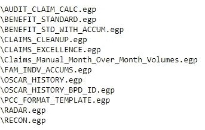
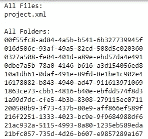
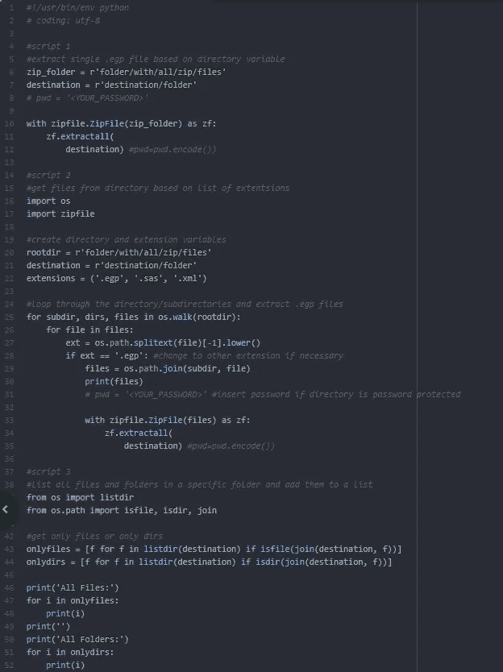

# 循环和解压缩。用 Python 处理 EGP 文件

> 原文：<https://blog.devgenius.io/looping-through-and-unzipping-egp-with-python-d8cf5a1ab41c?source=collection_archive---------4----------------------->


这是拉链！

# 什么是？EGP 档案？

直接取自[堆栈溢出](https://stackoverflow.com/questions/25036780/open-sas-egp-file-to-view-code-without-having-sas-installed#:~:text=A%20.,files%20(and%20other%20things).&text=zip%2C%20you%20can%20open%20it,do%20as%20it's%20fairly%20messy.):

> 答。egp 文件是一组压缩的 xml 文件(和其他东西)。如果您将扩展名更改为。zip，你可以用任何解压程序打开它，并看到里面的内容。从那里提取程序之类的东西是可能的，尽管这不一定容易做到，因为它相当混乱。

# 我为什么要写这个故事？

原因很简单。因为我的任务是遍历一个文件夹。这周 egp 文件，不知道怎么做，想通了，不想让别人浪费时间去想我已经做过的事情，所以写了这个帖子。

# 好吧，那密码在哪里？

直奔主题。我喜欢。我在和谁说话…没关系:

## 脚本 1/3:

这里有一个小脚本来解压一个文件。egp 文件，并将内容放在指定的目录中。只需更改该脚本中的路径即可重现:

```
#!/usr/bin/env python
# coding: utf-8#script 1
#extract single .egp file based on directory variable
zip_folder = r'folder/with/all/zip/files'
destination = r'destination/folder'
# pwd = '<YOUR_PASSWORD>'with zipfile.ZipFile(zip_folder) as zf:
    zf.extractall(
        destination) #pwd=pwd.encode())
```

## 第 2 个脚本，共 3 个:

这里有一个脚本来识别和过滤掉文件(。在我们的例子中是 egp ),根据指定的扩展名遍历并解压缩它们，然后将这些文件放在指定的目录中:

```
#get files from directory based on list of extentsions
import os
import zipfile#create directory and extension variables
rootdir = r'folder/with/all/zip/files'
destination = r'destination/folder'
extensions = ('.egp', '.sas', '.xml')#loop through the directory/subdirectories and extract .egp files
for subdir, dirs, files in os.walk(rootdir):
    for file in files:
        ext = os.path.splitext(file)[-1].lower()
        if ext == '.egp': #change to other extension if necessary
            files = os.path.join(subdir, file)
            print(files)
            # pwd = '<YOUR_PASSWORD>' #insert password if directory is password protectedwith zipfile.ZipFile(files) as zf:
                zf.extractall(
                    destination) #pwd=pwd.encode())
```



脚本 2 将产生类似这样的内容

## 脚本 3/3:

查看您刚刚提取的内容(所有文件和文件夹)的简单方法:

```
#list all files and folders in a specific folder and add them to a list
from os import listdir
from os.path import isfile, isdir, join#get only files or only dirs
onlyfiles = [f for f in listdir(destination) if isfile(join(destination, f))]
onlydirs = [f for f in listdir(destination) if isdir(join(destination, f))]print('All Files:')
for i in onlyfiles:
    print(i)
print('')
print('All Folders:')
for i in onlydirs:
    print(i)
```



脚本 3 将产生类似这样的结果

# 完整的剧本

因为每个人都想看到彩色的剧本:

[](https://www.buymeacoffee.com/31yearoldmoron)

## 问候，

最大