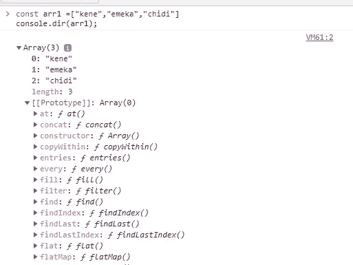
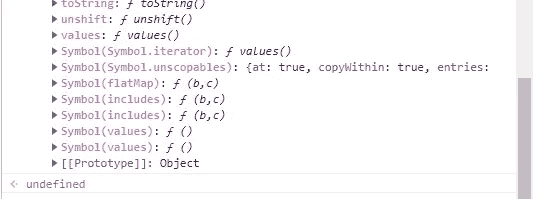

# 在 JavaScript 中遍历对象和数组

> 原文：<https://blog.devgenius.io/looping-through-objects-and-arrays-in-javascript-4f4c05d1838c?source=collection_archive---------13----------------------->


照片由 istockphoto.com 从伊斯托克拍摄

数据结构是一种以允许有效访问和修改的方式组织、管理和存储数据的格式。众所周知，对象和数组是 Javascript 中的数据结构类型。其他的还有:堆栈、队列、链表等。在本文中，我们将关注如何遍历两个最常用的数据结构，即**对象**和**数组**。

# **阵列**

这是存储在连续内存位置的项目集合。每个项目都可以通过其**索引**(位置)编号来访问。数组总是从索引 0 开始。

有两种方法可以创建数组:

1.  使用字符串文字

```
const musicians = ['psquare','Rema','Ayrrastar','Wizkid','Davido'];
```

2.使用对象构造函数

```
const fruits = new Array("Pineapple","Water melon","Cucumber");
```

**遍历数组元素**

我们可以使用普通的 for，for..of 或 for…in 循环遍历数组中的元素。

**为循环**

```
// For Loop
const fruits = ["Pineapple","Water melon","Cucumber"];
for(let i=0; i<=fruits.length; i++){
console.log(fruits[i]);
//Output
Pineapple
Water melon
Cucumber
```

在上面的代码片段中，我们使用了 for 循环来遍历数组 fruits 的元素。我们首先初始化一个名为“I”的计数器变量，我们将它设置为 0 ( *让 i=0* )，然后我们设置一个条件，假设数组 fruits(3)的长度仍然小于或等于计数器变量“I”的值( *i < =fruits.length* )，循环内的代码块( *console.log(fruits[i])* )应该继续运行，最后我们递增计数器变量“I”的值(*这一直持续到计数器变量“I”的值大于数组长度的值，即 3。然后，循环停止！。*

**为……的**

这个循环的语法是:

```
for( variable of iterable){
statement
}
/* where iterable can be an array, string, set etc */
```

示例代码:

```
const fruits = ["Pineapple","Water melon","Cucumber"];
for(let fruit of fruits){
    console.log(fruit)
/* the variable fruit can be any variable name of your
choice. Here I choose fruit you can choose whatever
variable that makes sense to you
**/
}
// output
Pineapple
Water melon
Cucumber
```

**为**中的……

```
const fruits = ["Pineapple","Water melon","Cucumber"];
for(let fruit in fruits){
    console.log(fruit)
}
//output
0
1
2
```

哎呀！我们得到的输出是多少！？。是用于..in on an array 不返回数组的元素，而是返回数组中每个元素的索引！。但是您仍然可以通过使用括号标记法从数组中访问元素来取回元素。让我们看一个例子:

```
const fruits = ["Pineapple","Water melon","Cucumber"];
for(let fruit in fruits){
    console.log(fruits[fruit])
}
// output
Pineapple
Water melon
Cucumber
```

但是这是一个非常长的过程，需要很多代码。所以如果我们想遍历一个数组的元素，我们要么使用普通的 for 循环，要么使用 for..循环的。但我想我们最好的选择是..的。然后，如果我们关心的是遍历数组，并获得我们可以使用的每个元素的索引..英寸(尽管我们仍然可以使用 array.indexOf()方法来获取元素的索引)。

# **物体**

我们用来迭代数组的一些循环不适用于对象。这是因为对象在 javascript 中不是可迭代的数据结构。要检查特定的数据结构在 javascript 中是否是可迭代的，请在该数据结构上运行以下代码:

```
const arr =["kene","emeka","chidi"]
console.dir(arr);
```

控制台上的输出:



向下滚动，点击“Array”展开，点击“Prototype”也展开，然后向下滚动，知道是否会找到“ **Symbol(Symbol.iterator)”。如果你能找到它，这意味着数据结构是可迭代的，否则就不是。**



查看上面的图片，您可以看到**符号(Symbol.iterator)** 值，这表明从我们的示例代码来看，数组“arr”是可迭代的，因此所有数组都是可迭代的，但是在对象上运行它，您会发现**符号(Symbol.iterator)** 不存在，因此表明对象是不可迭代的。

**为循环**

从上一段我们看到，对象是不可迭代的，所以试图使用 for 循环来迭代对象的元素是行不通的，因为对象不是基于索引的数组。因此在对象上使用 for 循环是不可能的。

**为……的**

```
let movieReviews={
    Avater:10,
    SpiderMan:9.5,
    Merlin:7.8,
    Wakanda:8.9,
    JamesBond:8.3
}

for(let movie of movieReviews){
    console.log(movie);
}
//output
TypeError: movieReviews is not iterable
    at Object.<anonymous> (c:\Users\ADMIN\Desktop\CSS-in-Depth\index.js:9:18)
    at Module._compile (node:internal/modules/cjs/loader:1155:14)
    at Object.Module._extensions..js (node:internal/modules/cjs/loader:1209:10)
    at Module.load (node:internal/modules/cjs/loader:1033:32)
    at Function.Module._load (node:internal/modules/cjs/loader:868:12)
    at Function.executeUserEntryPoint [as runMain] (node:internal/modules/run_main:81:12)
    at node:internal/main/run_main_module:22:47
```

此外，使用 for…of 循环直接遍历对象的属性是行不通的。从上图中我们可以看出，这给了我们一个错误，因为一个对象不是可迭代的。它们没有像数组和字符串那样的索引。但是有一个方法可以解决这个问题！通过使用 objects 静态方法调用 **key()和**values()。这两个方法都以你想要获取键值的对象作为参数。

```
let obj ={
name:"kenechukwu",
age:27,
address:"Nigeria"
}
let prop = Object.keys(obj);
console.log(prop)
//output
 ['name', 'age', 'address']
/*
 returns an array that contains all the keys of the object "obj"
*/
let val = Object.values(obj)
console.log(val)
//output
['kenechukwu', 25, 'Nigeria']

/*
 returns an array that contains all the values of the object "obj"
*/
```

现在让我们看看如何使用 for…of 来使用这两个静态方法迭代一个对象

```
let obj ={
name:"kenechukwu",
age:27,
address:"Nigeria"
}
// for the keys
for(let k of Object.keys(obj)){
console.log(k)
}
//output
name
age
address
// for the values
for(let k of Object.values(obj)){
console.log(k)
}
//output
kenechukwu
27
Nigeria
// if we want to print the values side by side to the keys
for(let k of Object.keys(obj)){
console.log(k,obj[k])
}
//output
name kenechukwu
age 27
address Nigeria
```

正如你所看到的，这种遍历对象内容的方法似乎太长了，可能会有点混乱。但是随着 ES6(ECMAScript6)的出现，这个问题得到了解决！。提供了一种遍历对象内容的新方法。

**用于**中的……

这是在 ES6 中引入的，以便提供一种简单快速的方法来遍历对象的内容。让我们看一些代码片段，看看它是如何做到的

```
let movieReviews = {
    Avater: 10,
    SpiderMan: 9.5,
    Merlin: 7.8,
    Wakanda: 8.9,
    JamesBond: 8.3
}
for(let k in movieReviews){
    console.log(k)
}
// This loops through the keys of the object only, not the values
//output
Avater
SpiderMan
Merlin
Wakanda
JamesBond
// to get the values we use bracket notation method of object

for(let k in movieReviews){
    console.log(movieReviews[k])
}
//output
10
9.5
7.8
8.9
8.3
```

# 结论

我们可以看到, **for 循环**在不可迭代的数据结构上根本不起作用，而的**for…并不直接处理它，只是使用一些对象静态方法 key()和 values()才起作用。只有在 ES6 中引入的**循环中的**for……可以直接处理 object 之类的不可迭代数据结构。但是循环**的**，循环**的**和循环**中的**可以很好地处理可迭代数据结构。**