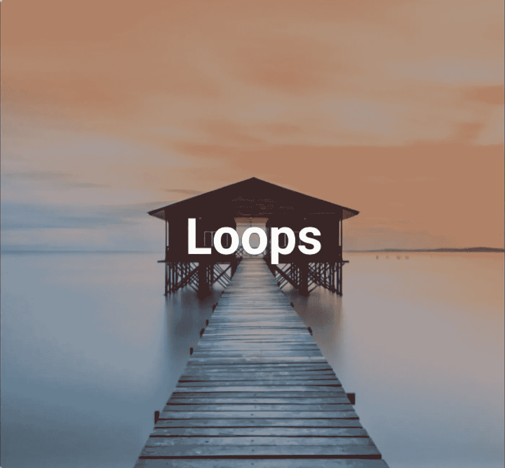

# 环

> 原文：<https://blog.devgenius.io/loops-5f39e586a71a?source=collection_archive---------19----------------------->

环

## C++基础

> 循环执行语句序列，直到条件变为假。

**什么是循环？**

循环是任何编程语言的标准库中预定义的变量。它的功能是执行语句序列，直到条件变为假。根据条件不同，存在有限循环和无限循环。有极限的循环称为有限循环。没有限制的循环称为无限循环。如果中的条件变为假，则循环中断。如果条件保持为真，则循环继续。只有当条件为假或编译器读取中断变量时，循环才终止。

> 中断—继续

**Break** 变量实际上是 use 或 switch 语句，也就是条件语句。如果循环中的 if 条件为真，In loops break 语句将中断循环。否则循环将是**继续**因为我们有 continue 变量来继续循环。

> 循环类型

我们有一些类型的循环。这些类型是使用循环语句或根据逻辑循环代码。首先，我们在 C++语言中有三种类型的循环。While 循环、do-while 循环和 for 循环。

> 线圈结构

在讨论循环的类型之前，我们首先需要知道循环的结构。循环有三个组成部分。第一个声明变量部分，第二个条件部分，第三个递增或递减部分。

> 括号的使用

While 和 do-while 循环语句必须写在括号中。在 for 循环中，如果只有一条语句，就不需要使用括号，但是如果有多条语句，括号是必不可少的。

> While 循环

**While 循环**是循环的一种类型。它只会在条件为真时执行。它有四个主要部分。声明变量部分是任何循环的第一部分。In while 循环声明部分发生在循环之外。条件部分是 while 循环的第二部分。while 循环的条件部分出现在 while 变量后面的括号中。如 while(条件)。while 循环的第三部分称为循环体。这一部分由包含若干语句的花括号组成。循环的第四部分是递增或递减部分。在这一部分中，我们递增或递减声明的循环变量的值，直到条件变为假。

> Do-while 循环

**Do- while 循环**是循环的一种。它用于运行循环至少一次，不管条件是真还是假。这个循环将在程序运行时执行一次。执行一次后，仅当条件为真时，第二次循环才再次执行。这个循环也由四部分组成。声明部分是 do-while 循环的第一部分。我们在循环外声明一个变量。do while 循环的第二部分是循环体。这部分由花括号和数字语句组成，还有循环的递增或递减部分。循环的第三部分是递增或递减部分。在这一部分中，我们增加或减少声明变量的值。do-while 循环的第四部分是条件部分。在这一部分中，编译器检查条件，如果条件为假，则循环中断，如果条件为真，则循环将再次运行。

> For 循环

**为循环**为 s 型循环。这种循环比其他类型的循环更可取。这是因为它的语法。这个循环根据情况由三个或四个部分组成。循环的第一部分是条件部分。这部分也被称为计算机的声明部分。在这一部分中，我们在 for 变量后面的括号中声明循环变量。循环的第二部分是条件部分。在这一部分中，我们根据逻辑将条件放在声明的变量之后。循环的第三部分是递增或递减部分。关于这个循环最有趣的事情是，我们可以把这些部分放在一个括号里，用昏迷把它们分开。例如 for(声明变量、条件、增量或减量)。循环的第四部分是循环体。当只有一条语句时，括号是可选，如果有多条语句，括号是必不可少的。