# PYTHON 中的循环

> 原文：<https://blog.devgenius.io/loops-in-python-df37e297f584?source=collection_archive---------12----------------------->

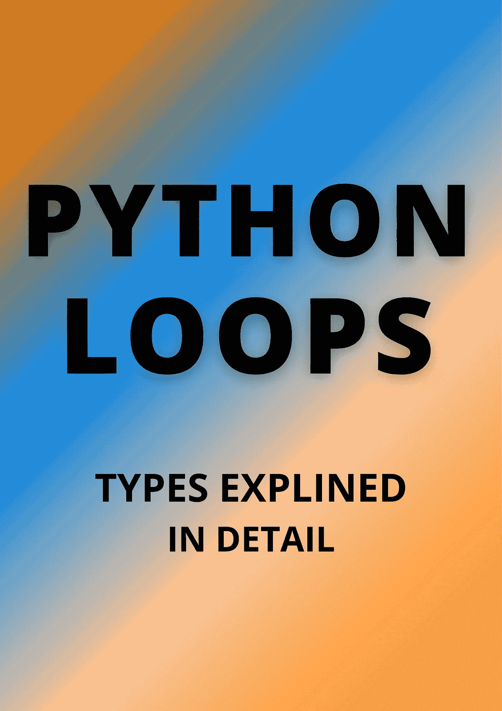

一般来说，**语句是按顺序执行的:首先执行函数中的第一条语句，然后是第二条，依此类推**。可能会出现需要多次执行一个代码块的情况。

编程语言提供了各种控制结构，允许更复杂的执行路径。

**所以 python 中主要有两种类型的循环，它们是:**

1.  **while loop。**
2.  **为循环。**
3.  **嵌套循环**

# 01.while 循环:

Python 中的 while 循环**用于迭代一段代码，只要测试表达式(条件)为真**。我们一般在事先不知道迭代次数的情况下使用这个循环。

例如，如果我们想向用户询问 1 到 10 之间的数字，我们不知道用户可能会输入多少次更大的数字，所以我们一直问“当数字不在 1 到 10 之间时”。

简单地说，while 循环用于重复执行一组语句，直到满足给定的条件。当条件为假时，程序中循环后的那一行被执行。

**语法:**

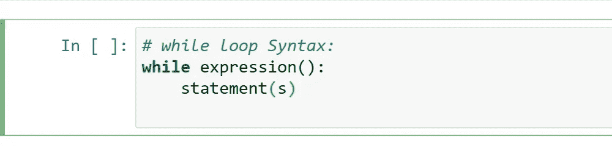

while 循环语法

**while 循环的图示:**

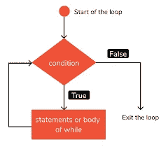

while 循环的图示

**让我们看一个 while 循环的简单例子:**

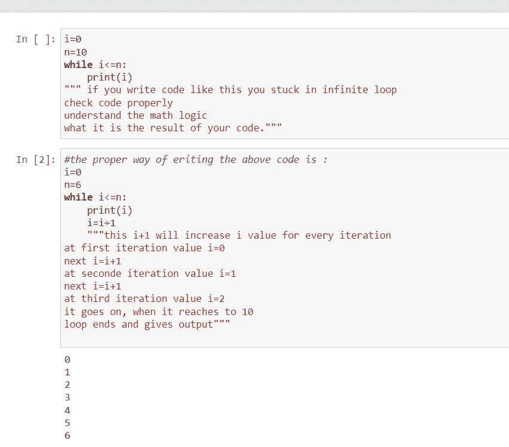

while 循环的简单示例

在上面的代码中我提到了一个词**“无限循环”**。

一个循环变成**无限循环，** **如果一个条件永远不会变成假**。使用 while 循环时必须小心，因为这种情况可能永远不会解析为 FALSE 值。这导致了一个永无止境的循环。这样的循环称为**无限循环**。所以，如果你的迭代进入无限循环，它会导致你的 CPU 内存不足。

**并且可以在 while 循环中使用 else 语句:**

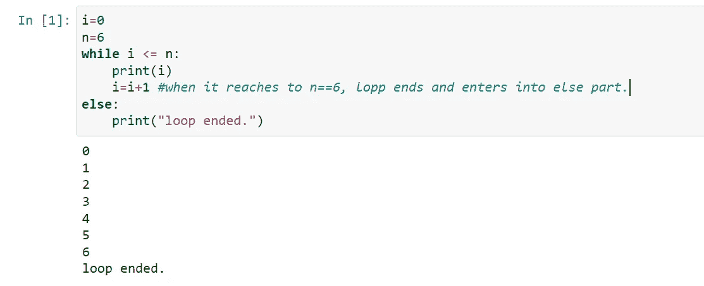

while 循环中的 else。

这是 while 循环的一个简单例子。

*注:我已经在我的 youtube 频道做了详细的视频链接，下面是结账说明。如果你喜欢的内容，请务必订阅我的频道。*

# 02.for 循环:

for 循环**用于遍历序列**(列表、元组、字典、集合或字符串)。迭代一个序列叫做**遍历**。for 循环**用于将特定代码块重复已知次数**。

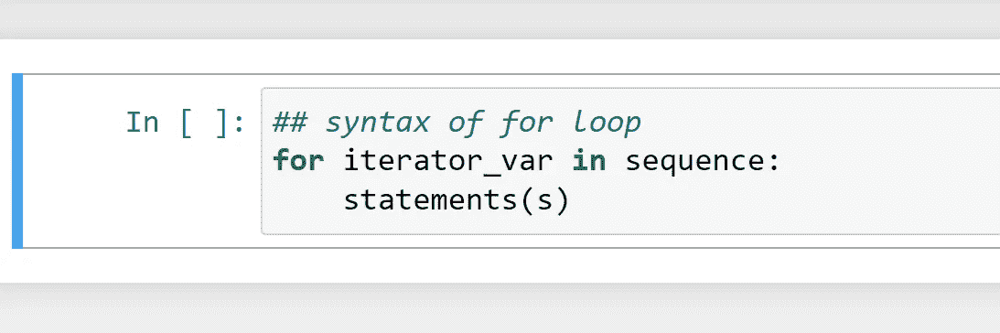

for 循环的语法。

**for 循环的图示:**

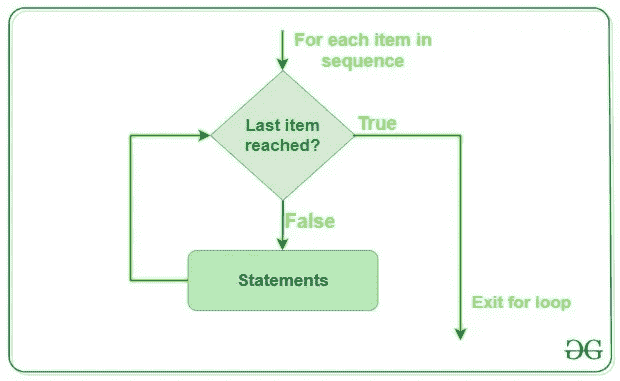

**for 循环的图示**

简单的例子:

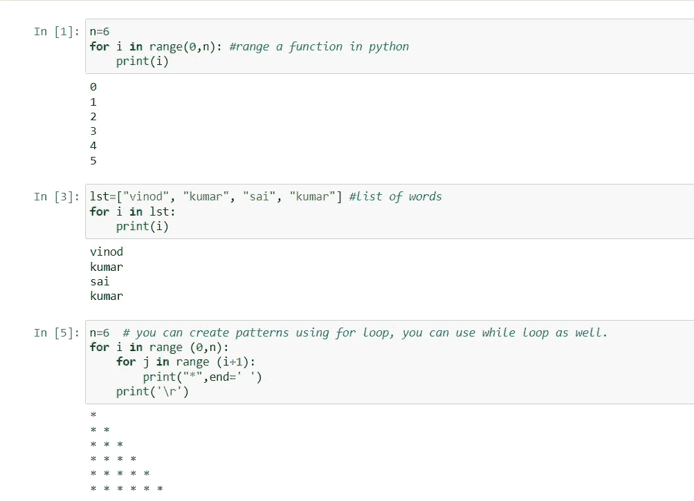

for 循环的示例。

这些是简单例子。这些并不像我在这里展示的那样简单。可以举不同的例子，通过采取不同的场景来尝试解决和练习。

**正如您可以在 for 循环中使用 else 语句一样:**

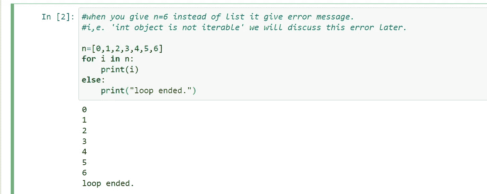

否则在 for 循环中。

# 03.嵌套循环:

嵌套循环是**外循环**体内的一个循环。内循环或外循环可以是任何类型，例如一个**而 loo** p 或**表示 loo** p

Python 编程语言允许在一个循环中使用另一个循环。

嵌套循环的可能方式:；

1.  **while 循环内部的 while 循环。**
2.  **while 循环内部为循环。**
3.  **for 循环内部的 for 循环。**
4.  **for 循环在 while 循环内部。**
5.  **用于 if-else 内部的循环。**
6.  **while 循环内部 if-else。**
7.  你可以创建许多 while 和 for 循环，比如[while-while-for-for-while-for-while]。

**语法:**

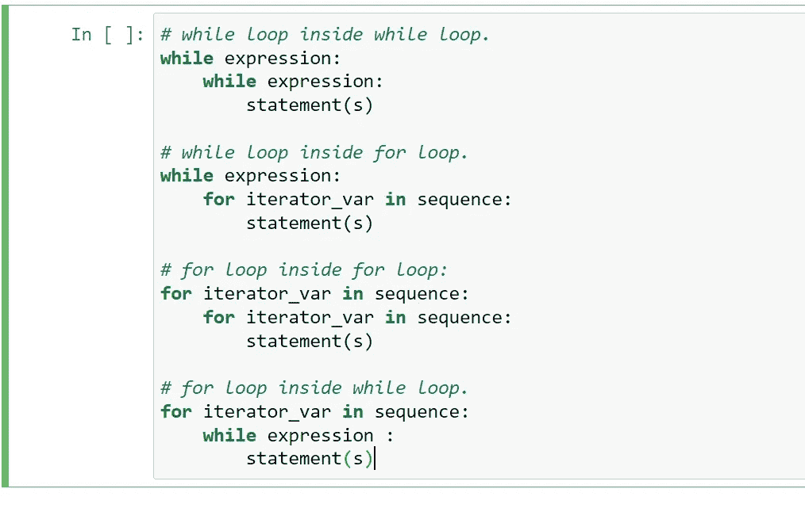

嵌套循环的语法。

在语法中，我只提到了一个语句。您可以根据需要添加多个语句。

**for 循环内部 for 的示例:**

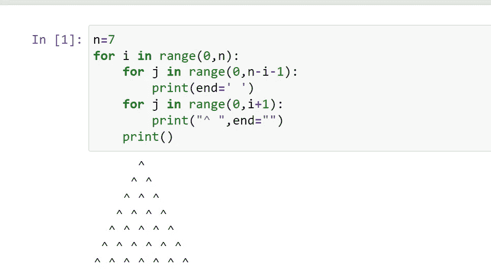

for 在 for 循环内部。

通过这种方式，您可以对 for 循环和 while 循环进行嵌套循环。

我已经在我的 youtube 频道中解释了更多关于嵌套循环的内容，下面提供了链接。结帐，并确保您订阅我的频道。

这里有一个小游戏给你，即猜数字游戏。

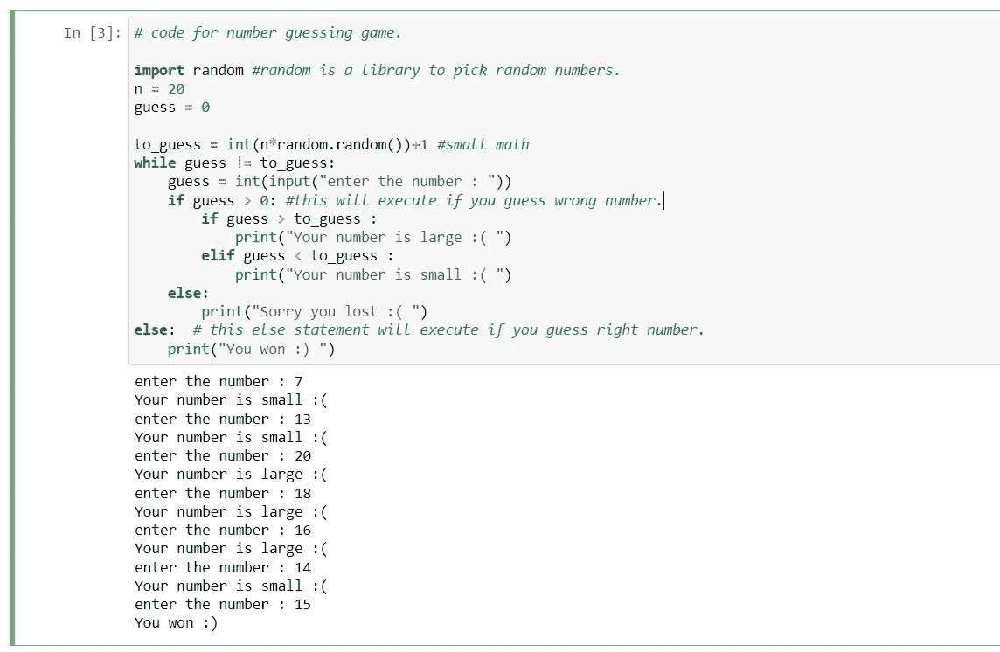

猜数字游戏。

这就是这篇博客的内容。接下来我们将在另一篇博客中讨论更多关于 python 的内容。

如果我在某个地方犯了拼写错误，对不起，请忽略，试着用谷歌搜索一下。

谢谢你。

*******************************************************************

我希望你明白这个简单的概念。所以我打算用一种简单的方式写一个关于 python 的每一个概念的博客，在这里你可以轻松地学习。

所以请继续支持我们，感谢所有读过这篇完整博客的人。

*请喜欢并关注本账号。*

***全爱无恨。***

***我们有一个 Youtube 频道，我们在那里上传关于编程相关的话题，你可以通过订阅我们的频道来支持。***

[***https://www.youtube.com/channel/UChiEiQ2E3_DUGYDG340si-A***](https://www.youtube.com/channel/UChiEiQ2E3_DUGYDG340si-A)

***这是我们的 Youtube 频道链接，请订阅。***

*本文概念及作者:*

***赛库马尔和维诺德库马尔。***

*******************************************************************