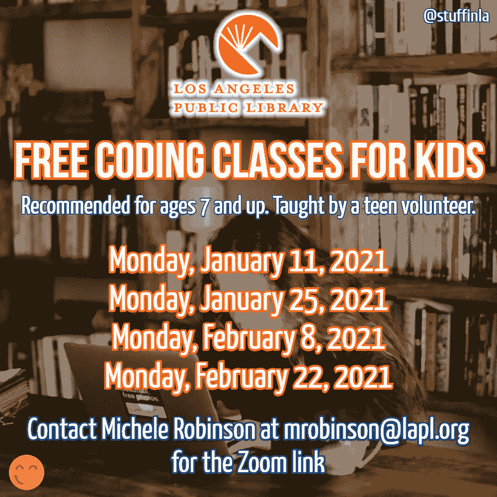

# 洛杉矶公共图书馆为孩子们提供免费的在线编码课程

> 原文：<https://blog.devgenius.io/los-angeles-public-library-is-offering-free-online-coding-classes-for-kids-5a5c3f9c38e2?source=collection_archive---------6----------------------->

## 学习编程的课后计划。

安妮·斯普拉特在 [Unsplash](https://unsplash.com/photos/4A1pj4_vClA) 上拍摄的照片。由[特里梅因·埃托](https://tremaineeto.com)撰写的文字。

对于世界各地的家长来说，在家上学一直是一个挑战，但我没有看到在公共领域讨论得那么多的一个方面是课外活动的缺乏在使事情变得更加紧张方面所起的作用。

无论是课外俱乐部、自习室还是体育运动，都存在一种普遍的空白，缺乏从教室(虚拟或非虚拟)到家庭的过渡。

最近，我听到洛杉矶公共图书馆提供了一些帮助，事实证明这是我热衷的事情:帮助任何有机会对编程感兴趣的人。

# 这是什么？

礼貌 [LAPL](https://www.lapl.org/) 。

2021 年 1 月和 2 月的四个周一，洛杉矶公共图书馆通过其兰乔公园分馆为孩子们提供免费的在线编码课程(建议 7 岁以上的孩子参加)。

这些课程将由一名对编程充满热情的青少年志愿者来教授，每堂课将涵盖一个不同的主题。

# 什么时候？

课程将在以下日期举行，时间均为**下午 3:00**:

*   2021 年 1 月 11 日星期一
*   2021 年 1 月 25 日星期一
*   2021 年 2 月 8 日星期一
*   2021 年 2 月 22 日星期一

# 我如何为我的孩子报名？

只需给 mrobinson@lapl.org**的 Michele Robinson**发电子邮件提到这个课程，她会给你发一个链接让你登录。

# 会教什么样的编码？

这些课程将完全是介绍性的，并将利用一种被称为 [**Scratch**](https://scratch.mit.edu/) 的编程语言和网站。这听起来比实际情况要可怕得多；它实际上是由麻省理工学院开发的，主要针对 7-16 岁的孩子。

Scratch 提供的拖放编码示例。(由路径斜率、 [CC BY-SA 4.0](https://creativecommons.org/licenses/by-sa/4.0) 、[链接](https://commons.wikimedia.org/w/index.php?curid=73604030))

有了 Scratch，孩子们能够编写各种各样的作品，从视频游戏——如下面的平台游戏“Jumper”所示——到动画和模拟。

一款白手起家的游戏，《Jumper》。(由[脱色器](https://scratch.mit.edu/users/Depicklator)、 [CC BY-SA 2.0](https://creativecommons.org/licenses/by-sa/2.0) 、[链接](https://commons.wikimedia.org/w/index.php?curid=91869014)

洛杉矶公共图书馆是一个非常棒的资源，尽管它不对人们开放，但看到他们仍然为洛杉矶社区提供像这些免费课程这样的有用服务，真的很高兴。

*原载于* [***货色于 LA***](https://stuffinla.com) *由 Tremaine Eto 于*[***【https://stuffinla.com***](https://stuffinla.com/los-angeles-public-library-is-offering-free-online-coding-classes-for-kids/)*。*

 [## 通过我的推荐链接加入媒体

### 作为一个媒体会员，你的会员费的一部分会给你阅读的作家，你可以完全接触到每一个故事…

tremaineeto.medium.com](https://tremaineeto.medium.com/membership)