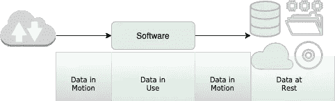
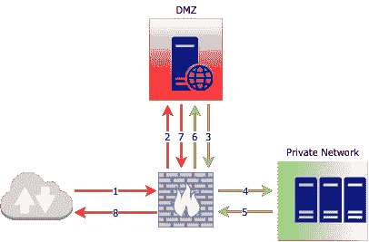
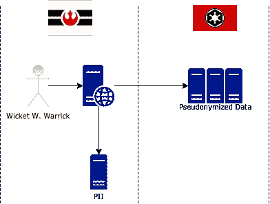

# 设计无损

> 原文：<https://blog.devgenius.io/lossless-by-design-89c4db2503f4?source=collection_archive---------35----------------------->

图片由 [272447](https://pixabay.com/users/272447-272447/?utm_source=link-attribution&amp;utm_medium=referral&amp;utm_campaign=image&amp;utm_content=808901) 来自 [Pixabay](https://pixabay.com/?utm_source=link-attribution&amp;utm_medium=referral&amp;utm_campaign=image&amp;utm_content=808901)

地狱中最黑暗的地方是留给那些不重视数据丢失的人的。虽然但丁没有这样写，但我相信这是真的。

在我们生活的世界里，硅、铝、铜和铅与血肉交织在一起，创造了我们称之为智能设备的延伸，这些元素对我们来说是有毒的。赋予这些设备生命的软件就像灵魂一样，如果没有适当的责任感、道德观和道德指南，它们也很可能和我们一样，永远受到诅咒。

你看，安全有点像避孕用具，在不管是什么东西离开或进入另一个东西之后再戴上它是没有多大意义的。积极主动永远是关键。这就是为什么您应该积极主动，开始在您的解决方案中寻找可能的泄漏点，并将其作为 SDLC 的一个组成部分来检查泄漏点。保护 SDLC 是另一个话题，但是现在，让我们关注系统中的数据丢失点。

数据属于个人或实体，准确地说是“法人”。电子邮件或护照号码等数据可能属于个人，而商业注册号或税务登记可能属于某个实体。这些被称为个人身份信息或 PII。当用户选择使用某个软件或服务时，他们会将自己的部分数据移交给运行该软件的实体(我们都可以放心地勾选魔鬼复选框)。从那时起，这个软件就成了你数据的保管人。

数据丢失是指托管人由于数据泄露或消失而失去对数据的控制；

**泄漏** : *当数据从组织的控制中被窃取，或者当数据被无意中暴露并且不再受组织控制时*。*这可能是由于有人入侵解决方案、网络钓鱼欺诈或简单的不良软件设计造成的，比如通过 GET 明文传输用户名，或者不使用 TLS。使用保护人员！*

**消失** : *当组织不再拥有数据的正确副本时。这可能是由于违反数据完整性、存储丢失或任何其他方式的故障。* *假设数据库因磁盘故障或部分数据损坏而被删除，如果没有经过验证的最新备份来恢复数据库，如果安全的话假设您的数据已经消失。*

数据在其存在期间会经历三种转换状态，即运动中的数据、使用中的数据和静止的数据(静止可能是暂时的或永久的，数据静止)。它可以在这些状态之间转换多次。

在所有这些状态下都可能发生数据丢失，因此需要谨慎操作以确保数据安全。让我们关注每一种状态，以及我们如何在每一种状态下防止损失。

**动态数据**(传输中的数据，飞行中的数据)是指数据在源和目的地之间传输的时候，这是数据最容易受到攻击的时候。

*   使用安全的通信渠道，在没有 TLS 的情况下将任何东西暴露在互联网上是绝对不行的！现在，当 HTTP/3 成为常态的时候，它会默认安全<[无耻的塞到我的文章 HTTP/3](https://medium.com/@charithds/quic-http-3-is-coming-e5449487f910)T14 上。还有其他替代方案，如双向 TLS 或 VPN，也有助于确保通信渠道的安全。
*   所有面向公众的组件都应存放在非军事区(DMZ ),您的关键资产(皇冠上的宝石)应安全地存放在私人“军事化”区。放置在 DMZ 中的组件不应该包含任何业务逻辑，这是视图所在的位置，如果您遵循 MVC 的话。DMZ 和专用网络之间的通信需要使用安全 API 通过防火墙进行。

*   所有通信都必须进行身份验证，使用的任何 API 都需要使用可更新的访问令牌进行保护。避免使用硬编码到视图组件中的长期或通用访问令牌。最佳选择是对最终用户进行身份验证，并生成特定于登录用户的 API 凭据，并确保这些凭据只能用于与经过身份验证的最终用户相关的数据进行交互。

**使用中的数据**是应用程序正在使用的任何数据。这比动态数据更容易受到攻击(因为理想情况下，这应该在您的私有网络中)，但在现实中保护起来也相当棘手。

*   加载你需要的，不要偷懒*select * from users where user _ id = " 1234 "*将整个用户对象存储在内存中。通过 API 或表单提交接收到的任何数据，不要在内存中保存太久。注意将数据保存在内存中，并确保自己清理干净。
*   审计跟踪有点像马走后关马厩的场景，但它将帮助您在下一匹马逃跑前修好大门。避免在审计跟踪中过度暴露数据。如果用户 A 的凭证被用来访问他/她的社会保险号，那么您需要记录的正是这个，而不是用户 A 的凭证或社会保险号。当您拥有这些信息时，您可以在以后提取实际的信息来进行进一步的调查。如果您使用的是高级威胁防护(ATP)系统，拥有这样的审计跟踪将作为额外的数据源。
*   每次 API 访问敏感数据时，都应该检查身份验证。没有安全就没有端点，没有安全就没有数据。

**静态数据**是指存储在数据库、文件系统或冷存储中的数据。这是最不容易受到攻击的数据类型，因为它被安全地锁定了。

*   访问控制对于维护数据安全是绝对必要的。只有经过授权的个人和服务才能访问数据。对数据的访问应该被控制到最细粒度的级别(稍后将详细介绍 PoLP)。所有的访问尝试都应该被记录下来以便追踪。
*   如果您运行的是裸机服务器，存储加密更适用，因为大多数云提供商默认都是这样做的。基于硬件和软件的解决方案都可用。
*   需要经过验证的备份来解决数据丢失问题，仅仅及时备份是不够的。需要对备份进行验证，并测试恢复的正确性。
*   地理冗余是从数据丢失中恢复的好方法。

一些一般要点适用于上述所有状态，在保护数据时需要注意这几点。

**最小特权原则(PoLP)** 指的是仅向用户(人或系统)提供完成任务所需的最低访问权限的做法。在数据库中，您可以控制用户对列级的访问。PoLP 强调的是，应该执行相同级别的粒度，并且应该给出正确的操作权限。为只读取数据的操作提供写访问权限是有风险的，应该避免。同样，应该避免向只需要访问特定目录的用户提供 root 访问权限。

**假名化&匿名化**，从定义上来说，这两者的区别在于，当数据被匿名化后，它就被销毁了，无法恢复。相反，当使用假名时，数据会使用密钥或其他方式取消标识，以便以后可以重新标识。一收到数据就存储数据并使用假名数据是一种安全的做法，因此“使用中的数据”将只包含假名数据，从而降低丢失的风险。

随着 GDPR 的实施，数据主权得到了广泛关注。世界各国现在都在关注加强他们的跨境隐私法。数据主权意味着存储的数据受存储数据的国家的法律约束，并且数据应该位于用户的国家内。我相信你已经看到问题了。如果我在斯里兰卡在当地经营一家企业(根据斯里兰卡的法律)，并将我的数据存储在云中(Utopia 的某个数据中心)，这就存在矛盾。两种不同的法律体系对业务和数据拥有管辖权。这些情况很难处理。一种选择是将假名数据存储在云上，永远不存储 PII。然而，如果法律非常严格，并且不要求任何州的数据离开原国家，那么它将要求您要么在当地国家托管整个解决方案，要么转向混合解决方案。

Wicket W. Warrick 先生是叛军联盟的公民，他决定在网上购买头饰，全球在线商店的大部分数据都在云上。云提供商在银河帝国控制的星球上有数据中心。解决方案是，网店将把任何与沃里克先生有关的 PII 存储在叛军联盟下的一个星球的本地服务器上，并将任何其他数据卸载到云服务器上。如果他们希望在云上存储任何敏感信息，他们必须在这样做之前对数据进行假名处理(去识别)。

安全性是一个持续的过程和实践。为了领先于威胁，您需要积极主动，像白帽黑客、漏洞评估和安全审计这样的事情需要经常进行。检查数据丢失点的工作也需要经常进行，尽管这不能保证解决方案永远无损，但这将是朝着正确方向迈出的一步。

> 不受干扰是一个人能向现代世界要求的最珍贵的东西――安东尼·伯吉斯

[1]法人，法律信息研究所。https://www.law.cornell.edu/wex/legal_person[康乃尔法学院](https://www.law.cornell.edu/wex/legal_person)

[2]数据丢失预防，Simon Liu，Rick Kuhn，[https://CSRC . NIST . rip/groups/SNS/RBAC/documents/Data-Loss . pdf](https://csrc.nist.rip/groups/SNS/rbac/documents/data-loss.pdf)

[3]系统开发生命周期(SDLC)，雪莉·m·拉达克，[https://tsapps.nist.gov/publication/get_pdf.cfm?pub_id=902622](https://tsapps.nist.gov/publication/get_pdf.cfm?pub_id=902622)