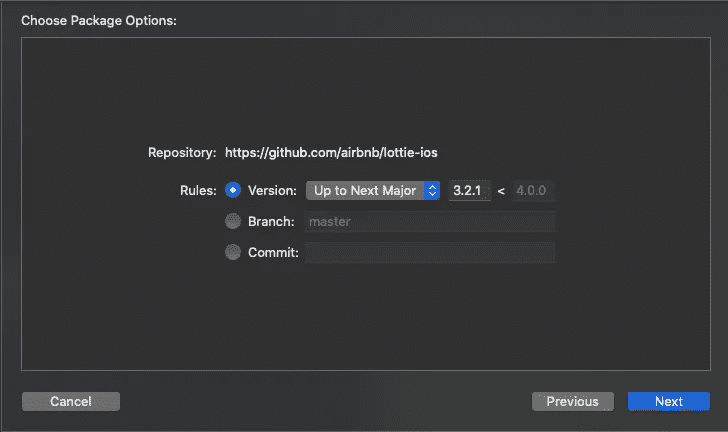

# SwiftUI 中的洛蒂动画

> 原文：<https://blog.devgenius.io/lottie-animations-in-swiftui-9bf22dd36786?source=collection_archive---------2----------------------->

在 SwiftUI 中集成 Lottie

由[弗雷德里克·李佛特](https://unsplash.com/@frederikli?utm_source=medium&utm_medium=referral)在 [Unsplash](https://unsplash.com?utm_source=medium&utm_medium=referral) 上拍摄的照片

洛蒂是什么？

> “Lottie 是一个适用于 Android 和 iOS 的移动库，它可以用最少的代码实时呈现基于矢量的动画和艺术。
> 
> Lottie 加载并渲染以 bodymovin JSON 格式导出的动画和矢量”

你可以在他们的回购中找到更多信息

让我们用 Swift 软件包管理器安装 Lottie:

1.  在 Xcode 中，进入文件> Swift 软件包>添加软件包依赖性

2.添加项目网址:[https://github.com/airbnb/lottie-ios](https://github.com/airbnb/lottie-ios)

3.在以下屏幕中，单击下一步

4.洛蒂提醒我们必须这样做:“不要忘记在你的`Build Setting`中设置`DEAD_CODE_STRIPPING = NO`”

现在你有洛蒂使用 SPM。

让我们找一个动画文件来使用:[https://lottiefiles.com/featured](https://lottiefiles.com/featured)

你可以选择任何你想要的动画，但是必须是 JSON 文件。选择一个文件后，只需下载它并将文件拖到您的项目中(它可以在代码中的任何路径下)。

我的项目中的洛蒂文件

要在 SwiftUI 中使用 Lottie，您需要创建一个 **UIViewRepresentable** ，如下所示:

在这里，您需要指定您想要使用的动画名称，在我的例子中是“通知”，您可以自定义动画的循环模式和内容模式。

如何在 SwiftUI 视图中使用？

只需在你的视图中添加 LottieView，它就可以工作了。

与我们合作:

 [## 阿维拉泰克

### 技术创新的发展

www.avilatek.com](https://www.avilatek.com/en/) 

我的 LinkedIn 个人资料:

 [## Marcelo Laprea - iOS 软件工程师- Kindred Group plc | LinkedIn

### 经验丰富的 iOS 应用程序开发人员，有在计算机软件行业工作的经历。熟练于…

www.linkedin.com](https://www.linkedin.com/in/marcelo-laprea/)