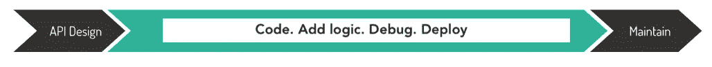
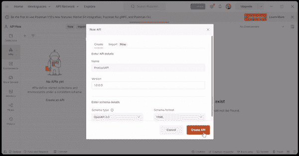
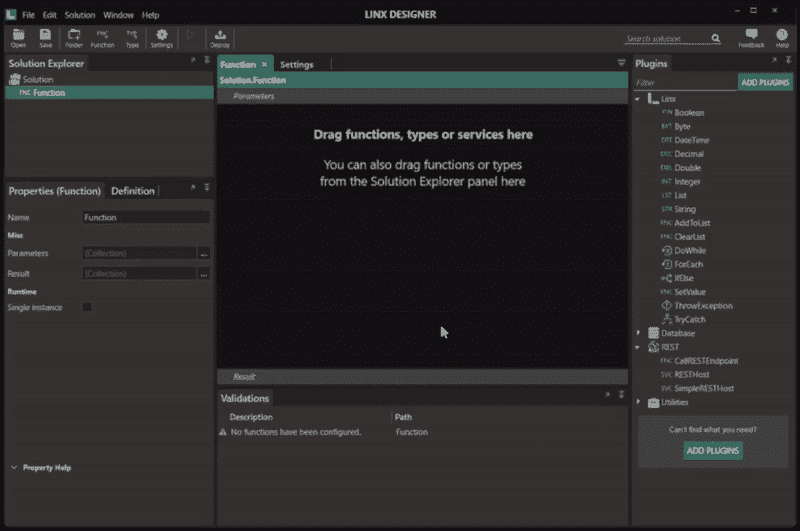
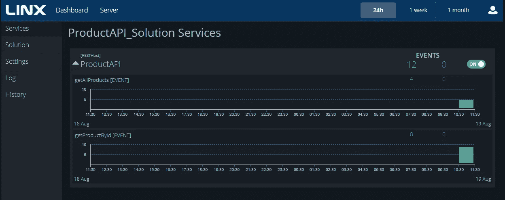

# 低代码:用于 API 开发和部署的喷气燃料

> 原文：<https://blog.devgenius.io/low-code-jet-fuel-for-api-development-and-deployment-4eb09e68f98f?source=collection_archive---------12----------------------->

构建良好的 API 有一种低调的艺术——易于集成、具有高操作可用性、提供易于获得的性能洞察，并且易于维护。但是如果你曾经不得不从零开始构建一个 API，不可否认这是很难的——当你的目标是交付一个高质量的 API 时，事情会变得更加复杂。

# API 开发流程

可以说，开发一个 API 有三个重要的步骤:

*   设计 API，
*   构建 API 和
*   托管 API。

在这篇文章中，我们将看看这些领域中的每一个，并打破将你的 API 设计应用到生产中的障碍。在进入细节之前，理解一个 API 的典型开发过程是很重要的。

通常，一个 API 是分多个阶段开发的。

# API 开发工具

正如 RESTful APIs 已经爆炸一样，创建、测试和管理它们的工具也在不断增加。无论您是构建第一个 API 的新手，还是赶时间的专家，都有一系列服务可以帮助您将 API 从概念转化为产品。当构建和实现你的 API 时，每一步都可能用不同的工具或平台来完成。

## API 设计

有几个工具可以帮助设计和测试您的 API。有了 many，您可以可视化并测试您的 OpenAPI 规范，然后在准备就绪后自动进行 API 测试。当然，您仍然需要构建 API、实现业务逻辑、托管它、执行监控并记录它。

## 编码、实现逻辑和测试

在构建 API 时，有几种方法可以做到这一点。您选择哪一个将取决于可用的技能、您需要支持的特性集、时间和预算。低代码平台通常是一个不错的选择，因为它们解决了许多与开发和托管相关的众所周知的问题，同时还减少了所需的工程时间和资源。

例如，使用低代码工具可以简化 API 开发过程，只需使用两种工具。

通过减少开发 API 所需的工具数量，重点从技术能力和对特定框架的掌握转移到确保业务和复杂逻辑按预期运行。此外，由于低代码工具拥有实现速度的额外好处，从设计到生产可以比传统的[工具快得多。](https://linx.software/linx-compared-to-traditional-coding-low-code-vs-pro-code/)

## 部署、监控、维护

在传统的 API 开发过程中，开发人员将负责托管和管理的所有元素。当然，你可以选择一个 IaaS 平台，其中的基本构件是无服务器功能，比如运行在 API 管理服务之后的 [AWS Lambda](https://aws.amazon.com/lambda/) 或 [Azure Functions](https://www.googleadservices.com/pagead/aclk?sa=L&ai=DChcSEwicy7exnIL6AhWBtO0KHcMEAjMYABABGgJkZw&ohost=www.google.com&cid=CAESaOD2YcPHEHh-AI7jgj2ADQgMVLmogtiUtxlcNYUs_7_hmvdCbBWGIr5hjskK0chJl4bYTnxArqkdncNwQYtFPa64jClugbICLx83GEFd6RyXKz0ewNzW8rzlrY6SKJcerMcJdqfwha5z&sig=AOD64_309ujmXRPpkR0mMIKUmmvETakV0w&q&adurl&ved=2ahUKEwju9q-xnIL6AhV5REEAHUupC90Q0Qx6BAgEEAE) 。您仍然需要编写 API，并对 API 的工作原理、IaaS 平台提供的服务以及它们如何交互有很好的理解。

但是当谈到托管和部署时，低代码平台再次脱颖而出。除了易于启动(现成的基础架构)和高效(易于维护)之外，许多解决方案还提供全包式功能(一键式部署、内置安全性)。

# 低代码如何解决 API 问题

通过使用正确的工具集，我们可以展示如何优化从设计到生产的 API 开发。

## 设计 API

**工具:邮递员**

在开始构建任何东西之前，您需要设计 API。通过使用 OpenAPI 3.0 规范，您可以轻松地确定将发生什么样的交互以及什么样的端点可用，并在几秒钟内处理好您的文档。OpenAPI 规范可以以 JSON 或 YAML 格式创建。

选择 Postman 这样的工具来设计 API 还会带来许多其他好处，比如丰富的 API 测试。当在 Postman 中设计 API 时，该规范是预先声明的，这意味着在构建 API 时测试会容易得多。一旦为 API 创建了测试套件，这就变得容易多了。

## 构建 API

**工具:** [**Linx**](https://linx.software)

开发将涉及为 API 创建代码，实现业务逻辑和集成额外的资源，如[数据源](https://linx.software/how-to-consume-restful-apis-in-low-code/)或甚至进行 API 调用。

当您在 Linx 中导入 OpenAPI 规范时，它会将端点创建为事件。一旦基本配置完成，您就可以开始实现逻辑和集成了。例如，您可以连接到 SQL Server 数据库，并根据输入参数检索数据。

Linx 还允许与几乎任何数据源或应用程序集成。当您确实需要调用另一个 API、从多个来源提取数据或者将您的 API 与现有系统集成时，这将变得更加容易。

在整个开发过程中，您可以使用调试器实时调试和测试 API。在调试 API 时，会创建一个本地服务器来托管 API。您可以使用 Postman 对本地托管的 API 进行 API 调用(使用本地主机基础 URI)。这样做可以让您快速看到输出是什么样子，以及 API 是否如预期的那样运行。运行一个模拟它在运行时如何反应的 API 版本将允许您在生产中出现问题之前发现并解决问题。

## 托管 API

**工具:Linx**

托管 API 时需要考虑很多方面，比如可伸缩性、安全性、可观察性和维护。在部署中还有几个障碍需要跨越。例如，Python 是构建 API 的绝佳选择，但在部署应用程序时，它却异常复杂。

使用传统的 API 部署，您将负责托管环境，这不可避免地会带来其自身的问题——即使它托管在 AWS 或 Azure 上，您也必须维护基础架构——并且，任何基础架构也必须同时部署，例如数据库对象、文件、存储配置和插件。此外，在内部维护 API 会导致前所未有的开销。因此，自然地，包含托管环境的低代码平台缓解了不可避免的时间-成本-能力场景。

作为一个平台，Linx 提供了一个[应用服务器](https://www.youtube.com/watch?v=w4cfHxuF0f4)，在这里你可以部署、托管和管理创建的应用程序。有了平台来承担重担，您的 API 不仅可以立即部署，而且从一开始就具有节省时间的内置功能—安全性、监控、日志记录等等。

Linx 服务器将托管您创建的解决方案。它还允许用户基于 API 规范中设置的配置来使用 API，此外，它还提供了一个用于观察和性能的仪表板。

# 将这一切结合在一起

与传统编程一样，使用 Linx，您可以构建解决方案并控制需要做的事情。您决定您的过程和 API 需要有多复杂或简单。用低代码实现的好处是实现速度快。

试试看:一个构建和托管 API 的[分步指南](https://linx.software/guide-postman-to-production/)。