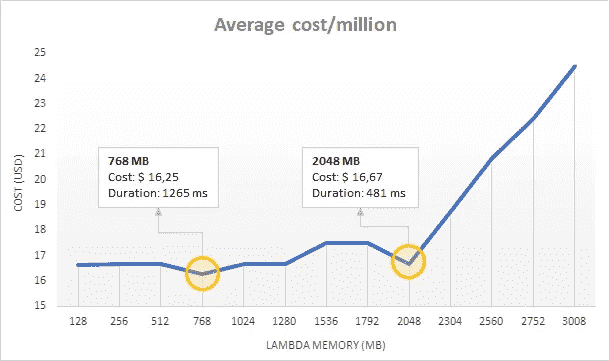
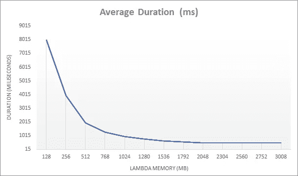

# 通过增加内存大小来降低 AWS Lambda 账单——没错！

> 原文：<https://blog.devgenius.io/lower-your-aws-lambda-bill-by-increasing-memory-size-yep-aaf7fbfae2bb?source=collection_archive---------7----------------------->

当我们为 Lambda 函数指定内存大小时，AWS 将按比例分配 CPU。例如，256 MB 功能的处理能力是 128 MB 功能的两倍。这看起来简单明了，但是…

> 我有这样一个问题:在 Lambda 上运行一个给定任务时，会有一个理想的内存大小来最小化成本吗？

为了回答这个问题，我测试了在多种内存大小上运行的相同任务，以检查是否存在这样的成本/内存权衡最佳点。

# 基准 Lambdas

我创建了两个 Lambda 函数来运行这个测试:

*   斐波那契:产生一系列…你猜对了，斐波那契数的基本代码！这只是一个低内存、CPU 密集型的任务。
*   Benchmarker:多次调用 Fibonacci 函数(或任何其他函数)，切换内存大小；最后，它会对结果进行平均，以确定哪个内存大小可以优化速度和成本。

如果你想测试你自己的 Lambdas，[代码是开源的](https://github.com/byrro/awslambda-memory-tradeoff)。下面给出的结果肯定会根据您测试的函数而有所不同，所以我鼓励您下载 Benchmarker Lambda 并亲自运行它。

由[斯蒂芬·道森](https://unsplash.com/photos/qwtCeJ5cLYs?utm_source=unsplash&utm_medium=referral&utm_content=creditCopyText)在 [Unsplash](https://unsplash.com/search/photos/data-center?utm_source=unsplash&utm_medium=referral&utm_content=creditCopyText) 上拍摄的照片

# 测试参数

*   AWS 地区:美国东部-1(北弗吉尼亚)
*   测试的内存大小:128、256、512、768、1024、1280、1536、1792、2048、2304、2560、2752、3008
*   对于每种内存大小，斐波那契被调用 20 次
*   调用以 10 个并发请求为一批运行，以加快进程
*   每次调用时，Fibonacci 函数都会构建前 30 个 Fibonacci 数的序列
*   忽略冷启动以标准化持续时间结果

#测试结果

斐波那契数列生成器每百万次执行的平均成本(美元)( n=30)

# 成本方面最有利的地方是:

*   768 MB :这是我们在 Lambda 上能得到的最便宜的任务了；为什么 128 MB 不便宜？它需要更长的处理时间，长到足以使它的总成本更高！
*   **2048 MB** :虽然价格比 768 MB 高~3%，但运行速度快 2.5 倍；在某些情况下，多花点钱来加快处理速度可能是值得的。

举例来说，与 128 MB 相比，运行 768 MB 的任务花费更少，这是违反直觉的。这意味着在某些情况下，我们实际上可以通过增加内存大小来降低 AWS 账单。当然，在考虑改变设置时，我们需要知道我们的函数需要的最小内存是多少。我们创建了]dash bird]([https://dash bird . io/features/AWS-lambda-server less-monitoring/](https://dashbird.io/features/aws-lambda-serverless-monitoring/))来更容易地分析 Lambda 内存使用情况并确定这种基准测试分析的阈值。

内存容量越大，线斜率(上图)的急剧上升引起了我的注意。从那时起，有报道称——尽管不是官方的 Lambda 提供了两个内核。我的假设是处理能力在内核之间分配，由于我的工作只使用了一个内核，测试实际上是在惩罚双核功能设置。这是在未来的测试中需要更密切关注的事情，这项任务可以利用多个内核。

运行斐波纳契数列生成器的平均持续时间(毫秒)( n=30)

在时长方面，上图看似没有什么惊喜，但我其实在结果中发现了一贯诡异的地方: **2048 MB** 总是比 **2304** 和 **2560 MB** 表现的更快，这是意料之外的。放大到最高内存大小，我们可以注意到差异。

运行斐波纳契数列生成器的平均持续时间(毫秒)( n=30)

这可能是可以忽略的，因为它代表大约 2%的额外执行时间。尽管如此，如果我们运行这个函数数百万次，或者如果延迟非常重要，那么这些额外的毫秒可能是相关的。

很难准确理解哪些因素在产生这些意想不到的结果中发挥了作用。Lambda 基础设施是一种黑箱。也许服务于每个请求的硬件有所不同，这将在我们的测试中引入一些不期望的可变性。底线是:如果你想优化 Lambda 的使用，以获得最快的执行速度或最低的成本，你应该明确地对你的函数进行基准测试。

我们已经发布了[基准测试函数](https://github.com/byrro/awslambda-memory-tradeoff)，这样你就可以自己部署和测试你自己的 Lambda 函数。

# 通过实时 Lambda 成本跟踪节省资金

为了从 Lambda 这个专为 AWS Lambda 定制的性能监控工具中获益并节省更多，您可以[立即注册 Dashbird](https://dashbird.io/#register) —一个免费的端到端无服务器监控平台。

获得 Lambda 函数的详细概述，它们有多健康和有效，以及每个函数的成本。凭借全面的 Lambda 度量知识，您将能够识别趋势以帮助节省资金。

Dashbird 通过监控、提供可观察性和洞察力以及实时错误警报来帮助您构建和操作复杂的**无服务器应用程序**。

*   快速 **3 分钟**设置。[从这里开始](https://dashbird.io/register/)！
*   零代码更改
*   立即开始调试、监控和接收警报
*   **易于访问的集中式数据**
*   ****监控错误、冷启动和异常情况****
*   **已经设置了自动提醒**
*   ****针对优化定制的见解****
*   **复杂数据可视化**
*   **没有安全或性能影响**