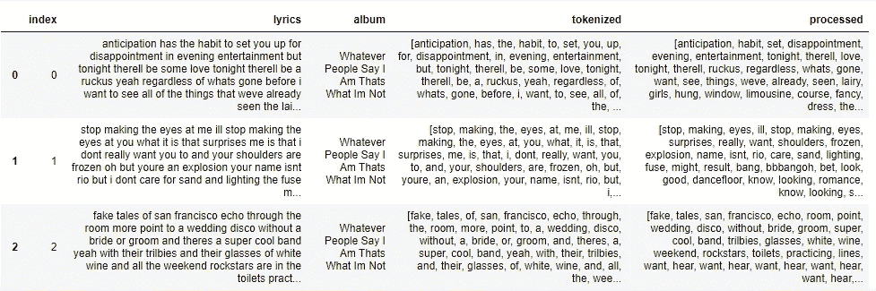
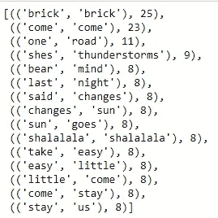
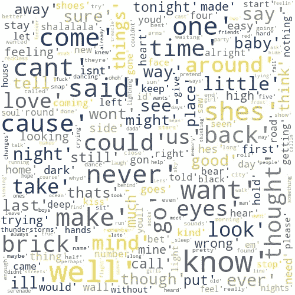
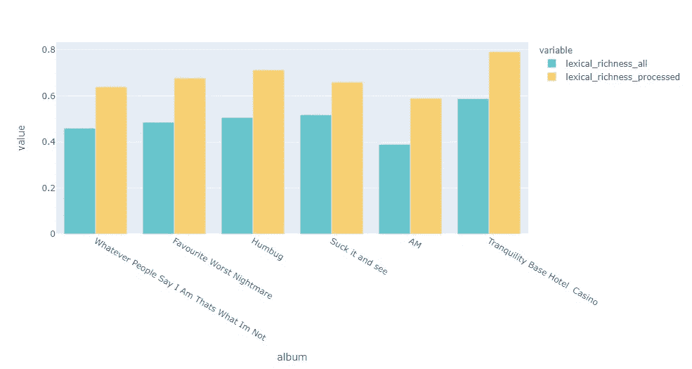

# 基于自然语言处理的北极猴子歌词分析——第一部分

> 原文：<https://blog.devgenius.io/lyrics-analysis-on-arctic-monkeys-albums-using-nlp-part-i-d8644cdcbf36?source=collection_archive---------5----------------------->

## 数据收集、文本清理、EDA、词汇多样性以及对 AM 再次北美巡演的无尽等待

我喜欢认为每个音乐迷都有一个“星火艺术家”——一个完全改变他们对音乐的看法、品味和消费的乐队/艺术家。对我来说，北极猴子乐队就是这样的乐队。它们是我进入 2000 年初摇滚的大门，是我在生活中任何可以想象的情况下的舒适播放列表，最重要的是，AM 的音乐让我大胆挑战我对西方音乐和肤浅歌词的天真联想。

2021 年，由于工作中的一个项目，我有机会学习关键的 NLP 概念并将其付诸实践。当我感觉差不多熟悉时，我决定尝试一下亚历克斯·特纳广受好评的抒情技巧。因为当一个粉丝最喜欢的乐队不在巡演的时候，她在疫情还能做什么呢？

想想下面的歌词——

> *“她的嘴唇像银河的边缘/她的吻是星座的颜色/落入合适的位置”*
> 
> *“我幻想，我停止幻想/我和经济学家们一起游泳/我永远地追根究底/当现实降临/自由的钟声破碎的时候”*
> 
> *”..我可能达不到目标/被咬怕了/虽然这不比吠声更刺耳/冒险的中途是一个/完美的起点"*

如果这种异想天开的图像没有抓住你，也许这个迷因会:

所以不管你是否能一字不漏地从里兹饭店唱到废墟，我希望你喜欢读这篇文章。

## 0.目标设定

我的目标是**使用基本的 NLP 技术分析北极猴子的歌词，如 N-Gram 分析、词汇丰富度和情感分析**，以及挖掘任何随时间推移的趋势。在这个过程中，我希望精通 NLP 库，如 NLTK、Gensim、Spacy，并了解如何有效地交流它们错综复杂的技术细节。

还有——玩得开心！

## 一.数据收集和数据清理

歌词网站 Genius.com 有一个很棒的 [API](https://docs.genius.com/) ，我用了它的 python 包装库 [lyricsgenius](https://lyricsgenius.readthedocs.io/en/master/) 。你当然可以遵循更明确的路线，使用[请求](https://docs.python-requests.org/en/latest/)调用 API，读取 json 文件，然后解析每首歌的歌词——网上有很多教程。

我收集了所有六张录音室专辑的歌词，日期为 2006-2018 年。最困难的部分是解析出单词“Embed”和每个正文的第一行。

如果你是 NLP 新手，我强烈建议你先熟悉一下 Python [String](https://www.w3schools.com/python/python_ref_string.asp) 和 [List](https://www.w3schools.com/python/python_ref_list.asp) 方法。挤出一些时间参加 [RegEx](https://docs.python.org/3/howto/regex.html) 活动。相信我，这会节省你很多时间。

大多数文本清理教程会给你一个完整的包:去除停用词、标记化、词干化和词汇化。然而，我发现对于每一个独特的项目，有必要定制这些步骤来最大限度地满足你的需求。歌词本质上是采用重复的短文。虽然词干化和词条化擅长提取高级短语，但它们往往过于简化，这有可能丢失我们已经很短的语料库中的信息，所以我决定放弃词干化和词条化。

出于这个分析的目的，我发现一些定制的文本规范化和标记化足以完成这项工作。

NLTK 的 stopwords 包使您能够制作“扩展包”。因此，在标记化之后，我不得不添加一些特定于 Alex-Turner 的停用词:

文字清理煞费苦心。它看似无限的改进和定制的潜力是一件好事，同时也是一件坏事，所以你需要知道什么时候该划清界限。也就是说，没有任何替代物可以更好地理解您的数据。**预处理文本的质量直接影响分析和建模结果。**

对于我的最终数据帧，我为专辑、原始歌词、标记化单词和“删除的”标记化单词各准备了一列(“已处理的”):

## 二。EDA: N-gram 和 WordCloud

> [N 元语法](https://kavita-ganesan.com/what-are-n-grams/#.Yde_0SDMK00)是给定窗口中连续的同现单词，N 是该窗口中单词的数量。

n 元语法有助于捕捉文本语料库的高级上下文。它还广泛用于文本挖掘、语音识别和各种 NLP 任务。

它是这样工作的:想象移动一个由三个单词组成的窗口通过“我要回到 505”这条线，三元模型将是:[我要回去]，[回到]，[回到 505]。NLTK 有一个方便的 N 元语法分析函数:

前 15 个二元模型，按频率降序排列

我们可以看到，由于重复，N 元语法并不是高层次概述的最佳解决方案。然而，运行 N 元语法也是在数据清理步骤中迭代添加停用词的好方法。

WordCloud 是我的第二个选择，用来可视化语料库中最频繁出现的内容。Python 有一个漂亮的 [**WordCloud**](https://amueller.github.io/word_cloud/) 包，提供了丰富的定制范围，包括要考虑的字数。这是一个比 N 元语法更好的表示法——能告诉你很多。

从经过标记化和清理的语料库中生成的词云

## 三。词汇多样性

> 英国桂冠诗人西蒙·阿米蒂奇(Simon Armitage)曾[评论](https://www.theguardian.com/music/2008/jun/27/arcticmonkeys.popandrock)说，“没有歌词，北极猴子很好，但有了歌词，它们也很棒。”

为了更深入地挖掘连珠炮似的韵律、丰富的隐喻和“工人阶级讽刺的厌世情绪”，我忽略了词汇的多样性。

应用语言学认为词汇多样性是不同的独特词干(类型)与单词总数(标记)的比率，或类型-标记比率。

将其转化为数学:独特的单词/单词总数。

专辑中的词汇多样性

具有讽刺意味的是，词汇多样性最少的专辑“AM”恰好是他们最受欢迎的专辑，他们的最后一张专辑是所有其他专辑中的佼佼者。除了 AM，抒情的丰富性也随着时间的推移而增加。

歌词最丰富的歌曲是《TBHC》(2018)中的*她看起来很有趣*，擦洗后的多样性得分为 98.6%，而最不丰富的歌曲是《一砖一瓦》(2011)中的 *Brick By Brick* ，只有 28.6%。

顺便说一下，这是《她看起来很有趣》中的一句预言诗:

*街上没有人
从三月份开始，我们把所有的都搬到了网上。*

🙃

## 在第二部分中，我将探索两个更深入的 NLP 应用:情感分析和主题建模。