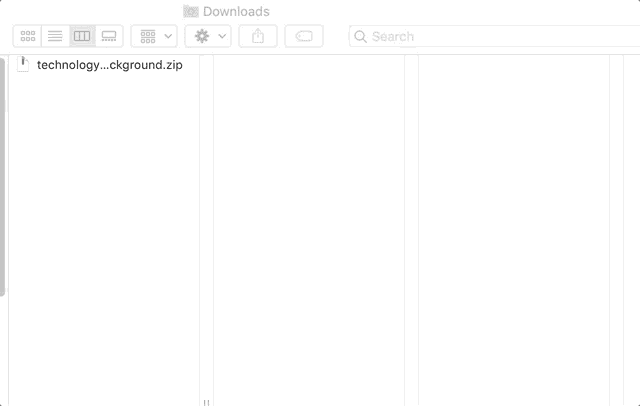
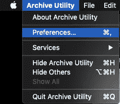
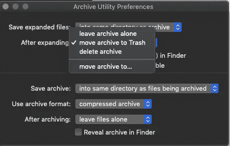

# Mac Hack:展开后自动将压缩文件移至垃圾箱

> 原文：<https://blog.devgenius.io/mac-hack-automatically-move-zipped-files-to-trash-after-expanding-f55c34b0c2ef?source=collection_archive---------0----------------------->

## 不要担心你删除。压缩文件了

解压缩/展开压缩文件(例如以`.zip`结尾的文件)后，在你的电脑上保存它们通常没有意义。**让你的 Mac 自动将压缩文件移到垃圾桶。**

压缩文件展开后。zip 文件被自动移动到垃圾箱

转到您的存档实用程序。按*【command+space】*，搜索**【存档实用工具】**，然后按回车键。

接下来，点击顶部菜单栏中的**“存档实用程序”**，并点击首选项。

你有一堆不错的选择。我们感兴趣的是**《拓展后》**。点击它旁边的下拉菜单，并选择**“将档案移至垃圾箱”**

就是这样。下次解压缩文件时，压缩后的文件会自动移动到回收站。