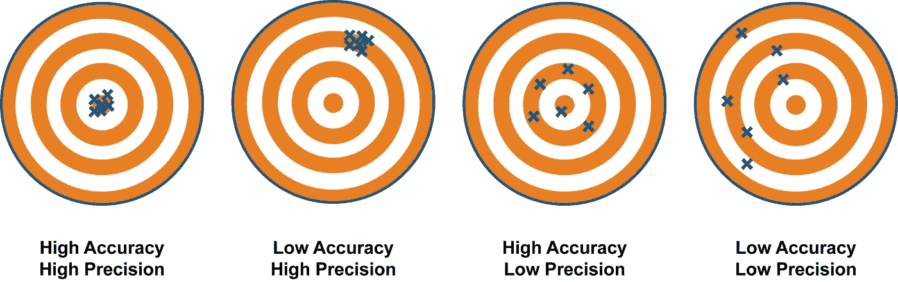

# 机器学习 101。拔掉插头。

> 原文：<https://blog.devgenius.io/machine-learning-101-unpluged-900bc01b0262?source=collection_archive---------37----------------------->

马库斯·斯皮斯克在 [Unsplash](https://unsplash.com?utm_source=medium&utm_medium=referral) 上的照片

在过去的几年里，我在竞赛和比赛中看到了很多机器学习项目。人工智能的趋势正在以指数级的速度增长，然而公众并不了解它是如何工作的。这种类型的研究通常受到称赞，因为它看起来很酷，但它仅仅是使用统计学解决具体问题的一个范例。它不会神奇地给出“正确”的答案。

基于概率统计的机器学习。当我们输入数据时，计算机会发现它们之间的统计关系，并预测其他数据集可能会发生什么。因此，这意味着更多地研究机器学习需要分析训练模型的好坏以及它们背后的统计数据。

机器学习并不智能。想象一下，如果我馈入过去的彩票结果，机器学习神奇地找到了其中的关系，并给出了下一次的预测结果，那就太可笑了。不幸的是，事情不是这样的。

我认为是时候**停止复制代码模板，放入数据，并声称这是一个项目**了。经过训练的模型只不过是给出预期答案的概率函数。大多数时候，只要模型能产生精确的结果，就只需要模型。因此，这里的关键问题是如何相应地训练模型，以在有限的数据量下实现最大的精度。

# 更准确=更好？

要获得准确的答案，不仅仅是输入数据并期待结果。考虑增加数据样本是很重要的，因为整个过程依赖于统计数据，这意味着只有在大量数据的情况下才能很好地工作。还需要考虑不同的模型、方法和函数来适应数据集，因为这将有助于最小化不必要的误差。

无论如何，达到最大的正确性仍然不是研究人员应该瞄准的目标。有时，模型的精确性伴随着过度拟合，这意味着该模型在现实世界中不适用，因为它不能概括结果。学会注意过度拟合并防止模型与问题实例过于相关是至关重要的。

如果机器学习是为了正确，那么衡量正确的方法还是很多的。**精确、准确、全面**是不可避免的简单措施，应该始终在计算中。即使它通常被自动包含在计算中，研究人员也应该意识到差异，这样他们就不会忽略任何因素。

准确度与精确度

精密度和准确度的差异不难理解(请参考图片)，但综合就不是这样了。考虑这个例子。医疗机器需要将人们分为两个独立的癌症群体——风险人群和健康人群。假设有 **1000 个**样本，其中 **10 个**患有癌症。S *系统 A* 可能以 **100%** 的精确度和准确度报告他们中的 **3** 患有癌症，因为它不会给出任何不正确的结果。同时，*系统 B* 指出其中 **15** 患有癌症。*系统 B* ，在这种情况下，准确性较低，但是当*系统 A* 将 **7** 其中的**人排除在他们应该得到的医疗待遇之外时，它设法让**所有的**癌症患者。我们说*系统 B* 更全面。**

这个例子也暗示了有时候，全面性比准确性更好。

# 不仅仅是正确？

机器学习中至关重要的不仅仅是对正确性的衡量。当这种系统决定人类生活的重要方面时，机器也应该是可以解释的。例如，在法庭上使用人工智能来判断人类的行为，这是不公平的。如果制作者不能详细讲述人工智能的机制，那就像凭直觉相信某人一样。如果人工智能找不到证据来支持它的决定，即使它可以获得信息，并诚实地做出决定，它也不应该被信任。

经典的伦理困境，电车问题。

为了澄清这一点，以经典的电车问题为例。电车难题是一个著名的伦理难题，比如有五个人被绑在电车要去的一条铁路上，你可以把它换到另一条轨道上，但不管怎样，铁路上有一个人。这个问题即使对人类来说也无法很好的回答。

在这一点上，电车问题可能看起来有点脱离上下文，但它越来越明智。想象一下，我拥有一辆自动驾驶汽车，并经常使用它。偶然地，一个人走到前面，有两个选择。如果系统决定躲开这个人，它会撞死另一个人。汽车也不可能及时停下来。这和手推车问题一模一样。

在这里，无论系统做出何种选择，都没有可接受的理由，如果公司不能解释系统内部发生了什么，情况会更糟。公司不能只说汽车是凭直觉选择的。此外，这个问题还有很多衍生问题。考虑一个老人，一个亲戚，或者一个婴儿，而不是普通人，可能会引起更多的争议。

一般来说，每一种人工智能都不具备也不应该具备司法裁决的能力。正义伴随着人类定义的道德而来，而道德是不可形式化表达的。决定论的机器很难(几乎不可能)理解道德并据此思考。

毕竟，我相信启动一个机器学习项目是很棒的。机器学习正以极快的速度流行起来。这也是一项令人印象深刻的技术，它改变了我们看待某些问题的方式。然而，在深入研究代码之前，理解其机制也是必要的。