# 机器学习算法-逻辑回归

> 原文：<https://blog.devgenius.io/machine-learning-algorithm-logistic-regression-4bf0768b07da?source=collection_archive---------20----------------------->

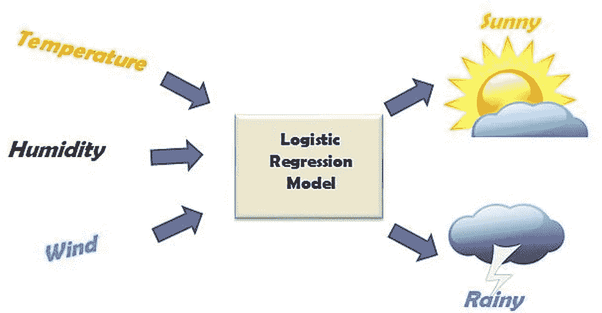

[https://images.app.goo.gl/SJpTK12BybL9eYDV9](https://images.app.goo.gl/SJpTK12BybL9eYDV9)

# 什么是回归？

回归是预测分析中最流行的监督学习算法之一。回归模型需要数据集中输出变量和特征变量的知识。

以下是线性回归问题的几个例子:

1.医院可能对发现患者的总治疗费用如何随患者体重而变化感兴趣。

2.餐馆想知道顾客下单后的等待时间和收入之间的关系。

3.亚马逊、big basket 等电子商务公司希望了解失业率、婚姻状况、银行账户余额、降雨量等变量的影响。论不良资产的百分比

4.保险公司希望了解医疗费用和老龄化之间的关系。

5.一个组织可能有兴趣发现产品产生的收入与价格、促销花费、竞争对手价格和促销费用等特征之间的关系。

# 监督学习

督导式学习顾名思义就是表示督导作为老师的存在。训练数据将由与正确输出配对的输入组成。在训练期间，算法将在数据中搜索与期望输出相关的模式。在训练之后，它将接受新数据，该新数据将基于先前的训练数据来确定新输入将被分类为哪个标签。动机是预测新输入数据的正确标签。可以写成 **Y=f(x)。**

# 逻辑回归

它是一种统计机器学习算法，用于对数据进行分类。当因变量是分类变量时，它可以被应用。逻辑回归的目标是根据数据之间的关系将数据分配到各自的类中。逻辑回归的方程式可以写成

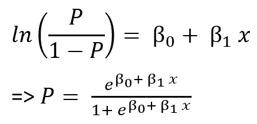

【https://images.app.goo.gl/oE1srjfA6NKVdqv5A 

由逻辑回归形成的图表通常呈“s”形，Y 轴上的值总是在 0 和 1 之间:

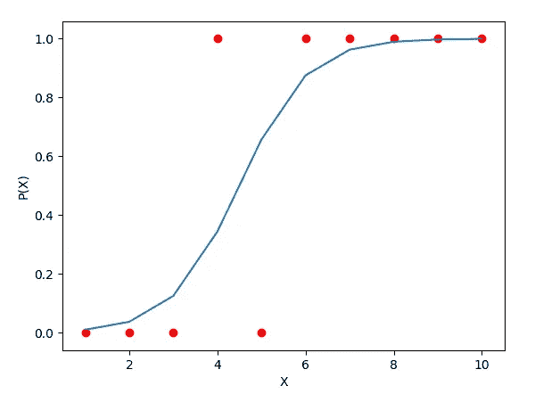

逻辑回归。

逻辑回归的例子包括:

1.假设我们对影响政治候选人是否赢得选举的因素感兴趣。结果(响应)变量是二进制的(0/1)；无论输赢。感兴趣的预测变量是花在竞选上的钱数、花在负面竞选上的时间以及候选人是否在职。

2.研究人员感兴趣的是变量，如 GRE(研究生考试成绩)，GPA(平均绩点)和本科院校的声望，如何影响研究生院的录取。响应变量“承认/不承认”是一个二元变量。

3.确定收到的电子邮件是否是垃圾邮件。

4.以确定银行贷款是否被批准。

5.不管肿瘤是不是恶性的。

我们有许多类型的逻辑回归，如:

## 1.二元逻辑回归

这是一种有两种结果的分类。例子包括收到的邮件是否是垃圾邮件。

## **2。多项式逻辑回归**

这是一种有两种以上结果的分类。例子包括汽车的价格是贵、中还是便宜。

## 3.有序逻辑回归

这是一种按顺序排列更多结果的分类，有序逻辑回归的一个例子是在 1-10 的范围内给幸福评分。

# 让我们编码:

**导入库**

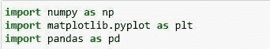

我只是导入了这个过程中需要的所有库

Numpy →这是一个用于处理数组的库。

Pandas →将数据文件作为 Pandas 数据框加载并分析数据。

Matplotlib →我已经导入 pyplot 来绘制数据的图形。

# 导入数据集

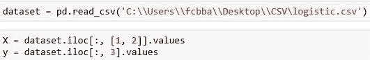

我们的文件是 CSV(逗号分隔值)格式，所以我们使用 pandas 导入文件。然后我们把数据分成因变量和自变量。x 被认为是独立的，Y 被认为是从属的。

# 训练装置和测试装置

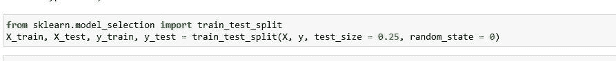

从 Sklearn 的子库 model_selection 中，我导入了 train_test_split，它用于分割训练集和测试集。我们可以使用 train_test_split 函数进行拆分。函数中的 test_size = 0.25 表示应该保留下来进行测试的数据的百分比。

# 特征缩放

当我们处理一个模型时，确保值在相同的范围内是很重要的，否则很难将它传递给模型。为了解决这个问题，我提出了特征缩放。它是一种将固定范围内的数据中存在的独立特征标准化的技术。这是在数据预处理期间执行的。

在我们的数据集中，我们有四个特征:

用户标识

年龄

收入

自己的房子

在这里，我们把年龄和收入作为自变量，把自己的房子作为因变量。在我们的独立变量中，年龄以十为单位，收入以千为单位，需要对这些变量应用特征缩放以获得最佳预测。

sci-kit 学习库提供了一个类来缩放我们的数据，我们可以从预处理中使用 StandaradScaler 类。我们从库中导入类，我们将为它创建一个对象。我们将利用 fit_transform 方法将独立变量的训练集和测试集转换到相同的范围内。

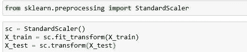

# 现在让我们来拟合数据

从子库线性模型 Sklearn 中，我们导入线性回归，并根据训练数据拟合模型。

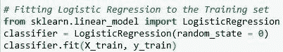

# 预测测试结果

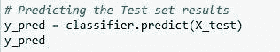

# 评估指标

简单地建立一个预测模型不是我们的动机。它是关于创建和选择一个模型，给出样本数据的高精度。因此，在计算预测值之前检查模型的准确性至关重要。我们将利用一种用于计算分类模型准确性的评估度量技术。下面详细讨论一下。

**混淆矩阵**

它是机器学习中分类模型的一种性能测量技术，其中输出具有两个或更多类别。这是一个包含实际值和预测值的四种不同组合的表格。

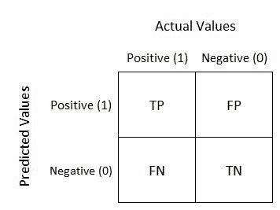

https://images.app.goo.gl/NZJ2YNoNUqiBFVZR8

让我们来理解混淆矩阵中的术语。

## 真阳性(TP)

如果实际值和预测值都是真的，那么就是真正。例如，你预测一个观察是一个苹果，观察是一个苹果。

## 假阴性(FN)

如果实际值为真，预测值为假，那么就是假阴性。例如，你预测一个观察不是一个苹果，但是观察是一个苹果。

## 假阳性

如果预测值为假，但实际值为真，则为假阳性。例如，你预测观察是一个苹果，但观察不是苹果。

## 真阴性(TN)

如果预测值为假，实际值也为假，则为真阴性。例如，你预测观察不是苹果，观察也不是苹果。

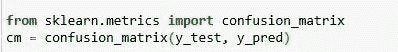

让我们从 metrics 类导入混淆矩阵并为其创建一个对象，然后我们将 y_test 和 y_pred 作为参数传递，以了解预测值的准确性。这里需要加上真正真负才能知道模型的表现。

下面是我所做工作的总结:我加载了数据，将数据分为训练集和测试集，应用标准的 scaler 方法将数据归一化到相同的范围内，将回归模型拟合到训练数据，基于这些数据进行预测，并在测试数据上测试预测。

# 使用 python 实现:

 [## saimanoj1234/SAI

### permalink dissolve GitHub 是超过 5000 万开发人员的家园，他们一起工作来托管和审查代码，管理…

github.com](https://github.com/saimanoj1234/SAI/blob/master/logistic%20%281%29.ipynb)