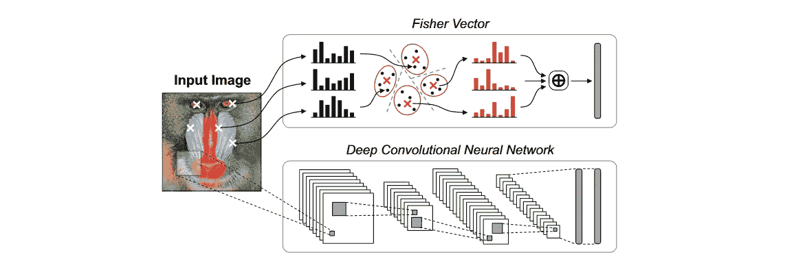
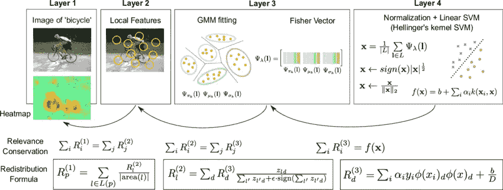
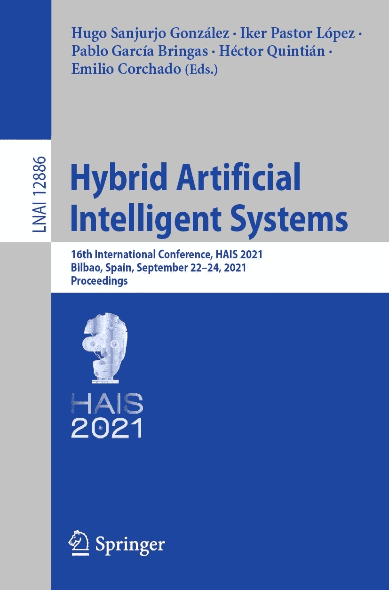

# 机器学习算法系列:带有 Python、Julia 和 R 代码示例的 Fisher 核算法

> 原文：<https://blog.devgenius.io/machine-learning-algorithm-series-fisher-kernel-algorithm-with-python-julia-and-r-code-examples-9445d32512dd?source=collection_archive---------12----------------------->


迈克尔·泽兹奇在 [Unsplash](https://unsplash.com?utm_source=medium&utm_medium=referral) 上的照片

Fisher 核算法是一种比较两组数据统计特性的方法，通常用于机器学习和模式识别领域。它由安德鲁·费希尔在 1936 年首次提出，此后成为机器学习领域的一个重要工具。它基于 Fisher 信息矩阵的思想，该矩阵测量一组随机变量包含的关于统计模型参数的信息量。Fisher 核算法用于通过构造核函数来比较两组数据的统计特性，核函数是两组数据之间相似性的度量。

# 内核函数是什么？

为了理解 Fisher 核算法，首先需要理解核函数的概念。核函数是采用两个输入向量并返回标量值的函数，标量值是两个向量之间相似性的度量。核函数通常用于机器学习算法中，以测量数据点之间的相似性，因为它们允许比较在其原始形式下可能不可直接比较的数据点。

# 什么是费雪信息矩阵？

Fisher 核算法使用基于 Fisher 信息矩阵的核函数。费希尔信息矩阵是一种矩阵，它度量一组随机变量包含的关于统计模型参数的信息量。它被定义为对数似然函数的 Hessian 矩阵的期望值的负值，它衡量对数似然函数在给定点的曲率。

Fisher 核算法的工作原理是构建一个线性分类器，通过在特征空间中找到一个使两个类之间的距离最大化的超平面，将数据分成两个类。这个超平面被称为 Fisher 线性判别式，它用于根据新数据点落在超平面的哪一侧来对它们进行分类。

Fisher 核算法的一个关键优势是其处理高维数据集的能力。它特别适用于维数远大于数据点数目的问题。

要使用 Fisher 核算法比较两组数据的统计特性，第一步是计算每组数据的 Fisher 信息矩阵。这是通过估计每组数据的统计模型的参数，然后在估计的参数下计算对数似然函数的 Hessian 矩阵来实现的。然后计算每组数据的 fisher 信息矩阵，作为 Hessian 矩阵的负矩阵。

一旦计算出两组数据的 Fisher 信息矩阵，下一步就是构造核函数。这是通过对一组数据的费希尔信息矩阵和另一组数据的费希尔信息矩阵求逆的乘积的迹来实现的。轨迹是矩阵的对角元素之和的度量，它在核函数中用于捕获两组数据之间的总体相似性。

然后，得到的核函数可用于比较两组数据的统计特性。例如，它可以在聚类算法中用作相似性的度量，或者在分类算法中用作距离度量。



Vijay Chandrasekhar，林杰，Olivier Morère，Hanlin Goh，Antoine Veillard，CNN 和 Fisher Vectors 用于图像实例检索的实用指南，信号处理，第 128 卷，2016 年，第 426-439 页，ISSN 0165-1684，https://doi.org/10.1016/j.sigpro.2016.05.021.

为了理解 Fisher 核算法是如何工作的，让我们考虑一个简单的例子。假设我们有一个包含两个类的数据集，A 类和 b 类。每个数据点都由一组特征描述，如身高、体重和年龄。我们希望使用 Fisher 核算法找到一个尽可能精确地分隔这两类的超平面。

为此，我们首先需要计算每个类的平均向量。平均向量就是每个类别的所有特征值的平均值。例如，如果 A 类具有特征值为`[5, 10, 15]`的三个数据点，B 类具有特征值为`[1, 2, 3, 4]`的四个数据点，那么 A 类的平均向量将为`[10]`，B 类的平均向量将为`[2, 5]`。

接下来，我们需要计算类内散布矩阵，它测量每个类内数据的散布。为此，我们取每个数据点与其类别的均值向量之间的差值，然后对这些差值求平方并求和。

最后，我们计算类间散布矩阵，该矩阵测量两个类之间的分离。为此，我们取两个类的平均向量之间的差，然后将该差乘以类内散布矩阵的逆矩阵。

然后，Fisher 核算法找到类间散布矩阵的特征向量和特征值。具有最大特征值的特征向量对应于两个类别之间具有最大间隔的维度。这些特征向量用于构建 Fisher 线性判别式，该判别式用于对新数据点进行分类。

# 代码示例

以下是用 Python 实现 Fisher 内核算法的代码示例:

```
import numpy as np

def fisher_kernel(X, Y):
  """
  Calculates the Fisher Kernel between two sets of data.

  Parameters
  ----------
  X : array-like, shape (n_samples, n_features)
      The first set of data.
  Y : array-like, shape (m_samples, m_features)
      The second set of data.

  Returns
  -------
  kernel : float
      The Fisher Kernel between X and Y.
  """

  # Calculate the Fisher information matrix for X
  X_params = estimate_parameters(X)
  X_hessian = calculate_hessian(X, X_params)
  X_fisher = -np.expect(X_hessian)

  # Calculate the Fisher information matrix for Y
  Y_params = estimate_parameters(Y)
  Y_hessian = calculate_hessian(Y, Y_params)
  Y_fisher = -np.expect(Y_hessian)

  # Calculate the kernel function
  kernel = np.trace(np.linalg.inv(X_fisher).dot(Y_fisher))

  return kernel
```

下面是一个在 Julia 中实现 Fisher 内核算法的代码示例:

```
using LinearAlgebra

function fisher_kernel(X, Y)
  # Calculate the Fisher information matrix for X
  X_params = estimate_parameters(X)
  X_hessian = calculate_hessian(X, X_params)
  X_fisher = -expected_value(X_hessian)

  # Calculate the Fisher information matrix for Y
  Y_params = estimate_parameters(Y)
  Y_hessian = calculate_hessian(Y, Y_params)
  Y_fisher = -expected_value(Y_hessian)

  # Calculate the kernel function
  kernel = trace(inv(X_fisher) * Y_fisher)

  return kernel
end
```

最后，这里有一个在 R 中实现 Fisher 核算法的代码示例:

```
fisher_kernel <- function(X, Y) {
  # Calculate the Fisher information matrix for X
  X_params <- estimate_parameters(X)
  X_hessian <- calculate_hessian(X, X_params)
  X_fisher <- -E(X_hessian)

  # Calculate the Fisher information matrix for Y
  Y_params <- estimate_parameters(Y)
  Y_hessian <- calculate_hessian(Y, Y_params)
  Y_fisher <- -E(Y_hessian)

  # Calculate the kernel function
  kernel <- trace(solve(X_fisher) %*% Y_fisher)

  return(kernel)
}
```

> 请注意，上面的代码示例只是为了说明 Fisher 内核算法的基本结构，并不打算成为功能完整的代码。您需要实现函数`estimate_parameters`、`calculate_hessian`和`expected_value`才能正常工作。



拉普什金，塞巴斯蒂安&宾德，亚历山大&蒙塔冯，格雷瓜尔&穆勒，克劳斯-罗伯特&萨梅克，沃伊切赫。(2016).分析分类器:费希尔向量和深度神经网络。2912-2920.2016.318。

总之，Fisher 核算法是一种强大的机器学习技术，特别适合高维数据集。它的工作原理是构建一个线性分类器，将数据分成两类。这个超平面被称为 Fisher 线性判别式，用于根据新数据点落在超平面的哪一侧来对它们进行分类。

# 阅读建议

[一个非参数的费希尔核](https://link.springer.com/chapter/10.1007/978-3-030-86271-8_38)



菲格拉郡，布林加斯郡(2021 年)。非参数 Fisher 核。载于:Sanjurjo González，h .，Pastor López，I .，García Bringas，p .，Quintián，h .，Corchado，E. (eds)混合人工智能系统。HAIS 2021。计算机科学讲义()，第 12886 卷。斯普林格，查姆。https://doi.org/[10.1007/978-3-030-86271-8 _ 38](https://doi.org/10.1007/978-3-030-86271-8_38)

[图像实例检索的 CNN 和 Fisher 向量实用指南](https://www.sciencedirect.com/science/article/abs/pii/S0165168416300846)

感谢您阅读本文！对于任何建议，请留下评论！

[Linkedin](https://www.linkedin.com/in/mertdemir0) [网站](https://www.mertdemir.org) [Github](https://www.github.com/mertdemir0)

电子邮件:info@mertdemir.org