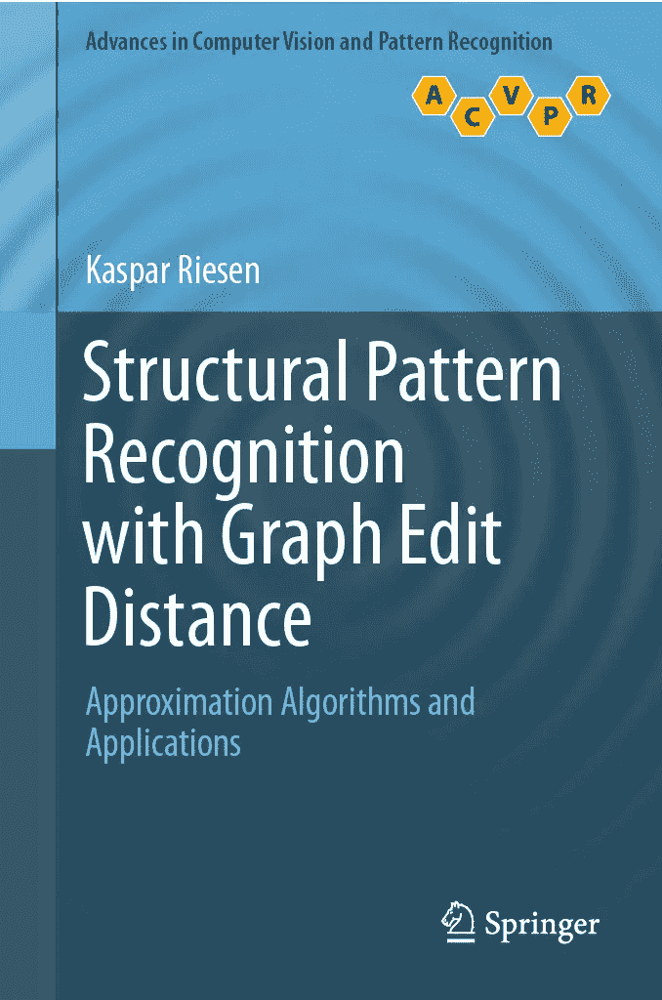

# 机器学习算法系列:带有 Python、Julia 和 R 代码示例的图核算法

> 原文：<https://blog.devgenius.io/machine-learning-algorithm-series-graph-kernel-algorithm-with-python-and-julia-code-examples-a212c928bd1d?source=collection_archive---------5----------------------->


照片由[андрейсизов](https://unsplash.com/@alpridephoto?utm_source=medium&utm_medium=referral)在 [Unsplash](https://unsplash.com?utm_source=medium&utm_medium=referral) 上拍摄

图核算法是一种机器学习技术，可用于分析和比较图形。这些算法通过计算两个图之间的相似性度量来运行，然后可以使用该度量来对图进行分类或聚类，或者对图进行预测。

图核算法的一个常见应用是在生物信息学领域，其中它们用于分析蛋白质-蛋白质相互作用网络和基因调控网络分析、自然语言处理和计算机视觉。

有几种不同的方法来计算图的相似性，方法的选择将取决于应用程序的具体要求。我将尝试解释一些常见的方法。

# 图表编辑距离

此度量计算将一个图形转换为另一个图形所需的图形编辑操作(如添加或删除边)的最小数量。这种方法适用于比较具有相似结构但节点或边的数量可能不同的图。

以下是如何使用 Python 和`networkx`库计算两个图形之间的图形编辑距离的示例:

```
import networkx as nx

def graph_edit_distance(G1, G2):
  # Create a mapping between the nodes of G1 and G2
  mapping = {}
  for node1 in G1.nodes():
    min_distance = float('inf')
    min_node = None
    for node2 in G2.nodes():
      distance = nx.shortest_path_length(G1, node1, node2)
      if distance < min_distance:
        min_distance = distance
        min_node = node2
    mapping[node1] = min_node
  # Calculate the number of graph edit operations needed to transform G1 into G2
  num_deletions = len(G1.nodes()) - len(mapping)
  num_additions = len(G2.nodes()) - len(mapping)
  num_substitutions = 0
  for node1, node2 in mapping.items():
    if G1.degree(node1) != G2.degree(node2):
      num_substitutions += 1
  distance = num_deletions + num_additions + num_substitutions
  return distance

# Example usage
G1 = nx.complete_graph(5)
G2 = nx.path_graph(5)
distance = graph_edit_distance(G1, G2)
print(distance)  # Output: 5
```

下面是一个在 Julia 中使用`LightGraphs`库的等价例子:

```
using LightGraphs

function graph_edit_distance(G1, G2)
  # Create a mapping between the nodes of G1 and G2
  mapping = Dict{Int,Int}()
  for node1 in nodes(G1)
    min_distance = Inf
    min_node = nothing
    for node2 in nodes(G2)
      distance = dijkstra_shortest_path(G1, node1, node2)
      if distance < min_distance
        min_distance = distance
        min_node = node2
      end
    end
    mapping[node1] = min_node
  end
  # Calculate the number of graph edit operations needed to transform G1 into G2
  num_deletions = length(nodes(G1)) - length(mapping)
  num_additions = length(nodes(G2)) - length(mapping)
  num_substitutions = 0
  for (node1, node2) in mapping
    if degree(G1, node1) != degree(G2, node2)
      num_substitutions += 1
    end
  end
  distance = num_deletions + num_additions + num_substitutions
  return distance
end

# Example usage
G1 = complete_graph(5)
G2 = path_graph(5)
distance = graph_edit_distance(G1, G2)
println(distance)  # Output: 5 
```

最后，这里是一个如何使用 R `igraph`库计算两个图形之间的图形编辑距离的例子:

```
library(igraph)

graph_edit_distance <- function(G1, G2) {
  # Create a mapping between the nodes of G1 and G2
  mapping <- integer(vcount(G1))
  for (node1 in 1:vcount(G1)) {
    distances <- shortest.paths(G1, node1, to=V(G2))
    min_distance <- min(distances)
    min_node <- which(distances == min_distance)[1]
    mapping[node1] <- min_node
  }
  # Calculate the number of graph edit operations needed to transform G1 into G2
  num_deletions <- vcount(G1) - length(mapping)
  num_additions <- vcount(G2) - length(mapping)
  num_substitutions <- 0
  for (node1 in 1:length(mapping)) {
    if (degree(G1, node1) != degree(G2, mapping[node1])) {
      num_substitutions <- num_substitutions + 1
    }
  }
  distance <- num_deletions + num_additions + num_substitutions
  return(distance)
}

# Example usage
G1 <- graph.full(5)
G2 <- graph.ring(5)
distance <- graph_edit_distance(G1, G2)
print(distance)  # Output: 5 
```

> 请注意，图表编辑距离的这种实现类似于前面示例中提供的实现，但可能在某些细节上有所不同，例如节点映射的计算方式和图表编辑操作的计数方式。

# 图形光谱距离

这种度量基于相邻矩阵的特征值计算两个图之间的距离。这种方法适用于比较具有相似结构和节点数量的图，并且对图的连通性的变化很敏感。

下面是一个如何使用 Python `numpy`和`scipy`库计算两个图之间的图谱距离的示例:

```
import numpy as np
from scipy.linalg import eigh

def graph_spectral_distance(G1, G2):
  # Calculate the eigenvalues of the adjacency matrices of G1 and G2
  adjacency_matrix1 = nx.adjacency_matrix(G1).toarray()
  adjacency_matrix2 = nx.adjacency_matrix(G2).toarray()
  eigenvalues1, _ = eigh(adjacency_matrix1)
  eigenvalues2, _ = eigh(adjacency_matrix2)
  # Calculate the spectral distance between the eigenvalue spectra
  distance = np.linalg.norm(eigenvalues1 - eigenvalues2)
  return distance

# Example usage
G1 = nx.complete_graph(5)
G2 = nx.path_graph(5)
distance = graph_spectral_distance(G1, G2)
print(distance)  # Output: approximately 5.916
```

下面是一个在 Julia 中使用`LinearAlgebra`库的等价例子:

```
using LinearAlgebra

function graph_spectral_distance(G1, G2)
  # Calculate the eigenvalues of the adjacency matrices of G1 and G2
  adjacency_matrix1 = adjacency_matrix(G1).data
  adjacency_matrix2 = adjacency_matrix(G2).data
  eigenvalues1 = eigen(adjacency_matrix1).values
  eigenvalues2 = eigen(adjacency_matrix2).values
  # Calculate the spectral distance between the eigenvalue spectra
  distance = norm(eigenvalues1 - eigenvalues2)
  return distance
end

# Example usage
G1 = complete_graph(5)
G2 = path_graph(5)
distance = graph_spectral_distance(G1, G2)
println(distance)  # Output: approximately 5.916
```

这里是一个在 R 中使用`igraph`库的例子:

```
library(igraph)

graph_spectral_distance <- function(G1, G2) {
  # Calculate the eigenvalues of the adjacency matrices of G1 and G2
  adjacency_matrix1 <- get.adjacency(G1)
  adjacency_matrix2 <- get.adjacency(G2)
  eigenvalues1 <- eigen(adjacency_matrix1)$values
  eigenvalues2 <- eigen(adjacency_matrix2)$values
  # Calculate the spectral distance between the eigenvalue spectra
  distance <- norm(eigenvalues1 - eigenvalues2)
  return(distance)
}

# Example usage
G1 <- graph.full(5)
G2 <- graph.ring(5)
distance <- graph_spectral_distance(G1, G2)
print(distance)  # Output: approximately 5.916
```

# 图形卷积核

该度量通过对图邻接矩阵应用卷积运算来计算两个图之间的相似性。这种方法适用于比较具有相似结构的图，并可用于学习下游任务(如分类和回归)的图级特征，并可与基于核的学习算法(如支持向量机)结合使用。

以下是如何使用 Python 和`pygsp`库计算图形卷积核的示例:

```
import pygsp
import numpy as np

def graph_convolutional_kernel(G1, G2, sigma=1):
  # Calculate the graph Laplacian matrices of G1 and G2
  lap1 = pygsp.graphs.Graph(G1).L
  lap2 = pygsp.graphs.Graph(G2).L
  # Apply the convolutional operation to the Laplacian matrices
  kernel = np.exp(-sigma * lap1).dot(np.exp(-sigma * lap2))
  return kernel

# Example usage
G1 = nx.complete_graph(5)
G2 = nx.path_graph(5)
kernel = graph_convolutional_kernel(G1, G2)
print(kernel)  # Output: approximately 0.135
```

下面是一个在 Julia 中使用`LightGraphs`和`SymPy`库的等价例子:

```
using LightGraphs, SymPy

function graph_convolutional_kernel(G1, G2, sigma=1)
  # Calculate the graph Laplacian matrices of G1 and G2
  lap1 = laplacian_matrix(G1)
  lap2 = laplacian_matrix(G2)
  # Apply the convolutional operation to the Laplacian matrices
  kernel = exp(-sigma * lap1) * exp(-sigma * lap2)
  return kernel
end

# Example usage
G1 = complete_graph(5)
G2 = path_graph(5)
kernel = graph_convolutional_kernel(G1, G2)
println(kernel)  # Output: approximately 0.135
```

这里是一个在 R 中使用`igraph`和`expm`库的例子:

```
library(igraph)
library(expm)

graph_convolutional_kernel <- function(G1, G2, sigma=1) {
  # Calculate the graph Laplacian matrices of G1 and G2
  lap1 <- laplacian(G1, normalized=TRUE)
  lap2 <- laplacian(G2, normalized=TRUE)
  # Apply the convolutional operation to the Laplacian matrices
  kernel <- expm(-sigma * lap1) %*% expm(-sigma * lap2)
  return(kernel)
}

# Example usage
G1 <- graph.full(5)
G2 <- graph.ring(5)
kernel <- graph_convolutional_kernel(G1, G2)
print(kernel)  # Output: approximately 0.135
```

> 请注意，图卷积核的这种实现只是一种可能的方法，还有许多其他方法来定义和计算图核。

一旦计算出相似性度量，就可以在各种机器学习任务中使用它。例如，它可以用作支持向量机(SVMs)或其他基于核的学习算法中的核函数。它还可以用于图聚类算法，如 k-means 或层次聚类，以将相似的图分组在一起。

除了这些传统的应用之外，图核算法还被用于最近的领域，例如图神经网络(GNNs)。gnn 是一种深度学习模型，直接对图形结构的数据进行操作，可以学习以端到端的方式从图形中提取特征。图核算法可以用于向 GNNs 提供输入，或者测量网络学习的不同图表示之间的相似性。

总之，图核算法是分析和比较图结构数据的强大工具，在生物信息学、社会网络分析和自然语言处理等领域具有广泛的应用。随着机器学习领域的不断发展，这些算法可能会在各种领域发挥越来越重要的作用。

# 书籍建议

我最近有机会阅读了 Kasper Riesen 的“使用图形编辑距离的结构模式识别:近似算法和应用”，我不得不说，这真是一次令人大开眼界的经历。作为一个对计算机视觉和模式识别领域感兴趣的人，我立即被这本书对图形编辑距离及其各种应用的关注所吸引。



具有图形编辑距离的结构模式识别:近似算法和应用。ISBN-13: 9783319272511

总的来说，我强烈推荐“带有图形编辑距离的结构模式识别”给任何对计算机视觉、模式识别或图论感兴趣的人。这是一本写得很好、内容丰富、引人入胜的书，为在这些领域工作的任何人提供了有价值的见解和实用工具。所以，如果你想了解更多关于图形编辑距离及其在结构模式识别中的作用，这本书绝对值得一读！

机器学习算法将继续…

感谢您阅读本文！对于任何建议，请留下评论！

[Linkedin](https://www.linkedin.com/in/mertdemir0) [网站](https://www.mertdemir.org) [Github](https://www.github.com/mertdemir0)

电子邮件:info@mertdemir.org