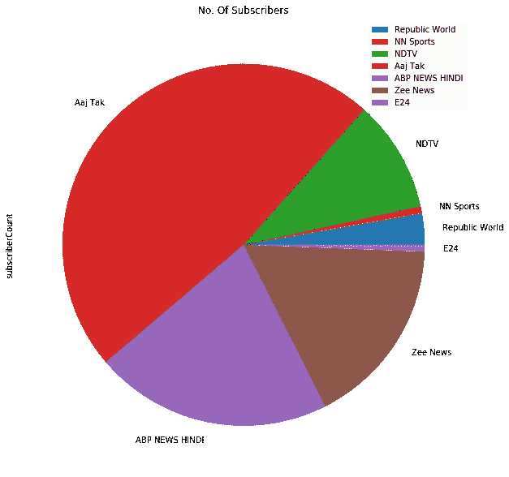
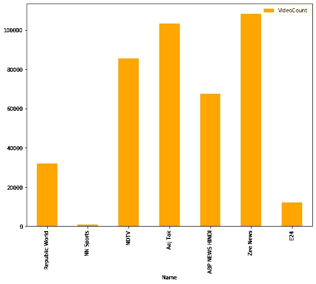
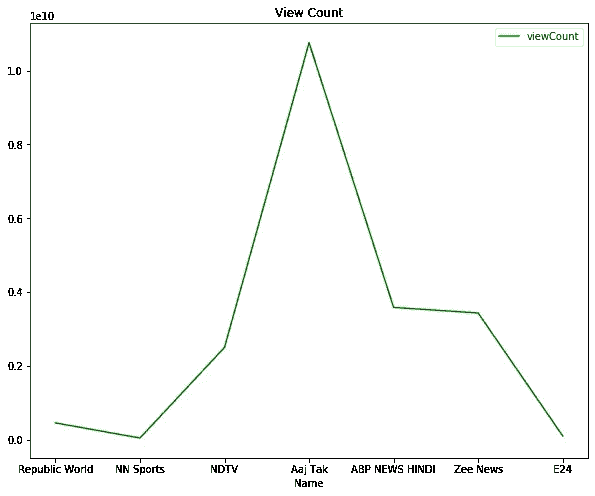

# 印度 YouTube 新闻频道数据集的机器学习

> 原文：<https://blog.devgenius.io/machine-learning-for-indian-news-channel-dataset-3fe1da8fc0fc?source=collection_archive---------1----------------------->

我们都长时间被锁在家里，时间长短因州而异，因国而异。娱乐在人类生活中起着重要的作用，因为人是一种社会性动物。不同的年龄组可以有不同的娱乐方式。由于电影院和公共集会完全关闭，呆在家里娱乐的选择有限。但另一方面，我们也很想知道与这个新冠肺炎相关的民族和国家正在发生什么。要了解这一点，最好的来源是新闻渠道。甚至我也学会了每天看新闻和头条新闻，这在我早期的日常生活中是不存在的。

在印度，新闻频道种类繁多。在这个数字世界里，每个新闻频道都创建了自己的 YouTube 平台来分享内容。有新闻频道提供全国新闻、州新闻、甚至地区新闻，也有不同风格的语言

所以，我应用了我的机器学习技能来研究印度最近的 YouTube 新闻频道，以及他们在此期间报道的最主要的话题。

我特别关注印地语新闻频道，因为它在整个国家广受欢迎。需要注意的重要一点是，数据集是 YouTube 视频，并从中提取数据。

让我们来看看十大新闻频道:

1.  阿依塔克

2.共和电视台巴拉特

3.泽新闻

4.总部新闻

5.新闻 18 印度

6.印度电视台

7.新闻 24

8.TV9 Bharatvarsh

9.新闻国家

10.印度 NDTV

我提取了上述所有新闻频道的数据，能够看到一些有趣的特征。让我和你们分享我从这些数据集中探索到的一切。

敏锐有趣的特点是

订户:AajTak 已经横扫了这个领域的大部分渠道

订户数量

2.视频数量:在这个领域，AajTak 和 Zee news 在各自的 YouTube 频道上的视频数量大致相同。

新闻频道的视频计数

3.浏览量:与其他网站相比，AajTak 的浏览量非常高。

观看次数

在下一篇博客中，我将展示这些新渠道在封锁期间涉及的最主要的话题。您可以将这些技术应用于不同的数据集，并了解它们的性能。

参考资料:

印度北印度语新闻频道[https://www . isrgrajan . com/10-best-Hindi-News-channels-of-India-in-2020 . html](https://www.isrgrajan.com/10-best-hindi-news-channels-of-india-in-2020.html)