# 机器学习基础:线性回归如何工作？

> 原文：<https://blog.devgenius.io/machine-learning-foundation-how-linear-regression-works-6d01b32436f7?source=collection_archive---------16----------------------->

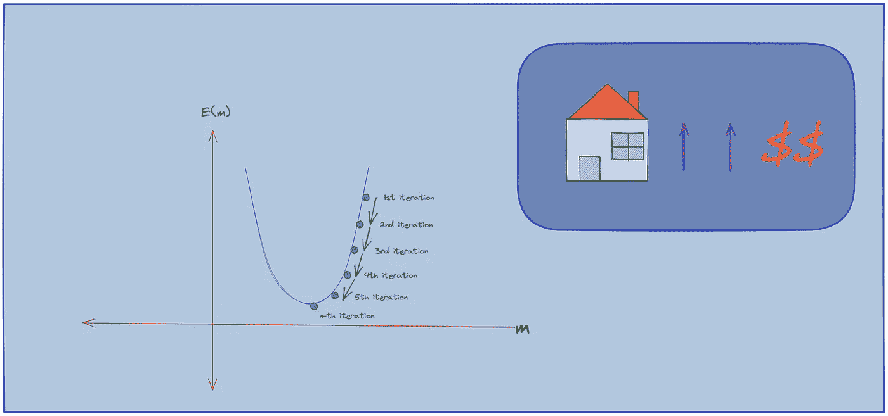

你有没有开过网店，得到过你想要的商品的推荐？或者说，你在 YouTube 上看视频的时候，有没有感觉 YouTube 总是在你的主页上展示你感兴趣的视频，好像它们知道你想要什么，需要什么？是的，他们有。YouTube 知道我们喜欢什么，不喜欢什么。YouTube 知道我们需要什么，不需要什么。Youtube 之所以有这样的“魔力”，是因为机器学习。

# 什么是机器学习？

什么是机器学习？简而言之，机器学习是允许机器(电子设备)进行“学习”的科学领域。在上面的 youtube 案例中，使用了机器学习，以便 youtube 能够学习其用户的行为。了解用户喜欢什么，不喜欢什么，了解用户需要什么，不需要什么，等等。了解[更多关于机器学习的信息](https://medium.com/nerd-for-tech/a-machine-that-think-like-a-human-e710e95ead00)。

# 是什么让机器学习变得重要？

让我们回到上面的 youtube 例子。YouTube 需要知道它的用户喜欢什么和不喜欢什么，以便能够提供相关的视频，符合用户意愿的视频。如果这行得通，那么用户就可以不间断地观看 youtube。此外，机器学习也很有用，以便 YouTube 可以向其用户显示相关广告，并通过他们的服务 Google Ads 实现收入最大化。这当然有利于 youtube 和那些使用谷歌广告的人。

在当今世界，机器学习已经影响了我们生活的许多方面。因此，机器学习成为一个非常有趣的讨论话题。在机器学习中，有各种各样的“神奇”算法，叫做模型。直到现在，已经有各种机器学习模型被应用来处理不同的问题。众所周知的机器学习模型之一是线性回归模型。

# 什么是线性回归？

在你看来，是什么让房子变贵了？是这个尺寸吗？房子的位置？使用什么类型的建筑材料？

一般来说，房子的面积越大，价格越贵。这是有道理的，考虑到房子的大面积需要更多的建材，所以房子的价格也更贵。房子的位置也影响价格。战略位置的房子往往更贵。比如离市中心越近的房子就越贵。所用材料的类型当然也会影响房子的价格。用的建材越贵，房子就越贵。

通常情况下，房子的大小和价格是线性关系。什么是线性关系？简单地说，如果 x 和 y 的值总是有一个恒定的比值，那么可以说变量 x 和 y 具有线性关系。如果 x 值增加，则 y 值也增加，如果 x 值减少，则 y 值也以恒定速率减少。我们称这种类型的关系为 x 和 y 之间的线性关系。如果当我们绘制变量 x 和 y 之间的值时，我们将得到一个直线图(线性)。

这就是线性回归这个术语的由来。在机器学习的一些问题中，我们看到有一些变量是具有线性关系的，比如房子大小和房价的关系，学习时间和考试成绩的关系等等。不完全是线性的，但是足够接近了。


问题是，如何利用这个线性性质来预测变量 x 的值？很简单。因为这些数据具有线性关系，所以我们可以创建一条能够代表几乎所有现有数据的线，这条线最适合这些数据点。这条线就是我们所说的回归线。这条回归线将是我们预测的结果。

基于这条回归线，如果变量 x 是已知的，我们可以使用直线方程来估计变量 y 的值。我们知道，直线的方程式是:

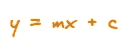

例如，上图中蓝色圆点上方的图像显示的是实际数据，而红色线条显示的是预测数据。没那么难。我们需要做的就是找到最合适的线来描述上图中的数据分布。但是，怎么做呢？

# 拟合回归线

如上图所示，红线(我们称之为回归线)并不完全接触所有现有的点，这意味着红线并不能正确预测**上方图中其他点的存在**。这一点非常清楚，因为数据并不是均匀分布形成一条完美的直线。即便如此，我们仍然可以通过**最小化误差来预测下一个数据 data。**

在这种情况下，误差是预测值和实际值之间的差异。误差函数这个术语就是由此而来的。误差函数是显示使用机器学习模型时产生多少误差的函数。最常用的误差函数公式是均方根误差(RMSE)函数。设 y_i 为 Y 在第 I 个数据点的值，Y_i 为 Y 在第 I 个数据点的预测值。那么线性回归模型的误差是:

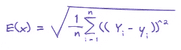

如果将回归线方程 y = mx + c 代入上述方程，则:

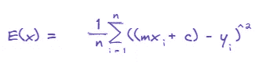

为了产生最适合数据的线，我们必须最小化误差函数值。通过最小化误差函数，我们的预测结果将更优。因为上式中的 m 和 c 是常数，其值是未知的，那么我们必须得到使误差最小的 m 和 c 的值。

> ***趣闻:*** *这个最小化误差的问题也被称为优化问题*

为了尽量减少错误，我们有两种方法可以做。第一种是普通的最小二乘法，第二种是梯度下降法。

# 普通最小二乘法

在普通的最小二乘法中，我们使用一个公式来计算 m 和 c 的值，该公式可以最小化回归线的误差。普通最小二乘法的公式为:

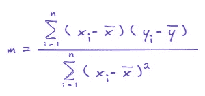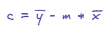

将 m 和 c 的值代入直线的一般方程，我们将得到最符合数据的回归线方程。有了这个回归线方程，不管后面 x 的值是多少，我们都能够预测 y 的值。

# 梯度下降法

你记得我们的目标是什么吗？我们的目标是得到 m 和 c 的值，使得误差函数值最小。基本上，梯度下降法不能用于存在的每一种形式的误差函数。应用梯度下降法有两个条件:

*   误差函数可以被微分
*   误差函数是凸函数

那么，什么是梯度呢？梯度是曲线在某一点的斜率。函数 f(x)在 x = c 点的梯度是函数 f(x)在 x = c 点的导数，梯度下降法的工作原理是用变量在对应点的梯度减去变量的值。让我们举一个例子来计算 m 的值。如果我们看看线性回归的误差函数的曲线，它将看起来像下面的曲线:

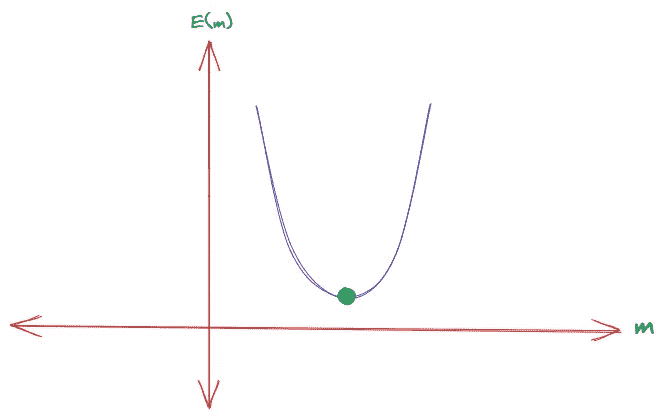

我们的目标是确定 m 的值，使得误差函数值最小。换句话说，我们必须确定函数 E(x)的最小全局值。全局最小值点是用绿色标记的点。我们如何到达那个点？方式是:

1.  在图上随机选择一个点
2.  用 E(x)在该点的梯度减去 m 在该点的值
3.  重复这个步骤，直到 m 的值变得恒定或者仅改变非常小的值。

在上面的步骤 2 中，最近的 m 值成为减去学习率和梯度的乘积的先前 m 值。目前，学习率可以理解为梯度函数的一个尺度。

以下是这些步骤的可视化:

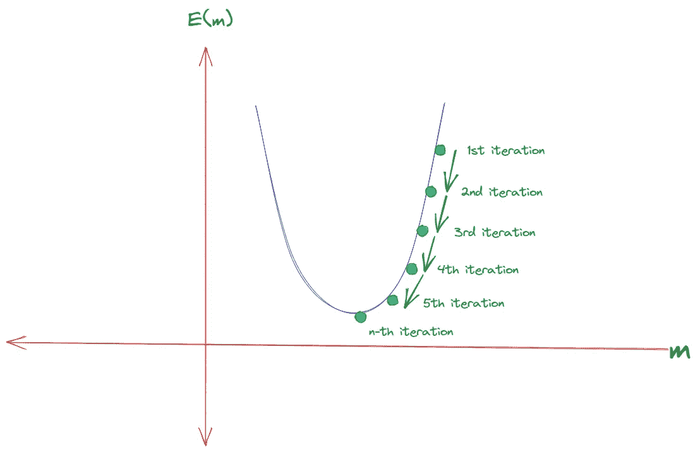

用这种方法，我们可以确定使误差函数最小的 m 值。同样的步骤我们可以用来确定 c 的值。通过将 m 和 c 的值代入直线方程，我们将得到回归线方程。

这是线性回归模型中的数学过程。但是，我们需要为每个机器学习项目从头开始构建一切吗？不会。Python 和各种其他编程语言提供了各种实现了所有数学过程的框架，这样我们就可以更专注于开发过程，而不用担心数学步骤。

> 让我们深入研究代码吧！

# 使用 Python 进行线性回归

为了使用 python 应用线性回归模型，我们可以使用各种框架，其中之一是 scikit-learn 或 sklearn。

正如我们所讨论的，有两种方法可以用于线性回归模型中的优化问题，即普通最小二乘法和梯度下降法。默认情况下，scikit-learn 线性回归模型使用普通的最小二乘法。

要使用 scikit-learn，我们必须首先使用 python 包管理器 pip 安装它。

```
pip install scikit-learn
```

下一步是使用 import 关键字导入 scikit learn 框架。

```
from sklearn.linear_model import LinearRegression
```

在 sklearn 框架中，有各种各样的机器学习模型可用，其中一种是线性模型。线性模型有许多实现方式，其中之一是线性回归。这也是我们从 sklearn.linear_model 导入 LinearRegression 模型的原因。

下一步是建立一个线性回归模型，我们将在后面使用。

```
model = LinearRegression()
```

记住，我们必须确定最符合可用数据的回归线。在对象模型上使用 fit()方法可以很容易地完成这个过程。默认情况下，该模型将使用普通的最小二乘法。

```
model.fit(x, y)
```

拟合过程完成后，我们可以使用 predict()方法预测 y 的值。

```
y_predict = model.predict(new_x)
```

y_predict 是 y 相对于 new_x 的预测值。

# 例子

作为在线性回归上实现 scikit-learn 的一个例子，我们将使用[这个数据集](https://github.com/fikrinotes/Datasets/blob/main/LinearRegression/xypairs.csv)。

首先，首先导入 pandas 库来查看和处理数据:

```
import pandas as pddata = pd.read_csv ("https://raw.githubusercontent.com/fikrinotes/Datasets/main/LinearRegression/xypairs.csv")
```

为了了解现有数据，我们可以使用以下命令:

```
data.head()
```

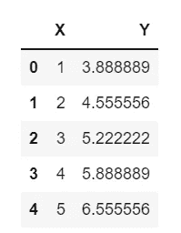

下一步是使用 scikit-learn 中的 linear regression 类构建一个线性回归模型:

```
model = LinearRegression()
```

然后，拟合步骤是确定常数 m 和 c 的最合适的值

```
model.fit(data[["X"]], data[["Y"]])
```

现在我们的模型已经可以使用了。假设我们想知道变量 x = data[["X"]]的 y 的近似值，那么:

```
y_pred = model.predict(data[["X"]])
```

y_pred 是数据的 y 的预测值[["X"]]。

如果我们希望看到 y 的实际值与我们得到的预测值的比较，我们可以通过使用 matplotlib 库绘制这两个值来实现。

```
import matplotlib.pyplot as pltplt.scatter(data.X[1:20], data.Y[1:20], s=2)plt.plot(data.X[1:20], y_pred[1:20], c = 'orange')
```

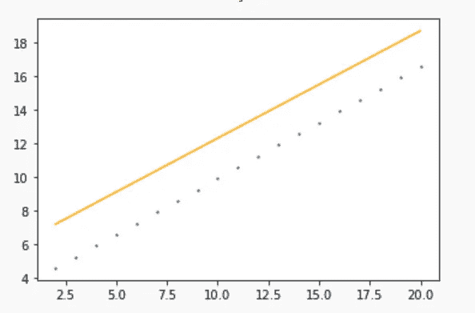

橙色线显示我们的预测结果，蓝色点显示实际数据。我们可能意识到的第一件事是，我们的预测结果并不十分准确。但是是什么让它不那么准确呢？

如果我们查看所有现有的数据，我们会发现有些数据的位置与周围的数据相距甚远。有一个异常现象。

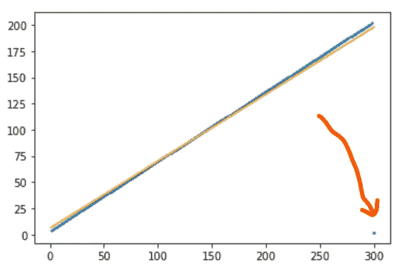

在数据科学中，类似这样的事情非常普遍。可能是因为输入数据时的错误、观察过程中使用测量单位时的错误等等。这足以增加我们的理解，即将用于机器学习模型的数据是原始数据，仍然需要首先进行处理和“清洗”。这个过程叫做**数据预处理**。我们将在下一篇文章中讨论关于数据预处理的问题，*再见！*