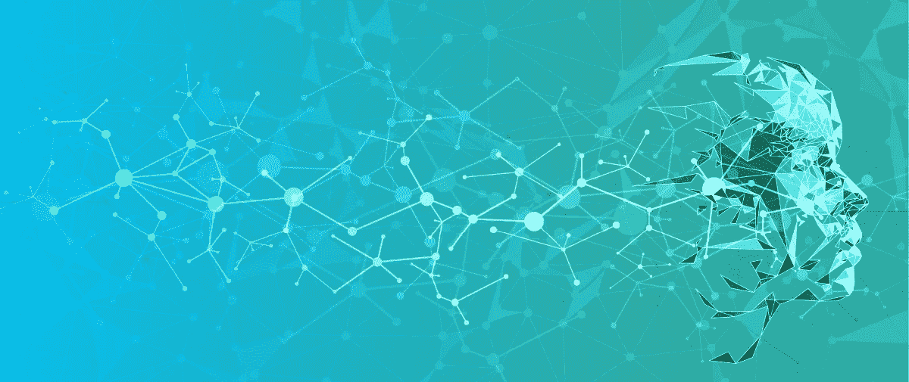

# 【机器学习 Higgs 1/3】深度学习🧿简介

> 原文：<https://blog.devgenius.io/machine-learning-higgs-1-3-introduction-to-deep-learning-ef4a337f0592?source=collection_archive---------13----------------------->

> **摘要**:深度学习是近年来备受关注的机器学习的一个子领域。这些算法已经成为跨越众多学科的最先进技术，在过去由于训练中的各种问题而被大量放弃。深度架构可以通过跨多个层构建分层抽象来学习表示数据集中存在的隐藏模式。最近的一些研究表明，深度学习技术在分析高能物理数据集方面优于传统模型。这些架构构建其输入的复杂内部表示的能力被认为具有巨大的实践和理论重要性。

机器学习最近抓住了公众的想象力，在亚马逊和谷歌等网站上有语音识别、计算机视觉、垃圾邮件过滤器和推荐引擎。可以想象，这只是冰山一角——机器学习就在我们身边。许多其他应用中的一些包括自动图像字幕、金融建模、自然语言处理、药物发现和信号处理。在这些领域中的许多领域中，最近的一系列成功可以归功于基于人工神经网络(ANN)架构的机器学习算法的子类。这些算法并不构成如何执行某项任务的一步一步的方法；相反，他们能够通过例子来学习。

人工神经网络已经存在很长时间了。这个领域的根源可以追溯到 1943 年麦卡洛克和皮茨的早期研究，当时他们发展了一种神经元的数学描述。然而，大多数引人注目的成功都是最近才取得的。那么，发生了什么变化？为了回答这个问题，我们需要引入这样一个概念，即这些人工神经网络的深度可以不同。传统上，只能训练由单一层组成的“浅层”网络。这是因为我们在本报告中将会遇到在训练他们的“深度”对应物方面的各种技术困难。最近，这些问题得到了解决，导致深度学习领域进入快速增长阶段。人工神经网络的一个子类，称为深度神经网络(DNNs)，已经在许多领域的基准测试中创造了新的记录，以至于无法一一命名。

那么，与传统的浅层架构相比，是什么让这些 dnn 如此特别呢？在这份报告中，我们将展示一些结果，证明它们在纯粹的数字意义上胜过肤浅的同行，但这不是真实的情况。传统的机器学习技术不能只从原始数据中学习，它们需要高素质工程师团队的帮助，才能将这些数据转化为合适的形式。只有转换成这些特殊的“特征向量”，原始输入的全部潜力才能实现。dnn 能够进行特征学习；它们不需要为它们构建特征向量。

他们是怎么做到的？在 DNNs 中，可以看到每一层都对前一层的输入进行数学抽象。这些抽象是输入的有用的内部表示，我们称之为“特征图”。每一层都构建自己的要素地图，放大有用的输入并抽取其他输入。有了这样的层，每一层都在前一层开发的基础上构建更抽象的表示，一些非常有趣的事情就成为可能。

理论结果表明，浅层神经网络可以学习表示任何连续函数——它们是通用函数逼近器。那么，为什么 dnn 如此适合特征学习呢？这个答案虽然很容易定性解释，但却很难严格证明。这一困难源于缺乏一个统一的理论框架来研究这些体系结构。文献中的大多数解释被迫从电路复杂性理论得出的相关架构的结果中进行归纳。我们将在以后探讨这些解释。

前面提到的必须为浅层结构构造有用的特征向量的问题是一个难题。就我们在研究中探讨的高能物理学而言，构建这些特征相对容易。这是由于我们对潜在的数学框架有详细的了解。这使得我们能够将碰撞中记录的运动特性组合成强大的特征向量。换句话说，我们能够使用标准模型和运动学方程来指导我们的手。

然后，考虑设计一个语音识别系统。我们构造的特征向量应该采取什么形式？人类语音的不变质量等价于什么？诸如此类的问题被证明是如此之难，以至于语音识别、物体检测和自然语言处理领域的专家们花了几十年时间来研究它们，结果却大多空手而归。有了训练深度架构的能力，这个头疼的问题就消失了。我们不再需要手动构建特征向量；网络可以在其内部表示中独立地发现它们。

**参考文献**

关于本文的参考资料，请参见[这篇文章](https://sebastian-mineev.com/article/2022/1/2/7.html)。

转自[我的个人博客](https://sebastian-mineev.com/)。