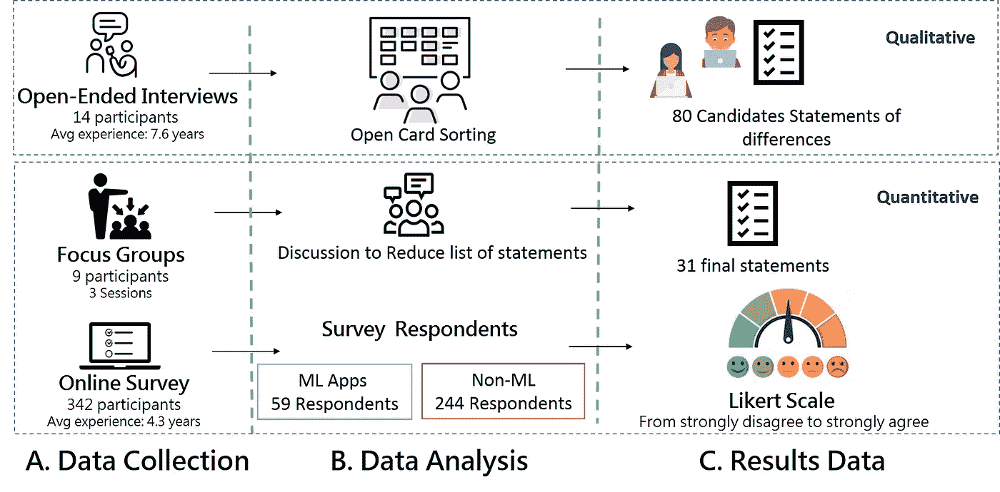
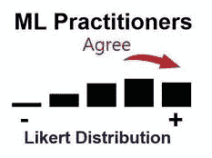
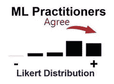
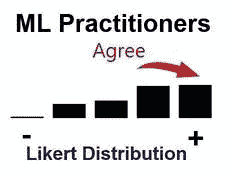
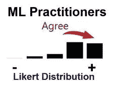
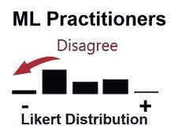
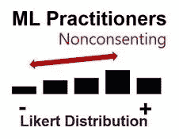
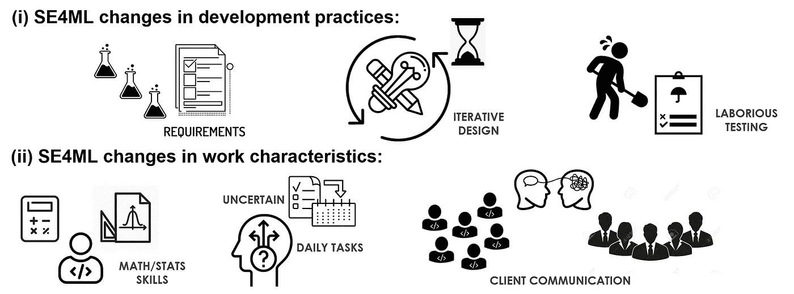

# 机器学习实际上正在改变软件工程实践

> 原文：<https://blog.devgenius.io/machine-learning-is-indeed-altering-software-engineering-practices-d4e37fd22bce?source=collection_archive---------2----------------------->

ML 已经被证明是 SE 的游戏规则改变者。一旦它被集成到一个软件项目中，开发人员必须适应所需技能和实践的实质性变化。

融入机器学习对软件工程的影响

像许多有 SE 背景的 ML 实践者一样，我在几个场合观察到支持 ML 的软件的开发过程与传统应用程序的开发过程有很大的不同。在阅读了一组 SE 研究人员最近发表的实证研究[1]后，我对自己早期的印象有了一个清晰的解释。事实上，这项令人着迷的研究工作彻底探索了机器学习如何影响软件开发实践，如设计和测试，以及工作的特点，如技能多样性和工作复杂性。

## 大规模定性和定量分析的混合

实证研究方法

首先，我将总结上述由万等人[1]所应用的方法，以导出在 ML 和非 ML 软件工程实践之间的差异的统计确认的陈述。

1.  在第一轮面试中，联系了 14 位在 ML 和非 ML 开发方面都有经验的高级软件专业人员，以汇集候选差异陈述的列表。在[开卡分类](https://www.usability.gov/how-to-and-tools/methods/card-sorting.html)之后，共有 80 条语句被保留用于后续步骤。
2.  在第二轮调查中，三个焦点小组讨论了保留的清单，将其减少到 31 条陈述，纳入调查。
3.  在最后一轮调查中，来自各种背景的数百名参与者按照五分制的李克特量表回答了每一项陈述，从完全不同意到非常同意。这将使得能够比较从不同组的回答者获得的每个陈述的李克特分布。

事实上，万等人[1]在 4 大洲 26 个国家招募了 342 名调查对象，包括多发性硬化症和非多发性硬化症人群，以增加他们推论的可信度。

基于最初的调查结果，在 ML 和非 ML 发展之间发现了 11 个显著差异。为了使这篇文章简洁易读，我将只评论 3+3 统计证实的关于 ML 和非 ML 软件在开发实践和工作特点上的差异的陈述。

## 开发实践:软件需求

> "收集**需求**涉及**大量**数量**的初步实验."**

为了定义软件需求，ML 开发者同意需要许多实验。这是指他们在数据样本上尝试一些机器学习算法以获得初步见解的阶段。虽然数据类型和学习任务通常会导致某些模型，但一些体系结构和超参数仍然可以进行实验评估。

## 开发实践:软件设计

> “详细设计**耗时**并且以**迭代的方式进行。”**

就软件设计而言，ML 实践者认为 ML 系统的详细设计通常是耗时、密集迭代过程的结果。根据前面的陈述，正在进行的实验对数据提供的反馈将持续影响未来改进的设计决策。

## 开发实践:软件测试

> “收集**测试**数据集是**劳动**密集型。”

最后但同样重要的是，ML 开发者同意收集测试数据需要很多努力。这可以通过以下事实来解释:大多数可用数据会影响 ML 系统的设计和开发，然后，一部分保留数据将用于测试。即便如此，ML 开发者通常只保留相对小部分的初始数据集，并且需要进一步的收集来评估 ML 系统的不同行为。Google 研究人员最近的一项工作[2]清楚地描述了欠规范管道问题，这是无关紧要的测试数据集最常见的问题。简而言之，DL 实践者提出了许多模型，这些模型在测试数据集上产生相同的性能，但是在部署设置下会有不同的行为。因此，在发布 ML 软件系统之前，拥有可靠的测试数据集是区分有效模型和无效模型的必备条件。

## 工作特点:技能多样化

> “开发我的软件**需要**数学**、**信息论**和**统计学**方面的知识**

为了实现机器学习算法并将其集成到软件系统中，开发人员必须理解 ML 模型中固有的数学。后者是采用随机和迭代优化过程的统计学习算法。Coursera 有一门由伦敦帝国理工学院提供的关于数学背后的有趣课程。

## 工作特征:任务认同

> “为我的软件的**开发任务**制定一个**精确的计划**是很容易的

****

**ML 开发人员不同意对开发任务有一个准确的计划。这种困惑来自于这样一个事实，即在高层次上，我们知道这些阶段是:收集和预处理数据，特征工程，构建 ML 模型，训练它们，调整它们的超参数，将它们的性能与保留的测试数据进行比较，等等。尽管如此，在低层次创建任务计划是困难的，因为通常下一个任务将基于前一个任务的结果来确定。**

## **工作特征:组织外的互动**

> **"开发我的软件需要**与**客户**的频繁沟通."****

****

**关于与客户频繁沟通的必要性，ML 开发者给出了不一致的答案。与强烈同意的非 ML 开发者相反。一个可能的解释可以在最大似然算法的内在复杂性中找到，以及解释它们的成功和失败的困难。ML 从业者通常通过推迟客户沟通来应对这些挑战，直到能够提供像样的解释并谈论来自生产前测试的真实结果。**

# **整体视觉摘要**

****

**在 SE 开发实践和工作特征中，ML 引起的变化的直观总结**

**你一路走到了最后。我猜你要么是 ML 从业者，要么是软件开发人员。如果您同意或不同意差异的陈述，请告诉我们。谢谢:)**

# **参考**

**[1] Wan，z .，Xia，x .，Lo，d .，& Murphy，G. C .，机器学习如何改变软件开发实践？(2019)， *IEEE 软件工程汇刊*。**

**[2] D'AMOUR，Alexander，HELLER，Katherine，MOLDOVAN，Dan，*等*欠指定对现代机器学习的可信度提出了挑战。(2020)， *arXiv 预印本 arXiv:2011.03395* 。**