# 混凝土抗压强度的机器学习模型

> 原文：<https://blog.devgenius.io/machine-learning-models-for-concrete-compressive-strength-4156be70b80b?source=collection_archive---------8----------------------->

***摘要——针对传统估计方法的不足，提出了一种新的估计方法。在这种方法中，使用非线性回归和优化技术进行抗压强度估计。***

# 1.介绍

混凝土的基本强度是通过对仍在施工的建筑物中的湿混凝土取样进行测试而确定的。这里的目的是测量混凝土的抗压强度并确定其使用寿命。在抗压强度测试中，借助于压力压制装置，在没有冲击的情况下，以不变的值向具有特定尺寸(15/30 cm 圆柱体或 20×20 立方体)的样品施加压力。一直持续到样品断裂，该过程在断裂时停止，通过将导致样品断裂的力的大小与横截面积成比例来确定抗压强度，其中样品的横截面积已经在之前找到。这些值根据结构的需要而不同。每个结构中混凝土具有一定的必须满足的抗压强度值。例如水坝、独立式房屋、桥梁、道路、工业楼层。这些数值对建筑工程至关重要，因为混凝土是建筑工程最基本的构件。对采集的样本进行各种测试。这些实验需要很长时间来进行，并且需要大量的实验室设备。因此，这是一种成本高昂的方法。它也容易出现人为错误，因此，已经很长的实验时间可能会更长。因此，生产会出现延迟。这里需要做的是，我们在制备混凝土时使用的材料及其数量是确定的，因此，我们可以通过查看过去的混凝土含量和抗压强度测试来估计新混凝土中的混凝土抗压强度。

研究中，对 17 个不同实验室的 1030 个混凝土强度数据进行了 SVM、决策树、线性回归、人工神经网络等分析。方法和作为用这些方法进行的估计的结果；比较一致性和估计精度。在文献中已经观察到，人工神经网络和决策树模型被广泛用于混凝土抗压强度的估计。

# 2.混凝土抗压强度

## *A .为什么使用混凝土抗压强度测试？*

作为单轴，混凝土材料抵抗相关标准中规定的压缩载荷的能力称为混凝土的抗压强度。换句话说，它被定义为承受轴向压缩载荷的混凝土结构中出现的最高压力。根据另一个定义，它被称为混凝土抵抗断裂和形状差异的能力，这种能力可能是由混凝土中形成的负载量引起的。压力一直持续到第一次破裂。当钢筋混凝土结构构件承受载荷时，它必须承受诸如压力、拉伸、剪切等载荷。在混凝土的机械强度中，混凝土材料的抗压强度是最大的，也是最重要的。因此，混凝土通过抗压强度测试用于建筑。

## 测试是如何进行的？

在工程师的陪同下，使用不同的原材料组合创造出小型混凝土圆柱体。测试这些圆柱体的强度随每种原材料的变化而变化。测试钢瓶的建议等待时间是 28 天。为了获得正确的结果，应注意标准中规定的时间。在土耳其，混凝土抗压强度测试和等级是根据 TS500 标准获得的。

## *C .这有什么问题吗？*

为了获得准确的结果，建议等待 28 天。这太花时间了。需要大量的人力和设备来准备和测试不同的实验原型。此外，这种方法容易出现人为错误，一个小错误就可能导致等待时间显著增加。等待时间也可能成为下一次生产的障碍。这些等待时间导致商业计划的延迟。

有一些方法可以减少等待时间和尝试的组合数量。其中之一是尝试使用机器学习模型来准确估计混凝土抗压强度。这里的重点将是提供计算机已知的数据，并利用数字模拟，其中机器学习模型尝试不同的组合来预测抗压强度。这样可以减少可以物理测试的组合数量，减少实验所需的时间。但是要设计这样一个模型，我们需要知道所有原材料之间的关系，以及一种材料如何影响结果。有可能推导出数学方程，并根据这些方程进行模拟，但我们不能期望现实世界中的关系是相同的。此外，这些测试已经执行了很多次，我们有足够的真实数据可以用于预测建模。

## *D .混凝土的成分(输入变量)*

这种特性影响混凝土的质量。同时，这些特征也是模型输入变量。

*水泥(kg 量以 1m3 计)，是一种以石灰石和粘土为主要原料，用作矿物块(砂、砾石、砖、煤饼等)粘结剂的材料。).为了使水泥达到这种粘合性能，水是绝对必要的。水泥是一种粘合剂，与水反应后会变硬。*

****高炉渣(kg 量以 1m3 计)*** ，是钢铁厂高炉炼铁过程中释放的副产品。高炉矿渣通过急冷造粒，然后研磨。这种研磨材料可以添加到水泥中，也可以单独用于混凝土中。*

***它是一种添加剂材料，本身几乎没有粘合性能，通过与熟石灰的化学反应获得水硬性粘合性能。***

****水(kg 量以 1m3 计)，*** 是使混凝土拌合物达到所需稠度和强度的物质。*

****超塑化剂(kg 量以 1m3 计)*** 塑化剂，增加被添加物质的可塑性或流动性的添加剂。它们通常用于塑料、水泥或混凝土混合物中。*

****粗细骨料(kg 量以 1m3 计)，*** 是一定尺寸的石料、天然石料或碎石块。骨料的结构、尺寸、形状、物理和化学结构根据混合物(混凝土、沥青等)的预期性能进行选择。)它们将被合并到其中。通过用水泥相互粘合，它形成了坚硬致密的物质，并构成了混凝土体积的 60-80%。直径在 0-6 毫米之间的细骨料(天然和人工砂)。6≁63mm 厚(碎石和碎石)骨料。*

****龄期(1–365 天)；***自混凝土拌合物生成后的天数。*

## **E .数据集信息**

*数据集由 1030 个实例组成，具有 9 个属性，没有缺失值。有 8 个输入变量和 1 个输出变量。七个输入变量代表原材料的数量(以 kg/m 计量),一个代表龄期(以天计)。目标变量是混凝土抗压强度，单位为兆帕(MPa —兆帕)。我们将研究这些数据，看看输入特征是如何影响抗压强度的。*

*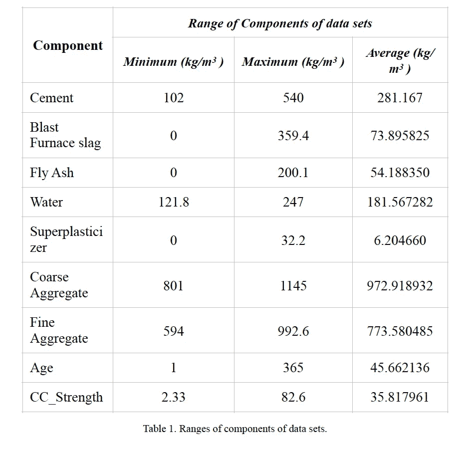*

# *3.文学中的类似研究*

*在文献中已经观察到，人工神经网络被广泛用于混凝土抗压强度的估计[1]-[2]。Yeh [1]指出，人工神经网络可以作为一种有效的方法用于混凝土强度的估计，并且人工神经网络可以获得比回归分析高得多的估计成功率。Fazel-Zarandi 等人[3]提出了一种由模糊神经网络和多项式神经网络组合而成的模糊多项式神经网络模型，用于预测混凝土强度。Cheng 等人在[4]中，遗传加权金字塔操作树(GWPOT)，它是由遗传算法、加权操作结构和金字塔决策树(GWPOT)组成的遗传决策树，HPC 压力执行耐力估计。将所开发的模型与人工神经网络、SVM 和进化支持向量机推理模型(ESIM)进行了比较，结果表明取得了更好的结果。*

*文献中对混凝土强度预测最全面的研究是 Chou 等人的研究[5]。5 种不同的机器学习方法；采用人工神经网络、SVM、多元回归分析和 2 种不同的组合学习模型(多元可加回归树和 bagging 回归树)对高性能混凝土的抗压强度进行预测，并对预测结果进行比较。作为研究的结果，强调了组合学习模型的预测成功的优越性。*

*在本研究中，使用线性回归、决策树、随机森林等进行回归分析。，各种机器学习模型。用各种参数检验了它们的准确性，并对结果进行了比较。然后，分配根据混凝土强度(混凝土抗压强度)确定的混凝土等级，并根据这些等级使用分类模型。*

# *4.培训和测试比较*

*在本节中，将检查所使用的模型和测试结果。通过上述模型，对数据进行了训练，并进行了各种测试。这些测试得出了一些结论。在进行这些推断时，会考虑领域信息。否则，由于不合逻辑的输入，可能会导致错误的估计。首先，检查数据集信息。在这里，检查是否有缺失、异常或不正确的数据。然后，为所有特征绘制图形。从这些图中，检查特征是否是预期的，以及它们是否来自它们的正态分布。未发现任何错误、异常或缺失。所有的属性都是由连续变量组成的。找不到分类变量。当查看数据摘要时，使用了标准的定标器，因为一些特征在数值上存在差异。*

*为什么要在拟合 ML 模型之前进行标准化？以不同比例测量的变量对模型拟合和模型学习功能的贡献并不相等，最终可能会产生偏差。因此，为了处理这一潜在问题，通常在模型拟合之前采用特征标准化方法(μ=0，σ=1)。*

*在训练机器学习模型之前，数据被分成训练数据和测试数据。可以对属性进行重新缩放，使其具有零平均值和 1 个标准差，这意味着所有特征都落在同一范围内。在准备好数据后，我们可以对训练数据拟合不同的模型，并比较它们的性能，选择性能良好的算法。由于这是一个回归问题，我们可以使用 RMSE(均方根误差)和 R 分数作为评估指标。混淆矩阵用于分类问题，并根据 f1 评分进行比较。分类模型用于具体的类。比较回归模型后，根据标准通过观察混凝土抗压强度确定混凝土等级。此处指定的标准为 TS500，在土耳其有效。例如；对于 C30 级的混凝土，抗压强度可以至少为 27.5Mpa，最多为 32.5MPa。这样，在划分等级后，目标变量被分类。更多详细信息，请参见表 2。*

*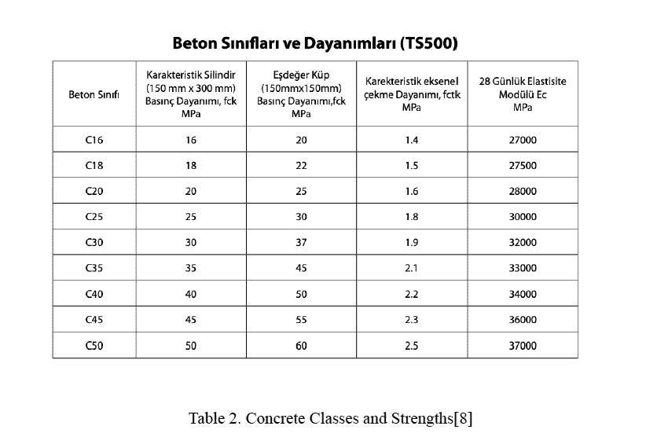*

*简要总结用于预测回归模型成功的值；*

****均方根误差(RMSE)*** 是残差(预测误差)的标准差。残差是距离回归线数据点有多远的度量；RMSE 是这些残差分布情况的量度。换句话说，它告诉您数据在最佳拟合线周围有多集中。*

****均方误差(MSE)*** 衡量拟合直线与数据点的接近程度。对于每个数据点，计算从该点到曲线拟合上相应 y 值的垂直距离(误差)，并将该值平方。*

****平均绝对误差(MAE)*** 衡量一组预测中误差的平均幅度，而不考虑它们的方向。它是测试样本上预测与实际观察之间的绝对差异的平均值，其中所有单个差异的权重相等。*

****R 平方*** 是一种统计度量，表示回归模型中一个或多个自变量解释的因变量的方差比例。*

## **一、线性回归**

*通过对代价函数使用正则化项，可以进一步控制回归问题方程中系数的大小。通过将系数的量值相加，旨在使系数接近零，这种线性回归变化称为套索回归。将系数的平方和与成本函数相加，可确保系数在同一范围内，这种变化称为岭回归。这两种变化都有助于降低模型的复杂性，降低过拟合的可能性。*

*如果预测值和目标值相等，散点图上的点将位于一条直线上。这种情况可以在图 4 中观察到。正如我们在这里看到的，无法非常准确地预测模型的抗压强度。这可能是因为预测模型试图对其进行线性拟合。这是线性回归的一般问题。它是在描述线性回归时提到的。*

*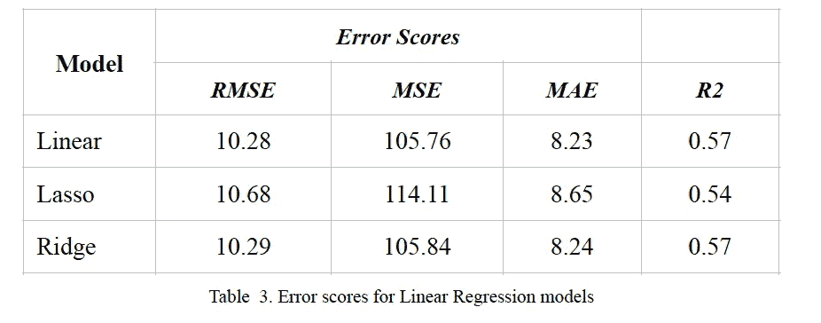**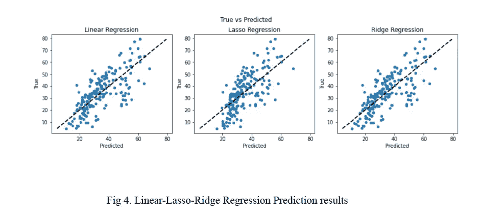*

*如果我们查看表 3 中的错误分数，我们可以观察到模型之间没有太大的差异。在这种情况下，我们将研究其他模型。*

## **B .决策树**

*误差基本上是预测值与数据集的实际值之间的距离。如果我们查看图 5 中的误差值，可以看出它比线性回归给出的结果更好。如果我们根据该图查看表 4 中的结果，我们可以观察到它同样成功。*

**

*在这种情况下，我们可以对此发表一些意见。从我们之前制作的成对图中的分布可以看出，在一些输入属性中有许多零。这将有助于决策树基于某些条件构建能够进一步提高性能的特征树。我们可以观察到，估计值更接近预期线。*

*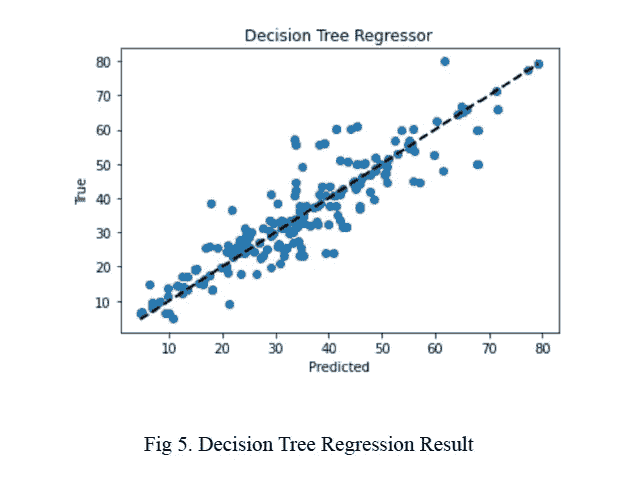*

*在图 6 中，考察了模型输入的重要性顺序，可以观察到上述水泥、水和湿输入对抗压强度的影响大于其他输入。由此可以推断，现实中就是这样。影响混凝土强度的最重要因素是水泥/水比。该比率应处于最佳水平。用水或水泥过多或过少都会降低混凝土的强度。从这里的特性重要性表中，我们可以说这种情况已经存在。此外，年龄因素也是最重要的。混凝土的强度日益提高。混凝土在第 7 天达到其强度的 65%，在第 28 天达到其强度的 99%。换句话说，我们可以从这里观察一天在混凝土强度方面有多重要。*

*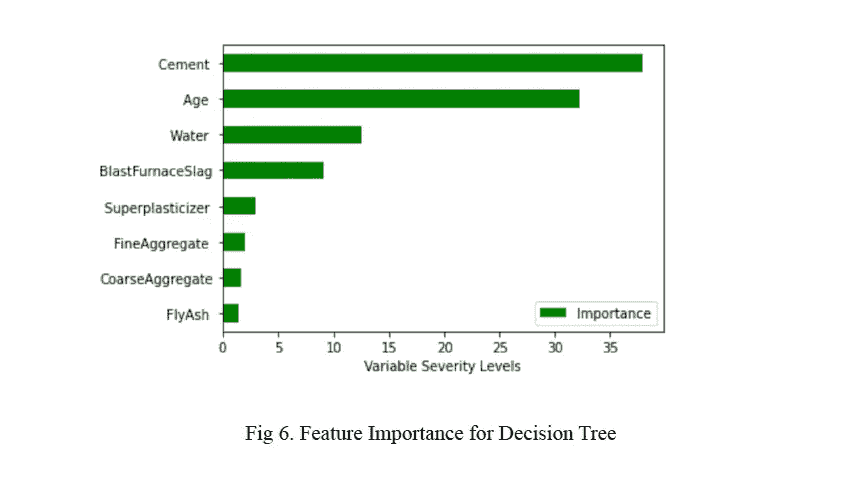*

## **密林**

**

*虽然在之前的标题中决策树的 RMSE 值是 6.60，但是可以观察到在随机森林模型中 RMSE 值降低到 5.12。在这种情况下，可以说随机森林模型比决策树模型预测得更好。这是因为随机森林模型由多个单独的树组成，每个树都基于训练数据的随机样本。除此之外的所有推论都将与决策树中的相同。*

*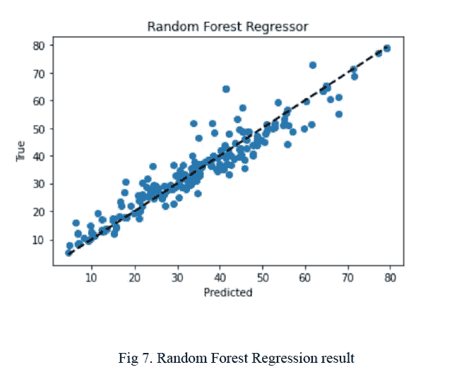*

*类似于决策树，我们可以观察输入的重要性顺序(图 8)。然后可以仅使用这些输入来重新训练该模型。这些特征可用于进行特征选择。用 4 个高变量对其进行了重新建模，但结果值没有观察到太大差异。这些变量是龄期、水泥、水、高炉矿渣。*

*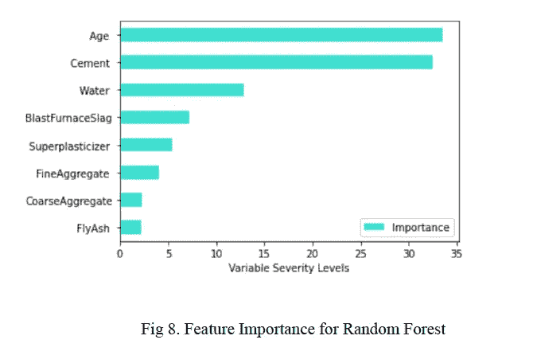*

*还使用了支持向量回归和 KNN 算法。查看表 7 中的结果，可以发现结果差别不大。根据决策树和随机森林模型，它们表现得非常糟糕。*

*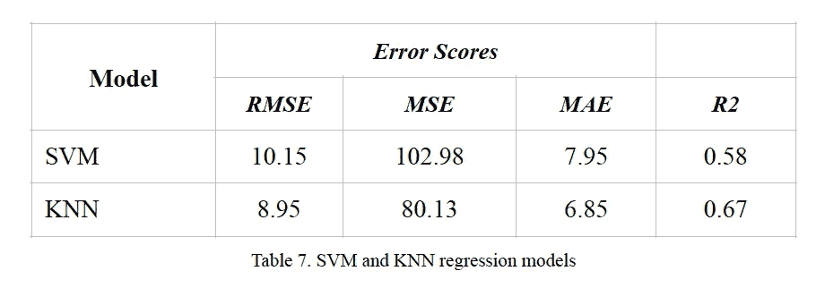*

*还使用了 XGBooster 算法，与其他算法相比，结果似乎更好。可以说，之所以会这样，是因为 XGBooster 使用了 Boosting，即把弱学习者转化为强学习者的方法。它通过迭代递增地实现这一点。其目的是从错误中学习并接近正确的猜测。结果见表 8。*

**

*后来也用了人工神经网络算法。根据结果，检查模型是否可以通过调整获得更好的结果。已经观察到了小的改善。观察到用默认参数训练的模型的分数是 0.853。然后，使用 GridSearchCV 库，尝试在以下参数中找到最成功的模型。根据从这里返回的最佳参数再次训练模型，这次观察到的得分为 0.875。*

## **车型对比:**

*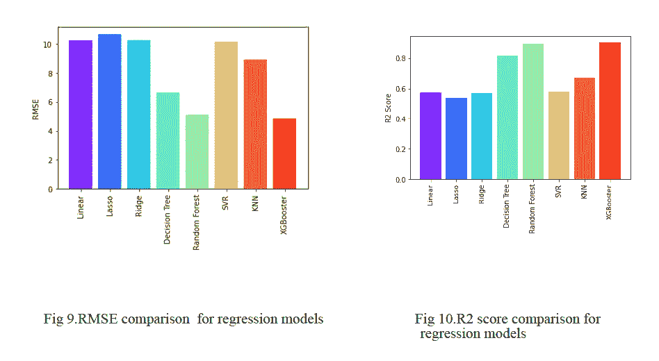*

*可以使用不同的统计标准来比较所用方法的性能。MAE、RMSE 和 R2 是基于平均误差概念的广泛使用的度量标准。R2 是变量之间的关系水平，如果关系水平在 0-0.25 之间，可以解释为非常弱，如果 0.26-0.49，则为弱，如果 0.50-0.69，则为中，如果 0.70-0.89，则为高，如果 0.90-1.00，则为非常高。*

*在这里，我们可以观察到回归模型彼此接近，并且低于其他模型。我们可以说，R2 分数越高的算法越成功。XGBooster 在查看其他模型时做出了更好的预测。我们还可以在决策树和随机森林算法中观察到接近 XGBooster 的结果。*

## **分类器模型**

*迄今为止使用的模型是回归模型。在这里，具体的类别是根据具体的优势创建的。混凝土的等级是根据抗压强度值确定的。您可以在表 2 中看到这些值。eg；对于 C30 级混凝土，抗压强度可至少为 27.5Mpa，最多为 32.5MPa。根据此信息，安排输出变量并使用分类算法。*

*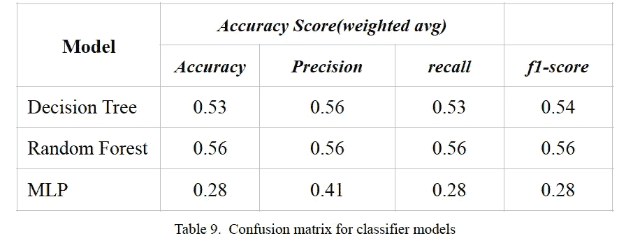*

*已经使用了具有各种模型的分类算法，但是没有获得非常成功的结果。对表 9 中的特征树、随机森林和 MLP 分类器模型进行了评估和比较。当检查精确度、召回率和 f1 分数值时，可以看出不能做出非常成功的预测。*

# *5.结论*

*成分的正确组合对于获得高质量的混凝土混合物非常重要。可靠性和耐久性是建筑工程中不可妥协的因素。使用机器学习模型，我们能够看到混凝土混合成分对抗压强度的重要性。随机森林模型表明，水泥、混凝土龄期和水是影响抗压强度的主要因素。混凝土工程中的一个重要因素是水灰比。在随机森林和决策树模型中，我们可以清楚地观察到输入的重要性。*

*我们分析了抗压强度数据，并使用机器学习来预测混凝土的抗压强度。我们使用了线性回归及其变体、决策树、随机森林、SVM、KNN、XGBooster、ANN 来进行预测，并比较了它们的性能。XGBooster 回归器的 RMSE 最低，是解决这个问题的好选择。此外，我们可以通过执行网格搜索或随机搜索来调整超参数，从而进一步提高算法的性能。*

# *参考*

*[1]叶 IC。“用人工神经网络模拟高性能混凝土的强度”。水泥和混凝土研究，28(12)，1797–1808，1998。*

*[2]可汗米。“使用人工神经网络预测含复合胶凝材料的高性能混凝土的性能”。建筑自动化，22，516–524，2012。*

*[3]法泽尔-扎兰迪 MH，图尔克森 IB，索巴尼 J，拉梅扎尼安普尔 AA。“混凝土抗压强度近似值的模糊多项式神经网络”。应用软计算，8(1)，488–498，2008。*

*[4] Cheng MY，Firdausi PM，Prayogo D .“利用遗传加权金字塔运算树(GWPOT)预测高性能混凝土抗压强度”。人工智能的工程应用。29, 104–113, 2014.*

*[5] Chou JS，Chiu CK，Farfoura M，Al-Taharwa I .“根据数据挖掘技术的比较优化混凝土抗压强度的预测精度”。土木工程计算杂志，25(3)，242–253，2011*

*Github 上的笔记本链接:[https://github.com/okanexe/artifical-intelligence-project](https://github.com/okanexe/artifical-intelligence-project)*