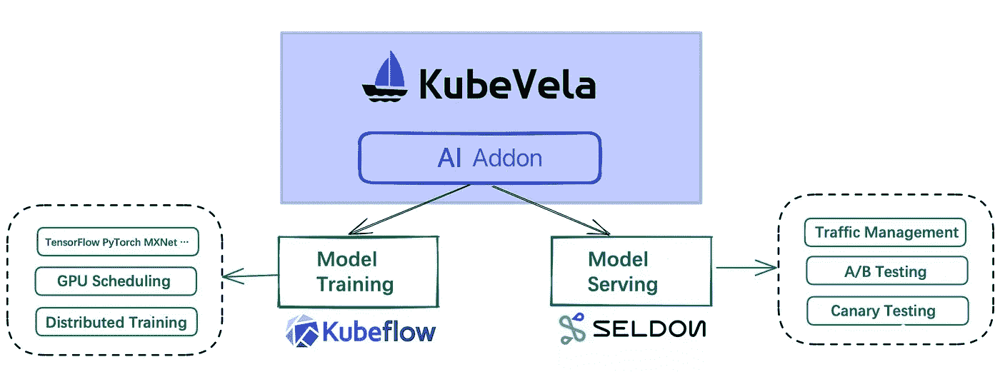
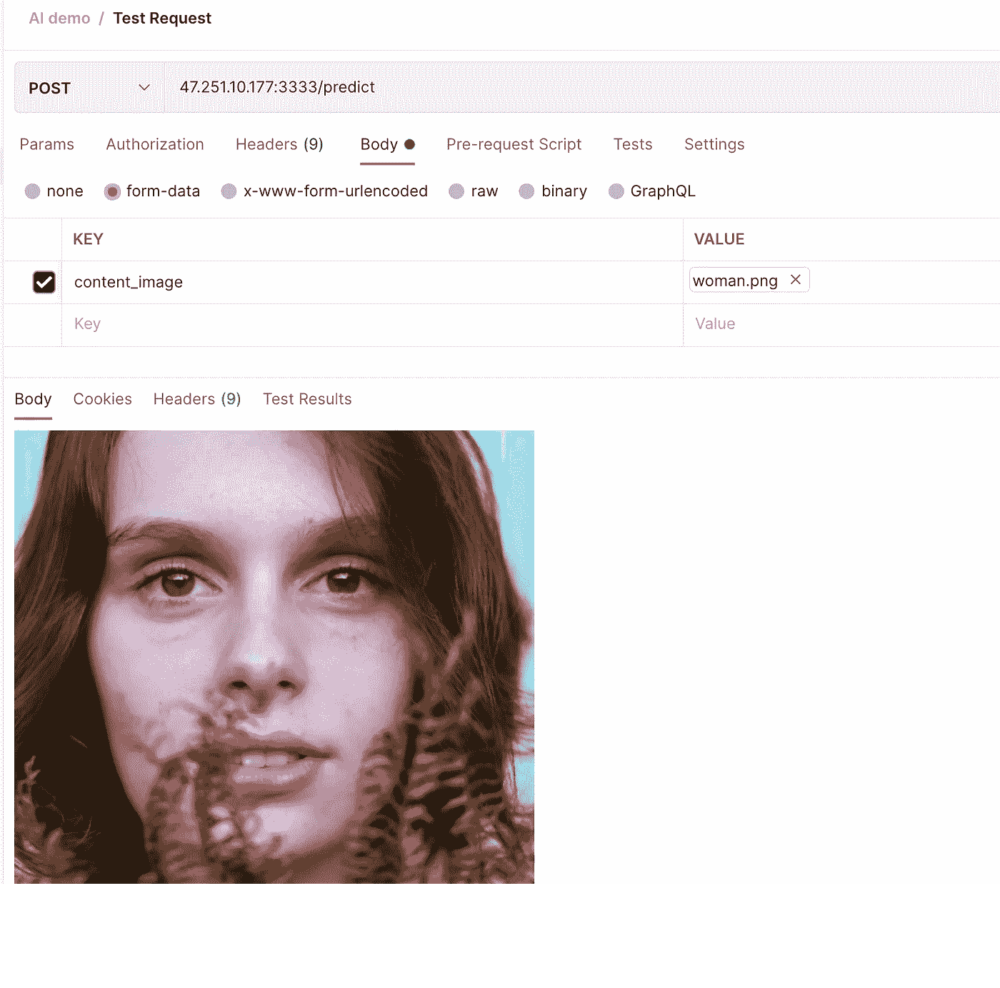
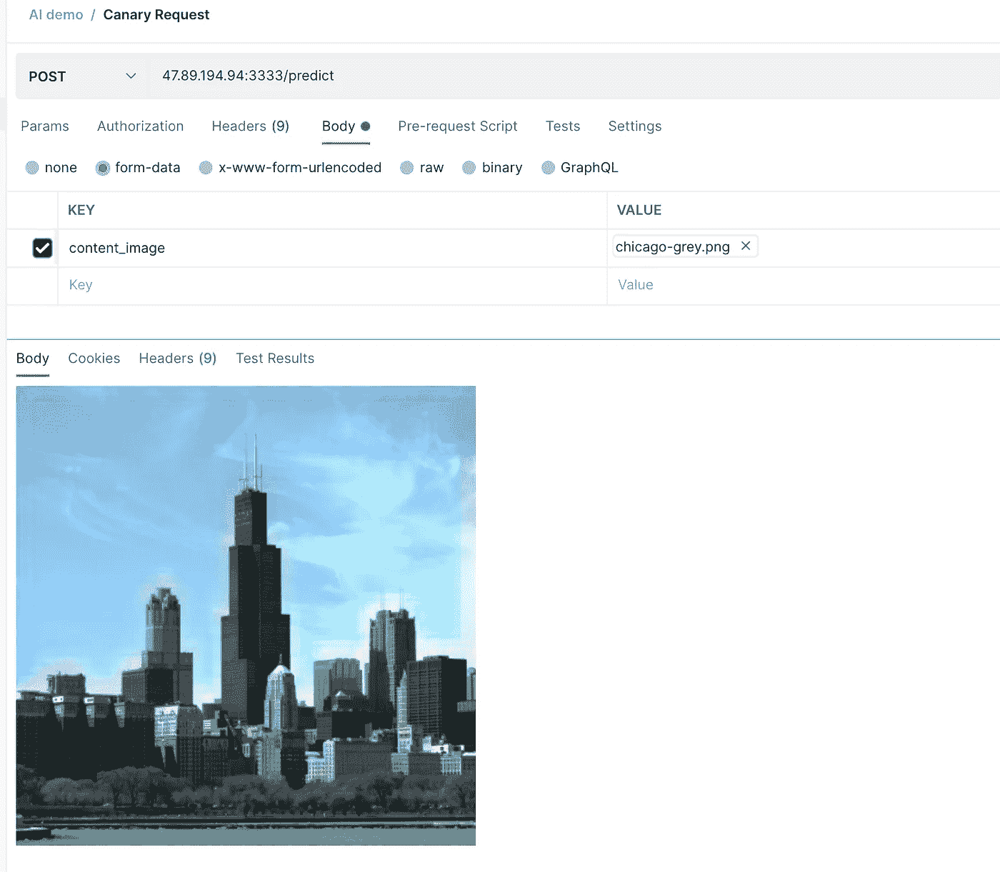
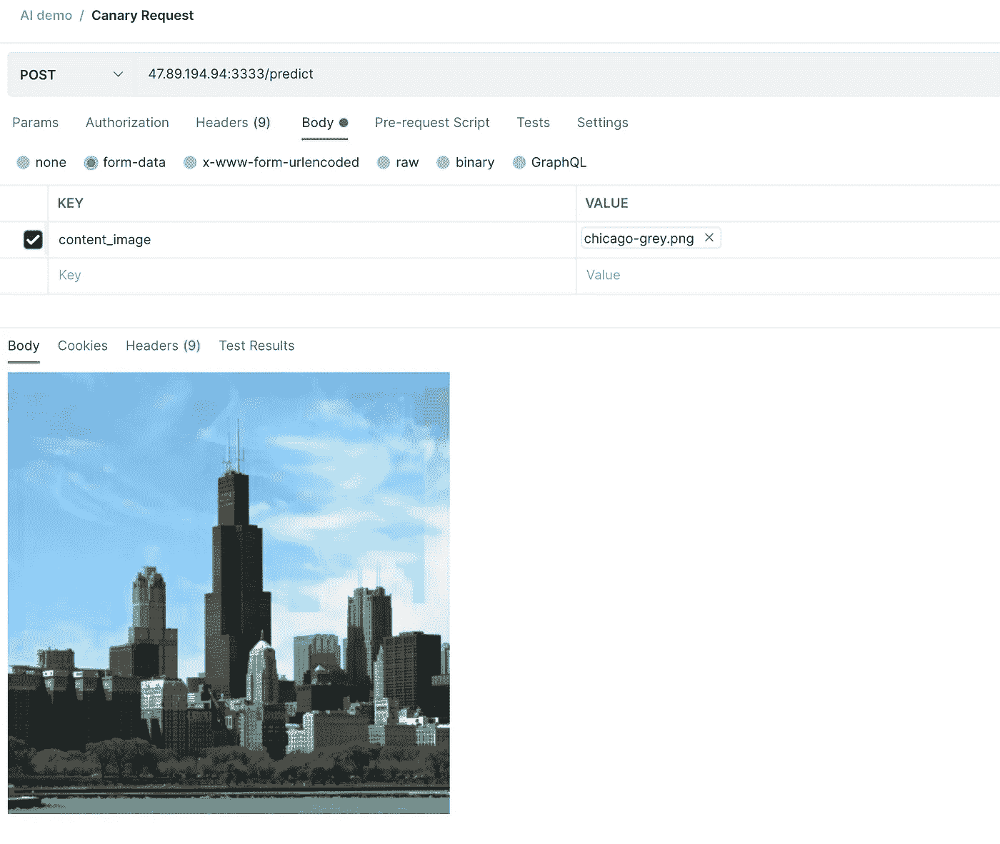
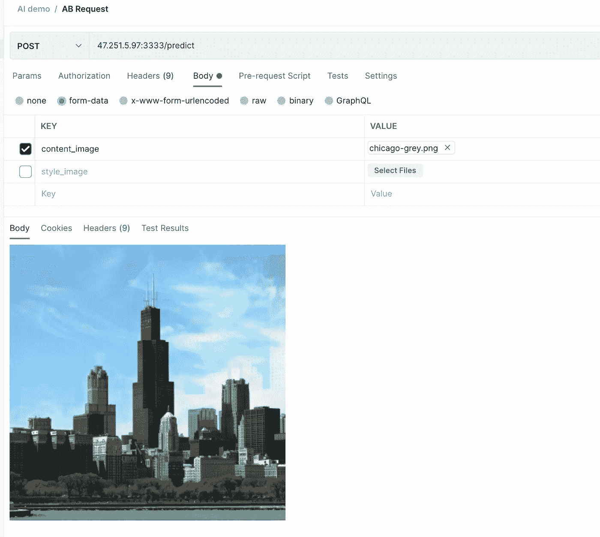
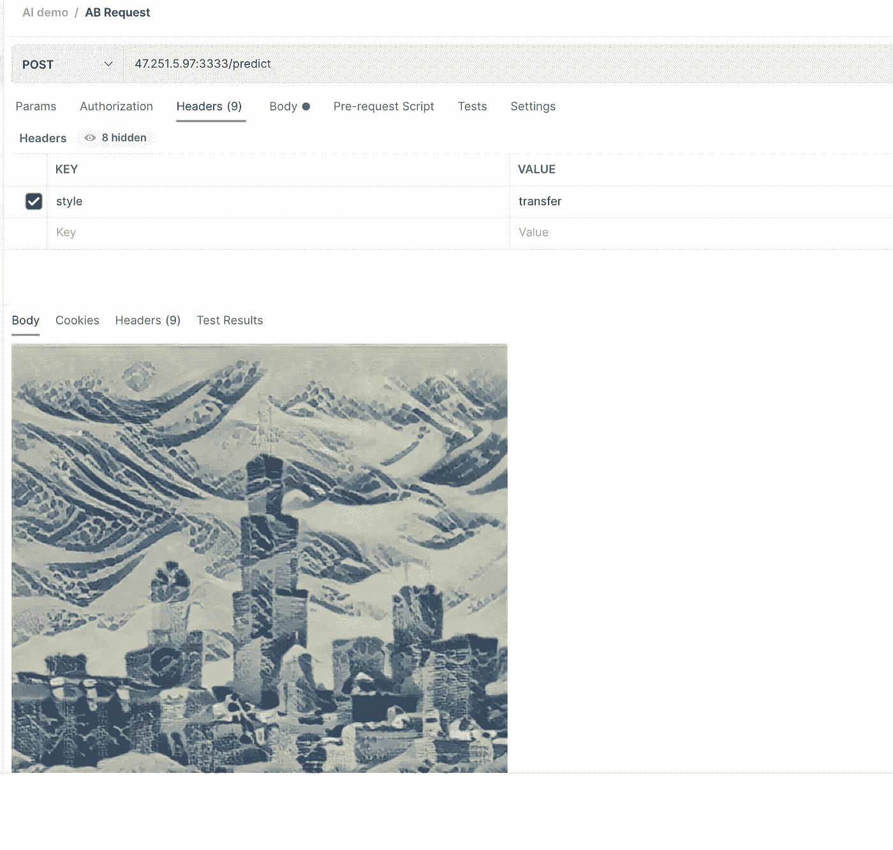
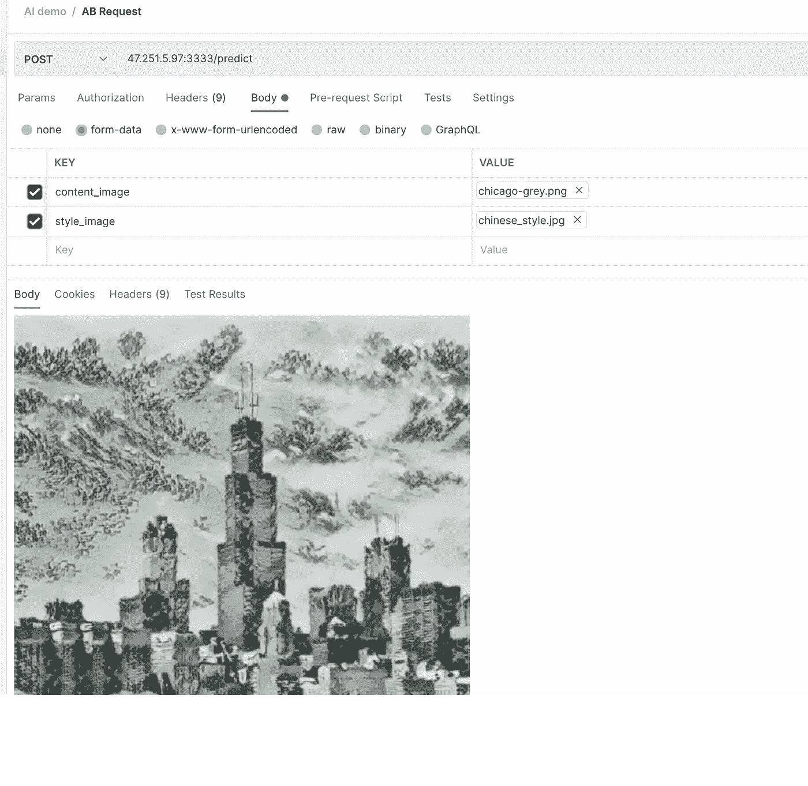

# 使用 KubeVela 进行机器学习实践

> 原文：<https://blog.devgenius.io/machine-learning-practice-with-kubevela-1f62a6dbafec?source=collection_archive---------11----------------------->

*由董天心在推特上@ fog _ 谷氨酰胺*

在机器学习病毒式传播的背景下，AI 工程师不仅需要训练和调试他们的模型，还需要在线部署它们，以验证它看起来如何(当然有时，这部分工作是由 AI 平台工程师完成的。).这是非常乏味和令人疲惫的人工智能工程师。

在云原生时代，我们的模型训练和模型服务通常也在云上进行。这样做不仅提高了可伸缩性，还提高了资源利用率。这对于消耗大量计算资源的机器学习场景非常有效。

但人工智能工程师通常很难使用云原生技术。随着时间的推移，原生云的概念变得越来越复杂。即使要在云原生架构上部署一个简单的模型，人工智能工程师可能也需要学习几个额外的概念:部署、服务、入口等。

作为一个简单、易用、高度可扩展的云原生应用管理工具，KubeVela 使开发人员能够在 Kubernetes 上快速轻松地定义和交付应用，而无需了解底层云原生基础设施的任何细节。KubeVela 丰富的扩展性延伸到 AI 插件，并提供模型训练、模型服务、A/B 测试等功能，覆盖 AI 工程师的基本需求，帮助 AI 工程师在云原生环境下快速进行模型训练和模型服务。

本文主要讨论如何使用 KubeVela 的 AI 插件来帮助工程师更容易地完成模型训练和模型服务。

# 库伯韦拉·艾·阿登

KubeVela AI addon 分为两个:模特培训和模特服务。模型训练插件基于 KubeFlow 的 training-operator，可以支持不同框架中的分布式模型训练，如 TensorFlow、PyTorch 和 MXNet。模型服务插件(model serving addon)基于 Seldon Core，可以方便地使用模型启动模型服务，还支持流量分配、A/B 测试等高级功能。



通过 KubeVela AI 插件，可以显著简化模型训练和服务任务的部署。同时，模型训练和服务的过程可以结合 KubeVela 自身的工作流、多集群等功能，完成生产级服务。

注意:你可以在 [KubeVela Samples](https://github.com/oam-dev/samples/tree/master/11.Machine_Learning_Demo) 中找到所有的源代码和 YAML 文件。如果您想要使用在这个例子中预先训练的模型，文件夹中的`style-model.yaml`和`color-model.yaml`将会这样做并将模型复制到 PVC 中。

# 模特培训

首先启用模型训练和模型服务这两个插件。

```
vela addon enable model-training
vela addon enable model-serving
```

模特培训包括`model-training`和`jupyter-notebook`两种组件类型，模特服务包括`model-serving`组件类型。这三个部件的具体参数可以通过`vela show`命令查看。

你也可以阅读 [KubeVela AI Addon 文档](https://kubevela.io/en/docs/next/reference/addons/ai)了解更多信息。

```
vela show model-training
vela show jupyter-notebook
vela show model-serving
```

让我们使用 TensorFlow 框架训练一个简单的模型，将灰色图像转换为彩色图像。部署以下 YAML 文件:

注:模型训练的源代码来自:[emilwallner/着色-灰度-图像](https://github.com/emilwallner/Coloring-greyscale-images)

```
apiVersion: core.oam.dev/v1beta1
kind: Application
metadata:
  name: training-serving
  namespace: default
spec:
  components:
  # Train the model
  - name: demo-training
    type: model-training
    properties:
      # Mirror of the trained model
      image: fogdong/train-color:v1
      # A framework for model training
      framework: tensorflow
      # Declare storage to persist models. Here, the default storage class in the cluster will be used to create the PVC
      storage:
        - name: "my-pvc"
          mountPath: "/model"
```

此时，库比韦拉会拉起一辆`TFJob`进行模特训练。

仅仅通过训练模型很难看出是怎么回事。让我们修改这个 YAML 文件，将模型服务放在模型训练步骤之后。同时，由于模型服务会直接启动模型，而模型的输入输出并不直观(ndarray 或 Tensor)，因此，我们部署一个测试服务来调用服务，并将结果转换成图像。

部署以下 YAML 文件:

```
apiVersion: core.oam.dev/v1beta1
kind: Application
metadata:
  name: training-serving
  namespace: default
spec:
  components:
  # Train the model
  - name: demo-training
    type: model-training
    properties:
      image: fogdong/train-color:v1
      framework: tensorflow
      storage:
        - name: "my-pvc"
          mountPath: "/model"

  # Start the model serving
  - name: demo-serving
    type: model-serving
    # The model serving will start after model training is complete
    dependsOn:
      - demo-training
    properties:
      # The protocol used to start the model serving can be left blank. By default, seldon's own protocol is used.
      protocol: tensorflow
      predictors:
        - name: model
          # The number of replicas for the model serving
          replicas: 1
          graph:
            # model name
            name: my-model
            # model frame
            implementation: tensorflow
            # Model address, the previous step will save the trained model to the pvc of my-pvc, so specify the address of the model through pvc://my-pvc
            modelUri: pvc://my-pvc # test model serving
  - name: demo-rest-serving
    type: webservice
    # The test service will start after model training is complete
    dependsOn:
      - demo-serving
    properties:
      image: fogdong/color-serving:v1
      # Use LoadBalancer to expose external addresses for easy to access
      exposeType: LoadBalancer
      env:
        - name: URL
          # The address of the model serving
          value: [http://ambassador.vela-system.svc.cluster.local/seldon/default/demo-serving/v1/models/my-model:predict](http://ambassador.vela-system.svc.cluster.local/seldon/default/demo-serving/v1/models/my-model:predict)
      ports:
        # Test service port
        - port: 3333
          expose: true
```

部署后，使用`vela ls`检查应用程序的状态:

```
$ vela lstraining-serving      	demo-training      	model-training	       	running	healthy	Job Succeeded	2022-03-02 17:26:40 +0800 CST
├─                  	demo-serving       	model-serving 	       	running	healthy	Available    	2022-03-02 17:26:40 +0800 CST
└─                  	demo-rest-serving  	webservice    	       	running	healthy	Ready:1/1    	2022-03-02 17:26:40 +0800 CST
```

如您所见，应用程序已经正常启动。使用`vela status <app-name> --endpoint`查看应用程序的服务地址。

```
$ vela status training-serving --endpoint+---------+-----------------------------------+---------------------------------------------------+
| CLUSTER |     REF(KIND/NAMESPACE/NAME)      |                     ENDPOINT                      |
+---------+-----------------------------------+---------------------------------------------------+
|         | Service/default/demo-rest-serving | tcp://47.251.10.177:3333                          |
|         | Service/vela-system/ambassador    | [http://47.251.36.228/seldon/default/demo-serving](http://47.251.36.228/seldon/default/demo-serving)  |
|         | Service/vela-system/ambassador    | [https://47.251.36.228/seldon/default/demo-serving](https://47.251.36.228/seldon/default/demo-serving) |
+---------+-----------------------------------+---------------------------------------------------+
```

应用程序有三个服务地址，第一个是我们测试服务的地址，第二个和第三个是本地模型的地址。

我们可以调用测试服务来看看模型的效果:测试服务会读取图片的内容，转换成一个`Tensor`并请求模型服务，最后将模型服务返回的`Tensor`转换成图片返回。

我们选择一张黑白女性图像作为输入:


请求之后，您可以看到输出了一幅彩色图像:



# 模型服务:金丝雀测试

除了直接启动模型服务，我们还可以在一个模型服务中使用模型的多个版本，并为它们分配不同的流量进行金丝雀测试。

部署以下 YAML，您可以看到模型的 v1 版本和模型的 v2 版本都设置为 50%流量。同样，我们在模型服务的背后部署了一个测试服务:

```
apiVersion: core.oam.dev/v1beta1
kind: Application
metadata:
  name: color-serving
  namespace: default
spec:
  components:
  - name: color-model-serving
    type: model-serving
    properties:
      protocol: tensorflow
      predictors:
        - name: model1
          replicas: 1
          # v1 version model traffic is 50
          traffic: 50
          graph:
            name: my-model
            implementation: tensorflow
            # Model address, our v1 version model is stored under the /model/v1 path in the pvc of color-model, so specify the address of the model through pvc://color-model/model/v1
            modelUri: pvc://color-model/model/v1
        - name: model2
          replicas: 1
          # v2 version model traffic is 50
          traffic: 50
          graph:
            name: my-model
            implementation: tensorflow
            # Model address, our v2 version model is stored under the /model/v2 path in the pvc of color-model, so specify the address of the model through pvc://color-model/model/v2
            modelUri: pvc://color-model/model/v2
  - name: color-rest-serving
    type: webservice
    dependsOn:
      - color-model-serving
    properties:
      image: fogdong/color-serving:v1
      exposeType: LoadBalancer
      env:
        - name: URL
          value: [http://ambassador.vela-system.svc.cluster.local/seldon/default/color-model-serving/v1/models/my-model:predict](http://ambassador.vela-system.svc.cluster.local/seldon/default/color-model-serving/v1/models/my-model:predict)
      ports:
        - port: 3333
          expose: true
```

模型部署完成后，使用`vela status <app-name> --endpoint`查看模型服务的地址:

```
$ vela status color-serving --endpoint+---------+------------------------------------+----------------------------------------------------------+
| CLUSTER |      REF(KIND/NAMESPACE/NAME)      |                         ENDPOINT                         |
+---------+------------------------------------+----------------------------------------------------------+
|         | Service/vela-system/ambassador     | [http://47.251.36.228/seldon/default/color-model-serving](http://47.251.36.228/seldon/default/color-model-serving)  |
|         | Service/vela-system/ambassador     | [https://47.251.36.228/seldon/default/color-model-serving](https://47.251.36.228/seldon/default/color-model-serving) |
|         | Service/default/color-rest-serving | tcp://47.89.194.94:3333                                  |
+---------+------------------------------------+----------------------------------------------------------+
```

要求模特展示黑白城市形象:


如您所见，第一个请求的结果如下。天空和地面是彩色的，而城市本身是黑白的:



再次请求，您可以看到在这个请求的结果中，天空、地面和城市都用颜色进行了渲染:



通过给模型的不同版本分配流量，可以帮助我们更好的判断模型结果。

# 模型服务:A/B 测试

对于一个黑白图像，我们可以通过模型把它变成彩色。或者换一种方式，我们可以通过上传另一个风格的图片来传递原图片的风格。

我们的用户是更爱色彩鲜艳的图片还是更爱不同风格的图片？我们可以通过进行 A/B 测试来探讨这个问题。

部署下面的 YAML，通过设置`customRouting`，将`Header`中带有`style: transfer`的请求转发给样式转移的模型。同时，使这个样式传递模型与彩色化的模型共享相同的地址。

注:风格传递的模型来自 [TensorFlow Hub](https://tfhub.dev/google/magenta/arbitrary-image-stylization-v1-256/2)

```
apiVersion: core.oam.dev/v1beta1
kind: Application
metadata:
  name: color-style-ab-serving
  namespace: default
spec:
  components:
  - name: color-ab-serving
    type: model-serving
    properties:
      protocol: tensorflow
      predictors:
        - name: model1
          replicas: 1
          graph:
            name: my-model
            implementation: tensorflow
            modelUri: pvc://color-model/model/v2
  - name: style-ab-serving
    type: model-serving
    properties:
      protocol: tensorflow
      # The model of style migration takes a long time, set the timeout time so that the request will not be timed out
      timeout: "10000"
      customRouting:
        # Specify custom Header
        header: "style: transfer"
        # Specify custom routes
        serviceName: "color-ab-serving"
      predictors:
        - name: model2
          replicas: 1
          graph:
            name: my-model
            implementation: tensorflow
            modelUri: pvc://style-model/model
  - name: ab-rest-serving
    type: webservice
    dependsOn:
      - color-ab-serving
      - style-ab-serving
    properties:
      image: fogdong/style-serving:v1
      exposeType: LoadBalancer
      env:
        - name: URL
          value: [http://ambassador.vela-system.svc.cluster.local/seldon/default/color-ab-serving/v1/models/my-model:predict](http://ambassador.vela-system.svc.cluster.local/seldon/default/color-ab-serving/v1/models/my-model:predict)
      ports:
        - port: 3333
          expose: true
```

部署成功后，通过`vela status <app-name> --endpoint`查看模型服务的地址:

```
$ vela status color-style-ab-serving --endpoint+---------+---------------------------------+-------------------------------------------------------+
| CLUSTER |    REF(KIND/NAMESPACE/NAME)     |                       ENDPOINT                        |
+---------+---------------------------------+-------------------------------------------------------+
|         | Service/vela-system/ambassador  | [http://47.251.36.228/seldon/default/color-ab-serving](http://47.251.36.228/seldon/default/color-ab-serving)  |
|         | Service/vela-system/ambassador  | [https://47.251.36.228/seldon/default/color-ab-serving](https://47.251.36.228/seldon/default/color-ab-serving) |
|         | Service/vela-system/ambassador  | [http://47.251.36.228/seldon/default/style-ab-serving](http://47.251.36.228/seldon/default/style-ab-serving)  |
|         | Service/vela-system/ambassador  | [https://47.251.36.228/seldon/default/style-ab-serving](https://47.251.36.228/seldon/default/style-ab-serving) |
|         | Service/default/ab-rest-serving | tcp://47.251.5.97:3333                                |
+---------+---------------------------------+-------------------------------------------------------+
```

在这个应用中，两个服务各有两个地址，但是第二个`style-ab-serving`的模型服务地址无效，因为模型服务已经指向了`color-ab-serving`的地址。同样，我们通过请求测试服务来了解它是如何工作的。

首先，没有页眉，图像从黑白变为彩色:



让我们添加一个海浪图像作为样式渲染:


我们将`style: transfer`的头添加到这个请求中，您可以看到这个城市已经变成了一种波浪风格:



我们还可以使用水墨画图像作为风格渲染:


可以看出，这个时候的城市已经变成了一种水墨画风格:



# 摘要

此外，与 KubeVela 一起，我们还可以通过 KubeVela 的多环境功能，将测试过的模型交付到不同的环境中，从而实现模型的灵活部署。