# Google Play 商店数据集上的机器学习技术(Python)

> 原文：<https://blog.devgenius.io/machine-learning-technique-on-google-play-store-dataset-python-e02197386f13?source=collection_archive---------11----------------------->

(第二部分)

数据是业务的重要流体。基于数据驱动的洞察力做出预测，可能会区分是具有竞争力还是进一步落后。为了利用企业和客户数据的价值，并做出让企业在竞争中保持领先的决策，机器学习就是答案。机器学习技术正在预测性维护、状态监控、动态定价和风险分析方面为多个行业提供帮助。此外，ML 预测结果更准确，而不需要专门训练。因此，为了预测 google play 商店平台上的最佳应用，选择机器学习算法来执行。

**数据集的准备**

**第一步:**准备，数据准备是 ML 技术必不可少的一部分，它一般是清理、收集、结构化和组织数据的过程。在准备过程中，只选择了一些变量来执行 ML 技术。

google play 商店数据集包含许多分类值，要在机器学习中处理这种数据，信息需要在相同的范围内。因此，标签编码器用于归一化数据集并将分类信息转换成数字形式。

#Playstore 表(标签编码后)

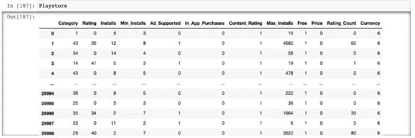

检查安装率:-

installes =(sum(Playstore[' installes '])/len(Playstore[' installes '])。指数))*100

[拿出来]:**798**。49860.88868888686

**步骤 2:** 在对 play store 数据集应用任何机器学习技术之前，需要将信息分为两种形式，即训练和测试。

**X_train，X_test，y_train，y_test = train_test_split(X，y，test_size=0.3，random_state=1)**

**X_train.info()**

**Dependent = Playstore[' installes ']#选择目标变量**

**Independent = playstore . drop(' installes '，axis='columns')**

这里，installs 变量是因变量，其余变量设为自变量。

**X =自变量#因变量**

**y =依赖#目标变量**

创建了训练和测试数据集:

4.2.2。逻辑回归

**步骤 3:** 用逻辑回归()函数对准备好的数据集应用逻辑回归。

**logreg = LogisticRegression()**

**logreg.fit(X_train，y_train)**

**Y _ pred = log reg . predict(X _ test)**

**ACC _ log = round(log reg . score(X _ test，y_test) * 100，2)**

**acc_log**

精度: **41.14。**

逻辑回归的准确度显示为 41.14 %，这表明对于数据集来说不是一个好的模型。这可能很重要，但结果并不令人满意。模型可能过拟合或欠拟合。但是，将检查模型的其他报告以对其做出决定。

**步骤 4:评估模型性能**

打印测试的分类记录:

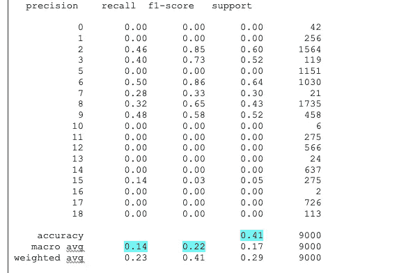

基本上，分类报告用于测量来自分类技术的预测质量。分类记录的主要用途是，它有助于从报告中找出有多少预测可能是真的和假的。其中，precision 是阳性预测的准确性，recall 描述了正确识别的真阳性结果和假阴性结果之和的真值比例。f1 分数被称为精度和召回类别的加权调和平均值，而支持度显示类别的实际出现次数。然而，在训练数据中，不等式支持描述了信息的结构性弱点。

为了更简单地说明:

**第五步:**分类结果的评估分数(准确率、精确度和召回率)

```
Accuracy: 0.41144444444444445Precision Score : 0.14330768271960476Recall Score :  0.2239805430340715
```

以上两个报告分析显示了模型准确性分数和性能检查。可以看出，准确度、精确度和回忆分数之间存在差异。的。精确度分数是 0.14，这表示真阳性，这意味着模型做出的准确预测是 0.14。然而，召回值是 0.22，表示模型做出的错误预测是 0.22。然而，在查看模型的精确度和召回值之后，表明模型具有低精确度和高召回分数。

**第六步:**进入模型评估:-

PCA 分析是一种通过从数据集中移除一些信息来增加模型的可解释性的方法。它还计算变量的协方差矩阵。从 scikit 学习执行中，获取了解释差异的信息，下图显示了累积解释差异。

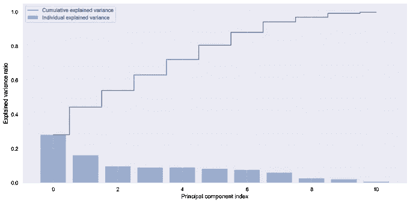

逻辑回归的主成分图

认识 PCA 中的一组数字很重要，学习它们最便宜的方法是绘制它们。执行是必不可少的，因为它有助于按重要性对因素进行排序。上图描述了每个主成分的方差数。已经对训练数据进行了缩放，并计算了解释方差。从上面的图中，我们可以读出所解释的信息的变化百分比。因此，第一个成分解释了 0.3%的方差，其他前两个成分解释了 0.5%，然而，前三个成分描述了 0.7 %，以此类推。

**第七步:**混淆矩阵

混淆矩阵解释了数据集的预测标签和实际标签。它估计模型预成形，该模型预成形给出了从分类算法中可以得到什么样的误差和真值的好主意。

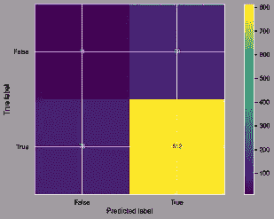

逻辑回归的混淆矩阵

执行的矩阵显示:-

True positive:模型正确预测了 google play 商店的 812 条记录。假阳性:错误预测的 99 个。

假阴性和假阳性分别为 11 和 79，其中 11 个预测错误。

**决策树**

决策树是机器学习(监督学习)的最佳技术，被认为是最常见和最容易理解的技术。它使用类似树的结构，包括根节点、分支和叶节点。其中，每个节点描述对属性的测试，分支显示结果，每个叶节点表示类别标签。然而，树的第一个节点被称为根节点。

**第一步:**

为了应用决策树，需要将信息分成训练和测试，这已经在前面的步骤中完成了。因此，将直接在准备好的数据集上实现该技术。

结果:

当决策树算法执行时，默认情况下，标准设置为“gini ”,如果需要，还可以更改不同的参数。本研究将检验两个参数对决策树分类器的影响及其模型评价。

```
Training set score: 0.8247
```

测试集得分:0.8232

训练和测试数据集得分显示 0.82 的值，它们之间的差异为 0.0015。决策树两个模型都以基尼系数为标准，给出了良好的值，表明模型具有 80%以上的得分。

**第二步:**

接下来，现在将把标准改为“熵”,它决定属性和数据采集之间的分割。

.

```
DecisionTreeClassifier(criterion='entropy', min_samples_split=50)Accuracy score on train data as criterion as entropy:) 0.999857136Accuracy score on test data as criterion as entropy:)  0.999222222
```

当判据变为熵时，值也随之切换。作为熵标准的精度显示 0.99%，其中 min_samples_split 设置为 50。当标准改变时，人们可以注意到有很大的不同。重要的原因是，通过增加 min_samples_split 的分数来放松决策边界，从而防止过拟合。

**步骤 3:** 了解决策树可视化:-

在这里，将决策树拟合到一些假设的数据，它将从两个部分生成。此外，具有不同均值的正态分布将代表:-

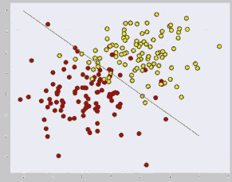

决策树散点图

上面的决策树可视化图显示了良好的离散边界，其中黄色的红点是两个类别。虽然一条复杂的曲线滑过每个红点会太困难，并导致模型在新样本上出错，但一条直线会太直截了当。根据新的数据，某种光滑的边界，或者至少是一条直线或一个超平面，表现良好似乎是合乎逻辑的。

**第四步:**分类分析:

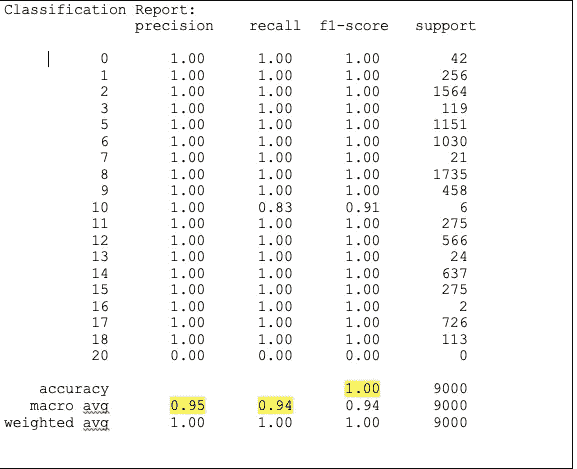

决策树模型的分类观测值表示准确率为 1.00，即 100%。此外，它显示了 95%和 94%的精确度和召回分数。精度为 1.00 的模型表明，模型非常适合任何学习数据集，但是，高精度分数通常表示数据不平衡，或者有时它认为实现错误。例如，模型使用训练信息进行测试。对训练集的适当拟合会使模型在新数据上表现不佳，如过度拟合。为了更好地推广，可以减少对训练数据的执行。这也叫正规化。

**K-最近邻(K-NN)**

k 近邻(KNN)机器学习技术是监督学习家族的一部分。它用于回归和分类，该技术的主要目标是估计训练和测试信息之间的距离，其中 k 数是从最接近的数据开始的点。K-NN 算法测量测试信息和训练点的概率，然而，在回归情况下，K 值是训练数据的平均值。此外，选择 k 值并不容易，因为 k 值对结果有很大的影响。如果类别为 2，数据科学家通常将 k 值视为记录数(奇数)的平方根。这是求 k 均值的简单方法。

然而，选择 K-NN 方法的原因是，它对结果的预测也很高，可以与其他最重要的模型竞争。

**第一步**:技术实现

将 K-NN 技术应用于 google play 商店数据集，该数据集分为两组训练和测试，其中 K 值设置为记录数量的平方根。记录的数量是 29，999，k 值被认为是 173(奇数)。

输出:

```
Testing: 0.9771111111111112Training: 0.978760893375875
```

在查看测试和训练数据集后，该数据集显示了 97.7%和 97.8%的模型准确性，这意味着它是一个非常好的模型。模型 k 值是 173，这是记录数据的平方根。将 K-NN 与以前的其他模型进行比较，它显示出比逻辑回归和决策树更好的结果。然而，探索更多的 K-NN 将检查错误率，并绘制训练和测试分数。

**第二步:**错误率与 K 值的关系图

执行错误率有助于了解模型执行得有多好。它可以帮助检测是否需要任何改进，评估干预是否有说服力。

这里，实现 K-NN 分类器训练数据集来计算适当的训练误差。

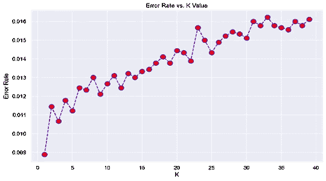

K-NN 误差率图

```
Minimum error:- 0.008888888888888889 at K = 0
```

上述结果显示了 K-NN 算法中训练集在 k=0 时的最小误差。训练误差在 k =0 时最低，并且如果 k 增加，则训练误差增加。误差率为 0.008，这表示最小 k 值。然而，当 k= 23 时，会观察到毛刺，不同的值会产生不同的验证误差。

**第三步:**准确确定误差率

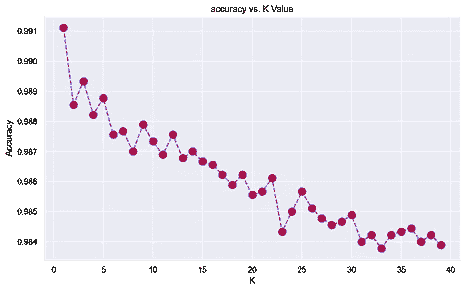

K-NN 误差率与准确度

```
Maximum accuracy:- 0.9911111111111112 at K = 0
```

该图显示了模型精度与 k 值的关系。上述分析表明，如果 k 降低，则精度增加。这里，当 k 值为 0 时，模型精度显示 0.99 值，这导致良好的模型。一般来说，准确性是预测的数据，而误差是通过错误预测的总数除以预测的总数来衡量的。

**第四步:**绘制训练和测试分数(K-NN)

检查错误状态后，将可视化 K- NN 分类器的训练和测试方法。如下图所示，它们各自显示了不同的值。蓝线表示训练集的准确性，而橙色表示测试数据的得分。测试分数用于评估机器学习算法的适合度，训练用于机器学习方法的适合度。


测试和训练值图表

**第五步:**K-NN 的分类报告

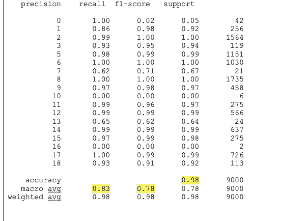

K-NN 的分类报告表示准确度、精确度和召回值。该模型实现了 98%的准确率和 83 %的预测，其中召回率为 78%，这意味着在该模型中准确预测了 0.78。上表显示，K-NN 算法在 google play 商店数据集测试模型上表现良好，具有良好的精确度和召回率。

**SVM(支持向量机**

支持向量机算法被认为是比其他模型更好的技术，因为 SVM 能够注意到信息之间的复杂关系，而不允许用户做许多转换。在 SVM，每个信息被表示为 n 维向量，其中创建 2 个类，SVM 操作 n-1 维的个体超平面，它们之间的距离最大。

它主要用于手写检测、人脸识别、电子邮件分类和网页。它也可以在线性或非线性数据集上实现。这是使用能够处理线性和非线性信息的 SVM 的主要原因。因此，将对所选数据集实施 SVM。

**步骤 1:** 在 playstore 数据集上应用 SVM 方法

结果:

```
The accuracy of testing is :  85.15555555555555 %The accuracy of training datasetis :  84.86118386589837 %
```

SVM 机器学习算法的训练精度结果表明，模型的准确率达到 84 %。然而，测试数据集也代表了 85%的好成绩。SVM 在 29999 条记录的数据集上表现良好。接下来，将对 SVM 进行可视化。

**第二步**:创建 SVM 的图形

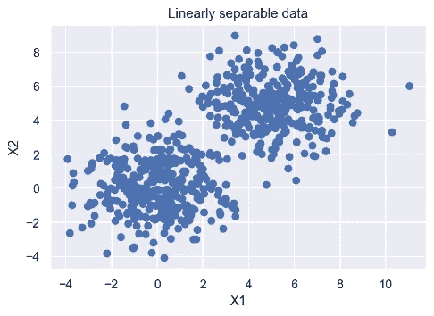

SVM 线性可分信息图

上图中的 SVM 表示线性判别分类器，它试图找到各种类别的决策边界，并最大化裕度。SVM 引入了非线性可分情形的两个概念，如软边际和核技巧。边距是超平面和数据点的最近距离之间的距离。目的是在训练数据集中选择具有最高可能边缘的超平面。因此，它显示数据被正确分类。

第三步:检查 SVM 的其他分数

```
Accuracy Score: 0.8516SVC f1-score  : 0.5172SVC precision : 0.5456SVC recall    : 0.5016
```

上表显示了支持向量机方法的得分，SVM 达到了 85 %的准确率，其准确率和召回率之间的调和平均值为 51%。f1 车型的分数对车型来说还可以，但不好。转到机器学习中的精度和召回值，确定积极的实际结果以及正确分析了多少。从给定的表格中可以看出，该模型的精度为 0.54，也就是说，它在 50 %的时间内正确无误。另一方面，回忆表示 0.50 分，表示 50%被正确预测。

#预测 google play 商店的最佳功能:

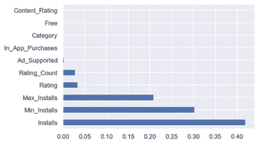

顶级变量预测

从上面的图来看，google play 商店最好的顶级功能是广告支持、评级计数、最大安装数、最小安装数、安装数和评级。这些是十大主要特征；可以说，这些变量对于制作一个影响客户对应用程序的态度的应用程序是必不可少的。一般来说，大多数人会安装评级高的应用程序，但最不喜欢付费应用程序(之前讨论过)。通过使用 Python 中内置的类特性，可以检测到重要的变量，如上图所示。

**模型间比较:**

在一个人工任务由自动化执行的技术世界中，人工的意义被机器人工作取代，机器学习模型可以帮助系统玩游戏，进行手术和许多其他个人工作。在本研究中，为了对选定的数据集进行预测，机器学习方法起着至关重要的作用。因此，本文采用了决策树、支持向量机、KNN 方法、逻辑回归等最好的算法，这些算法都是监督学习的一部分。

此外，变量选择和数据准备是建模的最重要部分，以获得良好的精度结果。所有的结果都来自于个体训练技术、准确度分数、精确度和召回值。为了更好地了解模型之间的差异，建立了柱状图。

**第一步**:打印所有模型结果和图形结果

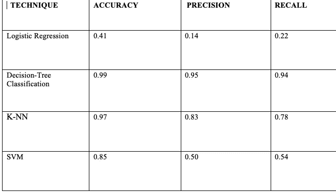

具有精确度和召回分数的模型精确度表

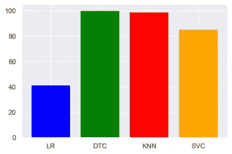

机器学习算法结果的条形图

上面两个图，柱状图和表格说明了机器学习方法结果之间的分数。每个算法的结果显示了它们在 google play 商店数据集上的性能。准确率和其他评分如上表所述。为了证明我们的分析是有效的，在实验中加入了其他值，如精度和召回分数。精确度分数范围从 1 到 100，其中决策树获得了最高的精确度，具有良好的精确度值和召回分数。因此，这表明这项研究结果是准确的，因为它展示了一个具有最佳准确度、精确度和回忆分数的模型。此外，条形图表示四个选定算法准确性结果的可视化，其中 DTC(决策树分类器)具有 99%。而从 logistic 回归模型来看，它的准确率最低，准确率和召回率得分较低，被认为是不太好的模型。然而，K-NN 也显示了 98%的良好准确性，但是与决策树相比具有较低的精度值。因此，决策树是 google play 商店数据集的最佳模型。

**争论点:**

本文之前的研究已经讨论和分析了机器学习算法的结果。在本节中，将讨论本文中已经实现的机器学习技术的成就、性能和结果。在文献章节中，许多论文帮助我们找到了在 google play 商店数据集上应用技术的结果和最佳方式。在执行最佳方法时，我们对结果进行了比较，以检测所选数据集的最佳方法。然而，在实施过程中，出现了许多挑战。例如，处理 installs 变量是一个非二进制变量，有不同的记录，应用技术很困难。当时，理解 SVM 和其他模型(比如它在 Python 中的工作方式)并不容易。在 Python 中执行机器学习模型时面临许多问题，如库问题、语法错误等。接着，本研究发现，在技术实现方面，R 并不比 Python 更好。R 语言也用于可视化部分，这在 EDA 期间工作得很好，但是，在像 google play store 这样拥有超过 20，000 条记录的巨大数据集上执行模型，使 R 语言爆炸。因此，Python 已经被决定用于执行机器学习模型。简而言之，对于统计分析和模型来说，R 语言是很好的选择，但是在功能和操作方面，R 语言的库是有限的。然而，Python 使得编码对用户来说既舒适又易读。此外，它有许多功能，被认为是 ML 模型的最佳选择。

此外，本研究还发现了最佳的机器学习模型。很难选择和承认会在学生中造成混乱的方法，尤其是当在线资源可用时。google play 商店数据集侧重于应用程序细节，其中使用数据科学技术预测热门应用程序非常具有挑战性。文献综述章节帮助我们确定了 google play 商店数据的最佳机器学习技术。通过比较模型准确性和其他得分，如精确度和召回率，为 google play 商店选择最佳模型。数据变量的类型是本文的唯一限制。未来的工作需要关注 google play 商店应用程序的更多安装和评级，这有助于预测更准确的结果。创建聚类并确定评级和安装之间的关系可以更精确地分析单个应用程序。

实现成功的分析和建模的一个基本点是模型的 p 值和准确度分数，这是今天的主要问题之一。诸如网络搜集、数据清理之类的任务不再有助于产生模型的良好结果。因此，需要耐心等待新方法的引入。

**结论**:

本文试图比较机器学习模型并预测 google play 商店中的最佳应用。Google play 商店已经成为下载和上传软件应用程序的著名平台。每个用户都有自己的体验和对应用的反馈。本文的研究和发现提出了创作者应该考虑的应用程序设计的各个方面。与 google play 商店平台上的付费程序相比，大多数用户更喜欢免费程序。在这项研究中，我们从在线网站上删除了 29，999 条数据记录，其中安装在整个数据集上起着主要作用。在进行探索性分析时，研究显示了用户安装率较高的两个类别的顶级应用，如“音乐”和“医疗”类别。在这些之后，google play 商店中的关键功能被注意到，如评级和免费变量，如果应用程序是免费的或有良好的评级，大多数安装程序都会下载应用程序。

此外，今天的每个人都出于不同的动机使用 android 应用程序，如锻炼、食物、游戏、学习语言和主题，web market 为许多智能手机用户提供了超过百万个 android 应用程序的免费和付费访问。开发人员发现很难发现的地方，哪些应用程序更适应这个世界，因此，业务可以朝着正确的方向发展。称为机器学习的技术是帮助公司有效地从原始信息中获得洞察力的方法。

本文在 google play store 数据集上实现了四种选择性监督机器学习方法，这些方法可以提供更好的结果，提高决策效率。每个模型都经过了训练，以从决策树分类器在所选数据集上显示最有效技术的技术中获得最佳结果和输出。决策树实现了 99%的准确率，精确度和召回率分别为 95%和 94%。DTC 的结果表明模型拟合良好，能快速适应信息。然而，K-NN 速度较慢，表现出良好的准确性，但召回分数较低，召回表明模型的预测有多准确。另一方面，与决策树和 K-NN 分类器相比，SVM 和逻辑回归表现不佳。因此，决策树方法是更准确的算法和鲁棒性。

此外，研究发现 google play 商店数据集中最重要的变量包括安装数、评分、最大安装数、最小安装数、评分数和广告支持数。在执行机器学习算法或做出决策时，选择这些变量至关重要。

希望对你有帮助。如果你想看 EDA(探索性数据分析)部分，请点击这里。