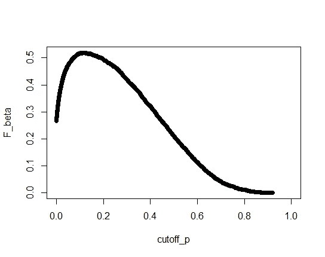
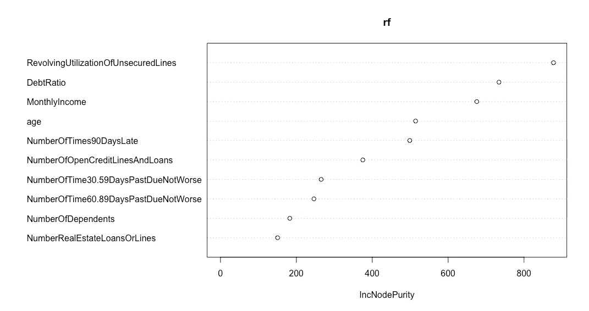
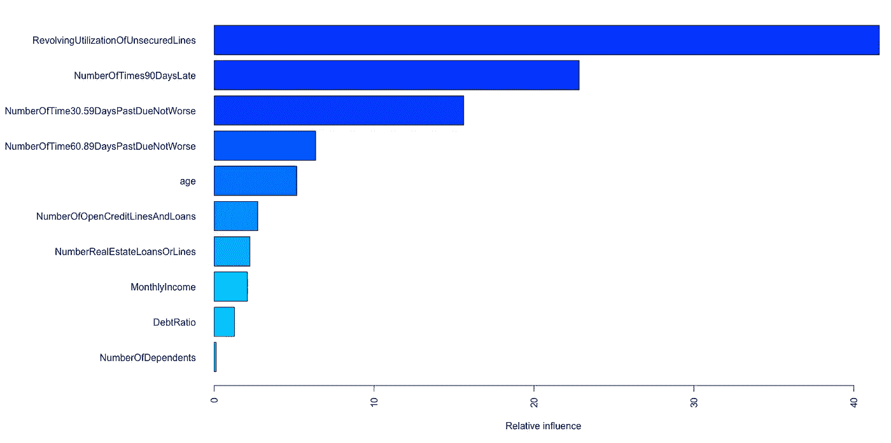
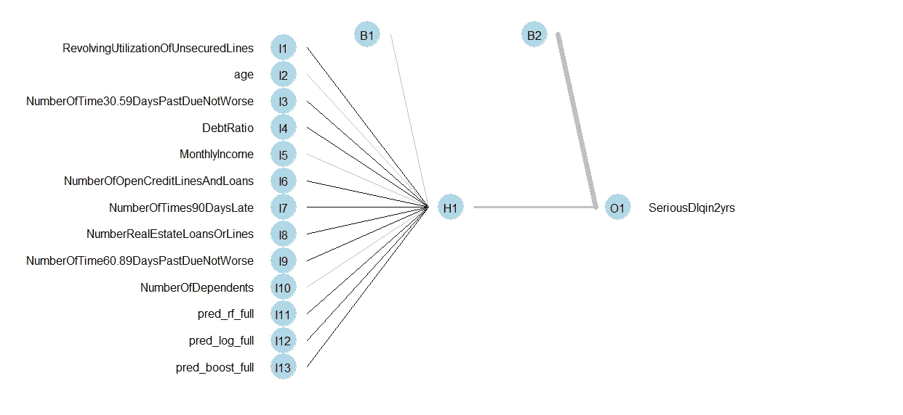
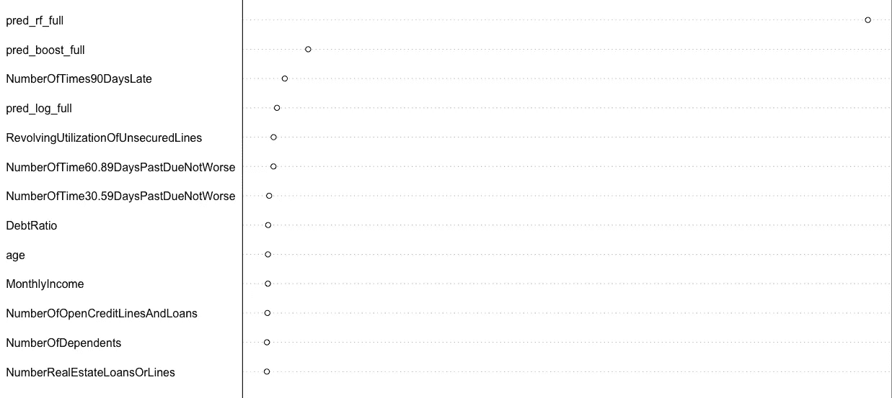

# 二元分类的机器学习技术:银行贷款决策

> 原文：<https://blog.devgenius.io/machine-learning-techniques-for-binary-classification-bank-loan-decision-431bdb832c2?source=collection_archive---------11----------------------->

这个项目使用并比较了几种机器学习技术进行二元分类，即分类一个观察值是否属于某个类别。在这种情况下，一家银行拥有一个具有信用历史的客户数据集，并希望分析团队建立一个模型来预测将陷入财务困境的个人，财务困境定义为在未来两年内发生逾期 90 天的拖欠。目标是建立一个最佳模型来预测未来两年内可能陷入金融危机的人。

数据集可以在 Kaggle 上找到:[https://www.kaggle.com/c/GiveMeSomeCredit/overview](https://www.kaggle.com/c/GiveMeSomeCredit/overview)

代码可以在[我的 GitHub](https://github.com/namofvietnam/) 资源库:[https://GitHub . com/namofvietnam/machine _ learning _ class ification _ r](https://github.com/namofvietnam/machine_learning_classification_r)中找到

# 摘要

*   这个项目探索了几种解决分类问题的机器学习方法:随机森林、boosting、逻辑回归和堆叠
*   在比较模型以找到“最佳”模型的任何分类机器学习项目中，每个模型都需要考虑两个因素:与其他模型进行比较的关键性能指标，以及实现最佳 KPI 的截止概率。
*   F-beta 评分是一个灵活的模型 KPI，它平衡了敏感性(即假阴性率的补充，揭示了模型预测阳性观察值的有效性)和特异性(假阳性率的补充，揭示了模型预测阳性观察值的有效性)。β表示灵敏度比特异性重要多少倍，或者假阳性比假阴性有害多少倍。
*   在我们的案例中，违约贷款的损失会吞噬掉两个客户的利润。因此，我们需要一个反映假阴性的 KPI，它的成本是假阳性的两倍，或者灵敏度比精确度重要两倍。F-β分数的β值因此被设置为 2。在任何分类建模项目中，判断假阳性和假阴性之间的相对重要性是很重要的。
*   模型预测观察结果为正的可能性。每一个临界值概率，超过这个概率，一个观察结果被确定为阳性，将产生一组不同的预测，从中得出不同的敏感性、特异性和 F 值。
*   有时(就像在我们的例子中)，有一个最高的允许截止概率，超过这个概率，业务就不可行，因为模型会预测太多的积极因素。在其他时候，有一个最低的允许临界值，低于这个临界值，手术就很难成功。
*   模型通过可能的最高 F-beta 分数进行比较，最高 F-beta 分数由与最高 F-beta 分数相关的截止概率或最高(或最低)允许的截止概率得出。
*   机器学习中的“学习”也意味着我们作为人类从模型中学到了什么，而不仅仅是模型预测了什么。

# 建模前的判断和理论框架

由于本项目中考虑的所有分类模型都预测每个人在未来两年内发生严重违约的*概率*，因此评估模型性能的两个判断是(1)截止概率，超过该概率个人可能会发生严重违约，以及(2)关键性能指标。

如果一个观察结果为“真”的概率高于这个*截止概率*，我们将该观察结果指定为“真”预测。因此，截止值取决于假阳性(即，预测某人会发生严重违法行为，而他们不会)相对于假阴性(即，预测某人不会发生违法行为，但他们会发生)的重要性。例如，如果假阴性比假阳性成本更高或具有更多不利影响，我们会希望截止值更高，以允许更多的阴性(假)预测。假设整个数据集代表人口，平均个人在 2 年内有 6.68%的机会发生严重违法行为。因此，该临界值不应比 6.68%高太多，因为银行不应投资于那些拖欠可能性较高的人。为了说明不错误地预测某人为潜在拖欠者的重要性(这将在下面讨论)，可以允许高于平均概率 6.68%的一个标准差作为临界值。因此，个人在两年内被归类为潜在拖欠的最大可能性是 8.35%。

我们预测未来两年严重违约的目标提出了一个有趣的问题，即量化假阳性和假阴性之间的相对重要性。直觉告诉我们，一个错误的负面预测将会带来可怕的后果，因为如果银行接受了基于此的贷款，它将会损失月供和本金。对银行来说，坏账可能会累积到一个危险的水平，这可能会导致一场重大的债务危机，尽管这是一个不太可能发生的事件。从个人的角度来看，一个人陷入金融危机的“机会”可能很低，但会产生严重的影响。因此，对个人和金融机构来说，个人的金融危机是一种“尾部”风险，不太可能发生——在事件分布的尾部——但影响很大。

另一方面，假阳性将意味着不仅失去利息支付，而且失去一个有利可图的或忠诚的客户。如果在两年内出现足够多的误报，银行的机会成本将接近(如果不是等同于)偶尔发生的坏账危机的影响。银行必须考虑这些结果的概率和影响，以构建一个风险组合，并在此基础上选择截止概率。

为了确定假阴性和假阳性的相对重要性，我们必须计算违约和失去客户的预期成本。根据预期效用理论，一个事件的预期成本或影响是该事件实际发生时的影响与其发生几率的乘积。为简单起见，我们假设整个人口中的严重拖欠概率反映了整个数据集中的严重拖欠概率，约为 6.68%，并且数据集中现有债务的平均值约为 2050 美元，也反映了人口平均值。如果银行的信用卡收取 24%的平均年利率(APR ),在接下来的两年里按月计算复利，2050 美元将以 60.84%的实际利率增长到 3297 美元(累计利息总额为 1247 美元)。我们假设非拖欠客户将在两年期结束时支付本金和利息，这也是一个保守的假设，因为这意味着银行由于拖欠客户而损失了整个期间积累的所有利息和本金。因此，根据预期效用理论，预期违约成本为 3297 美元* 6.68% = 220 美元。同时，我们假设盈利客户平均将在一年内还清 2050 美元的债务(即每月支付利息加上余额的 32%)，这将转化为 126.53 美元的利息支付。两年内，一个被错误识别为潜在拖欠的客户的预期成本将是 126.53 美元* 93.32% = 118.08 美元。因此，假阴性(即未能预测违约，导致本金和利息损失)的成本是假阳性(即预测客户为潜在违约，导致盈利客户损失)的两倍。

由于错误率(或准确性)的简单比较没有意义，由于正面和负面案例的偏斜分布以及两个案例之间影响的差异，我们决定使用其他指标。通常，在假阳性或假阴性明显比另一个更受关注的情况下，使用 ***灵敏度*** (假阴性率的补充)或 ***精度*** (假阳性率的补充)作为度量来比较模型。

***灵敏度*** 衡量一个模型覆盖所有观察到的阳性的程度。更高的灵敏度意味着预测更多的真阳性，但也允许更多的假阳性，并减少假阴性。

***精度*** 衡量模型在其做出的所有正面预测中做出真实正面预测的效率。更高的精度意味着模型用更少的肯定预测预测更多的真肯定，但是更多的假否定是可能的，因为做出了更多的否定预测，同时减少了假肯定。

因为在我们的情况下，假阴性的成本是假阳性的两倍，如上所述，我们需要一个结合了*灵敏度*和*精度*的指标，使得灵敏度比精度重要两倍，以减少假阴性。这样的指标是 ***F-beta 分数*** ，设置 *beta* 值以反映灵敏度与精度的相对重要性。当灵敏度是精度的 2 倍时，β被设置为 2。

使用 F-beta 分数作为衡量标准的优势有两方面。首先，最佳 F-beta 分数是跨模型可比的单一值。其次，作为 F-beta 分数的组成部分，灵敏度和精度很容易计算，可以提供关于模型性能的补充信息。对市场风险和内部风险承受能力持有不同观点的管理者可以依靠敏感性和精确性来构建他们自己版本的平衡。然而，如果没有对截止概率的理论约束，F-beta 分数往往会有一个倒 U 形曲线，因为截止概率从很低到很高，这在比较模型性能时会很棘手。F-beta 评分只有在 U 型曲线拐点之前或拐点处的绩效评估中才有意义，而拐点往往是最优点。

随机森林模型产生的 F-2 分数的倒 U 形

这种方法的缺点是 *beta* 的设定是基于对假阴性和假阳性之间相对重要性的判断，而这又需要各种假设。不同的假设会支撑对β的不同判断和选择。尽管如此，这个过程对于任何 beta 的选择都是一样的。

将通过应用不同的截止概率(从 0 到 1，超过 8.35%，这是根据银行风险管理政策提到的约束)得出的 F-beta 分数的最佳值来比较模型。我们称之为*最高允许截止值*。然而，一个模型可以达到的最高 F 值可能对应于一个不同的截止概率，我们称之为*理论最佳截止值*。我们将根据无约束的最高 F 分数比较型号*的性能*，并根据以最高允许截止值获得的最高 F 分数记录每个型号的*实用性*。

# 数据集摘要

数据集有 150，000 行数据。除了名为 SeriousDlquin2yrs 和标识号“X”的二元结果目标之外，所有其他变量都是数字(整数或百分比)。关于预处理和清理的更多细节，请访问我的这个项目的 [GitHub 库](https://github.com/namofvietnam/machine_learning_classification_r)。

# 模型构建、解释和评估

# 一.随机森林

## 理论与建设

随机森林是大量用于分类的决策树的集合。要建立对随机森林的理解，首先要理解分类树。

分类树模型基于某个“维度”或变量上的数据集中的观察位置来确定决策树。(可以有一个以上的预测变量，更多的预测变量意味着更多的维度，在这些维度上，决策的分支或“分裂”是可能的)。遵循这个决策树，人或机器就有可能对观察的目标变量做出正确的预测，该变量在某些维度上具有某些属性，这些属性落在树图中的某个位置。

正如一个森林由许多树组成一样，随机森林模型聚合了大量分类树的结果，在本例中是 500 棵树。这种聚集的效果是双重的。首先，总体预测通常比任何一棵树的预测都更准确。其次，从理论上讲，随机选择树分割决策的特征降低了过度拟合的可能性。

## 结果的解释

***模特表演***

关于模型的性能，如果不是因为银行的限制，鉴于在竞争环境中假阳性的成本是假阴性的两倍，随机森林在 13.3%的截止概率下达到的最高 F 值是. 52。这意味着，对于比 8.35%约束更高的风险容忍度，或者在获得盈利客户很重要的高度竞争环境中，并且严重违约的预期成本是盈利客户的两倍，根据该模型，银行可以容忍严重违约概率为 13.3%的人。在风险最高的容许截止概率为 8.35%时，随机森林模型的 F-beta 分数为 0.51。然而，为了使模型的 F 值增加 0.01，银行将不得不增加 59%的约束，这可能太冒险了。

在最佳临界值，灵敏度为 0.65，精确度为 0.29。这意味着，如果银行接受贷款给有严重拖欠风险的个人，其标准偏差比总体平均值高一个标准偏差，平均而言，该模型可以使用其 29%的正面预测识别出 65%的这些个人实际上会发生拖欠的情况，也就是说，以每 100 个被标记为潜在拖欠的个人中有 71 个被错误分类为代价。允许的最高截断概率导致灵敏度为 0.74，精确度为 0.23。

***学习感悟***

虽然不可能列出森林中每棵树的决策机制，但我们可以了解随机森林的综合决策中每个变量的相对重要性。下面是根据变量在森林决策中的重要性对变量进行排序的图表，使用“增加纯度”，也称为“基尼系数杂质”或“平均基尼系数减少”方法:

在随机森林模型中，“基尼系数不纯度”或“结点不纯度”是对随机选择的要素被错误标注的频率的度量，前提是根据该变量中观察值的随机分布对其进行随机识别。 *Im* 纯度随着随机性增加，所以在森林的随机选择过程中纯度增加的变量将被证明更重要。根据随机森林模型，基于纯度的增加，无担保额度的循环利用、负债比率和月收入是纯度增加最高的三个变量，因此最重要。接下来是几个期限的延期付款数，最后是家属数和房地产贷款数。

需要注意的是:衡量变量重要性的基尼系数法有一个偏差:它更重视有许多层次的变量(大多数是连续变量)，这些变量比层次少的变量有更多可能的分裂点。因此，关键字“相对重要性”应该相对于每个变量中的级别数来解释(例如:连续变量之间的相对重要性；5 级变量之间的相对重要性等。)

# 二。助推

## 理论与建设

Boosting 与随机森林相关，因为它也组合决策树，但垂直而不是水平。对于链中的大量树(数十、数百或数千)，链中第一棵树的预测误差将由下一棵树预测，下一棵树的预测误差将由随后的树预测，依此类推。因为大量的树如此彻底地预测和解释了错误，所以整个链的预测准确性得到了提高。当成员树的数量太大时，当将模型应用于新数据时，在训练集上获得的这种准确性会太好。因此，需要确定树木的最佳数量。我们不能尝试不同数量的树来预测测试数据集，并比较不同数量的树的性能，因为这样做将意味着在训练中使用测试数据集，并违反了机器学习中训练和测试数据集的完整性。然而，我们可以使用一种称为交叉验证的技术，其中将训练集划分为多个折叠；每个折叠将用于测试基于其余折叠的组合数据点构建的模型的最佳树数量，并且这些树的最佳树数量(每个折叠一个)将被聚集，作为基于整个训练集构建的模型的最佳树数量的估计。对于手头的问题，我们从 1000 棵树开始，并使用交叉验证来找到最佳的树数 620。

## 解释和评估

***模特表演***

boost 模型获得了最高的 F 值 0.52，与随机森林的 F 值相当，但最佳截断概率较低，为 10%。敏感度为 0.64，精确度为 0.29，与随机森林的最佳截止值非常相似。在允许的最高临界值，F 值接近 0.515，*灵敏度* = .69，*精度* = .25。在实践中，使用 boost 模型，银行不需要像在随机森林模型中那样将其容忍度提高 59%,就可以在违约和客户流失的预期成本之间实现相同水平的平衡。相反，在 boost 模型中，如果银行希望在预测潜在违约时获得比 8.35%更高的精度，它可以将门槛提高约 20%。

***学习感悟***

与随机森林和任何基于树的分类模型一样，提升也决定了分类中每个变量的相对影响。在随机森林中，我们使用纯度的增加或杂质的减少来确定变量的相对重要性，在 boosting 中，我们可以使用类似的概念，称为置换。该方法打乱(置换)预测值以引入随机性，并计算该变量的预测误差(类似于杂质)。使用与随机森林中类似的确定相对重要性的方法，我们得到了下面的按重要性排序的变量条形图。

random forest 和 boost 模型都同意，在预测一个人是否会在未来两年陷入金融危机时，无担保额度的循环利用是最重要的。然而，boost 模型继续将延迟付款 90 天、30-59 天和 60-89 天列为下一个重要因素。排在第二位的是年龄、公开信用额度的数量、房地产贷款或额度的数量以及月收入。在 random forest 中，债务比率的重要性排在第二位，而在 boost 模型中，债务比率的重要性排在第二位。在两个基于树的模型中，依赖项的数量被确定为不显著。

# 三。逻辑回归

## 理论与建设

逻辑回归与线性回归相关，因为两者都寻找各种因素和目标之间的线性关系。然而，逻辑回归不是像线性回归那样对数值目标本身进行数值预测，而是通过分析一个变量的变化如何与二元目标的阳性情况发生的几率相关来预测二元结果。

大多数回归模型试图将变量拟合到最佳拟合线(无论是线性的还是逻辑的)，而不管变量是否符合该线模型。如果没有为模型指定排除规则，可能会考虑统计上不显著的变量与模型的距离，但变量本身仍会包含在预测中。我们的团队使用逐步消除法来一个接一个地去除逻辑回归模型中的统计上不显著的变量，直到剩下统计上显著的变量，从而解决了由于统计上不显著的元素而过度拟合训练集的问题。该流程拒绝了无担保额度的循环使用，因为在预测某人发生严重违约的概率方面，无担保额度在统计上不显著。这与 random forest 的决定形成了鲜明对比，在 random forest 的决定中，无担保信贷额度的循环利用在预测相同目标时最为重要。

## 解释和评估

***模特表演***

逻辑回归模型在 8.79%的最佳截断点获得了最高的 F 值 0.35。请注意，这个最佳截止概率与银行的约束条件相差不远。虽然在平衡假阴性和假阳性的加权重要性方面，逻辑回归模型的表现不如随机森林模型，但它可能具有实用价值，因为银行可能不必过多地调整约束条件来利用逻辑回归模型的最佳性能。在最佳截止点，逻辑回归模型可以检测到 48%的实际发生严重违法行为的人，并将每 100 人中的 83 人错误分类为潜在违法者。在风险最大的容许截断概率为 8.35%时，逻辑回归模型的 F-beta 分数为 0.35，敏感性为 0.50，精确度为 0.15。

***学习感悟***

下表列出了逻辑回归模型确定的逻辑系数及其统计显著性。

***估计系数(β)P 值*** (截距)-1.31 e+00<2e-16 * * *年龄-2.91 e-02<2e-16 * * *次数 30.59 dayspastduenotworse 5.19 e-01<2e-16 * * *债务-1.28 e-040.01844 * monthly income-3.97 e-05<2e-17

*显著性代码:' **' 0.001 '，**' 0.01 '，*' 0.05 '，'0.1，“1”*

为了解释该表，每个系数 *β* 代表阳性病例发生几率的变化，乘以平均倍增系数 e *β* ，对于相关变量的每一个单位变化，所有其他变量相等。因此，平均而言，在其他条件相同的情况下，一个人在未来两年内发生严重违法行为的几率将:

1.  年龄每增加 1 岁减少 3%,
2.  每逾期 30-59 天增加 68%,
3.  负债率每上升 1%，下降 0.01%。
4.  月收入每增加 1000 美元减少 4%(月收入每增加 1 美元减少 0.004%)，
5.  每增加一笔信用额度或贷款，减少 1%,
6.  逾期付款每增加 90 天增加 63%,
7.  每增加一笔房地产贷款或额度就增加 9%,
8.  每逾期 60–89 天，减少 62%,
9.  每增加一名受抚养人增加 11%。

调查结果(1)、(2)、(4)、(6)、(7)、(9)与直觉一致，并提供了赔率的数字变化，这通常有助于涉及计算事件预期影响的决策情景，如预建模框架部分所述。发现，(e)和(h)有些违反直觉。调查结果(3)和(5)的统计显著性相对低于其他调查结果( *p(c)* = .02， *p(e)* = .007，相比之下，对于其他陈述观察到的 p 值低得多)，因此预测误差可能仍然在该调查结果中起着尽管很小的作用。然而，(8)在统计上是显著的，也是违反直觉的，需要进一步的研究。

# 四。堆叠模型

得益于计算能力和聚合效应，一组模型比单个模型要好。对于模型的组合，我们使用一种称为堆叠的技术，其中一个*管理器模型*基于现有的预测器和其他三个模型的预测来预测目标。为了找出堆叠的最佳表现经理模型，我们让每个堆叠使用测试数据集的子集进行测试，并比较经理在这些测试回合中的 F 分数。因为测试集的随机抽样子集本质上不同于测试集本身，所以我们可以在某种程度上避免将测试数据泄露给训练过程。然后，性能最好的堆栈将预测原始测试集，其性能将再次与单个模型的性能进行比较。

## 培训经理 1:物流回归

当使用基于堆叠训练集的逐步逻辑回归模型来预测堆叠测试集中的一个子集中的目标时，最高的 F 值为 0.49，最优截断值为 0.05%。更有趣的是，这个低截止值导致了 0.61 的健康灵敏度和 0.29 的精确度。在银行的最高允许截止点， *F 值* = .36，*灵敏度* = .34，*精度* = .42。

## 训练经理 2:随机森林

当基于堆叠训练集的随机森林模型被用于预测堆叠测试集的子集中的目标时，最高的 F 分数是. 48，也是在 0.11%的低最优截断值。这个低截止值导致了 0.60 的健康灵敏度和 0.27 的精度。在银行的最高允许临界值， *F 值* = .41，*灵敏度* = .40，*精度* = .44。

## 培训经理 3:神经网络

神经网络的吸引力在于它模仿了大脑中神经元的工作方式，用节点连接各层，就像突触将概念相互连接一样。这些层由输入层、输出层和其间的隐藏层组成。就像接收更多信号的神经元随着时间的推移变得更强一样，接收更多信号的节点在预测相邻层时变得更加重要。这种方法允许从例子中学习。神经网络经常以意想不到的准确性进行预测，并且是更高级的深度学习方法的基础。然而，由于中间层是隐藏的，神经网络可能无法对现象的运作提供可学习的洞察力。因为我们已经尝试了几个可学习的模型，神经网络在预测方面的声誉使它看起来像一个堆叠的经理模型。

多次运行具有不同单元大小的一层的神经网络模型，我们发现无论该层中的单元大小如何，单层模型都没有做出任何正面预测，这与基于占优势的负面情况的最佳猜测一样好。因此，我们拒绝将单层神经网络模型作为管理器。然而，与基于主导案例的最佳猜测方法不同，人们可以窥视神经网络模型的节点，以查看在“学习”过程中哪些“神经元”被激活得更多。

此图形是一个单元单层模型的输出。当我们为该层运行具有多个单元尺寸的模型时，出于可视化的目的，选择了最简单的模型(*单元尺寸* = 1)。粗线表示与单一隐藏层的联系更强，但这是我们从模型中能学到的最多的。

## 选择经理并针对单一模型进行“堆叠”

尽管其余管理人员在他们的最高 F 分数的最佳截止点上具有相似的表现，但当考虑实际最高允许截止概率时，森林管理的堆栈在 F 分数(假阳性和假阴性之间的加权平衡)、灵敏度(检测阳性病例的有效性)和精确度(检测阳性病例的效率)上表现稍好。当这个随机森林管理的堆栈继续预测堆栈测试时，它在 0.13%的最佳截止值处获得了最大的 F 值. 47，其*灵敏度* = .60，*精度* = .26。因为这个最佳截止值可能太低，银行无法实施，我们考虑了最高允许截止值。在此截止点，堆栈以 *F 值* = .40、*灵敏度* = .39、*精度* = .42 执行。

根据森林管理的堆栈，图表显示了变量的相对重要性(通过纯度的增加来衡量)。

由随机森林管理的堆栈中有随机森林的预测，这一事实可以解释单个森林的预测被认为具有如此不相称的重要性的偏见。然而，另一种假设可能是，奇异随机森林在预测目标方面做得如此之好，以至于随机森林堆栈认识到，当引入更多随机性时，奇异森林的预测纯度会增加。除此之外，其他两个模型的预测被赋予了很高的重要性。列表中第一个不是预测建模结果的变量是 90 天的延迟次数，这很直观。forest stack 还通常将不同期限的逾期付款列为比其他变量更重要的因素，这与单一的 *boost* 模型一致。

# 建议和讨论

如果假设假阴性的期望成本是假阳性的两倍，那么在四个主要模型中，奇异随机森林模型和 boost 模型都实现了 F-beta 得分的最高值(其中 *beta* = 2 代表提到的权重)。但是，boost 模型的最佳截止概率(与其 F 值相关)更接近于银行的最高允许截止值。在理论层面上，银行可以选择 boost 模型或随机森林模型，这取决于其风险承受能力。根据对假阳性和假阴性的相对权重的初步判断，最佳模型可能不相同，但是确定这种模型的过程是相似的。

当考虑最高允许的截止概率时，boost 模型仍然提供了假阴性和假阳性的最佳平衡。然而，随机森林模型在识别正面观察时最有效(*灵敏度* .74)，而森林管理堆栈在做出正面预测时最有效( *precisionrf_stack =* .42)。根据银行的风险承受能力，基于内部情况和外部市场条件，最高允许截止值可能会发生变化，敏感度和精确度之间的权重也可能会发生变化。

目前的研究有一些局限性。最关键的限制是，由于该团队试图维持灵敏度和特异性之间的加权平衡，模型的性能是在没有适用于所有模型的更稳定的基准的情况下进行相互比较的，以获得更客观的排除规则。虽然保持了平衡，但灵敏度和特异性都在一定程度上受到损害，或者理论最佳临界值和实际公差点之间可能出现差异(例如在堆叠模型的情况下，其中“最佳”临界值太低，在实践中无法实施)。未来的研究可能会受益于模型性能的高级度量——这种度量将考虑所讨论的加权平衡*和*模型的准确性。此外，值得指出的是，敏感性和特异性还取决于其他几个客观和主观的判断，所有这些都是可以改变的。因此，这一项目应更多地被视为一个方法框架，其建议是临时措施，而不是任何时候都适用于所有银行的通用答案。